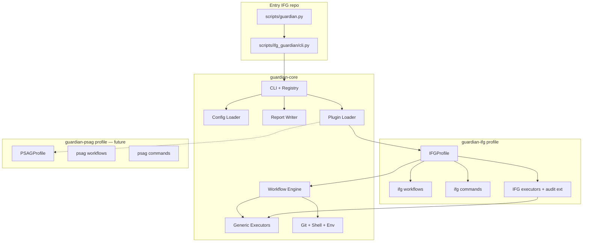

# Guardian — podział Core / Profile (IFG / PSAG)

**Data:** 2026-06-26  
**Status:** Projekt architektury — **bez migracji**  
**Kontekst:** Guardian V1 zakończony w `scripts/ifg_guardian/`; następny krok to wydzielenie frameworku od profili domenowych.

---

## 1. Stan obecny (as-is)

### 1.1 Lokalizacja kodu

```
scripts/
  guardian.py              → shim → ifg_guardian.cli
  guardian2.py             → legacy mutating (deploy-ksef, recover-prod)
  ifg_guardian/            → monolit: core + IFG plugin + legacy modules + CLI
    cli.py                 → parser + dispatch (core + IFG + legacy aliasy)
    config.py              → 100% IFG-specific constants
    core/                  → workflow engine + plugin API + repo_audit + IFG leaks
    plugins/
      core/                → core.ping, core.repo.audit
      ifg/                 → doctor, release.plan, deploy.run
    modules/               → legacy commands (deploy, ksef, frontend, …)
    reporting.py
    compat.py              → re-export dla guardian2
```

### 1.2 Workflow Engine (V1 — zostaje w core)

| Workflow | Plugin | depends_on |
|----------|--------|------------|
| `core.ping` | core | — |
| `core.repo.audit` | core | — |
| `ifg.doctor` | ifg | — |
| `ifg.release.plan` | ifg | `ifg.doctor` |
| `ifg.deploy.run` | ifg | `ifg.release.plan` |

Engine, transaction, executors, dependency chain — **produkt core**, nie IFG.

### 1.3 Naruszenia granicy Core → IFG (do usunięcia przy migracji)

| Plik / moduł | Problem |
|--------------|---------|
| `config.py` | KSeF, frontend-react, DS723+, compose.prod, warehouse markers |
| `core/deploy_config.py` | `DS723Config`, `ds723.env` |
| `core/git.py` | `resolve_ds723_host`, `IFG_DS723_HOST` |
| `core/compose.py` | `REQUIRED_COMPOSE_SERVICES = (api, worker, db)` |
| `core/repo_audit/classifier.py` | reguły `frontend-react/`, `app/`, `alembic/` |
| `core/repo_audit/actions.py` | rekomendacje deploy IFG |
| `core/repo_audit/service.py` | import `modules.frontend` |
| `core/workflow/executors/router.py` | heurystyki docker/alembic/npm |
| `core/workflow/executors/*.py` | DS723, compose.prod, pg_dump ifg |
| `core/workflow/transaction.py` | pola `alembic_*`, `frontend_*` (deploy-specific) |
| `cli.py` | domeny `ksef`, `warehouse`, `deploy`, `prod` bez namespace |
| `PluginLoader` | hardcoded `IFGPlugin` import |

### 1.4 Co już jest „core-ready”

| Moduł | Ocena |
|-------|-------|
| `core/workflow/*` (engine, stage, mode, state) | ✓ generyczny (poza transaction deploy fields) |
| `core/workflow/executors/local_executor.py` | ✓ |
| `core/workflow/executors/git_executor.py` | ✓ |
| `core/workflow/executors/filesystem_executor.py` | ✓ |
| `core/line_endings.py` | ✓ generyczny |
| `core/risk.py` | ✓ enumy + agregacja |
| `core/plugins/*` | ✓ API (wymaga rozszerzenia o commands) |
| `core/repo_audit/extensions.py` | ✓ hook dla profili |
| `plugins/core/workflows/repo_audit` | ~ generyczny (stages wołają classifier z IFG regułami) |

---

## 2. Docelowa architektura pakietów

```
guardian-core/                    # pip package: guardian-core
  guardian/
    __init__.py
    __main__.py                   # opcjonalny entry: python -m guardian
    core/
      cli/                        # parser skeleton, registry, alias router
      config/                     # loader YAML/TOML/env — bez wartości IFG
      logging/
      reporting/                  # terminal, json, markdown writers
      registry/                   # CommandRegistry, WorkflowRegistry
      runtime/                    # create_runtime, dry_run, --yes gate
      git/                        # porcelain, fetch, rev-parse, branch sync
      shell/                      # subprocess runner, capture, timeout
      ssh/                        # generic remote exec (host z config profilu)
      filesystem/                 # exists, ignore patterns, line_endings
      environment/                # cwd, hostname, python version, ci detection
      workflow/                   # engine, transaction (generic), executors (generic)
      plugins/                    # GuardianPlugin API, loader, discovery
      repo_audit/                 # generic classifier + extension hooks
    plugins/
      builtin/                    # opcjonalny minimal generic profile

guardian-ifg/                     # pip package: guardian-ifg (profile/plugin)
  guardian_ifg/
    plugin.py                     # IFGPlugin: workflows + commands + extensions
    config/                       # defaults IFG, ds723.env loader, compose paths
    commands/                     # deploy check, ksef, frontend, warehouse, prod
    checks/                       # doctor checks, repo audit extensions
    workflows/                    # ifg.doctor, release.plan, deploy.run
    executors/                    # deploy router, DS723 SSH, docker, compose, http
    compat/                       # re-export dla guardian2

scripts/ifg_guardian/             # WRAPPER — pozostaje w repo IFG
  __init__.py                     # import guardian + guardian_ifg, re-export __version__
  cli.py                          # cienki: bootstrap IFG profile + legacy aliasy
  compat.py                       # backward compat (guardian.py / guardian2.py)

scripts/guardian.py               # bez zmian ścieżki — deleguje do wrappera
```

**Zasada:** `guardian-core` nie zna słów KSeF, faktury, magazyn, frontend-react, DS723+.  
Profile dostarczają config, commands, workflows, executors, extensions.

---

## 3. guardian-core — specyfikacja

### 3.1 Odpowiedzialność

| Obszar | Moduł | Zakres |
|--------|-------|--------|
| **CLI** | `core/cli/` | Root parser, global flags (`--version`, `--format`, `--dry-run`, `--yes`, `-v`), subcommand registry |
| **Config loader** | `core/config/` | `GuardianConfig`, `ProjectConfig` z `.guardian/project.yaml`; merge env > project > user |
| **Report writer** | `core/reporting/` | `Report`, `CheckResult`, writers: terminal / json / markdown; `default_report_path(prefix)` |
| **Command registry** | `core/registry/` | Rejestracja komend i aliasów; `CommandSpec(mutating, supports_dry_run, profile)` |
| **Dry-run** | `core/runtime/` | `ExecutionMode`, gate mutacji, symulacja intentów |
| **Git checks** | `core/git/` | status, porcelain, fetch, ahead/behind, rev-parse, short_sha — **bez** `production` hardcoded |
| **Shell runner** | `core/shell/` | `run(cmd, cwd, capture, timeout)`, exit code mapping, redaction secrets |
| **Environment detection** | `core/environment/` | hostname, platform, `CI`, repo root discovery, venv detection |
| **Logging** | `core/logging/` | structured logger, run_id, profile tag |
| **SSH** | `core/ssh/` | `ssh_exec(host, port, user, script)` — host z `ProjectConfig.remote`, nie `ds723` |
| **Filesystem** | `core/filesystem/` | exists, ignore (.gitignore parse), line_endings |
| **Workflow Engine** | `core/workflow/` | engine, stages, intents (generic), transaction (generic schema) |
| **Plugin API** | `core/plugins/` | `GuardianPlugin`, loader (entry points + static), registry |
| **Repo audit (generic)** | `core/repo_audit/` | CRLF, secrets heuristic, dist/node_modules ignore, extension hooks |

### 3.2 Core executors (generyczne)

| Executor | Intent | Opis |
|----------|--------|------|
| `LocalExecutor` | `LocalExecIntent` | subprocess lokalny |
| `GitExecutor` | `Git*Intent` | git read/write przez config |
| `FilesystemExecutor` | `FsExistsIntent` | path exists |
| `SSHExecutor` | `SSHExecIntent` | remote bash — **bez** compose/alembic routing |
| `HTTPExecutor` | `HTTPCheckIntent` | curl/urlopen — URL z intent, nie hardcoded /health |

**Usunięte z core:** `DeployCommandRouter`, `DockerExecutor`, `ComposeExecutor`, `DS723Config`, npm/alembic heurystyki.

Profile rejestrują **IntentRouter** lub **ExecutorPlugin** hook:

```python
class ExecutorExtension(ABC):
    def route(self, intent: LocalExecIntent, ctx: ExecutorContext) -> IntentResult | None: ...
```

### 3.3 Core workflows

| ID | Opis |
|----|------|
| `core.ping` | smoke test engine |
| `core.repo.audit` | generic audit + merge `RepoAuditExtension` z aktywnych profili |

### 3.4 Core CLI (wbudowane komendy)

```bash
guardian version
guardian plugin list
guardian plugin doctor          # tylko core checks
guardian workflow run <id> [--dry-run|--plan]
guardian repo status [--fetch]
guardian repo audit [--fetch] [--json|--markdown]
guardian repo clean --dry-run
```

**Brak w core:** `deploy`, `ksef`, `warehouse`, `prod`, `frontend`, `ifg`.

### 3.5 Core config schema (`.guardian/project.yaml`)

```yaml
schema: guardian_project_v1
root: .                           # opcjonalnie; default cwd
profiles:
  active:
    - ifg                          # profile ids do załadowania
reports:
  dir: docs/guardian               # eksport MD — per-project, nie hardcoded w core
git:
  default_branch: production       # opcjonalne; profil może nadpisać
remote:
  host: null                       # core nie interpretuje — przekazuje do profilu
  path: null
logging:
  level: INFO
```

Core **czyta** klucze; **profil interpretuje** semantykę (np. `remote.host` → DS723 w IFG).

### 3.6 WorkflowTransaction (core — generic)

Pola deploy-specific (`alembic_*`, `frontend_*`, `containers_restarted`) → przeniesione do `transaction.extensions["ifg.deploy"]` lub `profile_data: dict[str, Any]`.

Core transaction:

```python
workflow_id, workflow_type, plugin, execution_mode
lifecycle, stages, artifacts, warnings, recommended_actions
dependencies, profile_data: dict[str, dict]  # klucz = profile id
```

---

## 4. guardian-ifg — profile / plugin

### 4.1 Rola

Jedyny profil produkcyjny w repo IFG. Zawiera całą wiedzę domenową Imperium Faktur G.

### 4.2 Struktura

```
guardian_ifg/
  plugin.py                 # IFGProfile(GuardianPlugin)
  config/
    defaults.py             # TARGET_BRANCH, COMPOSE_FILE, paths
    ds723.py                # DS723Config, load ds723.env
  commands/
    deploy_check.py         # ex modules/deploy.py
    deploy_run.py             # ex modules/ifg_deploy_run.py
    ksef.py
    frontend.py
    warehouse.py
    production.py             # health, recover
    release_plan.py
    doctor.py
  checks/                   # ifg.doctor stage implementations
    environment.py
    repository.py
    frontend.py
    backend.py
    docker.py
    database.py
    alembic.py
    ksef.py
    health.py
  repo_audit/
    extension.py            # IFGRepoAuditExtension — frontend/app/alembic rules
  workflows/
    doctor/
    release_plan/
    deploy_run/
  executors/
    deploy_router.py          # npm, docker compose, alembic routing
    ds723_ssh.py
    docker.py
    compose.py
    http_health.py
  reports/                  # IFG-specific report templates
```

### 4.3 Workflows IFG (bez zmian ID)

| ID | depends_on | CLI |
|----|------------|-----|
| `ifg.doctor` | — | `guardian ifg doctor` |
| `ifg.release.plan` | `ifg.doctor` | `guardian ifg release plan` |
| `ifg.deploy.run` | `ifg.release.plan` | `guardian ifg deploy run [--dry-run\|--yes]` |

### 4.4 Komendy IFG (namespace `ifg` + legacy aliasy)

| Canonical (V2) | Legacy alias (V1 compat) | Mutating |
|----------------|--------------------------|----------|
| `guardian ifg doctor` | `guardian doctor` | nie |
| `guardian ifg release plan` | — | nie |
| `guardian ifg deploy run` | — | tak (`--yes`) |
| `guardian ifg deploy check` | `guardian deploy check` | nie |
| `guardian ifg ksef check` | `guardian ksef check`, `--ksef-async-check` | nie |
| `guardian ifg ksef sync` | `guardian ksef sync` | tak (future) |
| `guardian ifg frontend check` | `guardian frontend check` | nie |
| `guardian ifg warehouse check` | `guardian warehouse check` | nie |
| `guardian ifg prod health` | `guardian prod health` | nie |
| `guardian ifg prod recover` | `guardian prod recover` | tak (`--yes`) |

Legacy `guardian deploy run` → docelowo alias `guardian ifg deploy run` (dziś: guardian2 — do sunset).

### 4.5 IFG config (profil)

```yaml
# guardian_ifg/config/ifg.defaults.yaml (bundled)
git:
  deploy_branch: production
compose:
  file: docker/docker-compose.prod.yml
  services: [api, worker, db]
frontend:
  src_prefix: frontend-react/src
  dist_dir: frontend-react/dist
remote:
  env_file: .env.production
  env_loader: scripts/ds723.env      # ścieżka względem repo IFG
ksef:
  connect_markers: [...]
warehouse:
  required_files: [...]
```

### 4.6 IFG Plugin API (rozszerzenie core)

```python
class IFGProfile(GuardianPlugin):
    name = "ifg"
    version = "1.0.0"

    def workflows(self) -> list[WorkflowDefinition]: ...
    def commands(self) -> list[CommandSpec]: ...
    def repo_audit_extensions(self) -> list[RepoAuditExtension]: ...
    def executor_extensions(self) -> list[ExecutorExtension]: ...
    def doctor_checks(self) -> list[CheckDefinition]: ...   # opcjonalnie poza workflow
```

---

## 5. guardian-psag — profile (przyszły target, tylko projekt)

### 5.1 Rola

Profil dla projektu PSAG (watchery rynkowe, alerty, email, raporty). **Nie implementowany w V1/V2 IFG migration.**

### 5.2 Zakres domenowy

| Obszar | Komendy (projekt) | Typ |
|--------|-------------------|-----|
| **watchers** | `guardian psag watchers status` | read-only |
| | `guardian psag watchers restart --yes` | mutating |
| **alerts** | `guardian psag alerts check` | read-only |
| | `guardian psag alerts test --dry-run` | dry-run |
| **market_data** | `guardian psag market_data freshness` | read-only |
| | `guardian psag market_data backfill --yes` | mutating |
| **email** | `guardian psag email queue` | read-only |
| | `guardian psag email flush --yes` | mutating |
| **reports** | `guardian psag reports generate` | read-only |
| | `guardian psag reports publish --yes` | mutating |

### 5.3 Workflows PSAG (projekt)

| ID | depends_on | Opis |
|----|------------|------|
| `psag.doctor` | — | health watchery, DB, Redis, SMTP |
| `psag.watchers.plan` | `psag.doctor` | plan restartów / rolling update |
| `psag.watchers.run` | `psag.watchers.plan` | LIVE restart (--yes) |

### 5.4 Struktura (mirror IFG)

```
guardian_psag/
  plugin.py
  config/defaults.yaml
  commands/{watchers,alerts,market_data,email,reports}/
  checks/
  workflows/{doctor,watchers}/
  executors/                  # systemd, redis-cli, smtp probe — PSAG-specific
```

### 5.5 Współdzielenie z core

PSAG używa wyłącznie: CLI registry, reporting, git (repo PSAG), shell, ssh (host z własnego config), workflow engine, dry-run.  
**Zero** importów z `guardian_ifg`.

### 5.6 Aktywacja multi-profile (przyszłość)

```yaml
# .guardian/project.yaml w monorepo lub osobnych repo
profiles:
  active:
    - ifg    # repo IFG
    # - psag  # repo PSAG — osobny projekt
```

W jednym workspace: `guardian doctor --profile ifg,psag` (core agreguje).

---

## 6. Wrapper `scripts/ifg_guardian` (kompatybilność)

### 6.1 Cel

IFG pozostaje uruchamialne **bez instalacji pip** przez istniejące entry pointy:

```bash
python3 scripts/guardian.py …
python3 scripts/guardian2.py …   # do sunset
```

### 6.2 Implementacja wrappera (docelowa)

```python
# scripts/ifg_guardian/cli.py (cienki)
from guardian.core.cli.app import build_app
from guardian.core.plugins.loader import load_profiles
from guardian_ifg.plugin import IFGProfile

def main(argv):
    app = build_app()
    load_profiles(app, [IFGProfile()], legacy_aliases=IFG_LEGACY_ALIASES)
    return app.run(argv)
```

### 6.3 Mapa aliasów legacy (must preserve)

| Wejście użytkownika | Docelowe dispatch |
|---------------------|-------------------|
| `guardian.py` | `ifg_guardian.cli.main` |
| `guardian doctor` | `ifg.doctor` workflow |
| `guardian deploy check` | `ifg deploy check` command |
| `guardian deploy run` | `ifg deploy run` (po sunset guardian2) |
| `guardian --deploy-check` | `ifg deploy check` + DeprecationWarning |
| `guardian --repo-sync` | `repo status` + DeprecationWarning |
| `guardian --ksef-async-check` | `ifg ksef check` + DeprecationWarning |
| `guardian2 deploy-ksef` | `ifg deploy run` (compat shim okresowo) |
| `guardian2 recover-prod` | `ifg prod recover` |

### 6.4 sys.path

```python
# scripts/guardian.py — bez zmian kontraktu
_SCRIPTS = Path(__file__).parent
sys.path.insert(0, str(_SCRIPTS))          # ifg_guardian wrapper
sys.path.insert(0, str(_SCRIPTS / "../vendor/guardian-core"))  # opcjonalnie vendored
```

Faza 1 migracji: monorepo `scripts/guardian_core/` + `scripts/guardian_ifg/` (bez pip).  
Faza 2: pip install `guardian-core`, `guardian-ifg`.  
Wrapper IFG zawsze obecny w repo IFG.

---

## 7. Command Registry — projekt

```python
@dataclass
class CommandSpec:
    profile: str              # "ifg" | "psag"
    path: tuple[str, ...]     # ("deploy", "check")
    handler: Callable
    mutating: bool = False
    supports_dry_run: bool = False
    deprecated_alias: str | None = None

class CommandRegistry:
    def register(self, spec: CommandSpec) -> None: ...
    def resolve(self, tokens: list[str]) -> ResolvedCommand: ...
    def legacy_route(self, flags: dict) -> ResolvedCommand | None: ...
```

CLI buduje drzewo argparse **dynamicznie** z registry aktywnych profili.  
Core rejestruje `repo`, `workflow`, `plugin`; profile rejestrują resztę.

---

## 8. Diagram zależności (docelowy)



---

## 9. Fazy migracji (plan — bez implementacji)

| Faza | Zakres | Ryzyko |
|------|--------|--------|
| **M0** | Dokument + ADR (ten plik) | — |
| **M1** | Wydziel `guardian_core/` obok `ifg_guardian/`; import re-export | niskie |
| **M2** | Przenieś workflow engine + generic executors | średnie |
| **M3** | Przenieś IFG config, deploy executors, classifier rules → `guardian_ifg/` | średnie |
| **M4** | Command registry + dynamic CLI; legacy aliasy w wrapperze | średnie |
| **M5** | Oczyść `transaction` (profile_data); testy regresji 104+ | średnie |
| **M6** | pip packages; opcjonalny vendoring | niskie |
| **M7** | Sunset guardian2; alias `deploy run` → ifg | wysokie (prod) |
| **M8** | PSAG profile scaffold (osobny repo) | osobny projekt |

---

## 10. Acceptance Checklist (post-split)

| # | Kryterium |
|---|-----------|
| 1 | `grep -r KSeF scripts/guardian_core/` → 0 wyników |
| 2 | `grep -r ds723 scripts/guardian_core/` → 0 wyników |
| 3 | `grep -r frontend-react scripts/guardian_core/` → 0 wyników |
| 4 | `python3 scripts/guardian.py ifg deploy run --dry-run` → PASS |
| 5 | Wszystkie legacy aliasy z §6.3 → PASS + DeprecationWarning |
| 6 | `guardian plugin list` → core + ifg |
| 7 | Testy core osobno; testy ifg z mock profile config |
| 8 | PSAG: tylko scaffold, brak importu IFG |

---

## 11. Mapowanie plików (obecny → docelowy)

| Obecny | Docelowy |
|--------|----------|
| `ifg_guardian/core/workflow/` | `guardian_core/workflow/` |
| `ifg_guardian/core/plugins/` | `guardian_core/plugins/` |
| `ifg_guardian/core/line_endings.py` | `guardian_core/filesystem/line_endings.py` |
| `ifg_guardian/core/risk.py` | `guardian_core/risk.py` |
| `ifg_guardian/core/git.py` (generic part) | `guardian_core/git/` |
| `ifg_guardian/core/git.py` (`resolve_ds723_host`) | `guardian_ifg/config/ds723.py` |
| `ifg_guardian/core/ssh.py` | `guardian_core/ssh/` |
| `ifg_guardian/core/compose.py` | `guardian_ifg/checks/docker.py` |
| `ifg_guardian/core/deploy_config.py` | `guardian_ifg/config/ds723.py` |
| `ifg_guardian/core/workflow/executors/{docker,compose,router}.py` | `guardian_ifg/executors/` |
| `ifg_guardian/config.py` | `guardian_ifg/config/defaults.py` |
| `ifg_guardian/plugins/ifg/` | `guardian_ifg/workflows/` |
| `ifg_guardian/modules/*.py` | `guardian_ifg/commands/` |
| `ifg_guardian/core/repo_audit/classifier.py` (IFG rules) | `guardian_ifg/repo_audit/extension.py` |
| `ifg_guardian/cli.py` (IFG domains) | `guardian_ifg/plugin.py` + `ifg_guardian/cli.py` wrapper |
| `ifg_guardian/reporting.py` | `guardian_core/reporting/` |

---

## 12. Ryzyka

| ID | Ryzyko | Wpływ | Mitigacja |
|----|--------|-------|-----------|
| R1 | Circular imports core ↔ ifg | blokada migracji | Jednokierunkowy import: ifg → core; core zero import ifg |
| R2 | `guardian2.py` dynamic import `compat` | broken deploy | Faza M7 dopiero po parity; compat layer w ifg |
| R3 | Transaction schema break | utrata raportów | `profile_data` + migrator JSON v1→v2 |
| R4 | Executor routing regression | LIVE deploy fail | Przenieść router 1:1 z testami; nie refaktorować logiki |
| R5 | Duplikacja CLI parser | drift aliasów | Single CommandRegistry; testy aliasów per flag |
| R6 | sys.path / packaging | CI, inne dev machines | Faza M1 monorepo; pip w M6; wrapper zawsze lokalny |
| R7 | Repo audit generic vs IFG rules | false positives PSAG | Extension hook obowiązkowy dla reguł domenowych |
| R8 | Core plugin vs profile naming | confusion | `core` = builtin generic; `ifg`/`psag` = profile packages |
| R9 | Wspólny `doctor` core+profiles | agregacja skomplikowana | Osobne: `guardian doctor` (core) vs `guardian ifg doctor` (workflow) do V2 merge |
| R10 | PSAG premature coupling | IFG slowdown | PSAG tylko scaffold + interfejs; zero kodu w migracji IFG |

---

## 13. Decyzje architektoniczne (ADR skrót)

| ADR | Decyzja |
|-----|---------|
| ADR-S1 | `guardian-core` i `guardian-ifg` to osobne pakiety; IFG repo trzyma wrapper |
| ADR-S2 | Workflow Engine należy do core; workflows IFG/PSAG do profili |
| ADR-S3 | Deploy executors (docker/compose/DS723) należą do profilu IFG, nie core |
| ADR-S4 | Legacy aliasy obsługuje wrapper IFG minimum 2 wersje (deprecation warnings) |
| ADR-S5 | PSAG projektowany równolegle; implementacja po stabilizacji split IFG |
| ADR-S6 | Config: core czyta schema; profile dostarczają defaults + env loaders |

---

## Powiązane dokumenty

- [GUARDIAN_V1_RELEASE.md](GUARDIAN_V1_RELEASE.md)
- [GUARDIAN_V3_ARCHITECTURE_REVISED.md](GUARDIAN_V3_ARCHITECTURE_REVISED.md)
- [GUARDIAN_WORKFLOW_ENGINE.md](GUARDIAN_WORKFLOW_ENGINE.md)
- [WORKFLOW.md](WORKFLOW.md)
