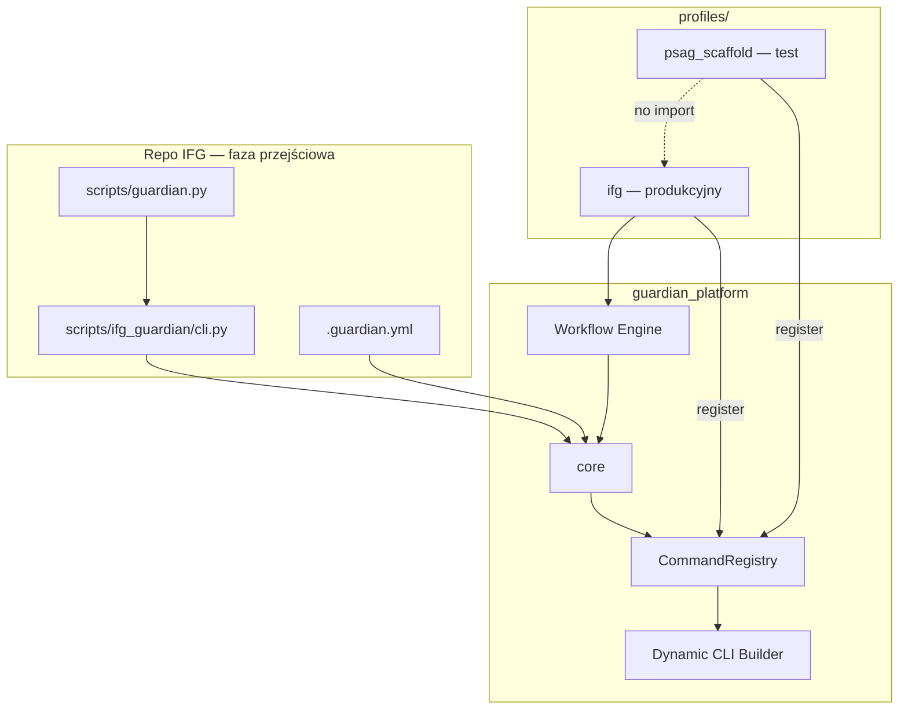

# Guardian Platform — architektura (Core + Profile)

**Data:** 2026-06-26  
**Status:** Projekt architektury — **bez migracji kodu**  
**Poprzednik:** [GUARDIAN_CORE_PROFILE_SPLIT.md](GUARDIAN_CORE_PROFILE_SPLIT.md)  
**Kontekst:** Guardian V1 w `scripts/ifg_guardian/`; następny krok to **jedna platforma** z rdzeniem i profilami projektowymi.

---

## Zasada nadrzędna

> **Nie tworzymy `guardian-ifg` ani `guardian-psag` jako osobnych narzędzi.**  
> **Tworzymy Guardian Platform + profile.**

Docelowo istnieje **jedno repo/narzędzie: `guardian`**.  
Zawiera neutralny **core** oraz **profile projektowe** (`ifg`, `psag`, …).

- IFG **nie jest** osobnym Guardianem — to **profil produkcyjny** platformy.
- PSAG **nie jest** osobnym Guardianem — to **profil** tej samej platformy (na razie scaffold).
- **Core** nie zawiera logiki IFG ani PSAG.
- Profile rejestrują: komendy, workflow, checks, executors, repo-audit extensions.
- Osobne repo `guardian` powstaje **dopiero po stabilizacji** struktury w IFG.
- Teraz: **separacja logiczna w repo IFG**, bez fizycznego wynoszenia.

---

## 1. Stan obecny (as-is)

```
scripts/
  guardian.py              → shim → ifg_guardian.cli
  guardian2.py             → legacy mutating
  ifg_guardian/            → monolit: core + IFG + legacy modules + ręczny CLI
    cli.py                 → ręczny argparse (IFG domeny wbudowane)
    config.py              → 100% IFG-specific
    core/                  → engine OK, ale wycieki IFG (ds723, deploy, frontend)
    plugins/core/          → core.ping, core.repo.audit
    plugins/ifg/           → doctor, release.plan, deploy.run
    modules/               → legacy commands
```

**Problem:** IFG repo traktuje Guardiana jak narzędzie IFG, a nie jak platformę z profilem IFG.

---

## 2. Guardian Platform — model

```
┌─────────────────────────────────────────────────────────┐
│                    Guardian Platform                     │
│  ┌───────────────────────────────────────────────────┐  │
│  │  core (neutralny)                                  │  │
│  │  CLI generator · config · registry · workflow      │  │
│  │  git · shell · ssh · reporting · dry-run           │  │
│  └───────────────────────────────────────────────────┘  │
│         ▲              ▲              ▲                  │
│         │              │              │                  │
│  ┌──────┴──────┐ ┌─────┴─────┐ ┌──────┴──────┐          │
│  │ profile:ifg │ │profile:   │ │ profile:   │  …       │
│  │ (prod)      │ │psag_scaff.│ │ generic    │          │
│  └─────────────┘ └───────────┘ └────────────┘          │
└─────────────────────────────────────────────────────────┘
         ▲
         │  .guardian.yml / .guardian/project.yaml
         │  (aktywne profile)
         │
┌────────┴────────┐
│  repo projektu   │  np. IFG repo: konfiguracja + cienki wrapper
└─────────────────┘
```

| Pojęcie | Znaczenie |
|---------|-----------|
| **Platforma** | Jedno narzędzie `guardian`, jeden CLI entry, jeden engine |
| **Core** | Infrastruktura wspólna — zero wiedzy o IFG/PSAG |
| **Profil** | Pakiet rozszerzeń: commands, workflows, checks, executors, audit rules |
| **Projekt (IFG repo)** | Hostuje kod platformy **tymczasowo** + `.guardian.yml` + wrapper compat |

---

## 3. Struktura katalogów

### 3.1 Przejściowa (w repo IFG — teraz)

```
scripts/
  guardian.py                    # entry — bez zmian ścieżki
  guardian2.py                     # legacy — do sunset
  guardian_platform/
    __init__.py
    core/                          # neutralny rdzeń platformy
      cli/                         # dynamic CLI builder (NIE argparse w profilach)
      config/                      # loader .guardian.yml
      registry/                    # CommandRegistry, ProfileRegistry, WorkflowRegistry
      logging/
      reporting/
      runtime/                     # dry-run, --yes gate
      git/
      shell/
      ssh/
      filesystem/
      environment/
      workflow/
      repo_audit/
      profiles/                    # Profile API (base class, loader)
    profiles/
      ifg/                         # pierwszy profil produkcyjny
        profile.py
        config/
        commands/
        checks/
        workflows/
        executors/
        repo_audit/
      psag_scaffold/               # test architektury — NIE pełna implementacja
        profile.py                 # minimal: 1 command, 0 importów IFG
        README.md
  ifg_guardian/                    # cienki wrapper kompatybilnościowy
    cli.py                         # bootstrap platform + legacy aliasy
    compat.py                      # re-export dla guardian2
```

**IFG repo docelowo (po M5 wyniesieniu):** tylko `.guardian.yml`, ewentualnie `scripts/ifg_guardian/compat.py`, dokumentacja — **bez** kodu platformy.

### 3.2 Docelowa (osobne repo `guardian` — po stabilizacji)

```
guardian/                          # osobne repo Git
  guardian/
    __init__.py
    __main__.py
    core/                          # identyczna rola jak guardian_platform/core/
    profiles/
      ifg/
      psag/                        # pełna implementacja PSAG (później)
  pyproject.toml
  README.md
  docs/
```

Jeden pakiet pip: `guardian` (nie `guardian-core` + `guardian-ifg`).

---

## 4. Core — specyfikacja

Core dostarcza infrastrukturę. **Zakazane w core:** KSeF, faktury, magazyn, frontend-react, docker-compose.prod.yml, DS723+, npm, alembic, nazwy projektów jako logika.

| Moduł | Odpowiedzialność |
|-------|------------------|
| `core/cli/` | Root parser, global flags; **generator** drzewa komend z registry |
| `core/config/` | Loader `.guardian.yml`, merge env > project > user |
| `core/registry/` | `CommandSpec`, `ProfileSpec`, rejestracja workflow/checks/executors |
| `core/reporting/` | terminal / json / markdown writers |
| `core/runtime/` | `ExecutionMode`, dry-run, mutating gate |
| `core/git/` | status, fetch, porcelain, ahead/behind — bez hardcoded branch |
| `core/shell/` | subprocess runner |
| `core/ssh/` | generic remote exec — host z config profilu |
| `core/filesystem/` | exists, ignore, line_endings |
| `core/environment/` | hostname, CI, repo root |
| `core/logging/` | structured log, run_id, profile tag |
| `core/workflow/` | engine, transaction (generic), generic executors |
| `core/repo_audit/` | CRLF, secrets heuristic, extension merge |
| `core/profiles/` | `GuardianProfile` ABC, loader, discovery |

### Core workflows (wbudowane)

| ID | Opis |
|----|------|
| `core.ping` | smoke test engine |
| `core.repo.audit` | generic audit + extensions z aktywnych profili |

### Core executors (generyczne)

`LocalExecutor`, `GitExecutor`, `FilesystemExecutor`, `SSHExecutor` (bez routing deploy), `HTTPExecutor` (URL z intent).

Routing specjalistyczny (docker compose, alembic, npm) → **profile executors**, nie core.

---

## 5. Profile — kontrakt

```python
class GuardianProfile(ABC):
    @property
    def id(self) -> str: ...           # "ifg" | "psag_scaffold" | "psag"

    @property
    def version(self) -> str: ...

    def register(self, ctx: ProfileContext) -> None:
        """Rejestruje wszystko w registry platformy — jedyny punkt wejścia profilu."""
        ctx.commands.register(...)
        ctx.workflows.register(...)
        ctx.checks.register(...)
        ctx.executors.register(...)
        ctx.repo_audit.register_extension(...)
```

**Zasady profili:**

1. Profil **nie buduje argparse** — tylko rejestruje `CommandSpec`.
2. Profil **nie importuje** innych profili (IFG ⊥ PSAG).
3. Profil może importować wyłącznie `guardian_platform.core.*`.
4. Konfiguracja domenowa w `profiles/<id>/config/`, nie w core.

### 5.1 Profil IFG — pierwszy produkcyjny

Pełna wiedza domenowa Imperium Faktur G. Przeniesienie obecnego `plugins/ifg/`, `modules/`, IFG leaks z core.

| Obszar | Zawartość |
|--------|-----------|
| **deploy** | check, run (dry-run + LIVE), release plan |
| **recover** | prod recover (zastąpi guardian2) |
| **KSeF** | check, sync |
| **warehouse** | check |
| **frontend** | dist freshness, connect fix |
| **db** | alembic checks (doctor) |
| **docker** | compose ps, container health |
| **worker** | worker health (doctor) |
| **health** | /health endpoint |

Workflows (bez zmian ID):

| ID | depends_on |
|----|------------|
| `ifg.doctor` | — |
| `ifg.release.plan` | `ifg.doctor` |
| `ifg.deploy.run` | `ifg.release.plan` |

CLI (namespace `ifg`):

```bash
guardian ifg doctor
guardian ifg release plan
guardian ifg deploy run [--dry-run|--yes]
guardian ifg deploy check
guardian ifg ksef check
guardian ifg frontend check
guardian ifg warehouse check
guardian ifg prod health
guardian ifg prod recover --yes
```

### 5.2 Profil PSAG — scaffold (test architektury)

**Nie pełna implementacja.** Cel: potwierdzić, że platforma obsługuje wiele profili bez zależności IFG.

| Element | Scaffold |
|---------|----------|
| `psag_scaffold.profile.py` | rejestruje 1 komendę read-only |
| `guardian psag ping` | zwraca `"psag profile active"` |
| Workflows | brak (lub `psag_scaffold.ping` noop) |
| Import IFG | **zakazany** |
| Executors | brak domenowych |

Po stabilizacji platformy: `psag_scaffold/` → `psag/` w osobnym repo projektu PSAG lub w repo `guardian`.

---

## 6. Dynamiczne CLI

Profile **nie tworzą parserów**. Core generuje CLI z registry.

### Przepływ

```
1. guardian.py / ifg_guardian/cli.py
        │
2. core.config.load(".guardian.yml")  → active_profiles: [ifg, psag_scaffold]
        │
3. core.profiles.loader.load(active_profiles)
        │
4. dla każdego profilu: profile.register(ctx)
        │   ├── CommandSpec("ifg", ("deploy", "run"), handler, mutating=True)
        │   ├── CommandSpec("ifg", ("doctor",), ...)
        │   ├── WorkflowDefinition("ifg.doctor", ...)
        │   ├── ExecutorExtension(...)
        │   └── RepoAuditExtension(...)
        │
5. core.cli.builder.build_parser(registry)
        │   → argparse tree: guardian ifg deploy run --yes
        │
6. core.cli.runner.execute(resolved_command)
```

### CommandSpec

```python
@dataclass
class CommandSpec:
    profile: str                    # "ifg"
    path: tuple[str, ...]           # ("deploy", "run")
    handler: Callable[[CommandContext], int]
    mutating: bool = False
    supports_dry_run: bool = False
    legacy_aliases: tuple[str, ...] = ()   # ("deploy", "run") top-level deprecated
```

### Zasady CLI

| Reguła | Enforced by |
|--------|-------------|
| Profile nie importują `argparse` | lint / review |
| Core nie zna handlerów IFG | registry only |
| Legacy aliasy rejestruje wrapper IFG | `ifg_guardian/cli.py` |
| `--dry-run` / `--yes` globalne | core runtime |

---

## 7. `.guardian.yml` — aktywacja profilu

Podstawowy sposób deklaracji profilu w repo projektu.

### Lokalizacja (priorytet)

1. `./.guardian.yml` (preferowany, root repo)
2. `./.guardian/project.yaml` (alternatywa)
3. `~/.guardian/config.yaml` (fallback user)

### Przykład — repo IFG

```yaml
# .guardian.yml
schema: guardian_project_v1

platform:
  version: "1.0"

profiles:
  active:
    - ifg                    # profil produkcyjny
    # - psag_scaffold        # opcjonalnie: test multi-profile lokalnie

project:
  root: .
  reports_dir: docs/guardian

# Reszta semantyki — w profilu IFG (defaults.yaml), nie tutaj:
# ds723, compose, ksef, frontend — profile ifg/config/
```

### Przykład — repo PSAG (przyszłość)

```yaml
schema: guardian_project_v1
profiles:
  active:
    - psag
```

Core **czyta schema** i ładuje profile. **Profil interpretuje** wartości domenowe.

---

## 8. Wrapper IFG (`scripts/ifg_guardian`)

Repo IFG hostuje platformę tymczasowo. Po wyniesieniu repo `guardian` — wrapper zostaje.

```python
# scripts/ifg_guardian/cli.py (docelowy — cienki)
from guardian_platform.core.cli.app import run
from guardian_platform.core.config import load_project_config
from guardian_platform.core.profiles.loader import load_active_profiles

def main(argv):
    config = load_project_config()          # .guardian.yml
    platform = load_active_profiles(config) # ifg (+ opcjonalnie psag_scaffold)
    return run(argv, platform, legacy=IFG_LEGACY_ALIASES)
```

### Legacy aliasy (must preserve)

| Wejście | Dispatch |
|---------|----------|
| `guardian doctor` | `ifg doctor` |
| `guardian deploy check` | `ifg deploy check` |
| `guardian --deploy-check` | `ifg deploy check` + DeprecationWarning |
| `guardian --ksef-async-check` | `ifg ksef check` + DeprecationWarning |
| `guardian2 deploy-ksef` | `ifg deploy run` (compat okresowo) |
| `guardian2 recover-prod` | `ifg prod recover` |

---

## 9. Diagram zależności



---

## 10. Ścieżka migracji

| Faza | Zakres | Repo |
|------|--------|------|
| **M1 — separacja logiczna** | Utwórz `scripts/guardian_platform/{core,profiles/ifg,profiles/psag_scaffold}`; przenieś kod z `ifg_guardian/` bez zmiany zachowania; re-export | IFG |
| **M2 — IFG przez platformę** | IFG działa wyłącznie jako profil; usuń IFG leaks z core; wrapper `ifg_guardian/cli.py` bootstrapuje platformę | IFG |
| **M3 — PSAG scaffold** | `psag_scaffold` rejestruje komendę; `guardian plugin list` → core + ifg + psag_scaffold; zero importów IFG | IFG |
| **M4 — stabilizacja** | Dynamic CLI z registry; `.guardian.yml`; testy regresji 104+; acceptance checklist | IFG |
| **M5 — wyniesienie repo** | Skopiuj `guardian_platform/` → repo `guardian/`; IFG repo: pip/git submodule + wrapper + `.guardian.yml` | osobne repo `guardian` |

**Nie w M1–M4:** osobne repo, pip publish, sunset guardian2 (osobna decyzja po M4).

---

## 11. Kryteria akceptacji

| # | Kryterium | Weryfikacja |
|---|-----------|-------------|
| 1 | Brak KSeF w core | `grep -ri KSeF scripts/guardian_platform/core/` → 0 |
| 2 | Brak ds723 w core | `grep -ri ds723 scripts/guardian_platform/core/` → 0 |
| 3 | Brak frontend-react w core | `grep -ri frontend-react scripts/guardian_platform/core/` → 0 |
| 4 | PSAG scaffold nie importuje IFG | `grep -r "profiles.ifg\|profiles/ifg" scripts/guardian_platform/profiles/psag_scaffold/` → 0 |
| 5 | IFG działa przez profil | `guardian ifg deploy run --dry-run` → PASS |
| 6 | Legacy wrapper działa | `guardian doctor`, `--deploy-check` → PASS + DeprecationWarning |
| 7 | Plugin list | `guardian plugin list` → core + ifg + psag_scaffold |
| 8 | Profile nie używają argparse | review / lint |
| 9 | Aktywacja przez config | `.guardian.yml` z `profiles.active: [ifg]` |

---

## 12. Mapowanie plików (obecny → platforma)

| Obecny (`ifg_guardian/`) | Docelowy |
|--------------------------|----------|
| `core/workflow/` | `guardian_platform/core/workflow/` |
| `core/plugins/` | `guardian_platform/core/profiles/` + loader |
| `core/line_endings.py` | `guardian_platform/core/filesystem/` |
| `core/risk.py` | `guardian_platform/core/risk.py` |
| `core/git.py` (generic) | `guardian_platform/core/git/` |
| `core/git.py` (ds723) | `guardian_platform/profiles/ifg/config/` |
| `core/ssh.py` | `guardian_platform/core/ssh/` |
| `core/deploy_config.py` | `guardian_platform/profiles/ifg/config/` |
| `core/compose.py` | `guardian_platform/profiles/ifg/checks/` |
| `core/workflow/executors/{docker,compose,router}.py` | `guardian_platform/profiles/ifg/executors/` |
| `config.py` | `guardian_platform/profiles/ifg/config/` |
| `plugins/ifg/` | `guardian_platform/profiles/ifg/workflows/` |
| `plugins/core/` | `guardian_platform/core/` (builtin workflows) |
| `modules/*.py` | `guardian_platform/profiles/ifg/commands/` |
| `cli.py` (IFG domains) | `guardian_platform/profiles/ifg/profile.py` + registry |
| `cli.py` (legacy) | `scripts/ifg_guardian/cli.py` |
| `reporting.py` | `guardian_platform/core/reporting/` |

---

## 13. Ryzyka

| ID | Ryzyko | Wpływ | Mitigacja |
|----|--------|-------|-----------|
| R1 | Circular imports core ↔ profile | blokada migracji | Import jednokierunkowy: profile → core |
| R2 | `guardian2.py` dynamic import `compat` | broken deploy | Compat w wrapperze IFG; sunset po M4 |
| R3 | Transaction schema break | utrata raportów | `profile_data` w generic transaction |
| R4 | Executor routing regression | LIVE deploy fail | Przeniesienie 1:1 z testami |
| R5 | Duplikacja CLI / drift aliasów | UX chaos | Single CommandRegistry + testy aliasów |
| R6 | sys.path w repo IFG | CI broken | Monorepo w IFG do M5; potem pip/submodule |
| R7 | Repo audit — reguły IFG w core | false positives | Extension hook obowiązkowy |
| R8 | Core vs profile naming | confusion | `core` = platforma; `ifg`/`psag` = profile |
| R9 | Agregacja doctor core+profiles | złożoność | Osobno do V2; na razie `ifg doctor` workflow |
| R10 | PSAG premature coupling | spowolnienie IFG | Tylko scaffold w M3 |
| **R11** | **Zbyt wczesne wydzielenie osobnego repo** | **podwójna maintenance, broken CI** | **M5 dopiero po checklist §11; do tego monorepo w IFG** |
| **R12** | **Budowanie dwóch Guardianów zamiast platformy** | **architektura rozjechana** | **ADR: jeden `guardian`, profile jako rozszerzenia; zakaz osobnych CLI/pakietów projektowych** |
| **R13** | **Przeciek logiki IFG do core „tymczasowo”** | **PSAG/generic niemożliwe** | **Acceptance grep §11; review każdego PR do core/** |

---

## 14. Decyzje architektoniczne (ADR)

| ADR | Decyzja |
|-----|---------|
| ADR-P1 | Jedna platforma `guardian` — nie osobne narzędzia per projekt |
| ADR-P2 | IFG to profil produkcyjny #1, nie produkt Guardian IFG |
| ADR-P3 | PSAG to scaffold architektury w M3, pełna implementacja później |
| ADR-P4 | CLI generowane z CommandRegistry — profile nie używają argparse |
| ADR-P5 | `.guardian.yml` decyduje o aktywnych profilach |
| ADR-P6 | Repo IFG hostuje platformę do M5; potem osobne repo `guardian` |
| ADR-P7 | IFG repo po M5: config + wrapper compat, bez kodu platformy |
| ADR-P8 | Core nie zawiera logiki IFG ani PSAG — twarde grep w CI |

---

## Powiązane dokumenty

- [GUARDIAN_CORE_PROFILE_SPLIT.md](GUARDIAN_CORE_PROFILE_SPLIT.md) — wersja poprzednia (osobne pakiety)
- [GUARDIAN_V1_RELEASE.md](GUARDIAN_V1_RELEASE.md)
- [GUARDIAN_V3_ARCHITECTURE_REVISED.md](GUARDIAN_V3_ARCHITECTURE_REVISED.md)
- [WORKFLOW.md](WORKFLOW.md)
