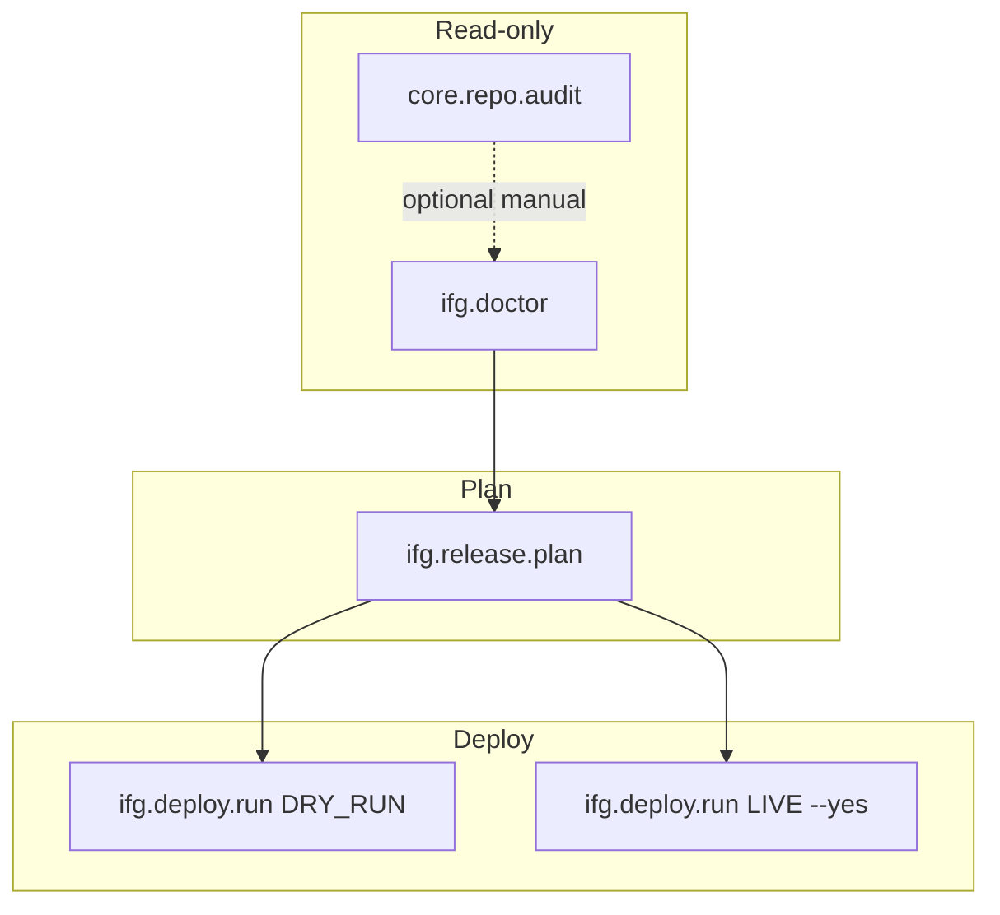

# Guardian V1 — Release Notes

**Wersja:** 1.0.0 (kandydat tag: `guardian-v1.0.0`)  
**Data odbioru:** 2026-06-26  
**Status:** Guardian V1 Accepted

---

## Podsumowanie

Guardian V1 to narzędzie administracyjne IFG oparte na **Workflow Engine** i **Plugin Architecture**.  
Obejmuje pełny cykl read-only diagnosis → release planning → deploy (dry-run + LIVE).

Entry point:

```bash
python3 scripts/guardian.py
# alias: guardian (po dodaniu do PATH)
```

---

## Architektura końcowa

```
CLI (scripts/ifg_guardian/cli.py)
        │
        ▼
create_runtime() ──► PluginLoader
        │                 ├── CorePlugin
        │                 └── IFGPlugin
        ▼
ExecutionEngine
        │
        ├── Dependency Engine (depends_on chain)
        ├── Stage loop: build_plan → IntentExecutor → interpret
        └── WorkflowTransaction → JSON + raporty MD
```

### Warstwy

| Warstwa | Ścieżka | Rola |
|---------|---------|------|
| Core Engine | `scripts/ifg_guardian/core/workflow/` | Stage loop, mode, transaction, executors |
| Plugin API | `scripts/ifg_guardian/core/plugins/` | Loader, registry, bootstrap |
| Core Plugin | `scripts/ifg_guardian/plugins/core/` | Workflow generyczne (ping, repo audit) |
| IFG Plugin | `scripts/ifg_guardian/plugins/ifg/` | Doctor, release plan, deploy |
| Domain services | `scripts/ifg_guardian/core/repo_audit/` | Logika repo audit |
| Legacy modules | `scripts/ifg_guardian/modules/` | Cienkie adaptery CLI → workflow |
| Executors | `scripts/ifg_guardian/core/workflow/executors/` | LIVE/DRY_RUN execution |

Core **nie importuje** domeny IFG poza `PluginLoader`.

---

## Workflow (5)

| ID | Plugin | Mutating | depends_on | CLI |
|----|--------|----------|------------|-----|
| `core.ping` | core | nie | — | `guardian workflow run core.ping [--dry-run]` |
| `core.repo.audit` | core | nie* | — | `guardian repo audit [--fetch] [--json\|--markdown]` |
| `ifg.doctor` | ifg | nie | — | `guardian ifg doctor [--fetch] [--json\|--markdown]` |
| `ifg.release.plan` | ifg | nie | `ifg.doctor` | `guardian ifg release plan [--fetch] [--json\|--markdown]` |
| `ifg.deploy.run` | ifg | tak | `ifg.release.plan` | `guardian ifg deploy run [--dry-run\|--yes]` |

\* `--fetch` emituje mutating intent; w `--dry-run` symulowany.

---

## Pluginy (2)

| Plugin | Wersja | Workflows |
|--------|--------|-----------|
| `core` | 1.0.0 | 2 |
| `ifg` | 1.0.0 | 3 |

```bash
guardian plugin list
```

---

## Executory

| Executor | Plik | Zakres |
|----------|------|--------|
| `IntentExecutor` | `executors/__init__.py` | Dispatcher + DRY_RUN simulation |
| `LocalExecutor` | `local_executor.py` | git pull, npm build (local subprocess) |
| `SSHExecutor` | `ssh_executor.py` | rsync, remote git, backup, alembic |
| `DockerExecutor` | `docker_executor.py` | compose build via SSH |
| `ComposeExecutor` | `compose_executor.py` | compose up, logs, ps via SSH |
| `HTTPExecutor` | `http_executor.py` | /health via SSH curl |
| `GitExecutor` | `git_executor.py` | rev-parse, fetch, status |
| `FilesystemExecutor` | `filesystem_executor.py` | fs exists |

Routing komend z `LocalExecIntent` (deploy pipeline) — workflow bez zmian intentów.

Konfiguracja DS723+: `scripts/ds723.env` + `core/deploy_config.py`.

---

## Diagram zależności workflow



Pełny łańcuch deploy:

```
ifg.doctor → ifg.release.plan → ifg.deploy.run
```

Engine uruchamia zależności automatycznie (`ExecutionEngine._run_dependencies`).

---

## Acceptance Checklist

| # | Obszar | Status |
|---|--------|--------|
| 1 | Workflow Engine (LIVE / DRY_RUN / PLAN) | ✓ |
| 2 | Plugin Loader + Registry | ✓ |
| 3 | Dependency Engine (`depends_on`) | ✓ |
| 4 | Repo Audit (`core.repo.audit`) | ✓ |
| 5 | IFG Doctor (`ifg.doctor`) | ✓ |
| 6 | Release Plan (`ifg.release.plan`) | ✓ |
| 7 | Deploy Dry Run (`ifg.deploy.run --dry-run`) | ✓ |
| 8 | Deploy LIVE (`ifg.deploy.run --yes`) | ✓ |
| 9 | DRY_RUN — brak mutacji | ✓ |
| 10 | Raporty terminal / JSON / markdown | ✓ |
| 11 | WorkflowTransaction persistence (`.guardian/`) | ✓ |
| 12 | Testy jednostkowe (104 PASS) | ✓ |
| 13 | Dokumentacja sprintów 1–5C | ✓ |
| 14 | RollbackPoint (snapshot, bez wykonania) | ✓ |
| 15 | Safety: doctor READY przed LIVE | ✓ |

---

## Known limitations (V1)

| Ograniczenie | Wpływ |
|--------------|-------|
| Brak automatycznego rollback | RollbackPoint zapisany; recovery ręczne |
| Brak SIGINT → ABORTED | Przerwanie Ctrl+C nie aktualizuje transaction |
| Brak retry policy per stage | Fail = halt (LIVE) lub continue (dry-run) |
| `guardian deploy run` → `guardian2` | Legacy path; canonical: `guardian ifg deploy run` |
| `guardian prod recover` → `guardian2` | Recovery nie zmigrowane do workflow |
| Brak testów E2E na realnym SSH | Tylko unit testy z mock executors |
| Intent routing przez parsing shell cmd | Kruche przy zmianie formatu komend w pipeline |
| `deploy-ds723.sh` nadal istnieje | Równoległa ścieżka deploy (bash) |
| Brak `history.json` indeksu runów | Tylko per-run JSON w `.guardian/workflows/` |

---

## Priorytety przed / po tagu

### MUST FIX

*Brak blockerów uniemożliwiających codzienne użycie canonical path (`guardian ifg …`).*

### SHOULD FIX

1. Przekierować `guardian deploy run` → `ifg deploy run` (deprecation guardian2 deploy-ksef)
2. Zaktualizować `docs/GUARDIAN_SPRINT5B_IMPLEMENTATION.md` (LIVE już w 5C)
3. Cienki shim `deploy-ds723.sh` → `guardian ifg deploy run --yes`
4. Usunąć duplikację `core/ssh.py` vs `SSHExecutor` (konsolidacja)
5. Test integracyjny smoke z mock SSH na pełnym łańcuchu doctor→plan→deploy

### NICE TO HAVE

1. `ifg.recovery` workflow (zastąpienie `guardian2 recover-prod`)
2. `history.json` + `guardian workflow list`
3. Dedykowane intenty deploy (zamiast parsing `LocalExecIntent`)
4. `--yes` prompt interaktywny dla mutating workflows
5. Markdown raport deploy jako artefakt CI

---

## Roadmap Guardian V2

| Epic | Opis |
|------|------|
| **V2.1 Recovery** | `ifg.recovery` workflow, migracja z guardian2 |
| **V2.2 Rollback** | Automatyczny rollback z RollbackPoint |
| **V2.3 Legacy sunset** | Usunięcie guardian2.py, deploy-ds723.sh jako shim only |
| **V2.4 Observability** | history.json, alerty, porównanie runów |
| **V2.5 Multi-plugin** | PSAG / inne pluginy na Plugin API |
| **V2.6 CI integration** | Guardian w pipeline GitHub / pre-deploy gate |

---

## Testy

```bash
python3.11 -m pytest tests/unit/test_guardian_*.py --confcutdir=tests/unit -q
# 104 passed
```

Pliki testowe (8):

- `test_guardian_workflow_engine.py` (16)
- `test_guardian_plugins_sprint2.py`
- `test_guardian_line_endings.py`
- `test_guardian_repo_audit_workflow.py` (12)
- `test_guardian_ifg_doctor_workflow.py` (14)
- `test_guardian_ifg_release_plan_workflow.py` (13)
- `test_guardian_ifg_deploy_run_workflow.py`
- `test_guardian_deploy_executors.py`

---

## Tag release

```bash
git tag guardian-v1.0.0
```

**Gotowość tagu:** TAK — po merge dokumentacji V1 i WORKFLOW.md.

---

## Dokumentacja powiązana

| Dokument | Opis |
|----------|------|
| [GUARDIAN_SPRINT1_IMPLEMENTATION.md](GUARDIAN_SPRINT1_IMPLEMENTATION.md) | Workflow Engine |
| [GUARDIAN_SPRINT2_IMPLEMENTATION.md](GUARDIAN_SPRINT2_IMPLEMENTATION.md) | Plugin Architecture |
| [GUARDIAN_SPRINT3_IMPLEMENTATION.md](GUARDIAN_SPRINT3_IMPLEMENTATION.md) | Repo Audit |
| [GUARDIAN_SPRINT4_IMPLEMENTATION.md](GUARDIAN_SPRINT4_IMPLEMENTATION.md) | IFG Doctor |
| [GUARDIAN_SPRINT5A_IMPLEMENTATION.md](GUARDIAN_SPRINT5A_IMPLEMENTATION.md) | Release Plan |
| [GUARDIAN_SPRINT5B_IMPLEMENTATION.md](GUARDIAN_SPRINT5B_IMPLEMENTATION.md) | Deploy Dry Run |
| [GUARDIAN_SPRINT5C_IMPLEMENTATION.md](GUARDIAN_SPRINT5C_IMPLEMENTATION.md) | Deploy LIVE |
| [WORKFLOW.md](WORKFLOW.md) | Oficjalny cykl pracy IFG |
| [GUARDIAN_WORKFLOW_ENGINE.md](GUARDIAN_WORKFLOW_ENGINE.md) | Specyfikacja engine |
