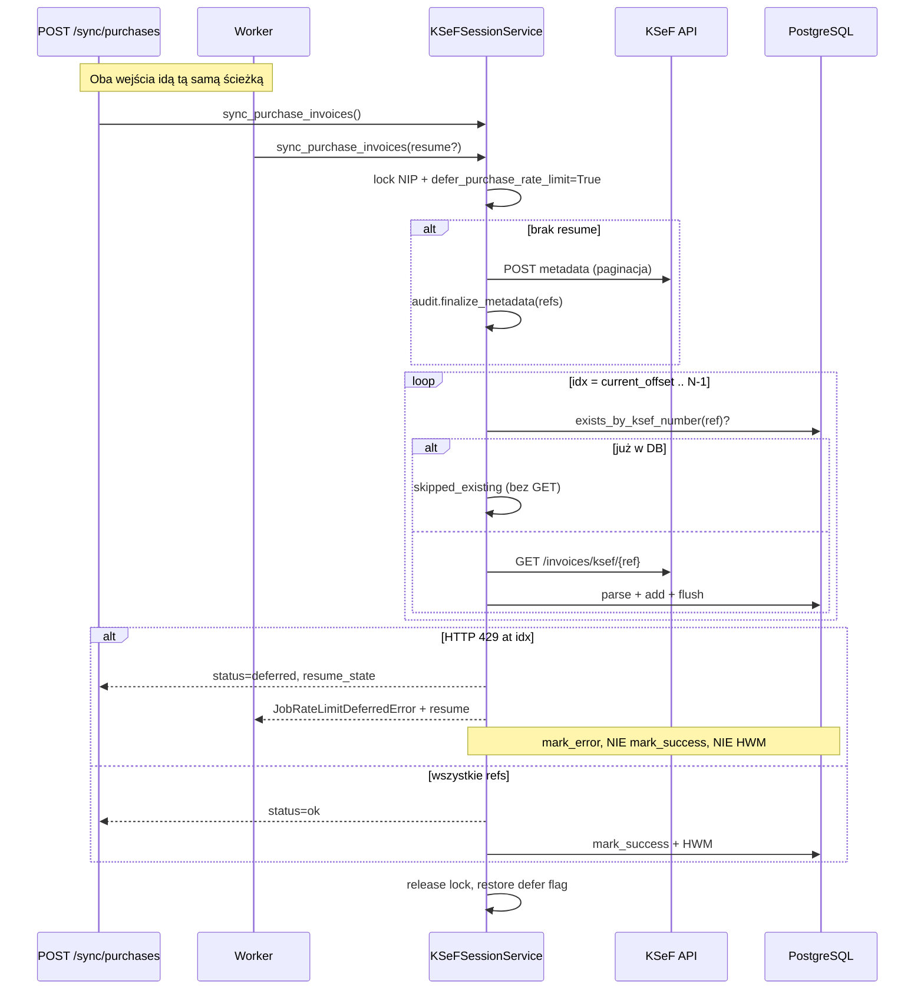

# KSeF purchase sync — wymuszenie resume przy HTTP 429 (API + worker)

**Data:** 2026-07-03  
**Branch:** `production`  
**Kontekst:** diagnostyka prod (NIP `9670402857`, 29 refs metadata, 13× HTTP 429 na XML, 0 faktur lipcowych w DB)

---

## Przyczyna błędu

Diagnostyka potwierdziła, że **metadata i paginacja działają poprawnie**. Główny problem to **HTTP 429** przy pobieraniu XML faktur zakupowych.

W IFG istniały **dwie różne ścieżki** pobierania XML:

| Ścieżka | Kiedy | Zachowanie przy 429 |
|---------|-------|---------------------|
| **incremental + resume** | worker, `defer_purchase_rate_limit=True` | `KSeFRateLimitDeferredError` → `resume_state` → wznowienie od `current_offset` |
| **bulk_metadata** | `POST /api/v1/ksef/sync/purchases` (API inline) | sleep/retry w kliencie → 429 trafia do `download_errors` → sync idzie dalej → **brak resume** |

Skutek na produkcji (2026-07-03):

- metadata: **29 refs**, `hasMore=False`
- XML: **16 pobranych**, **16 skipped_existing**, **13 skipped_error (429)**
- raport API: `saved=0`, status wyglądał na „zakończony” mimo brakujących faktur
- faktury **lipcowe (2026-07)** nie trafiły do DB
- ponowny sync pobierał XML **od początku listy**, co pogarszało 429

Dodatkowo równoległe wywołania (API + worker UI) dla tego samego NIP **podwajały** obciążenie KSeF.

---

## Zmienione pliki

| Plik | Zmiana |
|------|--------|
| `app/services/ksef_session_service.py` | Usunięto ścieżkę `bulk_metadata`; **zawsze incremental**; `defer_purchase_rate_limit=True` w `sync_purchase_invoices`; lock per NIP + blokada aktywnego BackgroundJob; skip GET XML gdy ref już w DB; `audit.finalize_metadata` po pobraniu refs |
| `app/worker/job_handlers/sync_purchase_invoices.py` | Przy defer **zawsze** przekazywany `resume` (`report.resume_state` lub `payload.resume`); bezpieczne parsowanie `job_id` jako UUID |
| `tests/unit/test_ksef_sync_service.py` | Mocki na incremental (`query_purchase_metadata_refs` + `get_purchase_invoice_xml`); test 429 → defer |
| `tests/unit/test_ksef_purchase_sync_resume.py` | Nowe testy: offset=17, skip existing, API incremental, deferred bez `mark_success`, blokada równoległego NIP, handler resume |

**Bez zmian strukturalnych DB** — resume w istniejącym `background_jobs.payload_json`, brak migracji Alembic.

---

## Nowy przepływ



### Kluczowe reguły

1. **`sync_received_invoices` zawsze wywołuje `_sync_received_invoices_incremental`** — nie ma fallbacku do bulk.
2. **`sync_purchase_invoices` (API i worker)** wymusza `defer_purchase_rate_limit=True` na czas syncu.
3. **Przed GET XML:** `invoice_repository.exists_by_ksef_number(ref)` → pominięcie, licznik `skipped_existing`.
4. **Blokada równoległości per NIP:**
   - aktywny `BackgroundJob` (`pending`/`processing`, typ `sync_purchase_invoices`) → `ConflictError` (HTTP 409),
   - threading lock w procesie → drugi request w tym samym workerze/API też dostaje 409.
5. **Enqueue** (`POST /ksef-sessions/sync-purchase`) — bez zmian: zwraca istniejący `job_id` zamiast tworzyć duplikat.

---

## Decyzja: co dzieje się przy HTTP 429

| Aspekt | Zachowanie |
|--------|------------|
| Traktowanie ref | **Nie** jako zwykły `skipped_error` — sync kończy się **defer/incomplete** |
| `invoice_refs` | **Zachowane** w `resume_state` |
| `current_offset` | Indeks ref, na którym wystąpił 429 (np. 17 → wznawiamy od ref nr 17) |
| Zapisane przed 429 | Pozostają w DB (`flush` po każdej fakturze) |
| High-water-mark (`ksef_sync_states`) | **Nie aktualizowany** — `mark_success` tylko przy pełnym sukcesie |
| Status sync state | `mark_error` przy defer/incomplete |
| API response | `status: "deferred"`, `rate_limit_deferred: true`, `resume_state: {...}` |
| Worker | `JobRateLimitDeferredError` z `resume` → `payload_json.resume`, `available_at = now + retry_after` |
| Ponowne pobieranie refs 0..N-1 | **Nie** — resume startuje od `current_offset`; refs już w DB pomijane bez GET |

---

## Wynik testów

```bash
PYTHONPATH=. .venv/bin/pytest \
  tests/unit/test_ksef_metadata_pagination.py \
  tests/unit/test_ksef_purchase_sync_audit.py \
  tests/unit/test_ksef_sync_window.py \
  tests/unit/test_ksef_session_service.py \
  tests/unit/test_ksef_sync_service.py \
  tests/unit/test_ksef_purchase_sync_resume.py \
  -q
```

**Wynik: 47 passed** (2026-07-03)

Pokryte scenariusze (wymagania z zadania):

| Test | Weryfikacja |
|------|-------------|
| `test_sync_purchase_invoices_uses_incremental_path_not_bulk` | API sync używa incremental, nie bulk |
| `test_incremental_sync_429_at_ref_17_saves_offset_17` | 429 na ref 17 → `current_offset=17` |
| `test_incremental_sync_resume_continues_from_current_offset_in_full_list` | wznowienie nie pobiera refs 0..16 |
| `test_incremental_sync_skips_get_xml_for_existing_refs` | istniejące refs bez GET XML |
| `test_sync_purchase_invoices_blocks_parallel_sync_for_same_nip` | równoległy sync NIP → `ConflictError` |
| `test_sync_purchase_invoices_deferred_does_not_mark_success` | defer → brak `mark_success` |
| `test_handler_defer_carries_resume_state` | worker zawsze niesie resume przy defer |

---

## Ryzyka

| Ryzyko | Poziom | Mitigacja |
|--------|--------|-----------|
| Joby DEFERRED sprzed deployu bez `resume` w payload | Niskie | Pierwsza próba po deploy pobierze metadata od nowa; refs już w DB pomijane przez `exists_by_ksef_number` |
| API inline sync przy 429 może trwać dłużej (defer zamiast sleep w pętli) | Niskie | Zalecany async worker dla dużych okien; API zwraca `deferred` z resume |
| Lock per NIP tylko w procesie | Średnie | DB check na `BackgroundJob` + lock; w multi-worker wystarczy job guard |
| `ConflictError` (409) gdy użytkownik kliknie sync podczas trwającego | Akceptowalne | UI powinno pokazać „sync już trwa” |
| Stary klient oczekujący `status=ok` mimo partial errors | Średnie | Teraz `incomplete`/`deferred` — poprawne semantycznie; monitorować logi `KSEF_PURCHASE_SYNC_AUDIT` |

---

## Instrukcja deploy / test na DS723+

### 1. Deploy (Guardian2)

```bash
# lokalnie — commit + push na production (po review tego raportu)
git push origin production

# deploy przez Guardian2 (jak wcześniej)
# upewnij się, że restart obejmuje API + worker
```

### 2. Weryfikacja po deploy

```bash
# kontenery
docker compose ps

# wersja commita
docker compose exec api git rev-parse --short HEAD
```

### 3. Połączenie KSeF

Upewnij się, że sesja KSeF jest **aktywna** (nie expired). W portalu IFG: KSeF → połącz ponownie jeśli trzeba.

### 4. Kontrolowany sync zakupów (NIP prod)

```bash
# async (zalecane — worker z resume)
curl -sS -X POST "https://<HOST>/api/v1/ksef-sessions/sync-purchase" \
  -H "Authorization: Bearer <TOKEN>" \
  -H "Content-Type: application/json" \
  -d '{"nip":"9670402857","date_from":"2026-06-01","date_to":"2026-07-03","force_full":true}'

# śledzenie joba
curl -sS "https://<HOST>/api/v1/jobs/<JOB_ID>" -H "Authorization: Bearer <TOKEN>"
```

Oczekiwane w logach workera przy 429:

```
KSeF purchases incremental sync ... offset=...
KSEF_PURCHASE_SYNC_AUDIT SYNC_INCOMPLETE rate_limited=True ...
# payload_json.resume z current_offset
```

### 5. Weryfikacja SQL (faktury lipcowe)

```sql
SELECT COUNT(*), MIN(issue_date), MAX(issue_date)
FROM invoices
WHERE invoice_type = 'purchase'
  AND buyer_nip = '9670402857'
  AND issue_date >= '2026-07-01';
```

### 6. Test API inline (opcjonalnie)

```bash
curl -sS -X POST "https://<HOST>/api/v1/ksef/sync/purchases" \
  -H "Authorization: Bearer <TOKEN>" \
  -H "Content-Type: application/json" \
  -d '{"date_from":"2026-06-01","date_to":"2026-07-03","force_full":true}'
```

Przy 429 oczekiwane: `"status":"deferred"`, `"resume_state":{...}`, **nie** `"status":"ok"` z `errors>0`.

### 7. Test blokady równoległości

Uruchom sync async, w trakcie wywołaj drugi sync dla tego samego NIP — oczekiwane **HTTP 409** lub zwrot istniejącego `job_id` (enqueue).

---

## Status

- [x] Kod naprawiony
- [x] Testy KSeF sync/resume/audit — **47 passed**
- [x] Raport
- [ ] Deploy na DS723+ — **celowo wstrzymany do review raportu**
