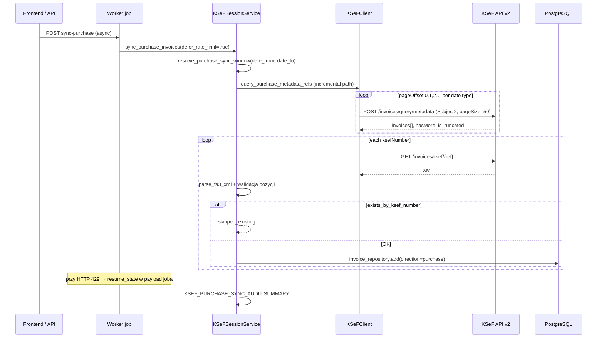

# KSeF — analiza luki sync zakupów (KSeF > IFG)

**Data:** 2026-07-03  
**Cel:** ustalić gdzie giną faktury zakupowe między KSeF a IFG  
**Status kodu:** dodano `KSEF_PURCHASE_SYNC_AUDIT` (jeden blok logów na sync)

---

## 1. Przepływ synchronizacji (end-to-end)



### Ścieżki w kodzie

| Etap | Plik | Metoda |
|------|------|--------|
| Enqueue | `app/api/routers/ksef_session.py` | `sync_purchase_invoices` |
| Worker | `app/worker/job_handlers/sync_purchase_invoices.py` | `handle` |
| Orchestracja | `app/services/ksef_session_service.py` | `sync_purchase_invoices` |
| Metadata | `app/integrations/ksef/client.py` | `_query_purchase_metadata_refs` |
| XML | `app/integrations/ksef/client.py` | `_get_purchase_invoice_xml` |
| Zapis | `app/services/ksef_session_service.py` | `_process_purchase_invoice_xml` |
| Resume 429 | `app/worker/__main__.py` | `JobRateLimitDeferredError` + `payload.resume` |

**Worker zawsze** ustawia `defer_purchase_rate_limit=True` → ścieżka **incremental** (metadata raz, potem GET per faktura z resume).

---

## 2. Limity w kodzie IFG

| Stała | Wartość | Efekt |
|-------|---------|-------|
| `_METADATA_PAGE_SIZE` | **50** | Max ref na stronę metadata |
| `_METADATA_MAX_PAGES` | **200** | Max **10 000** ref / dateType (200×50) |
| `_METADATA_DATE_TYPES` | PermanentStorage, Invoicing, Issue | 3 osobne zapytania, union + dedup |
| `_REQUEST_MIN_INTERVAL` | 1.2 s | Throttle między requestami KSeF |
| `_PURCHASE_INVOICE_RATE_LIMIT_RETRIES` | 5 | Retry GET XML przy 429 |
| Worker job priority | 2 | Kolejka — nie limit liczby FV |
| SQL `LIMIT` w sync | **brak** | Pełna lista ref z metadata przetwarzana sekwencyjnie |
| `exists_by_ksef_number` | per ref | Pomija duplikaty — nie obcina listy |

**Brak** `continuationToken` w API metadata KSeF v2 — paginacja wyłącznie `pageOffset` (numer strony) + `hasMore`.

---

## 3. Gdzie giną faktury — ranking przyczyn

### A. Paginacja metadata (historycznie główna; lokalnie naprawione)

**Objaw prod (2026-06):** strona 0 → 50 ref, `hasMore=true`; `pageOffset=50` → 0 ref.

**Przyczyna:** błędna inkrementacja `pageOffset += pageSize` (50) zamiast `pageOffset += 1` (numer strony).

**Stan kodu dziś:** `page_offset += 1` + `sortOrder=Asc` — zgodne z OpenAPI MF.

**Weryfikacja:** jeśli prod nadal ma starą wersję → **>50 FV w zakresie nigdy nie trafia do IFG**.

**Log audytu:** `KSEF_PURCHASE_SYNC_AUDIT page=N` — sprawdź czy `pages_downloaded > 1` gdy KSeF ma >50 FV.

---

### B. HTTP 429 — sync niekompletny (wysokie prawdopodobieństwo na prod)

**Mechanizm:**

1. Metadata pobiera **wszystkie** ref (np. 200).
2. Incremental GET XML: ~1.2 s/ref → przy 200 FV ≈ 4+ min.
3. KSeF zwraca **429** → job kończy się z `resume_state.current_offset`.
4. Worker odkłada job i wznawia z resume.

**Ryzyko utraty:**

- Job **nie dokończy** wszystkich ref przed kolejnym 429 / timeout.
- Użytkownik widzi „sync OK” tylko gdy job completed — partial defer = `status=deferred`.
- **`final_database_count` < `invoice_ids_received`** w SUMMARY = luka.

**Log audytu:** `incomplete=true`, `rate_limited=true`, porównaj `xml_downloaded` vs `invoice_ids_received`.

---

### C. Pusta strona przy `hasMore=true` (wcześniej cicho)

**Mechanizm:** API zwraca `hasMore=true`, następna strona pusta → pętla kończyła się bez błędu.

**Stan kodu dziś:** log **`PAGINATION_ERROR`** + `incomplete=true`.

---

### D. `isTruncated=true` — niezaimplementowane (średnie)

MF wymaga **przesunięcia `dateRange.from`**, nie dalszego `pageOffset`.

**Stan kodu:** log błędu, **brak algorytmu shift daty** → przy >10 000 FV w jednym filtrze część ginie.

---

### E. Pomijanie po pobraniu XML (niskie vs liczba w KSeF)

| Warunek | Licznik audytu |
|---------|----------------|
| Duplikat `ksef_reference_number` | `skipped_existing` |
| Błąd parsowania FA(3) | `skipped_invalid` |
| Walidacja pozycji (`purchase_items_validation_error`) | `skipped_invalid` |
| Błąd zapisu DB | `skipped_error` |
| Błąd GET XML | `skipped_error` |

To **nie tłumaczy** sytuacji „KSeF ma więcej, IFG ma 50” — to wyjaśnia pojedyncze odrzuty, nie masowy brak stron 2+.

---

### F. Okno dat sync (niskie)

`resolve_purchase_sync_window` może zawęzić zakres (incremental od `last_date_to`). FV **poza oknem** nie trafiają do metadata query — to oczekiwane, nie bug.

---

## 4. Nowe logowanie — jak czytać po jednym sync

Filtr logów:

```bash
grep 'KSEF_PURCHASE_SYNC_AUDIT' worker.log
```

### Per strona metadata

```
KSEF_PURCHASE_SYNC_AUDIT page=1 dateType=PermanentStorage pageOffset=0 received=50 hasMore=true ...
KSEF_PURCHASE_SYNC_AUDIT page=2 dateType=PermanentStorage pageOffset=1 received=30 hasMore=false ...
```

(`continuationToken` = null w API MF; logowany jest też `permanentStorageHwmDate`)

### Podsumowanie (jeden wiersz)

```
KSEF_PURCHASE_SYNC_AUDIT SUMMARY nip=... metadata_returned=80 pages_downloaded=2
  invoice_ids_received=80 xml_downloaded=80 saved=5 skipped_existing=75
  skipped_invalid=0 skipped_error=0 final_database_count=120 incomplete=false
```

### Interpretacja

| Sygnatura | Diagnoza |
|-----------|----------|
| `pages_downloaded=1`, `metadata_returned=50`, KSeF portal >50 | Paginacja / stary deploy / pusta strona 2 |
| `PAGINATION_ERROR ... hasMore=true` | API nie zwraca strony 2 |
| `invoice_ids_received` >> `xml_downloaded` | 429 / błędy GET |
| `xml_downloaded` >> `saved + skipped_existing` | parse/validation errors |
| `incomplete=true` | Sync nie dokończony — sprawdź job resume |
| `final_database_count` << oczekiwane | Okno dat lub wcześniejsze incomplete sync |

---

## 5. Poprawki (kolejność)

### Natychmiast (diagnoza prod)

1. **Deploy** wersji z `page_offset += 1` (jeśli prod ma starą).
2. Uruchomić sync, zebrać `KSEF_PURCHASE_SYNC_AUDIT SUMMARY`.
3. Porównać `metadata_returned` z liczbą FV w portalu KSeF (ten sam NIP, Subject2, zakres dat).

### Krótkoterminowa (jeśli A potwierdzone)

Paginacja już w kodzie — wystarczy deploy + weryfikacja `pages_downloaded >= 2`.

### Jeśli B (429) dominuje

- Zwiększyć `retry_after` compliance / backoff.
- Rozważyć **`POST /invoices/exports`** (MF rekomenduje do sync przyrostowego — omija wielostronną metadata).
- UI: jasny status „sync częściowy, wznowienie automatyczne”.

### Jeśli D (`isTruncated`)

Implementacja algorytmu MF: shift `dateRange.from` od ostatniego `permanentStorageDate`, reset `pageOffset=0`.

### Długoterminowo

Eksport paczek KSeF zamiast metadata+GET per ref — mniej 429, pełniejszy zbiór.

---

## 6. Pliki zmienione (audyt)

| Plik | Zmiana |
|------|--------|
| `app/services/ksef_purchase_sync_audit.py` | **nowy** — agregacja metryk + SUMMARY |
| `app/integrations/ksef/client.py` | page log + błąd hasMore/isTruncated/max_pages |
| `app/services/ksef_session_service.py` | podpięcie audytu, liczniki skip/save |
| `app/persistence/repositories/invoice_repository.py` | `count_ksef_purchases_in_issue_range` |
| `tests/unit/test_ksef_metadata_pagination.py` | poprawione mocki pageOffset 0,1 |
| `tests/unit/test_ksef_purchase_sync_audit.py` | **nowy** |

---

## 7. Werdykt

| Pytanie | Odpowiedź |
|---------|-----------|
| Gdzie giną faktury? | Najczęściej **przed zapisem**: metadata (paginacja / incomplete sync) lub GET XML (429) |
| Dlaczego KSeF > IFG? | **#1** niepełna paginacja metadata (historyczny bug `pageOffset+=50`); **#2** 429 bez dokończenia joba; **#3** `isTruncated` bez shift daty |
| Jaka poprawka? | Deploy paginacji + audyt prod; jeśli 429 — exports lub lepsze resume; jeśli truncated — algorytm MF |

**Następny krok operacyjny:** jeden sync na prod → wkleić blok `KSEF_PURCHASE_SYNC_AUDIT` → porównać liczby z tabelą powyżej.
