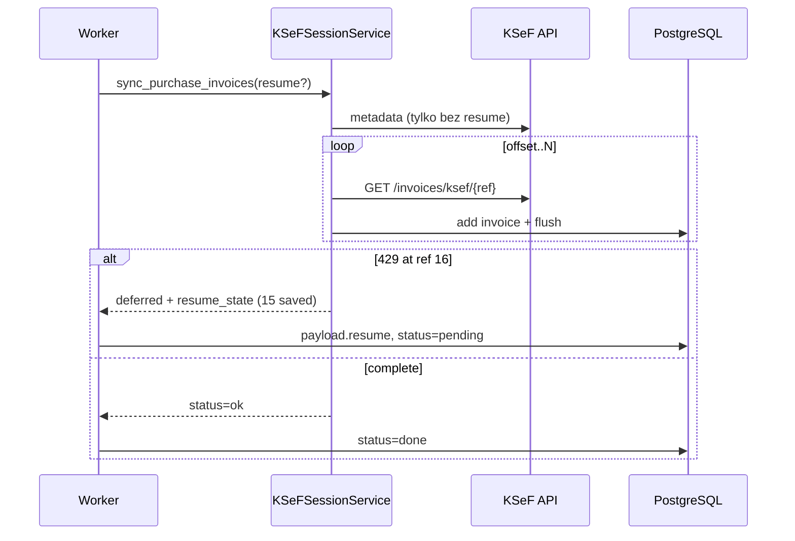

# KSeF purchase sync — resume przy HTTP 429

**Data:** 2026-06-22  
**Kontekst:** [KSEF_PURCHASE_SYNC_PROGRESS_DIAG.md](./KSEF_PURCHASE_SYNC_PROGRESS_DIAG.md)

---

## Problem

Przy `defer_purchase_rate_limit=True` (worker):

1. Metadata → lista ref (np. 50)
2. Batch `GET /invoices/ksef/{ref}` w kliencie
3. Pierwszy **429** → wyjątek → **0 zapisanych** faktur z bieżącej próby
4. Retry → metadata + download od początku → brak postępu

---

## Rozwiązanie

### 1. Incremental sync (worker / defer)

Gdy `defer_purchase_rate_limit is True` lub job ma `payload_json.resume`:

- Metadata pobierane **raz** (`query_purchase_metadata_refs`)
- Dla każdego ref: `GET` → parse → `invoice_repository.add` → **`session.flush()`**
- Przy 429: zwracany `resume_state` zamiast wyjątku w serwisie; handler rzuca `JobRateLimitDeferredError` z resume

### 2. Resume w `background_jobs.payload_json`

Po DEFERRED worker zapisuje:

```json
{
  "resume": {
    "invoice_refs": ["..."],
    "current_offset": 15,
    "current_reference": "KSEF-REF-015",
    "downloaded_count": 15,
    "subject_type": "subject2",
    "saved_accumulated": 15,
    "skipped_existing_accumulated": 0,
    "skipped_parse_accumulated": 0,
    "error_samples": []
  },
  "partial_result": { "saved": 15, "received": 50, ... }
}
```

Kolejna próba: **bez ponownego metadata**, start od `current_offset`.

### 3. Blokada równoległych jobów (ten sam NIP)

`POST /ksef-sessions/sync-purchase` — jeśli istnieje job `pending`/`processing` dla tego NIP, zwraca istniejący `job_id` (202).

### 4. Zachowany mechanizm retry_after

`JobRateLimitDeferredError.retry_after_seconds` → `available_at = now + retry_after`, `attempts -= 1`.

### 5. Ścieżka synchroniczna (API bez workera)

Bez zmian — batch download w kliencie, bez resume (flaga defer wyłączona).

---

## Zmienione pliki

| Plik | Zmiana |
|------|--------|
| `app/services/ksef_session_service.py` | incremental sync, `_process_purchase_invoice_xml`, partial defer w `sync_purchase_invoices` |
| `app/integrations/ksef/client.py` | publiczne `query_purchase_metadata_refs`, `get_purchase_invoice_xml` |
| `app/worker/job_handlers/sync_purchase_invoices.py` | resume w defer, `partial_result` |
| `app/worker/__main__.py` | persist `resume` / `partial_result` w payload przy DEFERRED |
| `app/api/routers/ksef_session.py` | blokada duplikatu joba per NIP |
| `tests/unit/test_ksef_purchase_sync_resume.py` | **nowy** — 429 partial, resume, brak duplikatów, blokada NIP |
| `tests/unit/test_background_job_claim.py` | persist resume w payload |

---

## Testy

```bash
.venv/bin/pytest tests/unit/test_ksef_purchase_sync_resume.py \
  tests/unit/test_background_job_claim.py \
  tests/unit/test_ksef_sync_service.py \
  tests/unit/test_ksef_client_retry.py -q
```

**Wynik:** 44 passed

Scenariusze:

- 429 po 15 zapisanych → `saved=15`, `current_offset=15`
- Resume od offset 15 → bez re-metadata, +1 saved
- Resume → brak duplikatu ref już w bazie
- Handler → `JobRateLimitDeferredError` z `resume`
- Worker → `payload_json.resume` po DEFERRED
- Enqueue → ten sam NIP nie tworzy drugiego aktywnego joba

---

## Migracja / deploy DB

| Aspekt | Wymagane? |
|--------|-----------|
| Migracja Alembic | **Nie** |
| Deploy DB | **Nie** |
| Deploy aplikacji + worker | **Tak** |

Resume używa istniejącego `background_jobs.payload_json` (JSONB). Brak nowych kolumn/tabel.

### Ryzyko migracji

**Brak** — zmiana wyłącznie w logice aplikacji.

### Ryzyko operacyjne (niskie)

- Joby DEFERRED sprzed deployu nie mają `resume` w payload — pierwsza próba po deploy pobierze metadata od nowa, ale już zapisane faktury są pomijane przez `exists_by_ksef_number`.
- `ksef_sync_states` przy partial defer: `status=error` (jak wcześniej przy 429), `last_success_at` bez zmian do pełnego sukcesu.

---

## Przepływ po fixie



---

## Poza zakresem (bez zmian)

- Magazyn
- Faktury sprzedaży / submit KSeF
- Batch sync synchroniczny (bez defer)
