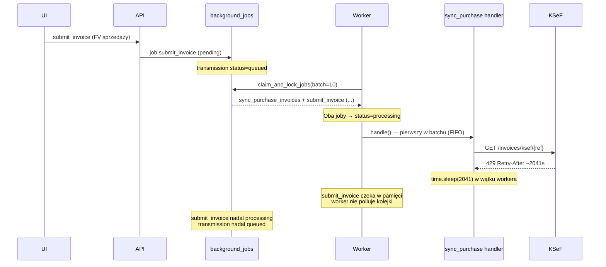

# Analiza: worker blokuje wysyłkę FV sprzedaży przez sync zakupów (HTTP 429)

**Data:** 2026-05-22  
**Kontekst produkcji:** transmisje `submit_invoice` w `status=queued`; worker przetwarza `sync_purchase_invoices`; KSeF zwraca `429 Too Many Requests`; log `sleep_seconds=2041`; sprzedaż nie jest obsługiwana.

---

## 1. Architektura workera

Pliki:

| Plik | Rola |
|------|------|
| `app/worker/__main__.py` | Pętla poll → `_process_batch()` → handlery |
| `app/worker/worker.py` | Cienka fasada `JobRepository.claim_next_batch` |
| `app/persistence/models/background_job.py` | `claim_and_lock_jobs`, kolejka FIFO po `available_at` |
| `app/worker/job_handlers/submit_invoice.py` | Wysyłka FV sprzedaży do KSeF |
| `app/worker/job_handlers/poll_ksef_status.py` | Polling statusu po submit |
| `app/worker/job_handlers/sync_purchase_invoices.py` | Sync faktur zakupowych |

Worker jest **jednowątkowy** — jedna instancja, jedna pętla:

```python
while _running:
    _process_batch()   # synchronicznie, do końca batcha
    time.sleep(POLL_INTERVAL_SECONDS)  # domyślnie 5 s
```

Brak osobnych kolejek, brak równoległości między typami jobów.

---

## 2. Przepływ produkcyjny (co się stało)



---

## 3. Odpowiedzi na pytania z zadania

### 3.1 Czy retry/sleep dla 429 blokuje cały worker?

**Tak.**

Sleep nie jest w handlerze — jest w `KSeFClient._get_purchase_invoice_xml()` (`app/integrations/ksef/client.py`), wołanym z łańcucha:

`sync_purchase_invoices` handler → `KSeFSessionService.sync_purchase_invoices()` → `sync_received_invoices()` → `query_received_invoices()` → `_download_metadata_purchase_invoices()` → `_get_purchase_invoice_xml()`.

Przy 429:

```python
sleep_seconds = self._rate_limit_sleep_seconds(response, attempt)  # Retry-After, np. 2041
time.sleep(sleep_seconds)  # blokuje wątek workera
```

Do **5 prób** (`_PURCHASE_INVOICE_RATE_LIMIT_RETRIES = 5`) — teoretycznie wiele godzin blokady w jednym jobie.

`submit_invoice` i `poll_ksef_status` **nie używają** `_get_purchase_invoice_xml`, ale **nie mogą startować**, dopóki worker siedzi w `time.sleep()` w jobie sync.

### 3.2 Czy jeden job może zatrzymać obsługę pozostałych?

**Tak — na dwa sposoby.**

#### A) Batch claim + sekwencyjne przetwarzanie

`__main__.py`:

```python
jobs = claim_and_lock_jobs(session, BATCH_SIZE)  # BATCH_SIZE = 10
for job in jobs:
    handler.handle(...)  # synchronicznie, jeden po drugim
```

`claim_and_lock_jobs` (`background_job.py`):

- Pobiera do 10 jobów `pending` z `available_at ASC`
- **Od razu** ustawia wszystkie na `status=processing`
- Worker przetwarza je **po kolei**

Skutek: jeśli `sync_purchase_invoices` jest pierwszy w batchu, pozostałe joby (w tym `submit_invoice`) są już `processing`, ale **nie wykonane** — czekają w pętli `for job in jobs` przez cały czas sleep sync.

#### B) Brak priorytetyzacji typów

Kolejność claim = wyłącznie `available_at ASC`. `sync_purchase_invoices` i `submit_invoice` konkurują na równi. Starszy sync może wyprzedzić świeże submity sprzedaży.

#### C) Brak kolejnego polla do końca batcha

Worker **nie** wraca do `claim_and_lock_jobs`, dopóki nie przetworzy **wszystkich** jobów z bieżącego batcha (lub nie padnie). Podczas 34‑minutowego sleep sync nie ma nowych ticków.

### 3.3 Zachowanie handlerów

| Handler | 429 / długi sleep | Requeue |
|---------|-------------------|---------|
| `sync_purchase_invoices` | Deleguje do serwisu; sleep w kliencie; brak requeue w handlerze | Nie — job `done` dopiero po zakończeniu całego sync |
| `submit_invoice` | `KSeFClientError` transient → backoff minuty + nowy job | Tak (wewnętrznie) |
| `poll_ksef_status` | Błąd → `_schedule_retry` +30 s | Tak |

Sync zakupów jest **outlierem** — może monopolizować worker na długi czas bez odroczenia.

---

## 4. Dlaczego transmisje sprzedaży siedzą w `queued`

1. API `TransmissionService.submit_invoice` tworzy transmisję `QUEUED` i job `submit_invoice` w `background_jobs`.
2. Worker musi wykonać `SubmitInvoiceJobHandler.handle`, żeby ustawić transmisję na `PROCESSING` → `SUBMITTED`.
3. Dopóki worker jest zablokowany w sync + sleep 429, job `submit_invoice` **nie startuje** → transmisja zostaje `queued`.

To nie jest bug statusów transmisji — to **blokada kolejki workera**.

---

## 5. Propozycja minimalnego fixu

Zakres: **worker + handlery** (plus minimalna zmiana claim w `background_job.py` jeśli potrzebna priorytetyzacja — jeden plik pomocniczy używany wyłącznie przez worker).

### Fix A — claim pojedynczy (najmniejszy, natychmiastowy)

**Plik:** `app/worker/__main__.py`

```python
BATCH_SIZE = 1  # było 10
```

Efekt:

- Tylko **jeden** job `processing` naraz — submit nie czeka „w batchu” na koniec sync.
- Po zakończeniu (lub błędzie) sync worker od razu bierze następny job.

**Ograniczenie:** jeśli sync **już działa** i śpi 2041 s, nadal blokuje worker. Nie rozwiązuje aktywnego sleep — tylko zapobiega „martwym” jobom w batchu.

### Fix B — priorytet sprzedaży przy claim

**Plik:** `app/persistence/models/background_job.py` (helper używany z `__main__.py`)

Dodać sortowanie po typie joba przed `available_at`:

```python
_PRIORITY = case(
    (BackgroundJob.job_type == "submit_invoice", 0),
    (BackgroundJob.job_type == "poll_ksef_status", 1),
    (BackgroundJob.job_type == "sync_purchase_invoices", 2),
    else_=3,
)
.order_by(_PRIORITY.asc(), BackgroundJob.available_at.asc())
```

Efekt: gdy w kolejce są oba typy, worker **najpierw** bierze `submit_invoice` / `poll_ksef_status`, sync zakupów dopiero gdy brak jobów sprzedażowych.

### Fix C — odroczenie sync przy 429 (handler)

**Plik:** `app/worker/job_handlers/sync_purchase_invoices.py`

Po zakończeniu sync (lub przy wyjątku 429):

- jeśli `report["rate_limited"] is True` **lub** wyjątek z `status_code == 429`:
  - **nie** oznaczać joba jako `done` z pełnym synciem,
  - ustawić `job.status = "pending"`, `job.available_at = now + timedelta(seconds=retry_after)`,
  - `job.attempts` bez incrementu (albo osobny licznik),
  - zwrócić wynik częściowy.

**Problem:** sleep 2041 s dzieje się **przed** powrotem do handlera. Bez zmiany klienta (poniżej) handler dostaje kontrolę dopiero po sleep.

### Fix D — wymagany uzupełniający (poza handlerami, ale konieczny dla 429)

**Plik:** `app/integrations/ksef/client.py` (follow-up, nie w scope tej analizy)

Przy pierwszym 429 w sync zakupów:

- **nie** wołać `time.sleep(retry_after)` w wątku workera,
- rzucić `KSeFClientError(..., status_code=429, transient=True, retry_after=2041)` **natychmiast**,
- handler (Fix C) robi requeue z `available_at`.

Alternatywa: cap sleep, np. `min(retry_after, 60)` — gorsze dla KSeF, ale mniejsza blokada.

**Rekomendacja:** Fix A + B + C + D razem. Sam A+B poprawia priorytet i batch, ale **nie** eliminuje 34‑minutowego sleep aktywnego sync.

---

## 6. Proponowana kolejność wdrożenia

| Krok | Zmiana | Ryzyko | Efekt |
|------|--------|--------|-------|
| 1 | `BATCH_SIZE = 1` | niski | brak martwych `processing` w batchu |
| 2 | Priorytet claim (submit > poll > sync) | niski | sprzedaż przed sync zakupów |
| 3 | Handler sync: requeue on `rate_limited`/429 | średni | sync nie kończy się „done” przy rate limit |
| 4 | Client: no inline sleep on 429 w worker context | średni | worker nie śpi 2041 s |

Krok 4 można zrealizować jako parametr `defer_rate_limit=True` przekazywany z handlera sync — minimalny kontrakt bez refaktoru całego klienta.

---

## 7. Co **nie** robić

- Nie zmieniać statusów `rejected` / `queued` transmisji produkcyjnych w DB.
- Nie uruchamiać masowego retry FV bez deployu fixu (ponowny submit wygeneruje ten sam problem na starym workerze).
- Nie dodawać drugiego procesu workera bez skip_locked — już jest `with_for_update(skip_locked=True)`, ale jeden worker i tak jest wąskim gardłem przy sleep.

---

## 8. Weryfikacja po fixie

1. W kolejce: 1× `sync_purchase_invoices` + 2× `submit_invoice`.
2. Symulacja 429 w mocku klienta **bez sleep** (Fix D).
3. Oczekiwane: oba `submit_invoice` wykonane w ciągu sekund; sync wraca do `pending` z `available_at` w przyszłości.
4. Transmisje sprzedaży przechodzą `queued` → `processing` → `submitted`.

Testy do rozszerzenia (poza obecnym scope):

- `tests/unit/test_worker_job_priority.py` (claim order),
- `tests/unit/test_sync_purchase_invoices_handler.py` (requeue on rate_limited).

Istniejące: `tests/unit/test_ksef_session_worker.py` — tylko `submit_invoice` handler, nie pokrywa blokady kolejki.

---

## 9. Podsumowanie

| Pytanie | Odpowiedź |
|---------|-----------|
| 429 blokuje worker? | **Tak** — `time.sleep()` w `_get_purchase_invoice_xml` w synchronicznym handlerze |
| Jeden job blokuje inne? | **Tak** — batch claim + sekwencja + brak priorytetu |
| Minimalny fix | `BATCH_SIZE=1` + priorytet claim + requeue sync przy 429 + brak inline sleep w kliencie |
| Dane prod | **Bez zmian** — po deployu ręczne ponowienie wysyłki FV w `queued` / retry rejected |

**Status:** analiza i propozycja — **implementacja nie wykonana** w tym zadaniu (tylko raport).
