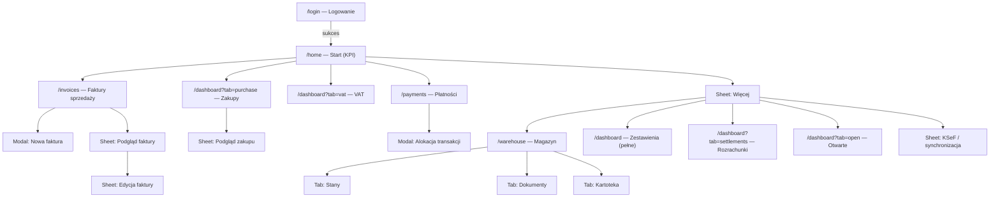
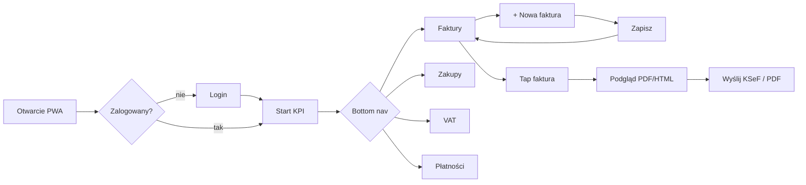

# IFG Mobile UI — specyfikacja do Penpot (iPhone)

**Kontekst:** Responsive Web App w istniejącym `frontend-react`, te same trasy pod `/ui`, breakpoint **≤768 px**. Desktop bez zmian.

**Ramka Penpot (master):** `390 × 844 px` (iPhone 14/15), siatka **4 px**, margines treści **16 px**, safe area góra **59 px**, dół **34 px**.

---

## 0. Struktura pliku Penpot

```
📁 IFG — Mobile iPhone
├── 🎨 00 Design Tokens
├── 🧩 01 Components (library)
├── 🗺 02 Sitemap
├── 🔀 03 User Flows
└── 📱 04 Screens
    ├── Auth
    ├── Start
    ├── Faktury
    ├── Zakupy
    ├── VAT
    ├── Płatności
    ├── Więcej
    └── Magazyn
```

Każdy ekran = osobna **Board** z nazwą: `[Sekcja] / [Ekran] / [Stan]`  
Przykład: `Faktury / Lista / Miesiąc aktywny`

---

## 1. Sitemap ekranów

### 1.1 Drzewo nawigacji



### 1.2 Mapowanie na istniejące trasy (implementacja później)

| Ekran mobilny | Trasa | Istniejący komponent |
|---|---|---|
| Logowanie | `/login` | `LoginPage` |
| **Start (nowy)** | `/home` *(propozycja)* | agregat KPI z dashboardu |
| Faktury sprzedaży | `/invoices` | `SimpleView` + `InvoiceCardList` |
| Zakupy | `/dashboard?tab=purchase` | `AdvancedDashboard` |
| VAT | `/dashboard?tab=vat` | `VATSummary` |
| Płatności | `/payments` | `PaymentsPage` |
| Magazyn | `/warehouse` | `WarehousePage` |
| Zestawienia (pełne) | `/dashboard` | `AdvancedDashboard` + `DashboardSummary` |
| Otwarte faktury | `/dashboard?tab=open` | `OpenInvoicesPanel` |
| Rozrachunki | `/dashboard?tab=settlements` | sekcja w `AdvancedDashboard` |
| Transmisje KSeF | `/dashboard?tab=transmissions` | `TransmissionTable` |

**Uwaga:** Domyślny redirect `/` → dziś `/invoices`; na mobile proponujemy `/home`.

### 1.3 Ekrany wtórne (overlay, nie w bottom nav)

| Ekran | Typ UI | Trigger |
|---|---|---|
| Nowa faktura | Full-screen sheet (od dołu) | FAB / CTA na Faktury |
| Podgląd faktury | Bottom sheet 90% wys. | tap karty faktury |
| Edycja faktury | Full-screen sheet | akcja „Edytuj” |
| Alokacja płatności | Modal centered | „Alokuj” na transakcji |
| Import CSV | Collapsible panel | sekcja na Płatności |
| Filtry | Bottom sheet | ikona lejek w headerze |
| KSeF — szczegóły | Bottom sheet | chip statusu w headerze |
| Więcej | Bottom sheet / menu | ikona „⋯” w headerze |
| Wyloguj | Dialog confirm | Więcej → Wyloguj |

---

## 2. User flow

### 2.1 Flow główny (codzienna praca)



### 2.2 Flow: wystawienie faktury sprzedaży

1. **Start** lub **Faktury** → CTA „+ Nowa faktura”
2. Sheet pełnoekranowy: `InvoiceForm` (kroki wizualne, jeden scroll)
3. Walidacja → Zapisz → toast sukcesu → powrót do listy z aktywnym miesiącem
4. Opcjonalnie: akcja „Wyślij do KSeF” na karcie / w podglądzie

### 2.3 Flow: kontrola zakupów i VAT

1. **Start** → kafel KPI „Zakupy netto” → **Zakupy**
2. Lista faktur zakupowych (karty, filtr miesiąca)
3. Bottom nav **VAT** → tabela stawek 23/8/5/0 + wiersz „Do zapłaty”
4. Tap wiersza stawki → drill-down lista faktur (opcjonalny ekran v2)

### 2.4 Flow: rozliczenie płatności

1. **Płatności** → sekcja Import CSV (zwinięta domyślnie)
2. Lista transakcji (karty zamiast tabeli)
3. Status `unmatched` → CTA „Alokuj” → modal: wybór faktury + kwota
4. Sukces → badge `matched` / `partially_matched`

### 2.5 Flow: KSeF

1. Chip w headerze: `Połączono` / `Brak sesji` / `Synchronizacja…`
2. Tap → sheet: ostatnia sync, liczba pobranych, przycisk „Odśwież KSeF”
3. Po sync → event odświeża pule faktur (jak dziś w desktopie)

---

## 3. Propozycja bottom navigation

### 3.1 Pięć pozycji (primary)

| # | Etykieta | Ikona (Penpot: 24×24 SVG) | Trasa | Aktywny gdy |
|---|---|---|---|---|
| 1 | **Start** | dom / siatka KPI | `/home` | `pathname === '/home'` |
| 2 | **Faktury** | dokument + złoty akcent | `/invoices` | `/invoices*` |
| 3 | **Zakupy** | koszyk / strzałka w dół | `/dashboard?tab=purchase` | `tab=purchase` |
| 4 | **Płatności** | karta / przelew | `/payments` | `/payments` |
| 5 | **VAT** | procent / kalkulator | `/dashboard?tab=vat` | `tab=vat` |

**Magazyn, Rozrachunki, Otwarte, Transmisje, Wyloguj** → menu **Więcej** (ikona `⋯` w prawym górnym rogu headera), nie w bottom nav.

### 3.2 Specyfikacja komponentu `BottomNav`

```
Wysokość: 56 px + safe-area-inset-bottom (34 px) = 90 px total
Tło: #141414 (--color-surface)
Górna obwódka: 1 px #2e2e2e
5 itemów równomiernie (78 px szer. każdy @390)
```

**Stany itemu:**
- Default: ikona `#606060`, label 10 px `#a0a0a0`
- Active: ikona `#d4a017`, label `#d4a017`, kropka 4 px pod ikoną
- Pressed: tło `#1c1c1c` radius 8 px

**Nie pokazywać** bottom nav na: `/login`, sheetach pełnoekranowych (Nowa faktura, Edycja).

### 3.3 Header mobilny (`MobileHeader`)

```
Wysokość: 56 px + safe-area-top
Layout: [Logo mini 28px] [Tytuł ekranu flex] [KSeF chip] [⋯ Więcej]
Tło: #0d0d0d, border-bottom 1 px #2e2e2e
```

Tytuły per ekran:
- Start → „Pulpit”
- Faktury → „Faktury · {miesiąc}”
- Zakupy → „Zakupy”
- VAT → „Zestawienie VAT”
- Płatności → „Płatności”

---

## 4. KPI na ekran Start (`/home`)

Okres domyślny: **bieżący miesiąc kalendarzowy** (spójnie z `SimpleView` i `resolveEffectiveFilters`).

### 4.1 Układ (Penpot board `Start / KPI / Default`)

```
[ Header: Pulpit + KSeF chip ]

[ Hero KPI — 1 duży kafel ]
  Sprzedaż netto (miesiąc)
  125 430,00 zł
  ▲ +12% vs poprzedni miesiąc (opcjonalnie v2)

[ Siatka 2×2 — kafle średnie ]
  Zakupy netto     |  VAT do zapłaty
  Otwarte FS       |  Nierozliczone płatności

[ Pasek akcji — 3 skróty ]
  [+ Faktura]  [Odśwież KSeF]  [Import CSV]

[ Mini wykres — opcjonalnie v1.1 ]
  Sprzedaż vs zakupy narastająco (height 120 px)

[ Ostatnia aktywność — lista 3 pozycji ]
  ostatnie faktury / transakcje
```

### 4.2 Lista KPI (źródło danych → co pokazać)

| # | KPI | Format | Źródło w app | Kolor akcentu |
|---|---|---|---|---|
| 1 | **Sprzedaż netto (m-c)** | `125 430,00 zł` | `buildPlnSummary(saleInvoices)` | złoto `#d4a017` |
| 2 | **Zakupy netto (m-c)** | `48 200,00 zł` | `buildPlnSummary(purchaseInvoices)` | niebieski `#3b82f6` |
| 3 | **VAT do zapłaty** | `8 940,00 zł` | `VATSummary` totals: saleVat − purchaseVat | zielony/czerwony zależnie od znaku |
| 4 | **Otwarte faktury sprzedaży** | `7 · 23 100,00 zł` | `OpenInvoicesPanel` count + sum | `#f59e0b` |
| 5 | **Nierozliczone transakcje** | `3 · 12 500,00 zł` | `PaymentsPage` filter `unmatched` | `#ef4444` |
| 6 | **Gotowe do KSeF** | `2 faktury` | status `ready_for_submission` | `#22c55e` |
| 7 | **Status KSeF** | chip: Połączono / Brak | `KSeFTopbarInfo` | statusowy |
| 8 | **Ostatnia synchronizacja** | `dziś 14:32` | `ksefApi.getPurchaseSyncStatus` | `#a0a0a0` |

**Kafel KPI — wymiary Penpot:**
- Hero: `358 × 96 px`, radius 10 px, tło `#1c1c1c`
- Średni: `171 × 88 px` (2 kolumny, gap 16 px)
- Label: 12 px `#a0a0a0`; wartość: 20 px bold `#f0f0f0`; hero wartość: 28 px

**Tap behavior:**
- KPI 1 → Faktury
- KPI 2 → Zakupy
- KPI 3 → VAT
- KPI 4 → `/dashboard?tab=open`
- KPI 5 → Płatności (filtr unmatched)

---

## 5. Opis komponentów (library Penpot)

### 5.1 Layout shell

| Komponent | Warianty | Opis |
|---|---|---|
| `MobileShell` | with-nav / no-nav | Kontener 390×844; slot: Header + Content + BottomNav |
| `MobileHeader` | default | Tytuł, KSeF chip, menu Więcej |
| `BottomNav` | 5 items | Patrz §3.2 |
| `BottomNavItem` | default / active / disabled | Pojedyncza pozycja |
| `SafeAreaTop` | — | Padding 59 px |
| `SafeAreaBottom` | — | Padding 34 px |

### 5.2 Nawigacja i menu

| Komponent | Warianty | Opis |
|---|---|---|
| `MoreMenuSheet` | open / closed | Lista: Magazyn, Zestawienia, Otwarte, Rozrachunki, Transmisje KSeF, Wyloguj |
| `KSeFStatusChip` | connected / disconnected / syncing | Kompaktowy badge w headerze |
| `KSeFDetailSheet` | — | Sesja, ref, przycisk Odśwież, ostatnia sync |
| `MonthPills` | scroll horizontal | Pills miesięcy (reuse z `SimpleView`) |
| `TabPills` | scroll horizontal | Zakupy/VAT/Magazyn — secondary tabs |

### 5.3 KPI i dashboard

| Komponent | Warianty | Opis |
|---|---|---|
| `KpiHeroCard` | loading / empty / filled | Duży kafel sprzedaży |
| `KpiTile` | sale / purchase / vat / warning | Kafel 171×88 |
| `KpiTrend` | up / down / neutral | Opcjonalny % vs poprzedni m-c |
| `QuickActionBar` | 3 buttons | Skróty akcji na Start |
| `MiniAreaChart` | loading / data / empty | Uproszczony wykres 120 px wys. |
| `ActivityListItem` | invoice / payment | Ostatnia aktywność |

### 5.4 Faktury

| Komponent | Warianty | Opis |
|---|---|---|
| `InvoiceCard` | sale / purchase | Numer, kontrahent, data, brutto, badge statusu |
| `InvoiceStatusBadge` | accepted / ready / sending / rejected | Kolory z theme |
| `InvoiceCardList` | loading / empty / list | Lista z pull-to-refresh |
| `InvoicePreviewSheet` | loading / html / error | Podgląd faktury |
| `InvoiceFormSheet` | create / edit | Pełny formularz scroll |
| `FabNewInvoice` | — | FAB 56×56, `#d4a017`, prawy-dolny nad nav |
| `InvoiceActionsBar` | preview mode | PDF, Edytuj, KSeF, Zamknij |

**InvoiceCard — wymiary:** `358 × auto`, min-height 72 px, padding 12 px, gap 8 px.

### 5.5 Płatności

| Komponent | Warianty | Opis |
|---|---|---|
| `TransactionCard` | matched / unmatched / partial | Data, tytuł, kwota ±, status |
| `CsvImportPanel` | collapsed / expanded | Upload + wynik importu |
| `AllocateModal` | — | Pola: faktura, kwota, Zapisz/Anuluj |
| `PaymentStatusBadge` | unmatched / matched / partial | |

### 5.6 VAT

| Komponent | Warianty | Opis |
|---|---|---|
| `VatRateRow` | 23 / 8 / 5 / 0 / inne | Sprzedaż netto/VAT, zakup netto/VAT |
| `VatTotalsBar` | — | Sticky suma „Do zapłaty” na dole contentu |
| `VatPeriodLabel` | — | „maj 2026” |

### 5.7 Magazyn

| Komponent | Warianty | Opis |
|---|---|---|
| `WarehouseTabBar` | balance / documents / catalog | 4 taby (fiskalny = placeholder) |
| `StockItemRow` | — | ISBN, nazwa, ilość, wartość |
| `WarehouseDocCard` | PZ / WZ | Typ, numer, data |
| `EmptyState` | — | Ikona + komunikat (np. raporty fiskalne) |

### 5.8 Wspólne (reuse desktop)

| Komponent | Uwagi mobile |
|---|---|
| `StatusBadge` | bez zmian logicznych |
| `Filters` | jako bottom sheet zamiast inline |
| `Pagination` | „Załaduj więcej” zamiast numerów stron |
| `Alert` | success / error / warning — full width |
| `Spinner` | inline w kartach KPI |
| `Button` | min tap target **44×44 px** |
| `Input` | height 44 px, font 16 px (iOS zoom fix) |

### 5.9 Design tokens (board `00 Design Tokens`)

**Kolory** — skopiuj z `theme.css`:
- BG `#0d0d0d`, Surface `#141414`, Surface-2 `#1c1c1c`, Border `#2e2e2e`
- Gold `#d4a017`, Text `#f0f0f0`, Text-2 `#a0a0a0`
- Success `#22c55e`, Error `#ef4444`, Warning `#f59e0b`, Info `#3b82f6`

**Typografia:**
- Font: Inter
- H1 ekranu: 18 px / 600
- KPI hero: 28 px / 700
- KPI tile value: 20 px / 600
- Body: 14 px / 400
- Caption: 12 px / 400
- Bottom nav label: 10 px / 500

**Spacing:** 4, 8, 12, 16, 24, 32 px  
**Radius:** 6 px (input), 10 px (karty)  
**Shadow:** `0 2px 12px rgba(0,0,0,0.4)`

---

## 6. Checklist Penpot (kolejność pracy)

1. Utwórz **Design Tokens** (kolory, typografia, spacing)
2. Zbuduj **Components**: BottomNav, MobileHeader, KpiTile, InvoiceCard, TransactionCard
3. Złóż **MobileShell** z auto-layout (vertical)
4. Narysuj 8 boardów ekranów primary: Login, Start, Faktury, Zakupy, VAT, Płatności, Więcej, Magazyn
5. Dodaj 4 stany overlay: InvoicePreviewSheet, InvoiceFormSheet, AllocateModal, KSeFDetailSheet
6. Połącz prototypem: bottom nav + tap KPI + tap karty faktury
7. Oznacz warianty `loading` i `empty` dla każdego ekranu listy

---

## 7. Decyzje projektowe (do akceptacji przed implementacją)

| Temat | Propozycja | Alternatywa |
|---|---|---|
| Ekran Start | Nowa trasa `/home` | Dashboard `/dashboard` jako Start |
| Magazyn | Menu „Więcej” | 6. pozycja w bottom nav (za ciasno) |
| Breakpoint | 768 px | 640 px (obecne CSS) |
| Lista faktur | Karty (`InvoiceCardList`) | Tabela responsywna |
| Domyślny landing mobile | `/home` | `/invoices` (obecne) |
