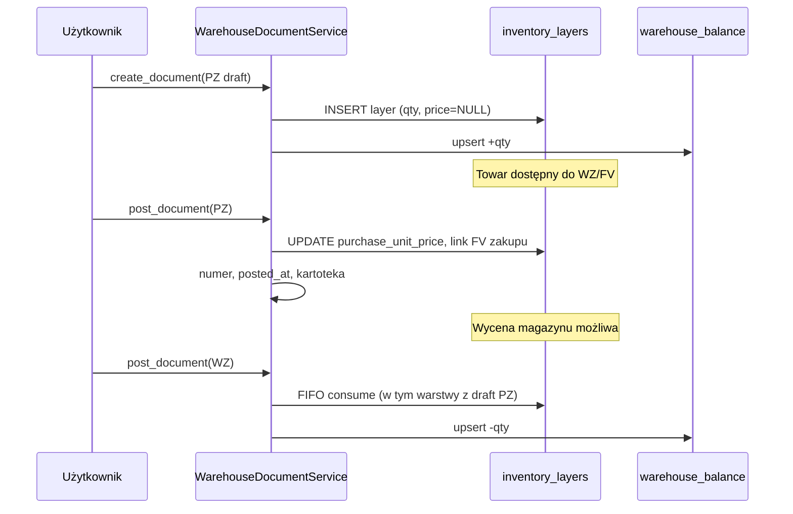

# PZ draft jako rzeczywisty stan magazynowy — analiza

**Data:** 2026-05-22  
**Zakres:** wyłącznie moduł magazynowy (PZ, WZ, FIFO, stany). Bez zmian kodu, migracji i commitów.  
**Wymaganie biznesowe:** PZ w stanie `draft` reprezentuje fizycznie dostarczony towar — ilość jest od razu dostępna do sprzedaży (FV, auto-WZ). PZ `posted` oznacza powiązanie FV zakupu, ustalenie ceny jednostkowej i możliwość wyceny magazynu.

---

## Streszczenie

| Aspekt | Stan obecny | Wymaganie docelowe |
|--------|-------------|-------------------|
| Moment powstania stanu ilościowego | dopiero `post_document(PZ)` | już `create_document(PZ)` (draft) |
| Moment ustalenia kosztu | razem ze stanem, przy `post` | dopiero `post` (FV zakupu + cena) |
| WZ / FV vs draft PZ | WZ nie widzi draftu — brak warstw FIFO | WZ schodzi z warstw utworzonych przy draft |
| Wycena magazynu (Stany) | tylko warstwy z `purchase_unit_price` | ilość od draft; wartość netto dopiero po `post` |

**Odpowiedź skrócona:** obecnie stan magazynowy powstaje wyłącznie przy zaksięgowanym PZ. Rozdzielenie ilości od kosztu jest możliwe **bez przebudowy algorytmu FIFO** (kolejność warstw, `_consume_fifo`), ale wymaga **rozszerzenia modelu warstwy** (nullable cena lub flaga „koszt nieustalony”) oraz **przeniesienia tworzenia warstwy z `_post_pz` do `create_document`**.

---

## 1. Czy stan magazynowy tworzy się dopiero przy posted PZ?

**Tak — w 100%.**

To jest explicite zapisane i egzekwowane w kodzie:

```3:5:app/services/warehouse_document_service.py
Przepływ:
  create_document() → status=DRAFT (nie zmienia stanu)
  post_document()   → status=POSTED (zmienia stany, tworzy warstwy FIFO)
```

```142:143:app/services/warehouse_document_service.py
    def create_document(self, body: dict, created_by: UUID | None = None) -> WarehouseDocumentORM:
        """Tworzy dokument w stanie DRAFT. Nie zmienia stanów magazynowych."""
```

Warstwa FIFO i wzrost salda następują wyłącznie w `_post_pz`:

```227:248:app/services/warehouse_document_service.py
    def _post_pz(self, doc: WarehouseDocumentORM, today: date) -> None:
        for item in doc.doc_items:
            ...
            layer = InventoryLayerORM(
                ...
                remaining_quantity=qty,
                purchase_unit_price=price,
                ...
            )
            self.layer_repo.add_layer(layer)
            self.doc_repo.upsert_balance(item.item_id, qty)
```

**Konsekwencje operacyjne dziś:**

- PZ `draft` = rekordy w `warehouse_documents` + `warehouse_document_items` (intencja przyjęcia).
- Zero wpisów w `inventory_layers`, zero zmiany `warehouse_balance`.
- WZ zaksięgowany na ten sam towar dostanie `InsufficientStockError`, dopóki PZ nie zostanie zaksięgowany.
- Zakładka **Stany** (`GET /warehouse/items/balance`) czyta wyłącznie `inventory_layers` z `remaining_quantity != 0` — draft PZ jest niewidoczny.

Testy jednostkowe to potwierdzają (`test_create_draft_does_not_change_balance`, `test_post_pz_increases_balance`, `test_post_pz_creates_inventory_layer` w `tests/unit/test_warehouse_documents.py`).

---

## 2. Które tabele przechowują ilość, a które koszt?

### Ilość (operacyjna, FIFO)

| Tabela / pole | Rola | Źródło prawdy? |
|---------------|------|----------------|
| `inventory_layers.remaining_quantity` | ile z warstwy jeszcze można zdjąć (WZ, KK−) | **tak** — podstawa FIFO |
| `inventory_layers.received_quantity` | pierwotna ilość warstwy (niezmienna) | audyt / historia |
| `warehouse_balance.quantity_available` | cache ilości per towar | nie — TODO w modelu: powinno = SUM(layers) |
| `warehouse_document_items.quantity` | ilość na linii dokumentu (snapshot) | nie — opis dokumentu, nie stan |

### Koszt / wycena

| Tabela / pole | Rola | Kiedy wypełniane |
|---------------|------|------------------|
| `inventory_layers.purchase_unit_price` | cena zakupu warstwy (NOT NULL, „niezmienna po zaksięgowaniu”) | przy `post` PZ |
| `warehouse_document_items.purchase_unit_price` | snapshot ceny na linii PZ/KK+ | przy create/update draft (dziś wymagane dla PZ) |
| `inventory_layer_movements.purchase_unit_price_snapshot` | koszt w momencie rozchodu WZ/KK− | przy `post` WZ/KK− |
| `warehouse_items.default_price_net` | ostatnia cena zakupu w kartotece | przy `post` PZ |

### Wartość magazynu w UI

`WarehouseItemService.list_balance_layers()` liczy `value_net = remaining_quantity × purchase_unit_price` per warstwa. Agregacja w `BalanceTab.jsx` sumuje te wartości po `item_id`.

**Podsumowanie:** ilość operacyjna żyje w `inventory_layers` (+ cache `warehouse_balance`). Koszt żyje w tej samej warstwie (`purchase_unit_price`) i w snapshotach ruchów. Dokument draft trzyma tylko **plan** (`warehouse_document_items`), nie stan.

---

## 3. Czy można rozdzielić `quantity_available` i `purchase_unit_price` bez przebudowy FIFO?

**Tak — algorytm FIFO nie wymaga przebudowy; wymaga rozszerzenia schematu warstwy i logiki zapisu.**

### Co FIFO robi dziś (i co zostaje bez zmian)

```19:28:app/persistence/repositories/inventory_layer_repository.py
    def get_available_fifo(self, item_id: UUID) -> list[InventoryLayerORM]:
        """Zwraca warstwy z remaining_quantity > 0 posortowane FIFO (najstarsza najpierw)."""
        ...
            .order_by(InventoryLayerORM.received_date.asc(), InventoryLayerORM.created_at.asc())
```

```325:340:app/services/warehouse_document_service.py
    def _consume_fifo(...):
        layers = self.layer_repo.get_available_fifo(item_id)
        total_available = sum(_to_dec(l.remaining_quantity) for l in layers)
        if total_available < qty_to_consume:
            raise InsufficientStockError(...)
```

FIFO operuje **wyłącznie na `remaining_quantity` i kolejności dat** — nie filtruje po cenie, nie grupuje warstw.

### Blokery rozdzielenia (model, nie algorytm)

1. **`inventory_layers.purchase_unit_price` jest NOT NULL** — warstwa bez ceny nie przejdzie insertu bez migracji lub wartości zastępczej.
2. **Komentarz/model zakłada niezmienność ceny po zaksięgowaniu** — docelowo cena ustala się przy `post`, więc warstwa z draft musi pozwolić na **update ceny przy post** (lub warstwa powstaje z `NULL` / `0` i jest uzupełniana).
3. **`_consume_fifo` zapisuje `purchase_unit_price_snapshot`** z warstwy — WZ na warstwie „bez kosztu” wymaga reguły biznesowej:
   - blokada WZ do czasu `post` PZ (ostrożne, ale sprzeczne z wymaganiem „FV/WZ od razu”), lub
   - snapshot `0` / `NULL` + późniejsza korekta kosztu (skomplikowane księgowo), lub
   - **post PZ przed pierwszym WZ z tej warstwy** (operacyjnie najprostsze, ale nie spełnia pełnego „sprzedaj z draft” jeśli FV idzie tego samego dnia).

### Minimalna ścieżka bez przebudowy FIFO

| Element | Zmiana |
|---------|--------|
| `inventory_layers.purchase_unit_price` | `NULL` do momentu `post` PZ (migracja + nullable) |
| `create_document(PZ)` | tworzy warstwę: `remaining_quantity = qty`, `purchase_unit_price = NULL`, `received_date = today` |
| `_post_pz` | **nie tworzy** nowej warstwy — **aktualizuje** cenę na istniejącej warstwie powiązanej z `source_document_item_id`; ustawia `source_invoice_id` na nagłówku |
| `_consume_fifo` | bez zmian kolejności; przy `NULL` cenie — reguła snapshot (patrz wyżej) |
| `list_balance_layers` / Stany | osobne kolumny: ilość zawsze; wartość tylko gdy cena ≠ NULL |
| Walidacja PZ draft | **usunąć** wymóg `purchase_unit_price` przy create; **wymagać** przy `post` |

**Wniosek:** rozdzielenie jest możliwe przy **1:1 powiązaniu** `warehouse_document_item` ↔ `inventory_layer` (już istnieje `source_document_item_id`). Nie trzeba nowej tabeli FIFO ani przeliczania historycznych warstw — tylko zmiana **momentu** insertu warstwy i **nullability** ceny.

---

## 4. Które elementy systemu założą błędnie, że draft PZ nie istnieje magazynowo?

### Backend

| Element | Plik | Założenie |
|---------|------|-----------|
| Docstring i kontrakt API | `warehouse_document_service.py` | draft = brak wpływu na stan |
| `_post_pz` | j.w. | jedyne miejsce tworzenia warstw PZ |
| `cancel_document` | j.w. | anulowanie draftu **nie cofa stanu** (bo go nie było) — po zmianie trzeba cofnąć warstwę |
| `update_document` | j.w. | podmiana pozycji draftu bez synchronizacji warstw — po zmianie trzeba aktualizować/usuwać warstwy |
| `_validate_items_for_type` (PZ) | j.w. | `purchase_unit_price` wymagane już przy create |
| `_post_pz` walidacja | j.w. | brak ceny blokuje post (OK docelowo) |
| `list_balance_layers` | `warehouse_item_service.py` | tylko `inventory_layers` — draft bez warstwy = niewidoczny |
| `_balance_entry_from_row` | j.w. | zawsze mnoży qty × price — warstwa bez ceny wymaga obsługi |
| Komentarz modelu | `inventory_layer.py` | „Każde **zaksięgowane** PZ tworzy warstwę” |
| Komentarz modelu | `warehouse_document.py` (`WarehouseBalanceORM`) | balance jako cache sumy warstw — spójne, ale dziś aktualizowane tylko przy post |

### Frontend

| Element | Plik | Założenie |
|---------|------|-----------|
| Formularz PZ | `DocumentsTab.jsx` | cena zakupu **wymagana** przy zapisie draftu (`validateForm`) |
| Stany | `BalanceTab.jsx` | dane z API warstw — brak warstw = brak stanu |
| FV (linie z magazynu) | `InvoiceForm.jsx` + `catalogItemLineFromWarehouse` | ceny sprzedaży z kartoteki; **nie sprawdza** stanu magazynowego — ale auto-WZ przy ACCEPTED będzie zależeć od warstw |

### Testy

| Plik | Testy zakładające „draft bez stanu” |
|------|-------------------------------------|
| `tests/unit/test_warehouse_documents.py` | `test_create_draft_does_not_change_balance` |
| `tests/unit/test_warehouse_balance_layers.py` | warstwy tylko po post |
| `tests/unit/test_warehouse_items.py` | balance endpoint po post PZ |

### Planowane / dokumentacja

| Dokument | Implikacja |
|----------|------------|
| `docs/FV_AUTO_WZ_IMPLEMENTATION_PLAN.md` | auto-WZ przy ACCEPTED FV schodzi FIFO — draft PZ dziś **nie zasili** tego procesu |
| Idempotencja `post_document` | drugi post = no-op — po zmianie `_post_pz` musi uzupełniać koszt, nie duplikować warstw |

---

## 5. Jak zmienić model, aby draft zwiększał stan ilościowy, a posted tylko uzupełniał koszt?

### Docelowy przepływ (propozycja minimalna)



### Kroki implementacyjne (koncepcja — bez kodu w tym zadaniu)

#### A. `create_document(PZ)`

1. Po zapisie `warehouse_document_items` — dla każdej pozycji:
   - `INSERT inventory_layers` z `source_document_item_id`, `remaining_quantity = quantity`, `purchase_unit_price = NULL`, `received_date = date.today()`.
   - `upsert_balance(item_id, +quantity)`.
2. Walidacja: wymagane `item_id`, dodatnia całkowita `quantity`; **bez** wymogu `purchase_unit_price`.
3. Opcjonalnie: pole nagłówka `source_invoice_id` (FV zakupu) — nullable w draft, wymagane przy `post`.

#### B. `post_document(PZ)` — zmiana semantyki

1. **Nie** tworzyć nowych warstw (uniknięcie podwójnego stanu).
2. Dla każdej pozycji: znaleźć warstwę po `source_document_item_id`:
   - ustawić `purchase_unit_price` z linii dokumentu (lub z FV zakupu),
   - zweryfikować `remaining_quantity` vs `quantity` (spójność).
3. Aktualizacja kartoteki (`default_price_net`, VAT, suggested sale price) — jak dziś.
4. Nadanie numeru, `status=posted`, `posted_at`.
5. Idempotencja: jeśli już `posted`, no-op (bez ponownego update ceny, chyba że explicite dozwolone).

#### C. `update_document(PZ draft)`

Synchronizacja warstw z pozycjami:

- pozycja usunięta → warstwa: jeśli `remaining == received`, usuń warstwę i cofnij balance; jeśli częściowo zużyta → błąd (nie można edytować).
- pozycja zmieniona (qty) → update warstwy + delta balance (tylko jeśli nic nie zużyto z warstwy).
- nowa pozycja → nowa warstwa jak przy create.

To jest **najdelikatniejszy** fragment — dziś `update_document` swobodnie kasuje linie bez magazynu.

#### D. `cancel_document(PZ draft)`

- Dla każdej pozycji: warstwa z `source_document_item_id` — jeśli `remaining_quantity < received_quantity` → błąd (już rozeszło WZ).
- W przeciwnym razie: usuń warstwę (lub `remaining = 0`), `upsert_balance(-qty)`.

#### E. WZ / auto-WZ

- `_consume_fifo` — **bez zmiany kolejności**.
- Reguła kosztu przy WZ z warstwy bez ceny:
  - **Rekomendacja biznesowa:** pozwolić na rozchód ilościowy; `purchase_unit_price_snapshot = 0` lub nullable + flaga „koszt do uzupełnienia”; raport wartości magazynu **wyklucza** warstwy bez ceny z sumy wartości, ale **wlicza** w sumę ilości.
  - Alternatywa ostrzejsza: `InsufficientStockError` tylko dla warstw z ustaloną ceną — **nie** spełnia wymagania sprzedaży z draft.

#### F. UI / API

- Formularz PZ: cena zakupu opcjonalna w draft, wymagana przy „Zaksięguj”.
- Stany: kolumna ilości z wszystkich warstw; kolumna wartości tylko dla warstw z ceną; oznaczenie „PZ draft / koszt nieustalony”.
- FV zakupu: powiązanie przy post PZ (`source_invoice_id` na `warehouse_documents` — pole już istnieje, dziś używane głównie przez WZ).

### Diagram stanów warstwy PZ

```text
[create PZ draft]
       │
       ▼
┌──────────────────────────────┐
│ Warstwa: qty>0, price=NULL   │  ← dostępna dla WZ (ilość)
│ Dokument: status=draft       │
└──────────────────────────────┘
       │ post PZ (+ FV zakupu, cena)
       ▼
┌──────────────────────────────┐
│ Warstwa: qty>0, price=ustalona│  ← pełna wycena
│ Dokument: status=posted      │
└──────────────────────────────┘
       │ WZ / KK−
       ▼
   remaining_quantity ↓
```

---

## 6. Ryzyka dla istniejących danych produkcyjnych

### Niskie ryzyko (dane już zaksięgowane)

| Scenariusz | Ryzyko | Uzasadnienie |
|------------|--------|--------------|
| PZ już `posted` | **niskie** | Warstwy już istnieją z pełną ceną; nowa logika dotyczy momentu create, nie retroaktywnego przetwarzania posted |
| WZ/KK na posted PZ | **niskie** | Ruchy FIFO już zapisane w `inventory_layer_movements` — nie wymagają migracji |
| Kartoteka towarów | **niskie** | `default_price_net` ustawione historycznie przy post |

### Średnie / wysokie ryzyko

| Scenariusz | Ryzyko | Działanie migracyjne (przyszłe) |
|------------|--------|----------------------------------|
| **PZ w stanie `draft` na produkcji** | **wysokie** | Po wdrożeniu te PZ **nie mają warstw**, ale biznes może traktować je jako „towar na magazynie”. Wymaga **backfillu**: dla każdego draft PZ utworzyć warstwy (price=NULL) i zaktualizować balance — **przed** pierwszym WZ po deployu |
| **Podwójne naliczenie** | **wysokie** | Jeśli backfill + późniejsze post na starym kodzie… — przy nowej logice post **nie może** ponownie tworzyć warstw. Stare drafty zaksięgowane po deployu: jeden insert przy create, post tylko update ceny |
| **`warehouse_balance` vs suma warstw** | **średnie** | Model ma TODO o niespójności cache. Backfill draftów i cancel/update wymagają `recalculate_balance(item_id)` lub audytu |
| **WZ wystawione „w oczekiwaniu” na post PZ** | **średnie** | Dziś niemożliwe (brak stanu). Po wdrożeniu możliwe — WZ przed post PZ da snapshot ceny 0/NULL; po post ceny historyczne WZ **nie** są automatycznie korygowane |
| **Edycja draft PZ z zużytą częścią warstwy** | **średnie** | Nowa reguła: blokada update/cancel jeśli WZ już zdjął część — wymaga komunikatu w UI |
| **Walidacja ceny w starych draftach** | **niskie–średnie** | Drafty z ceną w `warehouse_document_items` ale bez warstwy — backfill może od razu ustawić cenę na warstwie **lub** zostawić NULL do formalnego post |

### Scenariusz wdrożenia (checklist produkcyjna)

1. **Inwentaryzacja:** `SELECT count(*) FROM warehouse_documents WHERE doc_type='PZ' AND status='draft'`.
2. **Backfill warstw** dla tych dokumentów (skrypt jednorazowy, poza scope tego raportu).
3. **Weryfikacja balance:** per `item_id` suma `remaining_quantity` vs `warehouse_balance.quantity_available`.
4. **Deploy** z nową logiką create/post/update/cancel atomowo.
5. **Smoke test:** draft PZ → widoczny stan → WZ → post PZ → wartość w Stany.
6. **Auto-WZ z FV:** dopiero po punkcie 1–4, inaczej FV zaakceptowane w oknie deploy mogą nadal nie znaleźć stanu.

### Co się nie psuje bez migracji danych

Same zmiany kodu **nie psują** istniejących posted PZ/WZ, o ile:
- `_post_pz` nie tworzy duplikatów warstw dla już posted dokumentów (idempotencja),
- backfill draftów wykonany przed pierwszym create na nowym kodzie **lub** create na nowym kodzie obsługuje zarówno „stare” drafty bez warstw (jednorazowy lazy backfill przy pierwszym post/update).

---

## Macierz decyzyjna: posted vs draft (docelowo)

| Pytanie | PZ draft | PZ posted |
|---------|----------|-----------|
| Czy zwiększa `remaining_quantity`? | **tak** (propozycja) | nie (już zwiększone) |
| Czy ma `purchase_unit_price` na warstwie? | nie (NULL) | tak |
| Czy widać w Stany (ilość)? | tak | tak |
| Czy widać wartość magazynu? | nie / „—” | tak |
| Czy można zaksięgować WZ? | tak (ilość) | tak |
| Czy wymaga FV zakupu? | nie | **tak** (wymaganie biznesowe) |
| Czy można anulować? | tak, jeśli warstwa nietknięta | nie (posted immutable) |

---

## Pliki do dotknięcia przy implementacji (referencja)

**Backend (magazyn):**

- `app/services/warehouse_document_service.py` — główna logika create/post/update/cancel PZ
- `app/persistence/models/inventory_layer.py` — nullable `purchase_unit_price`, ewent. flaga `cost_finalized`
- `app/services/warehouse_item_service.py` — balance / wartość z warstw bez ceny
- `app/persistence/repositories/inventory_layer_repository.py` — ewent. `get_layer_by_source_doc_item`
- `tests/unit/test_warehouse_documents.py`, `test_warehouse_balance_layers.py`

**Frontend (magazyn):**

- `frontend-react/src/pages/warehouse/tabs/DocumentsTab.jsx` — walidacja PZ draft vs post
- `frontend-react/src/pages/warehouse/tabs/BalanceTab.jsx` — prezentacja ilości vs wartości

**Poza magazynem (świadomość zależności, bez zmian w tym zadaniu):**

- Auto-WZ przy ACCEPTED FV — skorzysta automatycznie z warstw draft, gdy te powstaną przy create PZ

---

## Wnioski końcowe

1. **Dziś stan powstaje wyłącznie przy posted PZ** — to jest twarde założenie całego modułu FIFO.
2. **Ilość i koszt są dziś nierozłączne w momencie powstania warstwy** — rozdzielenie wymaga nullable ceny i przesunięcia momentu insertu warstwy na create draft.
3. **FIFO jako algorytm nie wymaga przebudowy** — wystarczy 1:1 warstwa per linia PZ i update ceny przy post.
4. **Wiele miejsc (backend, UI, testy, plan auto-WZ) zakłada brak magazynu dla draft** — wymaga spójnej zmiany create/update/cancel, nie tylko `_post_pz`.
5. **Główne ryzyko produkcyjne to istniejące PZ draft bez warstw** — konieczny backfill lub lazy migration przed poleganiem na nowej semantyce.
6. **WZ przed post PZ** wprowadza lukę kosztową w snapshotach — należy ją zaakceptować biznesowo (wycena opóźniona) lub blokować WZ do post (sprzeczne z wymaganiem).
