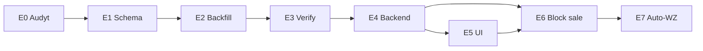

# Plan wdrożenia etapowego: PZ draft jako rzeczywisty stan magazynowy

**Data:** 2026-05-22  
**Podstawa:** [`docs/PZ_DRAFT_AS_REAL_STOCK_ANALYSIS.md`](PZ_DRAFT_AS_REAL_STOCK_ANALYSIS.md)  
**Zakres plików (implementacja):** wyłącznie pliki wymienione w analizie + zależności auto-WZ (osobny etap).  
**Bez kodu, migracji i commitów w tym dokumencie** — plan operacyjny.

---

## Założenia zatwierdzone (kontrakt biznesowy)

| Reguła | Implikacja techniczna |
|--------|----------------------|
| PZ draft = fizycznie dostarczony towar | warstwa FIFO powstaje przy `create_document(PZ)` |
| PZ draft zwiększa ilość dostępną | `inventory_layers.remaining_quantity` + `warehouse_balance` |
| PZ posted nie zwiększa ilości | `_post_pz` tylko UPDATE ceny + powiązanie FV zakupu |
| FV sprzedaży → auto-WZ (docelowo) | etap końcowy; wymaga warstw z draft PZ |
| Brak stanu blokuje sprzedaż | walidacja ilości przed ACCEPTED / przed auto-WZ |
| Sprzedaż przed FV zakupu — OK | WZ/FV schodzi z warstw `purchase_unit_price IS NULL` |
| Koszt uzupełniany później | nullable cena na warstwie; wartość magazynu bez ceny = „—” |

---

## Przegląd etapów

```text
E0  Audyt prod + zamrożenie okna
E1  Migracja schematu (nullable koszt)
E2  Backfill PZ draft → warstwy
E3  Weryfikacja danych (gate przed deployem kodu)
E4  Backend: create/post/update/cancel PZ + FIFO snapshot
E5  API balance + frontend magazynu
E6  Blokada sprzedaży przy braku stanu (FV)
E7  Auto-WZ przy ACCEPTED FV
```

**Zasada bezpieczeństwa:** E1 → E2 → E3 muszą zakończyć się sukcesem **przed** pierwszym requestem na nowy kod E4. W oknie E2–E4 **nie wolno** księgować (`post`) starych PZ draft na starym kodzie — grozi podwójnym stanem.

---

## 1. Kolejność wdrożenia etapów

### Etap 0 — Przygotowanie i audyt (prod DS723+)

**Cel:** znać stan bazy, ustalić okno wdrożenia, wyłączyć ryzykowne operacje.

| Krok | Działanie |
|------|-----------|
| 0.1 | Odczyt audytowy (SQL poniżej) — zapis wyników |
| 0.2 | Komunikat użytkownikom: brak księgowania PZ draft w oknie ~30–60 min |
| 0.3 | Opcjonalnie: zatrzymać `worker` (brak auto-WZ dziś — niski wpływ, ale ogranicza KSeF sync) |
| 0.4 | Backup bazy: `pg_dump` z kontenera `db` (patrz §5) |
| 0.5 | Pin commitu / tag release przed deployem |

**Gate:** backup OK + liczba draft PZ znana.

---

### Etap 1 — Migracja schematu (Alembic)

**Cel:** umożliwić warstwy bez kosztu i rozchód z niepełnym kosztem.

**Pliki docelowe:** `app/persistence/models/inventory_layer.py`, nowa rewizja w `alembic/versions/`.

| Zmiana | Uzasadnienie |
|--------|--------------|
| `inventory_layers.purchase_unit_price` → **nullable** | draft PZ bez FV zakupu |
| Opcjonalnie: `cost_finalized BOOLEAN DEFAULT false` | jawna flaga „posted PZ z ceną” (alternatywa: `price IS NOT NULL`) |
| Opcjonalnie: `inventory_layer_movements.purchase_unit_price_snapshot` → **nullable** | WZ przed uzupełnieniem kosztu PZ |
| Unikalność: **UNIQUE (`source_document_item_id`)** WHERE NOT NULL | 1 warstwa ↔ 1 linia PZ; zapobiega duplikatom przy backfill + nowym kodzie |

**Nie zmieniać:** algorytm FIFO (`received_date`, `created_at`), tabela `warehouse_balance`, posted PZ/WZ historyczne.

**Gate:** `alembic upgrade head` na prod bez błędów; `alembic current` = nowa rewizja.

---

### Etap 2 — Backfill istniejących PZ draft

**Cel:** drafty utworzone starym kodem dostają warstwy ilościowe **zanim** włączy się nowa logika `create`/`post`.

**Kiedy:** natychmiast po E1, **przed** restartem API z kodem E4.

Szczegóły: §3.

**Gate:** zero linii PZ draft bez warstwy (query w §4).

---

### Etap 3 — Weryfikacja danych (gate)

**Cel:** potwierdzić spójność przed deployem aplikacji.

Szczegóły: §4.

**Gate:** wszystkie query kontrolne = 0 wierszy błędów (lub udokumentowane wyjątki).

---

### Etap 4 — Backend: semantyka PZ draft/post

**Cel:** kod zgodny z analizą — głównie `app/services/warehouse_document_service.py`.

| Operacja | Zachowanie docelowe |
|----------|---------------------|
| `create_document(PZ)` | INSERT warstwa (qty, price NULL) + balance +qty; cena **nie** wymagana |
| `post_document(PZ)` | znajdź warstwę po `source_document_item_id`; UPDATE price; wymagaj FV zakupu + ceny; **bez** INSERT warstwy |
| `update_document(PZ draft)` | sync warstw; blokada jeśli `remaining < received` |
| `cancel_document(PZ draft)` | usuń warstwę / zero remaining; balance −qty; blokada jeśli częściowy rozchód |
| `_consume_fifo` | bez zmian kolejności; snapshot NULL lub 0 gdy brak ceny |
| `_post_pz` idempotencja | drugi post = no-op (już posted) |

**Repozytorium:** `get_layer_by_source_document_item_id()` w `inventory_layer_repository.py`.

**Gate:** testy jednostkowe E4 (§6) zielone lokalnie/CI.

---

### Etap 5 — API balance + UI magazynu

**Cel:** użytkownik widzi ilość od draft; wartość tylko po post.

| Plik | Zmiana |
|------|--------|
| `app/services/warehouse_item_service.py` | `_balance_entry_from_row`: qty zawsze; `value_net` tylko gdy cena ≠ NULL; flaga `cost_pending` |
| `app/schemas/warehouse_item.py` | pole opcjonalne w odpowiedzi balance |
| `frontend-react/.../DocumentsTab.jsx` | cena opcjonalna w draft; wymagana przy „Zaksięguj”; FV zakupu przy post |
| `frontend-react/.../BalanceTab.jsx` | suma ilości vs suma wartości; oznaczenie warstw bez kosztu |

**Deploy DS723+:** `npm ci && npm run build` **przed** restartem API (bind mount `frontend-react/dist`).

**Gate:** testy API balance + smoke UI (§6).

---

### Etap 6 — Blokada sprzedaży przy braku stanu

**Cel:** „brak stanu blokuje sprzedaż” — **przed** auto-WZ, żeby FV nie przechodziła na ACCEPTED bez towaru.

**Zakres (poza listą magazynową, ale zależność):**

- Walidacja przy zapisie / `mark_as_ready` / przed wysyłką KSeF: dla pozycji z ISBN → suma `remaining_quantity` per `item_id` ≥ ilość na FV.
- Źródło stanu: `inventory_layers` (po E4 identyczne z balance).

**Feature flag (zalecane):** `BLOCK_SALE_WITHOUT_STOCK=true` — możliwość wyłączenia na stagingu.

**Gate:** test: FV z ilością > stan → błąd; FV ≤ stan → OK.

---

### Etap 7 — Auto-WZ przy ACCEPTED FV

**Cel:** implementacja z [`docs/FV_AUTO_WZ_IMPLEMENTATION_PLAN.md`](FV_AUTO_WZ_IMPLEMENTATION_PLAN.md).

**Warunek startu:** E4–E6 na prod stabilne min. 1–2 dni robocze.

| Element | Uwaga |
|---------|-------|
| Hook | przejście FV → `accepted` (KSeF) |
| `ensure_posted_wz_for_invoice` | idempotencja `UNIQUE(source_invoice_id)` |
| `InsufficientStockError` | FV accepted, WZ brak — log + flaga ręczna (plan FV_AUTO_WZ) |
| Backfill historyczny | 27 FV bez WZ (wg planu) — **osobne okno**, po E7 |

**Feature flag:** `AUTO_WZ_ON_INVOICE_ACCEPTED=false` na prod → włączenie po backfillu FV.

**Gate:** testy integracyjne + jedna FV sandbox end-to-end.

---

## 2. Migracje potrzebne

### M1 — `inventory_layers.purchase_unit_price` nullable

```sql
-- koncepcja (w Alembic upgrade)
ALTER TABLE inventory_layers
  ALTER COLUMN purchase_unit_price DROP NOT NULL;
```

**Uwaga:** istniejące warstwy posted mają cenę — bez zmian danych.

### M2 — (zalecane) UNIQUE na `source_document_item_id`

```sql
CREATE UNIQUE INDEX uq_inventory_layers_source_doc_item
  ON inventory_layers (source_document_item_id)
  WHERE source_document_item_id IS NOT NULL;
```

Chroni przed duplikatem warstwy przy backfill + błędnym post na starym kodzie.

### M3 — (opcjonalnie) `inventory_layer_movements.purchase_unit_price_snapshot` nullable

Potrzebne, jeśli snapshot ma być `NULL` zamiast `0` przy WZ przed post PZ.

```sql
ALTER TABLE inventory_layer_movements
  ALTER COLUMN purchase_unit_price_snapshot DROP NOT NULL;
```

**Decyzja biznesowa:** `NULL` (brak kosztu) vs `0` (koszt zerowy w raportach). Rekomendacja: **NULL** + UI „koszt do uzupełnienia”.

### M4 — (opcjonalnie) `cost_finalized` na `inventory_layers`

Tylko jeśli zespół woli explicit flagę zamiast `purchase_unit_price IS NOT NULL`.

### M5 — brak migracji danych w Alembic

**Backfill PZ draft = skrypt operacyjny (E2)**, nie rewizja Alembic — łatwiejszy rollback i audyt logów.

### Kolejność migracji

```text
alembic upgrade head   # M1 (+ M2, opcjonalnie M3, M4)
→ skrypt backfill E2
→ deploy kod E4+
```

---

## 3. Backfill istniejących PZ draft

### 3.1 Zakres

```sql
-- Kandydaci do backfillu
SELECT d.id, d.created_at, d.status, di.id AS doc_item_id, di.item_id, di.quantity
FROM warehouse_documents d
JOIN warehouse_document_items di ON di.document_id = d.id
LEFT JOIN inventory_layers il ON il.source_document_item_id = di.id
WHERE d.doc_type = 'PZ'
  AND d.status = 'draft'
  AND il.id IS NULL;
```

**Nie backfillować:** PZ `posted`, `cancelled`; linie, które **już mają** warstwę.

### 3.2 Reguły insertu warstwy

Dla każdej linii bez warstwy:

| Pole | Wartość |
|------|---------|
| `id` | nowy UUID |
| `item_id` | z linii PZ |
| `source_document_item_id` | `warehouse_document_items.id` |
| `source_document_type` | `'PZ'` |
| `received_quantity` | `quantity` z linii |
| `remaining_quantity` | `quantity` z linii |
| `purchase_unit_price` | **NULL** (rekomendacja — posted uzupełni; nawet jeśli linia ma cenę w draft) |
| `received_date` | `DATE(d.created_at)` lub `CURRENT_DATE` |
| `is_correction` | `false` |

**Uzasadnienie NULL mimo ceny w linii:** spójność z nową semantyką „posted = koszt”; unikamy sytuacji „warstwa ma cenę, dokument wciąż draft”.

### 3.3 Aktualizacja `warehouse_balance`

Po insertach warstw per `item_id`:

```sql
-- koncepcja: delta = suma remaining nowo dodanych warstw per item
-- upsert warehouse_balance.quantity_available += delta
```

Alternatywa bezpieczniejsza: **`recalculate_balance(item_id)`** — ustaw balance = SUM(`remaining_quantity`) wszystkich warstw dla towaru (zgodnie z TODO w modelu).

### 3.4 Procedura wykonania (DS723+)

1. Aplikacja w trybie **maintenance** (brak ruchu magazynowego) lub zatrzymany `api`.
2. `alembic upgrade head` (E1).
3. Uruchom skrypt backfill (Python one-shot w kontenerze `api` lub `psql` z transakcją):

```bash
# przykład — docelowo dedykowany scripts/backfill_pz_draft_layers.py
docker compose -f docker/docker-compose.prod.yml --env-file .env.production \
  exec api python -m scripts.backfill_pz_draft_layers --dry-run

docker compose -f docker/docker-compose.prod.yml --env-file .env.production \
  exec api python -m scripts.backfill_pz_draft_layers --execute
```

4. E3 — query weryfikacyjne (§4).
5. Deploy kod E4 + restart `api` (+ `worker` jeśli zatrzymany).

### 3.5 Rollback backfillu (awaryjny)

Tylko jeśli **żaden WZ** nie skonsumował nowych warstw:

```sql
-- Usuń warstwy utworzone backfillem (oznacz je batch_id w skrypcie)
DELETE FROM inventory_layers WHERE backfill_batch_id = :batch;
-- Przelicz balance dla dotkniętych item_id
```

Skrypt **musi** logować `layer_id`, `doc_item_id`, `item_id`, `quantity` do pliku / tabeli audytowej.

---

## 4. Weryfikacja poprawności po backfillu

### 4.1 Kompletność backfillu

```sql
-- Oczekiwane: 0 wierszy
SELECT di.id AS orphan_doc_item
FROM warehouse_documents d
JOIN warehouse_document_items di ON di.document_id = d.id
LEFT JOIN inventory_layers il ON il.source_document_item_id = di.id
WHERE d.doc_type = 'PZ' AND d.status = 'draft' AND il.id IS NULL;
```

### 4.2 Brak duplikatów warstw

```sql
-- Oczekiwane: 0 wierszy
SELECT source_document_item_id, COUNT(*) AS cnt
FROM inventory_layers
WHERE source_document_item_id IS NOT NULL
GROUP BY source_document_item_id
HAVING COUNT(*) > 1;
```

### 4.3 Spójność balance vs warstwy

```sql
-- Oczekiwane: 0 wierszy (dla każdego item_id z magazynem)
SELECT wb.item_id,
       wb.quantity_available AS balance_cache,
       COALESCE(SUM(il.remaining_quantity), 0) AS layers_sum
FROM warehouse_balance wb
LEFT JOIN inventory_layers il ON il.item_id = wb.item_id
GROUP BY wb.item_id, wb.quantity_available
HAVING wb.quantity_available != COALESCE(SUM(il.remaining_quantity), 0);
```

Wariant per item (bez wpisu w balance):

```sql
SELECT wi.id AS item_id,
       COALESCE(wb.quantity_available, 0) AS balance_cache,
       COALESCE(SUM(il.remaining_quantity), 0) AS layers_sum
FROM warehouse_items wi
LEFT JOIN warehouse_balance wb ON wb.item_id = wi.id
LEFT JOIN inventory_layers il ON il.item_id = wi.id AND il.remaining_quantity != 0
WHERE wi.is_warehouse_active = true
GROUP BY wi.id, wb.quantity_available
HAVING COALESCE(wb.quantity_available, 0) != COALESCE(SUM(il.remaining_quantity), 0);
```

### 4.4 Spójność ilości warstwy vs linia PZ (draft)

```sql
-- Oczekiwane: 0 wierszy
SELECT di.id, di.quantity, il.received_quantity, il.remaining_quantity
FROM warehouse_documents d
JOIN warehouse_document_items di ON di.document_id = d.id
JOIN inventory_layers il ON il.source_document_item_id = di.id
WHERE d.doc_type = 'PZ' AND d.status = 'draft'
  AND (di.quantity != il.received_quantity OR il.remaining_quantity > il.received_quantity);
```

### 4.5 Warstwy bez kosztu (oczekiwane po backfillu draft)

```sql
SELECT COUNT(*) AS draft_layers_without_cost
FROM inventory_layers il
JOIN warehouse_document_items di ON di.id = il.source_document_item_id
JOIN warehouse_documents d ON d.id = di.document_id
WHERE d.doc_type = 'PZ' AND d.status = 'draft'
  AND il.purchase_unit_price IS NULL;
```

Liczba = liczba linii draft PZ (jeśli reguła NULL).

### 4.6 Kontrola posted PZ (regresja)

```sql
-- Każdy posted PZ powinien mieć warstwy z ceną (stary model)
SELECT d.id, d.number
FROM warehouse_documents d
JOIN warehouse_document_items di ON di.document_id = d.id
LEFT JOIN inventory_layers il ON il.source_document_item_id = di.id
WHERE d.doc_type = 'PZ' AND d.status = 'posted'
  AND (il.id IS NULL OR il.purchase_unit_price IS NULL);
```

**Oczekiwane:** 0 wierszy (dane historyczne).

### 4.7 Checklist po backfillu (operacyjna)

- [ ] Query 4.1–4.6 wykonane, wyniki zapisane
- [ ] Ręczny podgląd Stany w UI (po E5) — ilości zgodne z oczekiwaniem biznesu
- [ ] Próbny draft PZ **po** E4 — jedna warstwa, bez duplikatu przy post
- [ ] Próbny post PZ draft z backfillu — cena uzupełniona, ilość bez zmiany

---

## 5. Wdrożenie bez ryzyka na produkcji DS723+

### 5.1 Architektura prod (skrót)

- Host: Synology DS723+, Docker Compose (`docker/docker-compose.prod.yml`)
- Frontend: **`npm run build` na hoście** → volume `frontend-react/dist` (nie w obrazie Docker)
- Migracje: ręcznie w kontenerze `api` po deployu obrazu
- Checklist: [`docs/DS723_DEPLOYMENT_CHECKLIST.md`](DS723_DEPLOYMENT_CHECKLIST.md)

### 5.2 Okno wdrożenia (single maintenance window)

```text
T-24h   Audyt E0, komunikat użytkownikom
T-1h    Backup pg_dump
T0      Zatrzymaj api (+ opcjonalnie worker)
T0+5    git pull / checkout tag
T0+10   alembic upgrade head (E1)
T0+15   backfill --execute (E2)
T0+25   weryfikacja SQL (E3) — STOP jeśli błąd
T0+30   npm ci && npm run build (E5 frontend)
T0+40   docker compose up -d --build api worker (E4 kod)
T0+45   smoke testy (§6)
T0+60   Koniec okna; monitoring 24h
```

**Krytyczne:** nie wdrażać **samego** kodu E4 bez E1–E3 w tym samym oknie (ryzyko podwójnego stanu przy post starych draftów).

### 5.3 Backup przed zmianami

```bash
cd /volume1/docker/ifg/ifg_standalone
docker compose -f docker/docker-compose.prod.yml --env-file .env.production \
  exec db pg_dump -U postgres -d ksef_backend -Fc \
  > /volume1/docker/ifg/backups/pre_pz_draft_$(date +%Y%m%d_%H%M).dump
```

### 5.4 Deploy krok po kroku (DS723+)

```bash
cd /volume1/docker/ifg/ifg_standalone
git fetch && git checkout <TAG_PZ_DRAFT>

# 1. Migracja (api może być stary — schemat wstecznie kompatybilny)
docker compose -f docker/docker-compose.prod.yml --env-file .env.production \
  exec api alembic upgrade head

# 2. Backfill (nowy skrypt w repo)
docker compose -f docker/docker-compose.prod.yml --env-file .env.production \
  exec api python -m scripts.backfill_pz_draft_layers --execute

# 3. Frontend
cd frontend-react && npm ci && npm run build && cd ..

# 4. Backend
docker compose -f docker/docker-compose.prod.yml --env-file .env.production \
  up -d --build --force-recreate api worker

# 5. Weryfikacja
curl -fsS http://127.0.0.1:8000/health
docker compose -f docker/docker-compose.prod.yml --env-file .env.production \
  exec api alembic current
```

### 5.5 Rollback plan

| Sytuacja | Działanie |
|----------|-----------|
| E1 failed | `alembic downgrade -1`; przywróć backup jeśli partial |
| E2 failed | nie deployuj E4; rollback transakcji backfillu |
| E4 bug po deploy | `git checkout` poprzedni tag; rebuild api; **nie** usuwaj warstw backfillu bez analizy WZ |
| Podwójny stan wykryty | SQL: duplikaty `source_document_item_id`; ręczna korekta + KK |

### 5.6 Feature flags (etapy 6–7)

W `.env.production`:

```env
BLOCK_SALE_WITHOUT_STOCK=false   # → true po testach E6
AUTO_WZ_ON_INVOICE_ACCEPTED=false  # → true po backfillu FV
```

Wdrożyć kod z flagami **wyłączonymi**, włączać stopniowo bez redeployu (jeśli settings z env).

### 5.7 Monitoring po wdrożeniu (48h)

- Logi: `InsufficientStockError`, `warehouse_document.posted`, błędy backfill
- Dzienne query 4.3 (balance vs layers) — alert jeśli > 0
- Liczba PZ draft bez warstwy (4.1) — alert jeśli > 0

---

## 6. Testy po każdym etapie

### E0 — Audyt

| Test | Typ | Kryterium sukcesu |
|------|-----|-------------------|
| Query liczby draft PZ | SQL manual | wynik udokumentowany |
| Backup restore (staging) | ops | dump odtwarza się na kopii |

---

### E1 — Migracja schematu

| Test | Plik / komenda | Kryterium |
|------|----------------|-----------|
| `alembic upgrade head` | lokalnie + prod | bez błędu |
| Istniejące warstwy | SQL | wszystkie mają cenę NOT NULL |
| Insert warstwy price=NULL | SQL manual | dozwolony |

---

### E2 — Backfill

| Test | Typ | Kryterium |
|------|-----|-----------|
| `--dry-run` | skrypt | liczba warstw = liczba linii draft bez warstwy |
| `--execute` | skrypt | log JSON/CSV z layer_id |
| Query 4.1 | SQL | 0 orphan |
| Query 4.2 | SQL | 0 duplikatów |

---

### E3 — Gate danych

| Test | Kryterium |
|------|-----------|
| Query 4.3–4.6 | wszystkie PASS |
| Sign-off biznes | operator magazynu potwierdza ilości |

---

### E4 — Backend PZ/FIFO

**Plik:** `tests/unit/test_warehouse_documents.py`

| Test (nowy / zmieniony) | Scenariusz |
|-------------------------|------------|
| `test_create_pz_draft_increases_balance` | zastępuje `test_create_draft_does_not_change_balance` |
| `test_create_pz_draft_creates_layer_without_price` | warstwa, price NULL |
| `test_post_pz_does_not_duplicate_layer` | jedna warstwa, tylko UPDATE ceny |
| `test_post_pz_requires_purchase_price_and_invoice` | brak ceny / FV → błąd |
| `test_post_pz_idempotent` | drugi post no-op |
| `test_cancel_pz_draft_reverses_layer` | balance −qty |
| `test_cancel_pz_draft_blocked_after_wz` | remaining < received → błąd |
| `test_update_pz_draft_syncs_layers` | zmiana qty, nowa linia, usunięcie |
| `test_wz_consumes_draft_pz_layer` | WZ przed post PZ schodzi ilościowo |
| `test_wz_snapshot_null_cost_when_layer_no_price` | movement snapshot NULL/0 |

**Plik:** `tests/unit/test_warehouse_balance_layers.py`

| Test | Scenariusz |
|------|------------|
| warstwa bez ceny w balance API | qty widoczne, value_net null |

**Plik:** `tests/unit/test_warehouse_items.py`

| Test | Scenariusz |
|------|------------|
| `GET /warehouse/items/balance` | draft PZ widoczny w stanie |

**Komenda:**

```bash
pytest tests/unit/test_warehouse_documents.py tests/unit/test_warehouse_balance_layers.py tests/unit/test_warehouse_items.py -q
```

---

### E5 — Frontend magazynu

| Test | Typ | Kryterium |
|------|-----|-----------|
| Walidacja formularza PZ draft | manual / e2e | zapis bez ceny OK |
| Post PZ bez ceny | manual | błąd UI |
| BalanceTab | manual | ilość sumuje warstwy draft; wartość „—” bez ceny |
| `npm run build` | DS723+ | dist świeży |

---

### E6 — Blokada sprzedaży

| Test | Scenariusz |
|------|------------|
| FV sprzedaży, qty > stan | odrzucone |
| FV sprzedaży, qty ≤ stan (w tym draft PZ) | OK |
| Usługa bez magazynu | bez wpływu na stan |
| Flag OFF | stary behavior (jeśli wymagane przejściowo) |

---

### E7 — Auto-WZ

**Plik:** rozszerzenie `tests/unit/test_warehouse_documents.py` + testy serwisu FV (wg FV_AUTO_WZ plan)

| Test | Scenariusz |
|------|------------|
| ACCEPTED FV → WZ posted | source_invoice_id, FIFO |
| Brak stanu | FV accepted, WZ brak, log błędu |
| Idempotencja | drugi sync nie duplikuje WZ |
| WZ przed post PZ | ilość schodzi, koszt snapshot NULL |

**Smoke prod (sandbox KSeF):**

1. PZ draft (bez ceny) → stan widoczny  
2. FV sprzedaży → ACCEPTED → auto-WZ  
3. Post PZ → cena uzupełniona; Stany — wartość po post  

---

## Macierz zależności etapów



---

## Ryzyka resztkowe i mitigacja

| Ryzyko | Mitigacja |
|--------|-----------|
| Post starych draftów w oknie deploy | maintenance + stop api przed backfill |
| Podwójna warstwa | UNIQUE `source_document_item_id`; post bez INSERT |
| Balance rozjechany | recalculate po backfill; query 4.3 codziennie 48h |
| WZ przed post PZ — brak kosztu w COGS | akceptacja biznesowa; raport „ruchy bez kosztu” |
| Auto-WZ + draft bez ISBN | strict mode — całe WZ fail; komunikat w UI |
| Stary dist na DS723+ | obowiązkowy `npm run build` przed up api |

---

## Podsumowanie

1. **Kolejność:** schema → backfill → weryfikacja → backend → UI → blokada FV → auto-WZ.  
2. **Migracje:** nullable `purchase_unit_price` (+ opcjonalnie snapshot, UNIQUE, flaga kosztu).  
3. **Backfill:** warstwa 1:1 per linia draft PZ, price NULL, balance przeliczony — w oknie maintenance **przed** nowym kodem.  
4. **Weryfikacja:** 6 zestawów SQL (§4) + sign-off biznes.  
5. **DS723+:** backup, alembic, backfill, npm build, recreate api/worker, feature flags off → on.  
6. **Testy:** zestaw per etap (§6); gate E3 blokuje deploy E4 bez zielonych query.

**Szacowany czas okna maintenance:** 45–60 min (przy < 100 draft PZ).  
**E7 (auto-WZ):** osobne okno 1–2 tygodnie po stabilizacji E4–E6.
