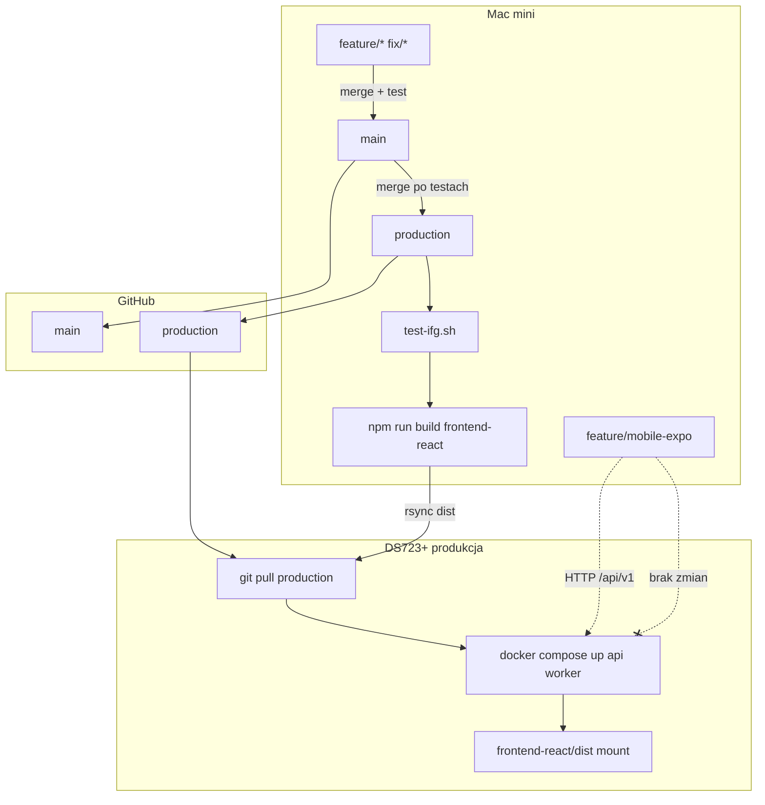

# IFG — workflow rozwoju, produkcji i mobile-expo

## Architektura środowisk

| Środowisko | Rola | Dozwolone | Zabronione |
|------------|------|-----------|------------|
| **Mac mini** | Development | backend, frontend-react, testy, build, mobile-expo | deploy produkcyjny bez testów |
| **DS723+** | Produkcja 24/7 | `git pull production`, docker up, migracje | edycja kodu, npm build, eksperymenty |
| **mobile-expo** | Klient iPhone (Mac mini) | HTTP → API IFG | zmiany w backend/frontend-react/docker prod |

**Produkcja DS723+:**

```
/volume1/docker/ifg_v2/ifg_standalone/
├── .env.production          ← sekrety (poza git)
├── frontend-react/dist/     ← build z Mac mini (rsync)
└── docker/docker-compose.prod.yml
```

---

## Branching strategy

```
feature/*  ──merge──►  main  ──merge (po testach)──►  production  ──deploy──►  DS723+
fix/*      ──merge──►  main

feature/mobile-expo  ──►  osobna linia (Expo); merge do main tylko po decyzji
```

| Branch | Opis | Deploy DS723+ |
|--------|------|---------------|
| `main` | Stabilna baza rozwojowa | ❌ |
| `production` | Dokładne odzwierciedlenie DS723+ | ✅ jedyny dozwolony |
| `feature/*` | Nowe funkcje IFG (web) | ❌ |
| `fix/*` | Poprawki IFG (web) | ❌ |
| `feature/mobile-expo` | Wyłącznie aplikacja mobilna | ❌ |

### Reguły merge

**Do `main`:**

- PR / review (nawet samodzielny)
- `bash scripts/test-ifg.sh` — zielony
- brak sekretów w commicie
- migracje Alembic przetestowane lokalnie

**Do `production`:**

- merge z `main` po pełnych testach
- tag opcjonalny: `release/x.y.z`
- `.env.production` na DS723+ zweryfikowany (`preflight-ds723.sh`)

**`feature/mobile-expo`:**

- nie merge do `production`
- nie zmienia `app/`, `frontend-react/`, `docker/docker-compose.prod.yml` bez wyraźnej decyzji

---

## Struktura repo

```
ifg_standalone/
├── app/                 backend FastAPI
├── frontend-react/      UI produkcyjne (web)
├── docker/
│   ├── docker-compose.yml       dev (Mac mini)
│   └── docker-compose.prod.yml  prod (DS723+)
├── tests/
├── scripts/             deploy, testy, logi
├── mobile-expo/         Expo + TypeScript (iPhone)
└── docs/
    └── WORKFLOW.md
```

---

## Diagram workflow



---

## Procedura deployu (Mac mini → DS723+)

### Checklist przed deployem

- [ ] Merge `main` → `production` wykonany i wypchnięty
- [ ] `bash scripts/test-ifg.sh` — OK
- [ ] `bash scripts/preflight-ds723.sh` — OK (opcjonalnie przed deployem)
- [ ] `.env.production` na DS723+ kompletny (`REGON_API_KEY`, `JWT_SECRET_KEY`, `DATABASE_URL`)
- [ ] Lokalny branch = `production`

### Kroki

```bash
git checkout production
git pull origin production

bash scripts/deploy-ds723.sh
```

Skrypt `deploy-ds723.sh`:

1. weryfikuje branch `production`
2. uruchamia `test-ifg.sh` (pytest + frontend build)
3. buduje `frontend-react/dist/` na Mac mini
4. `rsync` dist → DS723+ (NAS **nie** kompiluje frontendu)
5. `git pull origin production` na DS723+
6. `docker compose build api` + `up -d api worker`
7. `alembic upgrade head`
8. `healthcheck.sh`

### Po deployu

```bash
bash scripts/preflight-ds723.sh
bash scripts/logs-api.sh 50 --no-follow   # opcjonalnie
```

Test manualny: logowanie UI, REGON (NIP), KSeF sesja.

---

## Procedura rollbacku

### Szybki rollback (kod)

Na DS723+:

```bash
cd /volume1/docker/ifg_v2/ifg_standalone
git log --oneline -5
git checkout <poprzedni-commit-na-production>
export PATH="/var/packages/ContainerManager/target/usr/bin:$PATH"
docker compose -f docker/docker-compose.prod.yml --env-file .env.production up -d --build api worker
```

Na Mac mini — przywróć `production` do poprzedniego commita i wypchnij (`git revert` preferowane).

### Rollback frontendu

Przywróć poprzedni `frontend-react/dist/` z backupu lub:

```bash
git checkout <commit> -- frontend-react/
cd frontend-react && npm run build
rsync -avz --delete -e "ssh -p 32122" dist/ zdalny_admin@ds723:/volume1/docker/ifg_v2/ifg_standalone/frontend-react/dist/
```

### Rollback bazy (ostrożnie)

Przy migracji wstecz tylko jeśli `alembic downgrade` był testowany lokalnie.

---

## Zasady pracy z Expo (`mobile-expo/`)

| Dozwolone | Zabronione |
|-----------|------------|
| Kod w `mobile-expo/` na branchu `feature/mobile-expo` | Merge do `production` bez review |
| `EXPO_PUBLIC_API_BASE_URL` → DS723+ API | Zmiany w `docker-compose.prod.yml` |
| Nowe ekrany, klient HTTP | Modyfikacja `app/`, `frontend-react/` |
| Test na symulatorze iPhone | Deploy Expo na NAS |

**API:** Expo korzysta z istniejących endpointów `/api/v1/*`. Nowe endpointy wymagają osobnego brancha backend + merge do `main` → `production`.

**Start lokalny:**

```bash
cd mobile-expo && npm install && npm run ios
```

---

## Skrypty (`scripts/`)

| Skrypt | Gdzie | Opis |
|--------|-------|------|
| `test-ifg.sh` | Mac mini | pytest + frontend build |
| `deploy-ds723.sh` | Mac mini | pełny deploy `production` → DS723+ |
| `preflight-ds723.sh` | Mac mini | branch, REGON key, dist, health |
| `healthcheck.sh` | Mac mini | docker ps + `/health` |
| `logs-api.sh` | Mac mini | logi API |
| `logs-worker.sh` | Mac mini | logi workera |
| `ds723.env` | — | wspólna konfiguracja ścieżek |

Konfiguracja DS723+: edytuj `scripts/ds723.env`.

---

## Plan przejścia: `feature/ifg-agent-v1` → `main` → `production`

### Stan obecny (2026-06)

- DS723+ działa na branchu `feature/ifg-agent-v1` (nie `production`)
- Repo produkcyjne: `/volume1/docker/ifg_v2/ifg_standalone/`

### Ryzyka migracji

| Ryzyko | Mitigacja |
|--------|-----------|
| Różnice `feature/ifg-agent-v1` vs `main` | Porównaj diff przed merge; uruchom pełne testy |
| Pusty `REGON_API_KEY` w `.env.production` ifg_v2 | `preflight-ds723.sh` przed deployem |
| Stare skrypty ze złymi ścieżkami (`homes/...`) | Używaj `scripts/ds723.env` (ifg_v2) |
| Worker restart loop | Osobny fix po ustabilizowaniu branchy |
| Frontend dist niezsynchronizowany | Deploy zawsze przez `deploy-ds723.sh` (rsync) |

### Kroki przejścia

1. **Ustabilizuj `feature/ifg-agent-v1`**
   - wszystkie testy zielone
   - REGON/KSeF zweryfikowane na DS723+

2. **Merge → `main`**
   ```bash
   git checkout main
   git merge feature/ifg-agent-v1
   git push origin main
   ```

3. **Utwórz `production` z `main`**
   ```bash
   git checkout -b production main
   git push -u origin production
   ```

4. **Na DS723+ przełącz branch**
   ```bash
   cd /volume1/docker/ifg_v2/ifg_standalone
   git fetch origin
   git checkout production
   git pull origin production
   ```

5. **Pierwszy deploy nowym procesem**
   ```bash
   bash scripts/deploy-ds723.sh
   bash scripts/preflight-ds723.sh
   ```

6. **Oznacz `feature/ifg-agent-v1` jako zamknięty** (archiwum / delete po 2 tygodniach stabilnej produkcji)

---

## Branch wdrożony na DS723+ (docelowo)

**`production`** — jedyny branch dozwolony na NAS.

Tymczasowo (do zakończenia migracji): **`feature/ifg-agent-v1`** lub **`production`** po kroku 3–4 powyżej.
