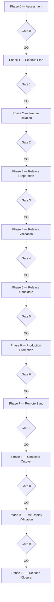

# Guardian Release Workflow — Standard kanoniczny

**Status:** CANONICAL  
**Wersja:** 1.0-draft  
**Data:** 2026-07-06  
**Hierarchia:** pod [GUARDIAN_VISION.md](./GUARDIAN_VISION.md), nad [REPOSITORY_TARGET_STATE.md](./REPOSITORY_TARGET_STATE.md)  
**Pierwszy przypadek użycia:** GWO-IFG-002A — IFG Container Manager cutover  
**Powiązany raport:** [2026-07-06_GUARDIAN_RELEASE_WORKFLOW_DESIGN.md](../../reports/2026-07-06_GUARDIAN_RELEASE_WORKFLOW_DESIGN.md)

---

## Preface

Guardian Release Workflow to **proces**, nie lista komend Git.

Prowadzi operatora od dowolnego stanu repozytorium (w tym dirty tree) do **bezpiecznego wdrożenia na produkcję** — z walidacją, Safety Gate, checkpointami, raportami i możliwością wznowienia.

Cutover Container Manager jest **ostatnią fazą** Release, nie osobnym wydarzeniem.

> **Zasada:** Żadna faza mutating nie wykonuje się bez GO od Safety Gate i — tam gdzie wymagane — jawnej zgody operatora (`--yes`).

---

## 1. Definicja

**Guardian Release Workflow** — wielofazowy, audytowalny proces orkiestrowany przez Guardiana, który:

1. Ocenia stan projektu i repozytorium.
2. Porządkuje zmiany (izolacja WIP, housekeeping).
3. Przygotowuje i waliduje kandydata release (`release/*`).
4. Promuje na `production` z tagiem i release notes.
5. Wykonuje wdrożenie infrastrukturalne (w tym Container Manager cutover).
6. Weryfikuje produkcję i zamyka release.

**Workflow ID (docelowe):** `ifg.release.run`  
**Skrót CLI (docelowe):** `python3 scripts/guardian.py ifg release run`

---

## 2. Model procesu — 11 faz



| Faza | ID | Nazwa | Mutating | Operator `--yes` |
|------|-----|-------|----------|------------------|
| 0 | `assessment` | Repository Assessment | ❌ | — |
| 1 | `cleanup_plan` | Cleanup Plan | ❌ | — |
| 2 | `feature_isolation` | Feature Isolation | ✅ Git | ✅ |
| 3 | `release_prep` | Release Preparation | ✅ Git | ✅ |
| 4 | `release_validation` | Release Validation | ❌ | — |
| 5 | `release_candidate` | Release Candidate Lock | ❌ | — |
| 6 | `production_promotion` | Production Promotion | ✅ Git | ✅ |
| 7 | `remote_sync` | Remote Sync (DS723+) | ✅ SSH read/pull | ✅ |
| 8 | `container_cutover` | Container Manager Cutover | ✅ SSH | ✅ |
| 9 | `post_deploy_validation` | Post-Deploy Validation | ❌ | — |
| 10 | `release_closure` | Release Closure | ⚠️ cleanup | ✅ (cleanup) |

---

## 3. Szczegóły faz

### Phase 0 — Repository Assessment

| Pole | Wartość |
|------|---------|
| **Cel** | Zrozumieć pełny obraz zmian; sklasyfikować je procesowo (nie „commit 1, commit 2") |
| **Wejście** | Dowolny branch; dirty lub clean tree |
| **Warunki startu** | Repo Git; Guardian CLI dostępny |
| **Czynności** | `repo audit`; klasyfikacja: cutover / WIP / CRLF / runtime / docs / poza zakresem; mapowanie na [Ready Check](../../reports/2026-07-06_IFG_CONTAINER_CUTOVER_READY_CHECK.md) |
| **Walidacja** | Raport assessment kompletny; brak niesklasyfikowanych plików CRITICAL |
| **Wyjście** | `AssessmentReport` — grupy zmian + werdykt wstępny GO/NO-GO |
| **Rollback** | N/A (read-only) |
| **Raport** | `.guardian/releases/<id>/phase_00_assessment.md` |

**Safety Gate 0:** GO jeśli assessment zakończony i operator zaakceptował klasyfikację. NO-GO jeśli nierozpoznane zmiany CRITICAL.

---

### Phase 1 — Cleanup Plan

| Pole | Wartość |
|------|---------|
| **Cel** | Ustalić plan porządkowania bez utraty pracy |
| **Wejście** | `AssessmentReport` z Phase 0 |
| **Warunki startu** | Gate 0 = GO |
| **Czynności** | Przypisanie każdej grupy: → release / → feature branch / → ignore / → housekeeping; plan branchy `feature/*`; plan `.gitignore`; plan untrack `dist/` |
| **Walidacja** | Każdy plik dirty ma dokładnie jedną destynację; brak konfliktów |
| **Wyjście** | `CleanupPlan` — sekwencja działań procesowych |
| **Rollback** | N/A (read-only) |
| **Raport** | `.guardian/releases/<id>/phase_01_cleanup_plan.md` |

**Safety Gate 1:** GO po akceptacji planu przez operatora. NO-GO jeśli plan zawiera DELETE bez backup lub miesza cutover z WIP bez izolacji.

---

### Phase 2 — Feature Isolation

| Pole | Wartość |
|------|---------|
| **Cel** | Usunąć WIP z ścieżki release (production path clean) |
| **Wejście** | `CleanupPlan`; dirty tree |
| **Warunki startu** | Gate 1 = GO; operator `--yes` |
| **Czynności** | Utworzenie `feature/<name>`; commit WIP (np. `transmission_repository`); powrót na branch roboczy release; opcjonalnie: revert working tree WIP na production path |
| **Walidacja** | Pliki WIP zacommitowane na feature; nie pozostają jako `M` na ścieżce release |
| **Wyjście** | Branch `feature/*` z WIP; `production` / bazowy branch bez WIP |
| **Rollback** | `git switch feature/<name>`; ewentualnie `git reset` na feature (nie na production) |
| **Raport** | `.guardian/releases/<id>/phase_02_feature_isolation.md` + commit SHAs |

**Safety Gate 2:** GO gdy `git status` na ścieżce release nie zawiera plików WIP z Phase 1.

---

### Phase 3 — Release Preparation

| Pole | Wartość |
|------|---------|
| **Cel** | Zbudować branch `release/<YYYY-MM-DD>-<name>` z kompletną zawartością release |
| **Wejście** | Czysta ścieżka release (bez WIP); plan grup cutover |
| **Warunki startu** | Gate 2 = GO; operator `--yes` |
| **Czynności** | Utworzenie `release/2026-07-06-container-manager-cutover`; sekwencyjne commity procesowe: (A) Preflight Engine, (B) Cutover workflow, (C) dokumentacja GWO + runbook, (D) housekeeping `.gitignore` + untrack dist; po każdym commicie: checkpoint |
| **Walidacja** | `pytest` cutover + preflight; `git status` clean na release branch |
| **Wyjście** | Branch `release/*` gotowy; `ReleaseManifest` z listą commitów |
| **Rollback** | `git reset` na release branch (nie dotykać production); feature branches nietknięte |
| **Raport** | `.guardian/releases/<id>/phase_03_release_prep.md` |

**Safety Gate 3:** GO gdy release branch clean, testy PASS, wszystkie grupy cutover w commitach release.

**IFG — pierwszy release (zawartość):**

| Grupa procesowa | Zawartość | Poza release |
|-----------------|-----------|--------------|
| Guardian cutover stack | preflight, container_cutover, CLI, testy | G003 execution |
| Dokumentacja operacyjna | runbook, GWO-IFG-002* | Vision, repo strategy |
| Housekeeping | `.guardian/` w gitignore, untrack dist | CRLF chore (opcjonalnie) |

---

### Phase 4 — Release Validation

| Pole | Wartość |
|------|---------|
| **Cel** | Udowodnić gotowość release do promocji |
| **Wejście** | Branch `release/*` |
| **Warunki startu** | Gate 3 = GO |
| **Czynności** | `ifg doctor`; `ifg release plan`; `ifg cutover run --dry-run`; `deploy check` (local); analiza ryzyka |
| **Walidacja** | Doctor bez CRITICAL; release plan wygenerowany; dry-run cutover SUCCESS; Safety Gate GO |
| **Wyjście** | `ReleaseValidationReport` — GO/NO-GO do promocji |
| **Rollback** | N/A |
| **Raport** | `docs/reports/operational/RELEASE_VALIDATION_<id>.md` + `.guardian/releases/<id>/phase_04_validation.json` |

**Safety Gate 4:** GO tylko przy dry-run SUCCESS + doctor PASS + brak CRITICAL risk.

---

### Phase 5 — Release Candidate

| Pole | Wartość |
|------|---------|
| **Cel** | Zamrozić kandydata; przygotować tag i release notes |
| **Wejście** | `ReleaseValidationReport` = GO |
| **Warunki startu** | Gate 4 = GO |
| **Czynności** | Oznaczenie SHA kandydata; draft release notes; propozycja tagu SemVer (np. `v6.7.0-container-manager-cutover`); checkpoint `candidate_sha` |
| **Walidacja** | SHA niezmienny od Gate 4; operator przegląda release notes |
| **Wyjście** | `ReleaseCandidate` — zamrożony SHA + tag + notes |
| **Rollback** | N/A (jeszcze nie na production) |
| **Raport** | `.guardian/releases/<id>/phase_05_candidate.md` |

**Safety Gate 5:** GO po **jawnej akceptacji operatora** release notes i tagu.

---

### Phase 6 — Production Promotion

| Pole | Wartość |
|------|---------|
| **Cel** | Przenieść release na `production` |
| **Wejście** | `ReleaseCandidate`; branch `release/*` |
| **Warunki startu** | Gate 5 = GO; operator `--yes` |
| **Czynności** | Merge `release/*` → `production`; utworzenie tagu; `git push origin production --tags` |
| **Walidacja** | `production` @ candidate SHA; tag istnieje na remote |
| **Wyjście** | `production` zsynchronizowany z remote |
| **Rollback** | `git revert` merge commit na production + push; tag pozostaje (nowy tag revert) |
| **Raport** | `docs/reports/operational/PRODUCTION_PROMOTION_<id>.md` |

**Safety Gate 6:** GO po potwierdzeniu push; NO-GO jeśli push failed.

---

### Phase 7 — Remote Sync

| Pole | Wartość |
|------|---------|
| **Cel** | DS723+ ma ten sam kod co `production` |
| **Wejście** | `production` na remote |
| **Warunki startu** | Gate 6 = GO |
| **Czynności** | SSH: `git fetch`; `git checkout production`; `git pull`; weryfikacja SHA; weryfikacja `docker-compose.prod.yml` pins (`name: ifg`, external volume/network) |
| **Walidacja** | Remote SHA = production SHA; remote tree clean; compose config gate PASS |
| **Wyjście** | DS723+ gotowy do cutover |
| **Rollback** | `git checkout <pre-release-sha>` na DS723+ (zapisany w checkpoint) |
| **Raport** | `.guardian/releases/<id>/phase_07_remote_sync.md` |

**Safety Gate 7:** GO gdy remote SHA zgodny i compose gate PASS.

---

### Phase 8 — Container Manager Cutover

| Pole | Wartość |
|------|---------|
| **Cel** | Migracja projektu Compose `docker` → `ifg` (Scenario B) |
| **Wejście** | DS723+ zsynchronizowany; workflow `ifg.container.cutover` w HEAD |
| **Warunki startu** | Gate 7 = GO; okno maintenance; operator `--yes` |
| **Czynności** | Delegacja do workflow `ifg.container.cutover`: backup → git pull → compose gate → preflight → legacy containers → cutover up → health → guardian verify |
| **Walidacja** | Health OK; sanity SQL; worker logs; **nie** usuwać `docker-*` w tej fazie |
| **Wyjście** | Kontenery `ifg-*` działają; legacy `docker-*` Exited |
| **Rollback** | `ifg cutover rollback --yes` |
| **Raport** | `docs/guardian/IFG_CONTAINER_CUTOVER_<date>.md` (istniejący format) |

**Safety Gate 8:** GO po health + guardian verify PASS.

**Uwaga:** To **jedna faza Release**, nie osobny proces. Cutover workflow jest **podprocesem** Phase 8.

---

### Phase 9 — Post-Deploy Validation

| Pole | Wartość |
|------|---------|
| **Cel** | Potwierdzić działanie produkcji |
| **Wejście** | Cutover wykonany |
| **Warunki startu** | Gate 8 = GO |
| **Czynności** | Checklist funkcjonalna (runbook); smoke API/UI/KSeF; operator attest `--confirm-functional` |
| **Walidacja** | Operator potwierdza checklist |
| **Wyjście** | `FunctionalAttestation` |
| **Rollback** | Cutover rollback + revert production (ostateczność) |
| **Raport** | `.guardian/releases/<id>/phase_09_functional.md` |

**Safety Gate 9:** GO po `--confirm-functional` od operatora.

---

### Phase 10 — Release Closure

| Pole | Wartość |
|------|---------|
| **Cel** | Zamknąć release; posprzątać; zarchiwizować wiedzę |
| **Wejście** | Gate 9 = GO |
| **Warunki startu** | Functional attestation |
| **Czynności** | Opcjonalnie: `ifg cutover run --yes --confirm-functional --cleanup` (usunięcie legacy `docker-*`); merge release notes do `docs/reports/migrations/`; zamknięcie brancha `release/*`; aktualizacja `ReleaseManifest` status = CLOSED |
| **Walidacja** | Release CLOSED; brak otwartych CRITICAL |
| **Wyjście** | Release zakończony; projekt w stanie docelowym |
| **Rollback** | N/A (po cleanup trudny — dlatego cleanup na końcu) |
| **Raport** | `docs/reports/migrations/GWO_IFG_002A_RELEASE_CLOSED_<date>.md` |

**Safety Gate 10:** GO — release formalnie zamknięty.

---

## 4. Automatyczne vs operator

| Faza | Automatyczne | Wymaga operatora |
|------|--------------|------------------|
| 0 Assessment | Skan, klasyfikacja, raport | Akceptacja klasyfikacji |
| 1 Cleanup Plan | Generowanie planu | Akceptacja planu |
| 2 Feature Isolation | Propozycja branchy, lista plików | `--yes` + potwierdzenie commitów WIP |
| 3 Release Prep | Propozycja kolejności commitów | `--yes` per commit batch |
| 4 Validation | doctor, release plan, dry-run | Przegląd raportu |
| 5 Candidate | Draft notes, propozycja tagu | **Akceptacja tagu i notes** |
| 6 Promotion | Merge (po zgodzie) | `--yes` merge + push |
| 7 Remote Sync | SSH pull, SHA check | `--yes` jeśli remote dirty |
| 8 Cutover | Stages po GO | `--yes` LIVE |
| 9 Post-Deploy | Smoke scripts | **Checklist + `--confirm-functional`** |
| 10 Closure | Raport, archiwizacja | `--yes` cleanup legacy containers |

> **Reguła:** Żadna faza mutating nie przechodzi dalej bez GO + (jeśli wymagane) `--yes`.

---

## 5. Safety Gates

Każda faza kończy się **twardym** Gate:

```
GO   → następna faza dozwolona
NO-GO → proces zatrzymany; raport + recommended_actions
```

| Gate | Kryterium NO-GO (przykłady) |
|------|----------------------------|
| G0 | Niesklasyfikowane pliki CRITICAL |
| G1 | Plan miesza WIP z cutover bez izolacji |
| G2 | WIP nadal na ścieżce release |
| G3 | Testy FAIL; release branch dirty |
| G4 | dry-run FAIL; doctor CRITICAL |
| G5 | Operator odrzuca release notes |
| G6 | Push failed |
| G7 | Remote SHA mismatch |
| G8 | Health FAIL po cutover |
| G9 | Brak functional attestation |
| G10 | — (zamknięcie) |

**Brak soft-pass:** WARNING nie uprawnia do przejścia fazy mutating.

---

## 6. Wznowienie procesu (Resume)

### 6.1 Release Manifest

Każdy release ma manifest:

```
.guardian/releases/<release-id>/
  manifest.json          # stan procesu
  phase_XX_*.md          # raporty faz
  checkpoints.json       # SHA, branch, gate results
```

**`manifest.json` (schema `guardian_release_v1`):**

```json
{
  "release_id": "2026-07-06-container-manager-cutover",
  "workflow_id": "ifg.release.run",
  "current_phase": 4,
  "last_gate": "G4",
  "last_gate_result": "GO",
  "candidate_sha": "abc123...",
  "production_sha_before": "9505adc",
  "remote_sha_before": "9505adc",
  "status": "IN_PROGRESS",
  "phases_completed": [0, 1, 2, 3, 4],
  "created_at": "2026-07-06T20:00:00Z",
  "updated_at": "2026-07-06T21:30:00Z"
}
```

### 6.2 Komendy resume (docelowe)

```bash
guardian ifg release status                    # gdzie jesteśmy
guardian ifg release resume                    # kontynuuj od current_phase
guardian ifg release resume --from-phase 3     # po naprawie błędu
guardian ifg release abort                     # NO-GO + zamknięcie IN_PROGRESS
```

### 6.3 Zasady resume

| Sytuacja | Zachowanie |
|----------|------------|
| Przerwanie w Phase 3 | Resume od ostatniego checkpoint commita |
| Przerwanie po Gate 6 | Nie powtarzać merge; start Phase 7 |
| Przerwanie w Phase 8 | Delegacja do `ifg cutover` transaction |
| Abort | Status ABORTED; raport; nie auto-cleanup |

---

## 7. Raporty i artefakty

| Artefakt | Lokalizacja | Żywotność | Promocja |
|----------|-------------|-----------|----------|
| Phase reports (0–3, 7, 9) | `.guardian/releases/<id>/` | Runtime | Opcjonalnie → archive |
| Validation report (4) | `docs/reports/operational/` | 12 mies. | → `archive/` |
| Production promotion (6) | `docs/reports/operational/` | Permanentna | migrations/ |
| Cutover report (8) | `docs/guardian/` | Operational | migrations/ po zamknięciu |
| Release closed (10) | `docs/reports/migrations/` | Permanentna | Kanoniczna historia |
| Transaction JSON | `.guardian/workflows/` | 30 dni | Nie commitować |
| Release manifest | `.guardian/releases/<id>/` | Do zamknięcia release | Snapshot w (10) |

**Tymczasowe:** `.guardian/releases/`, `.guardian/workflows/`  
**Dokumentacja projektu:** `docs/reports/migrations/`, `docs/reports/operational/` (po review)  
**Kanoniczne:** runbooki, ADR — osobno, nie w Release runtime

---

## 8. Promocja branchy

```mermaid
gitGraph
    commit id: "9505adc compose-prep"
    branch feature/ksef-transmission-wip
    commit id: "wip transmission"
    checkout main
    branch release/2026-07-06-cm-cutover
    commit id: "preflight"
    commit id: "cutover workflow"
    commit id: "docs+housekeeping"
    commit id: "validation PASS"
    checkout production
    merge release/2026-07-06-cm-cutover tag: "v6.7.0-cm-cutover"
    commit id: "cutover LIVE"
```

| Przejście | Kto | Gate |
|-----------|-----|------|
| dirty → feature | Guardian Phase 2 | G2 |
| base → release | Guardian Phase 3 | G3 |
| release → production | Guardian Phase 6 | G5, G6 |
| production → DS723+ | Guardian Phase 7 | G7 |
| production → cutover | Guardian Phase 8 | G7, G8 |

---

## 9. Pierwszy release IFG — mapowanie Ready Check

| Ready Check bloker | Faza Release |
|--------------------|--------------|
| B1 dirty tree | Phase 0–3 |
| B2 cutover nie w HEAD | Phase 3 |
| B3 preflight nie w HEAD | Phase 3 |
| B4 brak push | Phase 6–7 |
| B5 transmission WIP | Phase 2 |
| B6 CRLF + dist | Phase 1 plan; Phase 3 housekeeping |
| B7 `.guardian/` | Phase 3 housekeeping |

**Werdykt Ready Check NO-GO** → **Start Release Workflow od Phase 0**.

---

## 10. Relacja z istniejącymi workflow

| Workflow | Rola w Release |
|----------|----------------|
| `ifg.doctor` | Phase 4 |
| `ifg.release.plan` | Phase 4 |
| `ifg.container.cutover` | Phase 8 (podproces) |
| `deploy check` | Phase 4, 7 |
| `core.repo_audit` | Phase 0 |

Release Workflow **orkiestruje** istniejące workflow — nie zastępuje ich.

---

## 11. CLI (docelowe)

```bash
# Pełny proces (interaktywny, fazowy)
python3 scripts/guardian.py ifg release run --id 2026-07-06-container-manager-cutover

# Pojedyncza faza
python3 scripts/guardian.py ifg release run --phase 0

# Dry-run całego release (bez mutating)
python3 scripts/guardian.py ifg release run --dry-run

# Status / resume
python3 scripts/guardian.py ifg release status
python3 scripts/guardian.py ifg release resume
```

---

## 12. Słownik

| Termin | Znaczenie |
|--------|-----------|
| **Release** | Proces od dirty tree do zamknięcia wdrożenia |
| **Release ID** | Unikalny identyfikator (np. `2026-07-06-container-manager-cutover`) |
| **Phase** | Etap procesu z własnym Gate |
| **Gate** | GO/NO-GO — twarda bariera |
| **Checkpoint** | Zapisany stan po fazie (SHA, branch, gate) |
| **Candidate** | Zamrożony SHA release przed promocją |
| **Attestation** | Potwierdzenie operatora (functional, cleanup) |

---

*Standard kanoniczny. Implementacja wymaga zatwierdzenia i osobnego GWO. Pierwszy release IFG jest walidacją tego procesu w praktyce.*
