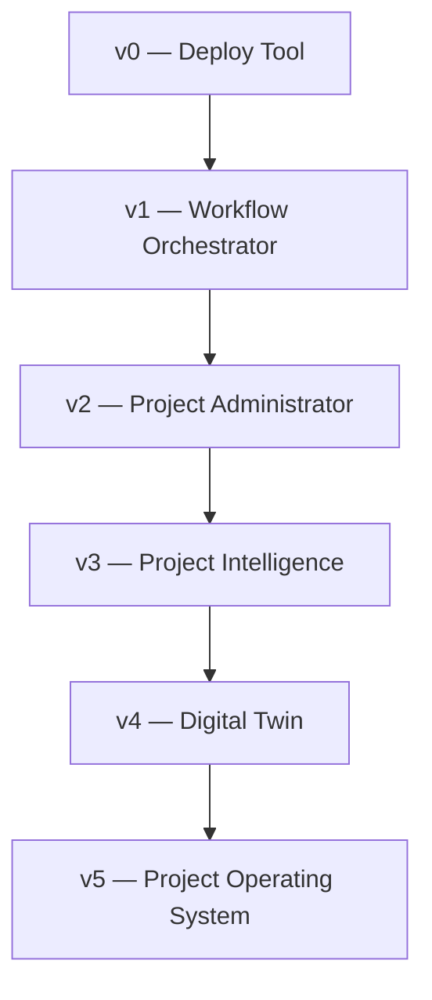
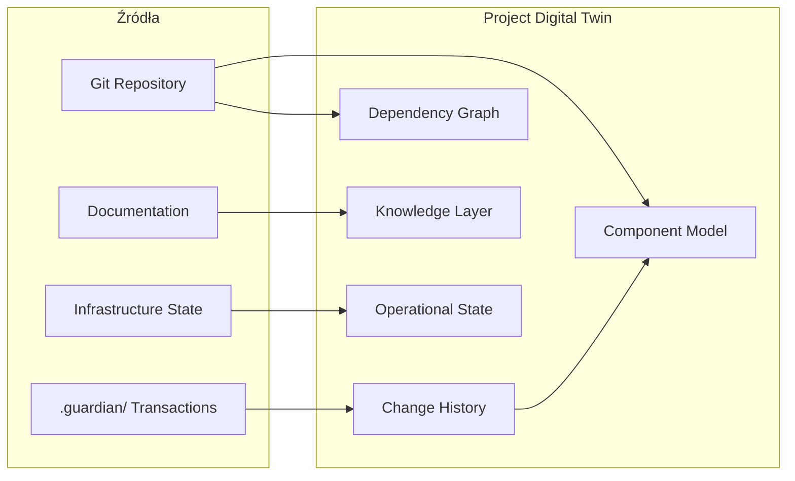
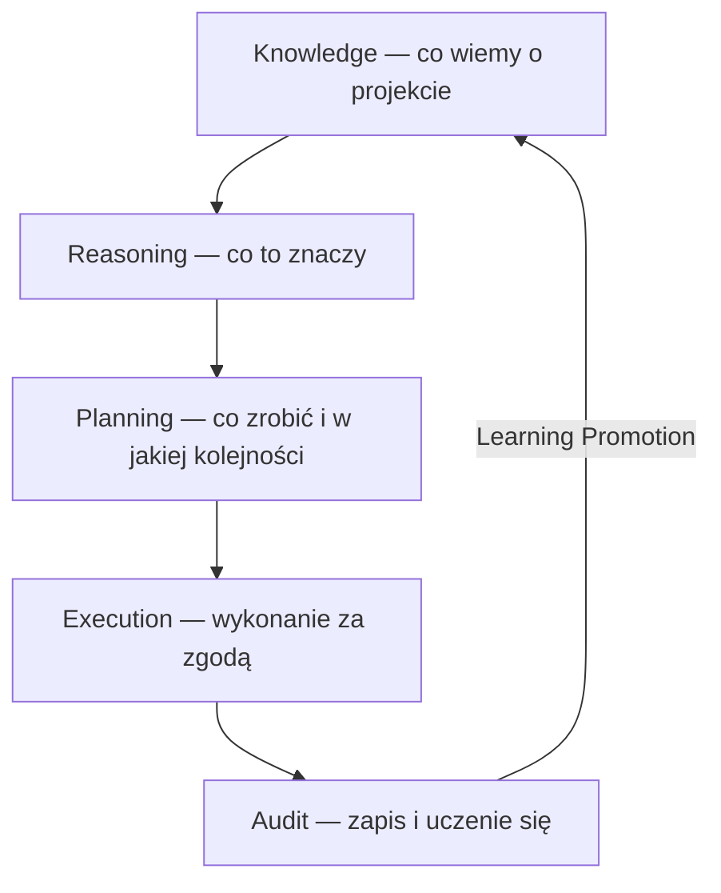
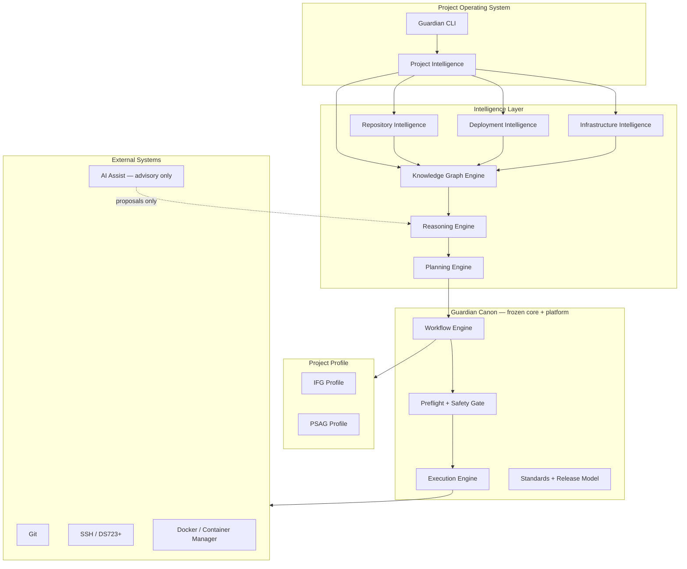
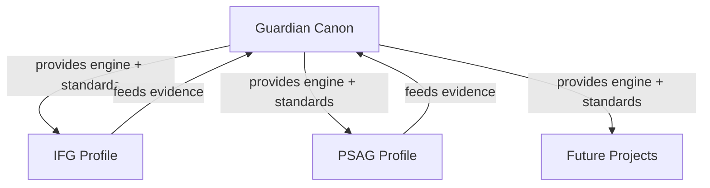
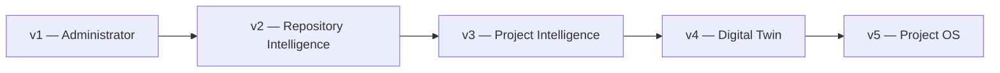

# Guardian Vision

**Status:** CANONICAL — dokument nadrzędny  
**Wersja:** 1.0  
**Data:** 2026-07-06  
**Hierarchia:** ten dokument jest **ponad** wszystkimi innymi dokumentami Guardiana w projekcie  
**Powiązane:** [REPOSITORY_TARGET_STATE.md](./REPOSITORY_TARGET_STATE.md), Canon (`guardian/Canon/VISION.md`)

---

## Preface

Guardian powstał jako odpowiedź na ból operacyjny: deploy na DS723+, sprawdzenie stanu, odzyskanie po awarii. Z czasem okazało się, że ten ból nie jest problemem infrastruktury — jest problemem **zarządzania projektem jako całością**.

Repozytorium, dokumentacja, decyzje, release, infrastruktura i wiedza operatora żyją w osobnych światach. Guardian łączy je — i właśnie dlatego przestaje być „narzędziem do deployów".

Ten dokument odpowiada na pytanie: **czym Guardian ma być za pięć lat?**

---

## 1. Definicja

### 1.1 Jednym zdaniem

**Guardian jest Project Operating System — systemem operacyjnym projektu, który utrzymuje cyfrowy model projektu, rozumie jego wiedzę i kontekst, planuje bezpieczne zmiany oraz wykonuje je tylko za zgodą operatora.**

### 1.2 Jedna strona

Guardian nie jest CI/CD, nie jest frameworkiem workflow, nie jest chatbotem ani zamiennikiem programisty.

Guardian jest **warstwą operacyjną między człowiekiem a projektem** — między intencją a wykonaniem.

Wie, jak wygląda architektura IFG lub PSAG. Wie, jakie decyzje zostały podjęte i dlaczego. Wie, co jest w repozytorium, co na produkcji, co w dokumentacji, a co tylko w głowie operatora. Wie, które zmiany są bezpieczne, które wymagają uwagi, a które są sprzeczne z dotychczasowymi decyzjami.

Guardian **nie zastępuje** operatora. Jest bardziej ostrożny niż operator. Analizuje zanim zaproponuje. Planuje zanim wykona. Pyta zanim zmieni produkcję.

Projekt dla Guardiana to nie folder z kodem. To **żywy organizm**: kod, docs, infra, historia, ryzyka, roadmapa, standardy. Guardian utrzymuje **Project Digital Twin** — cyfrowy model tego organizmu — i na jego podstawie podejmuje działania.

Dziś Guardian deployuje. Jutro Guardian rozumie. Pojutrze Guardian prowadzi projekt.

### 1.3 Pełny opis

Guardian to platforma **Project Intelligence** zdolna do:

1. **Poznania** — budowania i odświeżania modelu projektu (architektura, komponenty, zależności, dokumentacja, decyzje, infrastruktura, historia).
2. **Rozumowania** — wnioskowania o wpływie zmian, ryzyku, gotowości release, sprzecznościach z ADR i standardami.
3. **Planowania** — proponowania kolejności commitów, branchy, release, deploy, rollback — z uzasadnieniem.
4. **Wykonania** — uruchamiania workflow operacyjnych (doctor, release plan, deploy, cutover, recover) przez Safety Gate i z pełnym audytem.

Guardian działa w modelu **Canon + Profile**:

- **Guardian Canon** — wspólne jądro: silnik workflow, model wiedzy, reasoning, standardy release, Safety Gate, Execution Engine.
- **Project Profile** — IFG, PSAG, kolejne projekty: domena, runbooki, klasyfikatory, workflows specyficzne dla projektu.

Guardian Core v1 jest **zamrożony** — dojrzała warstwa wykonania. Przyszłość Guardiana leży **nad** Core: Intelligence, Digital Twin, Knowledge Graph, Project Operating System.

Fundamentalne założenia:

| # | Założenie |
|---|-----------|
| Z1 | **Repository First** — Git jest źródłem prawdy dla kodu i dokumentacji kanonicznej |
| Z2 | **Documentation First** — jeśli nie jest udokumentowane, nie istnieje operacyjnie |
| Z3 | **Knowledge First** — decyzje i kontekst są tak samo ważne jak kod |
| Z4 | **Production-driven evolution** — Guardian rozwija się z realnych problemów, nie spekulacji |
| Z5 | **Operator sovereignty** — ostateczna decyzja zawsze należy do człowieka |
| Z6 | **Safety over speed** — Guardian jest bardziej ostrożny niż operator |
| Z7 | **No silent bypass** — operacje produkcyjne przechodzą przez Guardiana |

---

## 2. Czym Guardian jest — i czym nie jest

### 2.1 Guardian JEST

| Rola | Opis |
|------|------|
| **Project Operating System** | Warstwa zarządzająca cyklem życia projektu |
| **Project Intelligence** | System rozumiejący kontekst, nie tylko pliki |
| **Administrator repozytorium** | Higiena Git, commity, branche, release |
| **Strażnik produkcji** | Preflight, Safety Gate, rollback |
| **Kustosz wiedzy** | ADR, architektura, runbooki, historia decyzji |
| **Planista operacji** | Release plan, commit plan, impact analysis |
| **Audytor** | Doctor, repo audit, readiness reports |

### 2.2 Guardian NIE JEST

| Anti-pattern | Dlaczego nie |
|--------------|--------------|
| CI/CD (GitHub Actions, Jenkins) | Guardian nie zastępuje pipeline build/test — je współpracuje |
| Framework aplikacyjny | Guardian nie jest częścią `app/` — jest nad projektem |
| IDE / edytor | Guardian nie pisze kodu za programistę |
| Autonomiczny agent AI | Guardian proponuje i wykonuje **za zgodą** — nie samodzielnie |
| System ticketowy | Guardian nie zarządza backlogiem biznesowym |
| Monitoring (Datadog, Prometheus) | Guardian czyta health, ale nie zastępuje observability |
| Git hosting (GitHub, GitLab) | Guardian operuje na lokalnym/remote repo, nie hostuje |

---

## 3. Ewolucja Guardiana

Guardian przechodzi przez wyraźne fazy tożsamości. Każda faza **nie odrzuca** poprzedniej — ją **opakowuje**.



| Faza | Tożsamość | Pytanie, na które odpowiada | Stan (2026) |
|------|-----------|----------------------------|-------------|
| **v0** | Narzędzie deployów | „Jak wgrać na DS723+?" | ✅ `guardian2.py`, SSH compose |
| **v1** | Orkiestrator workflow | „Jak bezpiecznie wykonać sekwencję kroków?" | ✅ Core v1 frozen, workflow engine |
| **v2** | Administrator projektu | „Czy repo i release są gotowe?" | 🔄 Repository Target State, release flow |
| **v3** | Project Intelligence | „Co te zmiany znaczą dla projektu?" | 📋 Repository Intelligence (projekt) |
| **v4** | Digital Twin | „Jak wygląda cały projekt teraz?" | 📋 Knowledge Graph + Twin |
| **v5** | Project Operating System | „Jak prowadzić projekt przez lata?" | 🎯 Wizja 5-letnia |

**Uwaga:** v0–v1 są **osiągnięciem**, nie długiem. Execution Engine i Workflow Engine pozostają fundamentem v5.

---

## 4. Problemy, które Guardian rozwiązuje

Guardian adresuje problemy **organizacyjne i poznawcze**, nie tylko techniczne.

### 4.1 Mapa problemów

| Obszar | Problem bez Guardiana | Rozwiązanie Guardiana |
|--------|----------------------|----------------------|
| **Zarządzanie projektem** | Rozproszona wiedza, brak „kto za co odpowiada" operacyjnie | Project Profile + runbooki + readiness |
| **Wiedza projektowa** | W głowie operatora, ginie przy absencji | Knowledge Graph + ADR + Digital Twin |
| **Dokumentacja** | 200+ plików bez taksonomii, nie wiadomo co aktualne | Standard docs/ + archiwizacja + klasyfikacja |
| **Deployment** | Ręczne SSH, brak audytu | Workflow + transaction JSON + raporty |
| **Release** | Push na production „bo działa lokalnie" | Release branch + plan + Safety Gate |
| **Architektura** | Decyzje w czatach, nie w repo | ADR + architecture/ + compliance check |
| **Decyzje** | Brak śladu „dlaczego tak" | decisions/ + Knowledge Graph edges |
| **Onboarding** | „Zapytaj Łukasza" | Doctor + Twin + canonical docs |
| **Analiza wpływu** | „Nie wiem co się zepsuje" | Impact analysis via dependency graph |
| **Bezpieczeństwo zmian** | Deploy z dirty tree | Preflight + git.clean + mixed-topic detection |
| **Utrzymanie jakości** | Regresje po miesiącach | Doctor + test gates + release checklist |

### 4.2 Problem nadrzędny

> **Projekt jest zbyt złożony, aby jedna osoba mogła go trzymać w głowie — ale zbyt mały, aby uzasadniać pełny enterprise toolchain.**

Guardian wypełnia lukę między „skryptami w katalogu" a „platformą DevOps".

---

## 5. Project Digital Twin

### 5.1 Koncepcja

**Project Digital Twin** to utrzymywany przez Guardiana cyfrowy model projektu — nie kopia repozytorium, lecz **semantyczna reprezentacja** tego, czym projekt jest, jak działa i jak się zmienia.

### 5.2 Wymiary modelu

| Wymiar | Źródło danych | Odświeżanie |
|--------|---------------|-------------|
| **Architektura** | `docs/architecture/`, ADR | Przy zmianie ADR / release |
| **Komponenty** | import graph, docker compose, API routes | CI / `repo analyze` |
| **Zależności** | Python imports, npm, DB schema | `repo analyze` |
| **Workflow** | workflow registry, runbooki | Przy zmianie plugin |
| **Deployment** | compose, DS723+ state, Container Manager | `deploy check`, cutover |
| **Infrastruktura** | `.guardian.yml`, remote config | Profile config |
| **Dokumentacja** | docs graph, canonical vs draft | `doc analyze` |
| **Decyzje** | `decisions/ADR-*` | Przy nowym ADR |
| **Roadmapa** | `specifications/roadmap/` | Manual + review |
| **Standardy** | `standards/`, Canon | Canon sync |
| **Testy** | test graph, coverage | `pytest` stage |
| **Ryzyka** | doctor, release plan risk stage | Per release |
| **Historia zmian** | Git log, tags, transaction JSON | Continuous |

### 5.3 Twin ≠ Mirror

| Digital Twin | Mirror (kopia repo) |
|--------------|---------------------|
| Semantyczny model | Pliki 1:1 |
| Wiedza + relacje | Brak relacji |
| Odświeżany selektywnie | Zawsze pełny |
| Używany do reasoning | Używany do backup |

**Werdykt:** Project Digital Twin jest **właściwym kierunkiem**. Bez niego Guardian zawsze będzie reagował na pliki, nie na projekt.

### 5.4 Architektura Twin



---

## 6. Project Knowledge Graph

### 6.1 Czy Guardian potrzebuje własnego modelu wiedzy?

**Tak.** Repozytorium Git przechowuje artefakty. Knowledge Graph przechowuje **znaczenie i relacje**.

### 6.2 Węzły grafu

| Typ węzła | Przykład |
|-----------|----------|
| `ADR` | ADR-0001 Core Freeze |
| `Architecture` | Deployment Backend Architecture |
| `Component` | `app/services/ksef_sync_service.py` |
| `API` | `POST /api/invoices` |
| `Workflow` | `ifg.container.cutover` |
| `Runbook` | RUNBOOK_IFG_CONTAINER_MANAGER_CUTOVER |
| `Release` | `v6.7.0-cutover` |
| `Branch` | `production` |
| `Infrastructure` | DS723+ Project `ifg` |
| `Environment` | production, staging |
| `Standard` | REPOSITORY_TARGET_STATE |
| `Risk` | dirty tree, mixed commit |
| `Specification` | FV numbering model |
| `Test` | `test_guardian_container_cutover` |

### 6.3 Krawędzie grafu

| Relacja | Przykład |
|---------|----------|
| `decides` | ADR → Architecture |
| `implements` | Component → Specification |
| `depends_on` | Component → Component |
| `deployed_by` | Component → Workflow |
| `documented_in` | Workflow → Runbook |
| `governs` | Standard → Release |
| `supersedes` | ADR-v2 → ADR-v1 |
| `blocks` | Risk → Release |
| `verified_by` | Workflow → Test |

### 6.4 Przechowywanie

| Warstwa | Format | Lokalizacja |
|---------|--------|-------------|
| Kanoniczne źródła | Markdown, YAML | Git (`docs/`, `.guardian.yml`) |
| Indeks grafu | JSON-LD lub własny schema | `.guardian/knowledge/graph.json` |
| Snapshot query | Derived | generowany on-demand |
| Promocja do Canon | ADR | `guardian/Canon/` (osobne repo) |

Graf jest **materializowany** z repo — nie zastępuje Git, lecz go interpretuje.

---

## 7. Od analizy do wykonania: Knowledge → Reasoning → Planning → Execution

### 7.1 Obecny model

```
Analyze → Execute
```

To wystarczało dla deployów. Nie wystarcza dla Project Operating System.

### 7.2 Docelowy model



| Etap | Odpowiedzialność | Tryb | Przykład |
|------|------------------|------|----------|
| **Knowledge** | Zbierz i zsynchronizuj Twin | read-only | Odśwież graf po `git pull` |
| **Reasoning** | Wnioskuj o ryzyku, sprzecznościach, wpływie | read-only | „Cutover wymaga Preflight w HEAD" |
| **Planning** | Zaproponuj plan commitów, release, deploy | advisory | 5 commitów w kolejności zależności |
| **Execution** | Wykonaj workflow przez Safety Gate | mutating | `ifg cutover run --yes` |
| **Audit** | Zapisz transaction, zaktualizuj historię | write | `.guardian/workflows/` |

**Zasada:** Execution **nigdy** nie pomija Reasoning dla operacji mutating na production.

---

## 8. Architektura warstw Guardiana



### 8.1 Opis warstw

| Warstwa | Rola |
|---------|------|
| **Project Operating System** | Interfejs operatora; spójny model interakcji z projektem |
| **Project Intelligence** | Orkiestrator Intelligence — łączy wszystkie domeny w jeden obraz |
| **Repository Intelligence** | Git, commity, branche, docs hygiene |
| **Deployment Intelligence** | Release readiness, deploy plan, rollback |
| **Infrastructure Intelligence** | Container Manager, compose, health, capacity |
| **Knowledge Graph Engine** | Twin + graf wiedzy |
| **Reasoning Engine** | Wnioskowanie, sprzeczności, impact |
| **Planning Engine** | Commit plan, release plan, merge order |
| **Workflow Engine** | Core v1 — definicje, stages, transactions |
| **Preflight + Safety Gate** | GO/NO_GO |
| **Execution Engine** | SSH, Docker, Compose, HTTP |
| **Project Profile** | Logika domenowa per projekt |

---

## 9. Project Intelligence

Repository Intelligence jest **podzbiorem** Project Intelligence.

### 9.1 Zadania Project Intelligence

| Zadanie | Opis |
|---------|------|
| **Holistyczny obraz** | Połącz repo + infra + docs + decisions w jeden raport |
| **Release readiness** | Czy projekt (nie tylko repo) jest gotowy na production |
| **Impact analysis** | „Co się stanie jeśli zmienię X?" |
| **Onboarding synthesis** | „Co musi wiedzieć nowa osoba?" |
| **Drift detection** | Rozjazd między Twin a rzeczywistością |
| **Conflict detection** | Sprzeczność ADR ↔ kod ↔ runbook |
| **Recommendation** | Następny krok operacyjny z uzasadnieniem |

### 9.2 Współpraca z modułami

```
Project Intelligence
    ├── Repository Intelligence  → commity, branche, docs
    ├── Deployment Intelligence  → release, deploy, rollback
    ├── Infrastructure Intelligence → DS723+, containers, volumes
    ├── Knowledge Graph Engine   → ADR, architektura, historia
    └── Reasoning Engine         → synteza + rekomendacja
```

---

## 10. Guardian Canon vs Project Profile

### 10.1 Guardian Canon (wspólne jądro)

| Element | Uzasadnienie wspólnoty |
|---------|------------------------|
| Workflow Engine | Ten sam model stages/transactions |
| Preflight + Safety Gate | Uniwersalna ostrożność |
| Execution Engine | SSH, Docker, Compose — wspólne primitives |
| Knowledge Graph Engine | Schema grafu uniwersalny |
| Reasoning Engine | Reguły wnioskowania ponad projektami |
| Planning Engine | Commit/release plan — wspólny algorytm |
| Standards | REPOSITORY_TARGET_STATE, VISION, release model |
| Release Model | feature → release → production |
| CLI conventions | `--dry-run`, `--yes`, formaty output |
| Transaction model | `.guardian/workflows/` |

**Guardian Core v1** (frozen) = Workflow + Execution + Preflight.  
**Guardian Platform** (evolving) = Intelligence + Canon standards.

### 10.2 Project Profile (per projekt)

| Element | IFG | PSAG |
|---------|-----|------|
| Workflow plugins | cutover, ksef, warehouse | TBD |
| Domain classifiers | invoice, ksef, warehouse | TBD |
| Runbooki | Container Manager, KSeF | TBD |
| Remote config | DS723+ | TBD |
| Doctor checks | frontend build, alembic | TBD |
| Knowledge extensions | FA(3), PZ/WZ | TBD |

### 10.3 Relacja Canon ↔ Profile



Profil **nie modyfikuje** Core. Profil **dostarcza evidence** do ewolucji Canon przez ADR.

---

## 11. Wizja za pięć lat (2031)

### 11.1 Możliwości

Operator mówi: *„Chcę wdrożyć zmiany magazynowe na produkcję"*.

Guardian odpowiada:

1. **Knowledge** — odświeża Twin; widzi 23 zmienione pliki w 4 domenach.
2. **Reasoning** — wykrywa zależność warehouse → invoice → KSeF XML; flaguje brak migracji Alembic.
3. **Planning** — proponuje `release/2031-03-warehouse-v2`, 6 commitów, kolejność, testy.
4. **Review** — generuje release plan z ryzykiem MEDIUM; wskazuje ADR-0042 dotyczący FIFO.
5. **Approval** — operator zatwierdza GO.
6. **Execution** — deploy run z pełnym audytem; smoke test; tag.
7. **Learning** — jeśli wykryto nowy pattern, proponuje promocję do heurystyki (nie do Core bez ADR).

### 11.2 Role

| Rola | Za 5 lat |
|------|----------|
| **Operator** | Decydent; zatwierdza GO/NO_GO; ustawia priorytety |
| **Developer** | Pisze kod i docs; Guardian pilnuje standardów |
| **Guardian** | Twin + reasoning + planning + execution + audit |
| **AI** | Advisor w Reasoning — propozycje, nie autonomiczne decyzje |
| **Repozytorium** | Source of truth dla artefaktów |
| **Dokumentacja** | Source of truth dla intencji i decyzji |
| **Wiedza** | Graf łączący repo, docs, infra, historię |
| **Automatyzacja** | Wykonanie **po** planie i zgodzie |

### 11.3 Scenariusz onboarding

Nowy developer:

```bash
guardian project onboard
```

Otrzymuje: architekturę, aktywne ADR, stan branchy, ostatni release, znane ryzyka, runbooki APPROVED, „co nie ruszać".

---

## 12. Granice Guardiana

### 12.1 Czego Guardian NIE robi

| Zakaz | Powód |
|-------|-------|
| Autonomiczny deploy bez `--yes` | Operator sovereignty (Z5) |
| Modyfikacja Core bez ADR | Core freeze |
| Usuwanie kodu produkcyjnego bez review | IFG policy |
| Decyzje biznesowe (ceny, kontrakty) | Poza zakresem |
| Zastępowanie code review człowieka | Jakość kodu to odpowiedzialność dev |
| Bezpośrednia edycja `.env.production` | Sekrety — tylko operator |
| Force push na `production` | Nienaruszalność historii |
| „Naprawianie" repo przez `git restore` bez zgody | Ryzyko utraty pracy |

### 12.2 Zawsze u operatora

- GO/NO_GO na production
- Approval runbooków (DRAFT → APPROVED)
- Nowe ADR zmieniające architekturę
- Promocja heurystyki do Canon
- Rollback po awarii biznesowej (nie tylko technicznej)
- Definicja roadmapy produktowej

### 12.3 Nigdy automatycznie

- Merge do `production`
- `docker rm` na produkcji
- Migracje DB bez backup stage
- Usuwanie plików docs (tylko archiwizacja z approval)
- Zmiana `.env.production`
- Push --force

---

## 13. Roadmapa wizji



| Wersja | Nazwa | Kluczowy deliverable |
|--------|-------|---------------------|
| **v1** | Guardian Administrator | Release flow, repo standards, cutover, clean tree policy |
| **v2** | Repository Intelligence | `repo plan`, commit grouping, mixed-topic detection |
| **v3** | Project Intelligence | Holistyczny readiness, impact analysis, conflict detection |
| **v4** | Digital Twin | Knowledge Graph, component model, drift detection |
| **v5** | Project Operating System | Pełny cykl Knowledge→Reasoning→Planning→Execution→Learning |

---

## 14. Relacja z istniejącymi dokumentami

| Dokument | Relacja do VISION |
|----------|-------------------|
| `REPOSITORY_TARGET_STATE.md` | Standard v1–v2 — **podrzędny** wobec VISION |
| `GUARDIAN_DEPLOYMENT_BACKEND_ARCHITECTURE.md` | Warstwa Infrastructure Intelligence |
| `GUARDIAN_CORE_STATUS.md` | Core v1 frozen — fundament, nie przyszłość |
| `guardian/Canon/VISION.md` | Kanon platformy — **równorzędny** (sync) |
| `GUARDIAN_V3_ARCHITECTURE_REVISED.md` | Historia ewolucji v0→v1 |

**Hierarchia dokumentów w projekcie:**

```
GUARDIAN_VISION.md          ← TEN DOKUMENT (nadrzędny)
    ├── REPOSITORY_TARGET_STATE.md
    ├── GUARDIAN_CORE_STATUS.md
    ├── architecture/*
    └── reports/*
```

---

## 15. Słownik wizji

| Termin | Definicja |
|--------|-----------|
| **Project Operating System** | Docelowa tożsamość Guardiana — system zarządzania projektem |
| **Project Digital Twin** | Cyfrowy model semantyczny projektu |
| **Knowledge Graph** | Graf wiedzy: decyzje, komponenty, relacje |
| **Project Intelligence** | Zdolność rozumienia projektu jako całości |
| **Repository Intelligence** | Podzbiór PI — Git, commity, docs hygiene |
| **Reasoning Engine** | Warstwa wnioskowania między wiedzą a planem |
| **Planning Engine** | Warstwa propozycji działań z uzasadnieniem |
| **Safety Gate** | GO/NO_GO — ostatnia brama przed Execution |
| **Learning Promotion** | Promocja wzorca z audytu do heurystyki/ADR |

---

> *„Guardian nie deployuje aplikacji. Guardian prowadzi projekt."*

---

*Dokument kanoniczny. Zmiany wymagają ADR i synchronizacji z `guardian/Canon/VISION.md`.*
