# Audyt numeracji faktur zakupowych KSeF w IFG

**Data audytu:** 2026-05-22  
**Zakres:** import XML/KSeF → parser → sync → DB → serwisy → API → frontend web → IFGM/mobile  
**Metoda:** przegląd statyczny kodu (bez migracji, bez zmian w repo)  
**Kontekst:** po wdrożeniu fixu opisanego w `docs/KSEF_PURCHASE_INVOICE_NUMBER_FIX.md`

---

## 1. Werdykt

| Reguła biznesowa | Ocena | Uwagi |
|------------------|-------|-------|
| `direction=sale` → numeracja IFG dozwolona | **Zgodne** | `_assign_number_local` / `ensure_number_local` / `mark_as_ready` (po fixie) tylko dla sale |
| `direction=purchase` → zakaz numeracji IFG | **Zgodne (kod bieżący)** | Guard w `mark_as_ready` i `ensure_number_local`; brak ścieżki submit KSeF dla purchase |
| KSeF purchase → prezentacja numeru P_2/XML | **Zgodne (web listing)** | `InvoiceCardList` gałąź purchase; import zapisuje P_2 do `number_local` |
| Brak numeru → pusto / „brak numeru” | **Częściowo** | Web listing: „brak numeru”; PDF/API settlements: „—”; mobile API: fallback na `ksef_reference_number` |
| Brak generowania IFG w całym systemie | **Prawie** | Patrz sekcja 3 — historyczne dane i semantyka pola `number_local` |

**Ogólna ocena:** przepływ KSeF purchase **nie generuje już numerów IFG** w kodzie produkcyjnym. Główne ryzyko to **dane historyczne** (seed / stary `mark_as_ready`) oraz **niespójność semantyczna** pola `number_local` (numer dostawcy vs numer IFG w jednej kolumnie).

---

## 2. Przepływ end-to-end (KSeF purchase)

```mermaid
flowchart LR
  A[KSeF API metadata + XML] --> B[ksef_client.query_received_invoices]
  B --> C[ksef_session_service.sync_received_invoices]
  C --> D[parse_fa3_xml]
  D --> E["P_2 → parsed['number_local']"]
  E --> F["Invoice.number_local = P_2 or NULL"]
  F --> G[(invoices.number_local)]
  G --> H[GET /api/v1/invoices]
  H --> I[InvoiceCardList direction=purchase]
  I --> J["displayNumber = number_local lub 'brak numeru'"]
```



| Etap | Plik | Zachowanie numeru |
|------|------|-------------------|
| XML FA(3) | `app/integrations/ksef/xml_parser.py` | `fa:P_2` → klucz `number_local` w słowniku parse |
| Sync | `app/services/ksef_session_service.py` | `number_local=parsed.get("number_local")`, `direction="purchase"`, `status=ACCEPTED`, dedup po `ksef_reference_number` |
| Orchestracja | `app/services/ksef_sync_service.py` | Deleguje do `sync_received_invoices` — brak własnej numeracji |
| Persistencja | `app/persistence/models/invoice.py` | Kolumna `number_local VARCHAR(128) NULL` — **wspólna** dla sale i purchase |
| API list | `app/api/routers/invoices.py` | Zwraca `number_local` bez transformacji |
| Web UI | `frontend-react/src/components/invoice/InvoiceCardList.jsx` | Purchase: surowy `number_local`, sort `issue_date` ↓, bez `temporary_sequence` |
| Mobile API | `app/services/mobile_service.py` | `number = number_local or ksef_reference_number or ""` |

**Uwaga architektoniczna:** brak osobnego pola `vendor_invoice_number` / `invoice_number_external`. Numer dostawcy z P_2 jest mapowany na `number_local`, co utrudnia audyt i migracje (ta sama kolumna co numer IFG sprzedaży).

---

## 3. Mapa miejsc generowania / ustawiania numerów

### 3.1 Ustawianie `number_local`

| Lokalizacja | Warunek | Wartość | Zgodność |
|-------------|---------|---------|----------|
| `ksef_session_service.sync_received_invoices` | import KSeF | `P_2` z XML lub `NULL` | OK |
| `invoice_service.create_invoice` | ręczne utworzenie (sale/purchase) | zawsze `NULL` | OK |
| `invoice_service._assign_number_local` | sale, via `mark_as_ready` / `ensure_number_local` | `InvoiceNumberPolicy.generate` → `FV/{seq}/{MM}/{YYYY}` | OK (tylko sale) |
| `invoice_service.update_invoice` | edycja | **nie modyfikuje** `number_local` | OK |
| `InvoiceCreateRequest` / `InvoiceUpdateRequest` | API write | brak pola `number_local` w requestach | OK |
| `scripts/sql/fix_draft_invoice_numbering_2026_04_26.sql` | migracja historyczna | `NN/MM/YYYY` dla `status=draft` | **Ryzyko** — brak filtra `direction`; dotyczy tylko draft |
| `scripts/seed_monthly_invoices.py` | seed dev | wywołuje `mark-ready` na **wszystkich** fakturach łącznie z purchase | **Ryzyko historyczne** — przed fixem nadawał IFG purchase |

### 3.2 Wywołania `_assign_number_local` / `ensure_number_local`

| Wywołujący | Guard purchase |
|------------|----------------|
| `invoice_service.mark_as_ready` | **TAK** — `if direction != "sale": return invoice` (linia ~474) |
| `invoice_service.ensure_number_local` | **TAK** — `if direction != "sale": return invoice` (linia ~509) |
| `transmission_service._prepare_sale_invoice_for_submit` | **TAK** — wczesny return gdy `direction != "sale"` |
| `transmission_service._validate_invoice_before_enqueue` | walidacja `number_local` tylko dla `direction == "sale"` |

**Generator IFG:** wyłącznie `InvoiceNumberPolicy.generate()` w `_assign_number_local`.

### 3.3 `temporary_sequence` (UI)

| Plik | Zakres | Status |
|------|--------|--------|
| `InvoiceCardList.jsx` | tylko gałąź **sale** (grupowanie miesięczne + sekwencja UI) | OK — purchase ma osobną gałąź |
| Backend | brak odpowiednika | — |

`ui:temporary_sequence` **nie zapisuje** numeru w DB — dotyczyło wyłącznie wyświetlania sprzedaży / błędnie także zakupów przed fixem.

### 3.4 Formatowanie numeru do wyświetlenia

| Warstwa | Plik | Logika purchase | Zgodność z P_2 |
|---------|------|-----------------|----------------|
| Lista zakupów (web) | `InvoiceCardList.jsx` | `number_local` lub „brak numeru” | **TAK** |
| Otwarte faktury | `OpenInvoicesPanel.jsx` | `number_local \|\| '—'` | TAK (jeśli DB poprawne) |
| PDF / preview HTML | `pdf_service.py` | `number_local \|\| "—"` | TAK |
| Nazwa pliku PDF | `invoices.py` | `faktura-{number_local \|\| id}.pdf` | TAK |
| Transmisje KSeF (sale) | `transmissions.py` | `number_local`, fallback parse `P_2` z XML transmisji | N/A (sale submit) |
| Rozliczenia / płatności | `payment_service.py` | `inv.number_local` | TAK (numer dostawcy w opisach) |
| Mobile — ostatnie zakupy | `mobile_service._recent_purchase_invoices` | `number_local or ksef_reference_number` | **Częściowo** — fallback na numer KSeF, nie P_2 |
| Mobile — settlements | `mobile_service._settlement_invoice_item` | j.w. | **Częściowo** |
| IFGM Expo UI | `mobile-expo/app/purchase-invoices.tsx` | **mock** (`@/data/mock`) | N/A (nie podłączone do API) |

---

## 4. Ocena reguł biznesowych (szczegóły)

### 4.1 Import KSeF — zgodny

```546:547:app/services/ksef_session_service.py
                    number_local=parsed.get("number_local"),
                    ksef_reference_number=result.ksef_reference_number,
```

Parser:

```181:183:app/integrations/ksef/xml_parser.py
    number_local = _txt(_find(fa_el, "fa:P_2"))
    currency = _txt(_find(fa_el, "fa:KodWaluty")) or "PLN"
    return issue_date_txt, sale_date_txt, number_local, currency
```

- Brak P_2 → `number_local = NULL` (nie generuje zastępczego).
- Re-import istniejącej faktury: pomijany (`exists_by_ksef_number`) — **numer nie jest aktualizowany** przy ponownym sync.

### 4.2 Sprzedaż — bez regresji

- Numer IFG: `FV/{seq}/{MM}/{YYYY}` via `_assign_number_local`.
- KSeF mapper wymaga P_2 tylko dla `direction=sale` (`mapper.py` linia ~371).
- Submit worker: `validate_sale_formal_requirements(require_number_local=True)`.

### 4.3 Zakup — zakaz IFG (kod bieżący)

Potwierdzone guardy w `invoice_service.py` (mark_as_ready, ensure_number_local) oraz brak ścieżki wysyłki KSeF dla purchase.

### 4.4 Wyświetlanie — web OK, mobile częściowo

Gałąź purchase w `InvoiceCardList.jsx`:

```171:189:frontend-react/src/components/invoice/InvoiceCardList.jsx
    if (direction === 'purchase') {
      return items
        .map((invoice, idx) => {
          ...
          const rawNumber = String(invoice.number_local || '').trim();
          return {
            ...
            displayNumber: rawNumber || 'brak numeru',
            numberSource: rawNumber ? 'ksef:P_2' : 'missing',
          };
        })
        .sort((a, b) => {
          if (a.dateTs !== b.dateTs) return b.dateTs - a.dateTs;
          ...
        });
    }
```

---

## 5. Wyszukiwanie i sortowanie

### 5.1 Wyszukiwanie (`number_filter`)

**Backend** (`invoice_repository.list_paginated`):

- `number_local ILIKE %filter%`
- oraz NIP/nazwa z `buyer_snapshot_json` / `seller_snapshot_json`
- **nie** przeszukuje `ksef_reference_number`

**Frontend:** filtr „kontrahent” (`filters.contractor`, min. 3 znaki) mapowany na `number_filter` (`dashboardQuery.js`).

| Scenariusz | Działa? |
|------------|---------|
| Szukaj numeru dostawcy (P_2) w liście zakupów | **TAK** (po `number_local`) |
| Szukaj numeru referencyjnego KSeF | **NIE** (brak w zapytaniu SQL) |
| Szukaj nazwy/NIP dostawcy | **TAK** (seller_snapshot) |

### 5.2 Sortowanie

| Warstwa | Domyślne sortowanie | Uwagi |
|---------|---------------------|-------|
| API `GET /invoices/` (view=month/default) | `created_at DESC` | **Nie** `issue_date` |
| API view=open | `due_date ASC`, `issue_date ASC` | widok rozliczeń |
| `InvoiceCardList` purchase | **`issue_date DESC`** (re-sort w UI) | nadpisuje kolejność API |
| `InvoiceCardList` sale | sekwencja IFG w grupach miesięcznych | zamierzone |
| `fetchInvoicesAllPages` | brak sortu — kolejność z API | purchase re-sortowane w CardList |
| Mobile `_recent_purchase_invoices` | kolejność z API (`created_at DESC`) | **inna** niż web listing |

**Wniosek:** sortowanie zakupów po `issue_date` jest **gwarantowane tylko w web `InvoiceCardList`**, nie w API ani mobile.

---

## 6. Dane historyczne

### 6.1 Czy w bazie mogą być purchase z numerami IFG?

**TAK.** Możliwe źródła:

1. **`mark_as_ready` przed fixem** — purchase w statusie `ready_for_submission` bez numeru dostawał `FV/{seq}/{MM}/{YYYY}`.
2. **`scripts/seed_monthly_invoices.py`** — tworzy purchase i woła `mark-ready` na każdej fakturze (linie 49–56).
3. **Migracja draft** (`fix_draft_invoice_numbering_2026_04_26.sql`) — format `NN/MM/YYYY` dla `status=draft` bez filtra direction (purchase draft teoretycznie możliwy).
4. **UI `temporary_sequence`** — **nie** zapisywało do DB; wpływ tylko wizualny przed fixem.

Faktury KSeF z poprawnym P_2 w XML zwykle mają numer dostawcy (np. `FV/DOSTAWCA/42`), **nie** format IFG — o ile nie nadpisano przez (1) lub (2).

### 6.2 Identyfikacja rekordów podejrzanych (SQL — tylko odczyt)

**A. Purchase z numerem w formacie IFG (wysokie prawdopodobieństwo błędu):**

```sql
-- PREVIEW: purchase z numerem IFG (FV/seq/MM/YYYY)
SELECT
  id,
  issue_date,
  number_local,
  ksef_reference_number,
  status,
  created_at,
  updated_at
FROM invoices
WHERE lower(direction) = 'purchase'
  AND number_local IS NOT NULL
  AND number_local ~ '^FV/[0-9]+/[0-9]{2}/[0-9]{4}$'
ORDER BY issue_date DESC, created_at DESC;
```

**B. Purchase z formatem UI-legacy NN/MM/YYYY (średnie ryzyko — mógł być też numer dostawcy):**

```sql
SELECT
  id,
  issue_date,
  number_local,
  ksef_reference_number,
  status
FROM invoices
WHERE lower(direction) = 'purchase'
  AND number_local ~ '^[0-9]{2}/[0-9]{2}/[0-9]{4}$'
ORDER BY issue_date DESC;
```

**C. KSeF purchase bez numeru (brak P_2 w XML lub parse error historyczny):**

```sql
SELECT
  id,
  issue_date,
  ksef_reference_number,
  number_local,
  status
FROM invoices
WHERE lower(direction) = 'purchase'
  AND ksef_reference_number IS NOT NULL
  AND (number_local IS NULL OR btrim(number_local) = '')
ORDER BY issue_date DESC;
```

**D. Podsumowanie:**

```sql
SELECT
  CASE
    WHEN number_local IS NULL OR btrim(number_local) = '' THEN 'brak'
    WHEN number_local ~ '^FV/[0-9]+/[0-9]{2}/[0-9]{4}$' THEN 'ifg_format'
    WHEN number_local ~ '^[0-9]{2}/[0-9]{2}/[0-9]{4}$' THEN 'nn_mm_yyyy'
    ELSE 'vendor_other'
  END AS number_class,
  count(*) AS cnt
FROM invoices
WHERE lower(direction) = 'purchase'
GROUP BY 1
ORDER BY 1;
```

### 6.3 Propozycja migracji naprawczej (NIE WYKONYWAĆ bez review)

**Faza 0 — backup**

```sql
CREATE TABLE invoices_backup_purchase_number_audit_20260522 AS
SELECT * FROM invoices WHERE lower(direction) = 'purchase';
```

**Faza 1 — bezpieczne czyszczenie tylko oczywistych numerów IFG na KSeF purchase**

Dotyczy rekordów, gdzie numer jest **na pewno** nadany przez IFG, a prawdziwy numer powinien pochodzić z KSeF:

```sql
-- PREVIEW ONLY
SELECT id, number_local, ksef_reference_number
FROM invoices
WHERE lower(direction) = 'purchase'
  AND ksef_reference_number IS NOT NULL
  AND number_local ~ '^FV/[0-9]+/[0-9]{2}/[0-9]{4}$';

-- Po akceptacji preview + backup:
-- UPDATE invoices
-- SET number_local = NULL,
--     updated_at = now()
-- WHERE lower(direction) = 'purchase'
--   AND ksef_reference_number IS NOT NULL
--   AND number_local ~ '^FV/[0-9]+/[0-9]{2}/[0-9]{4}$';
```

**Faza 2 — odtworzenie P_2 z KSeF (zalecane zamiast samego NULL)**

Ponieważ re-sync pomija istniejące rekordy, potrzebny **jednorazowy skrypt operacyjny**:

1. Dla każdego `ksef_reference_number` z Fazy 1 (lub C): pobierz XML z KSeF API.
2. `parse_fa3_xml` → ustaw `number_local = P_2`.
3. Audit log / raport diff.

**Faza 3 — purchase seed bez KSeF (bez `ksef_reference_number`)**

Rekordy z `ifg_format` i `ksef_reference_number IS NULL` (np. seed dev) — **ręczna decyzja**: zostawić, usunąć, lub oznaczyć jako dane testowe.

**Czego NIE robić automatycznie:**

- Masowe `UPDATE` wzorca `NN/MM/YYYY` — może usunąć prawdziwy numer dostawcy.
- Ponowny pełny sync KSeF bez zmiany logiki dedup — nie nadpisze numerów.

---

## 7. Ryzyko regresji

| Obszar | Ryzyko | Opis |
|--------|--------|------|
| **OCR** | Brak | Brak modułu OCR faktur w repo |
| **Import CSV** | Brak (faktury) | CSV dotyczy **płatności** (`payment_csv_parser`), nie faktur |
| **Import ręczny purchase** | Niskie | `create_invoice` → `number_local=NULL`; brak UI do nadania numeru IFG po fixie |
| **`mark_as_ready` purchase** | **Niskie (po fixie)** | Zwraca fakturę bez numeru; seed script nadal woła endpoint, ale nie psuje numeracji |
| **Edycja faktury purchase** | Niskie | `update_invoice` nie dotyka `number_local`; ACCEPTED — read-only |
| **Submit KSeF purchase** | Brak | Submit tylko sale |
| **API mobile** | **Średnie** | Fallback `ksef_reference_number` gdy brak P_2 — **nie** spełnia reguły „tylko numer dokumentu dostawcy” |
| **IFGM Expo** | **Wysokie (dev)** | Ekrany zakupów na mockach — brak weryfikacji E2E z backendem |
| **`get_next_sequence_number`** | **Niskie–średnie** | Liczy **wszystkie** faktury z `number_local IS NOT NULL` w miesiącu, **w tym purchase** → może zawyżać seq dla sale |
| **Re-sync KSeF** | Niskie | Dedup — nie nadpisze numeru po imporcie |
| **PDF zakupu** | Niskie | Pokazuje `number_local`; jeśli DB ma IFG — PDF też błędny |

---

## 8. Rekomendacje przed wdrożeniem na DS723+

### Must (blokery jakości danych)

1. **Uruchom zapytania PREVIEW z sekcji 6.2** na produkcyjnej bazie DS723+ i udokumentuj liczność klas `ifg_format` / `brak`.
2. **Zweryfikuj ręcznie** 3–5 faktur zakupowych w UI: kolumna „Numer” = numer dostawcy, nie `01/MM/RRRR` ani `FV/n/MM/YYYY`.
3. **Potwierdź deploy** zawiera fix `InvoiceCardList` + guard `mark_as_ready` (commit z `KSEF_PURCHASE_INVOICE_NUMBER_FIX.md`).

### Should (krótki horyzont)

4. **Rozszerz `number_filter`** o `ksef_reference_number ILIKE` dla purchase (wyszukiwanie po numerze KSeF).
5. **Mobile API:** dla `direction=purchase` zwracaj `number_local or ""` bez fallbacku na `ksef_reference_number` (lub osobne pole `ksef_number`).
6. **API sort:** rozważ `issue_date DESC` jako domyślne dla `direction=purchase` (spójność z UI).
7. **`get_next_sequence_number`:** filtruj `direction = 'sale'` przy liczeniu seq — uniknięcie kolizji z numerami dostawców.

### Could (architektura)

8. Dedykowane pole `vendor_invoice_number` (P_2) vs `number_local` (IFG sale) — długoterminowo czytelniejszy model.
9. Job „repair purchase numbers from KSeF XML” zamiast ręcznego SQL.
10. IFGM: podłączenie `purchase-invoices.tsx` do mobile API z testami regresji numeru.

---

## 9. Checklist weryfikacji na DS723+ (read-only + UI)

```bash
# 1. Testy regresji numeracji (lokalnie / CI przed deployem)
pytest tests/unit/test_ksef_sync_service.py tests/unit/test_ksef_xml_parser.py \
  tests/unit/test_invoice_service.py -q

# 2. SQL preview (na DS723+ przez psql — sekcja 6.2)

# 3. UI smoke: Advanced Dashboard → Faktury zakupu
#    - kolumna Numer = numer dostawcy z faktury
#    - brak P_2 → „brak numeru”
#    - sort po dacie malejąco w obrębie listy

# 4. API spot-check
# curl -H "Authorization: Bearer …" \
#   "https://…/api/v1/invoices/?direction=purchase&size=5" | jq '.items[] | {number_local, ksef_reference_number, issue_date}'
```

---

## 10. Powiązane dokumenty

- `docs/KSEF_PURCHASE_INVOICE_NUMBER_FIX.md` — opis wdrożonego fixu
- `docs/KSEF_PURCHASE_SYNC_V1.md` — dedup po `ksef_reference_number`
- `scripts/sql/fix_draft_invoice_numbering_2026_04_26.sql` — historyczna numeracja draft (sale-centric)
- `.cursor/rules/rules_05_invoice_numbering.mdc` — reguły numeracji sprzedaży IFG

---

## 11. Podsumowanie dla Guardian2

| Pytanie audytu | Odpowiedź |
|----------------|-----------|
| Czy KSeF purchase dostaje numer IFG w kodzie? | **Nie** (po fixie) |
| Czy web pokazuje P_2? | **Tak** (`InvoiceCardList` purchase) |
| Czy cały system nigdy nie generuje IFG dla purchase? | **Kod: tak**; **dane historyczne: mogą zawierać IFG** |
| Czy wymagana migracja DB? | **Opcjonalna** — tylko jeśli preview wykryje `ifg_format` na KSeF purchase |
| Gotowość deploy DS723+ | **TAK z warunkiem** preview SQL + smoke UI |
