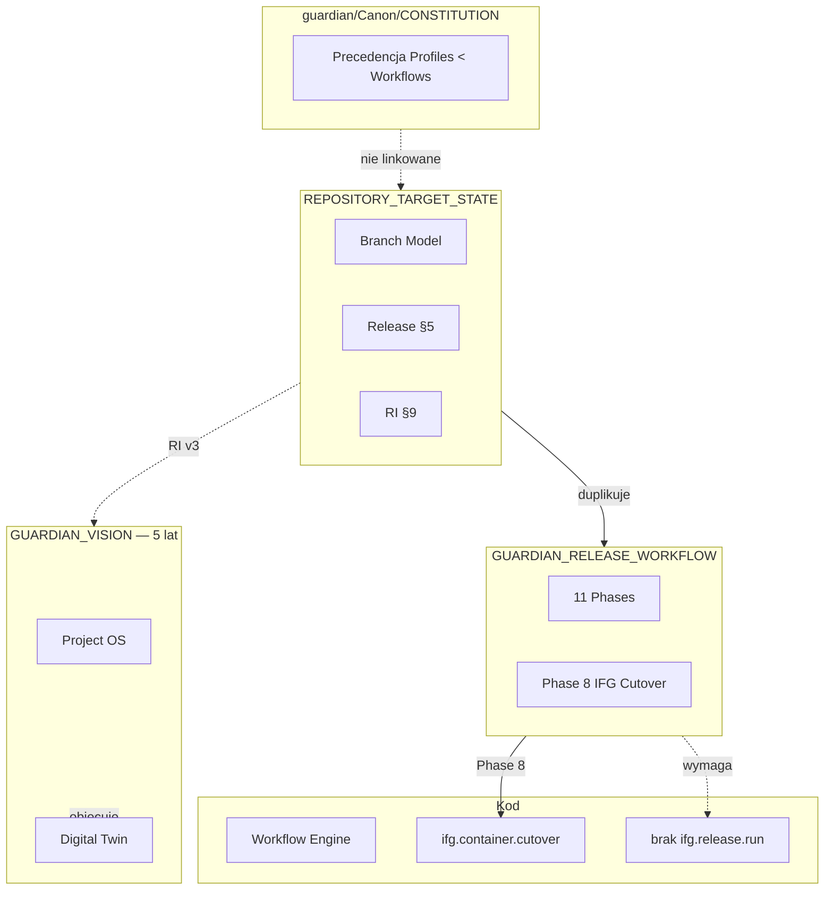
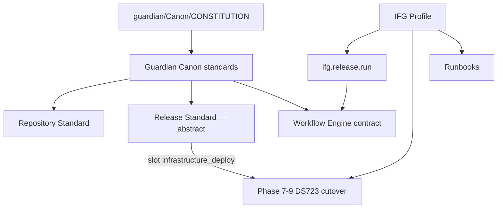
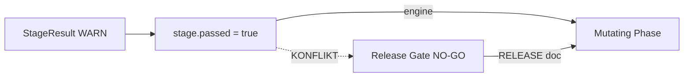

# Guardian Architecture Review v1

**Data:** 2026-07-06  
**Typ:** Krytyczny przegląd przed implementacją Guardian v1  
**Zakres:** `GUARDIAN_VISION.md`, `REPOSITORY_TARGET_STATE.md`, `GUARDIAN_RELEASE_WORKFLOW.md` + raporty projektowe + stan kodu + `guardian/Canon/CONSTITUTION.md`  
**Metoda:** Analiza jako **jeden system** — celowo próba złamania spójności, nie jej potwierdzenia  
**Zakaz wykonania:** brak zmian w kodzie, brak nowych dokumentów kanonicznych, brak implementacji

---

## Werdykt końcowy (Etap 10)

# YELLOW

Architektura ma sens jako **kierunek**, ale **nie jest gotowa do zamrożenia** w obecnej formie dokumentów. Można rozpocząć implementację **wyłącznie węższego pilota** (np. `ifg.release.run` dla GWO-IFG-002A jako **Project Profile**, nie jako freeze całego Canonu) po rozstrzygnięciu 6 blokerów z §9.3.

| Odpowiedź | Uzasadnienie |
|-----------|--------------|
| **Nie GREEN** | Hierarchia sprzeczna wewnętrznie i względem `guardian/Canon/`; Canon/Profile rozmyty; Release Workflow IFG-specific w kanonie projektu; engine nie obsługuje Git phases ani semantyki Gate z dokumentu Release |
| **Nie RED** | Workflow Engine, Safety Gate, branch model, Profile plugin — fundament użyteczny; pierwszy release IFG da się przeprowadzić po korekcie **kontraktu**, nie przepisaniu wizji |

---

## Etap 1 — Czy dokumenty tworzą jedną architekturę?

### Werdykt: **NIE w sensie operacyjnym — trzy narracje na wspólnym słowniku**

| Dokument | Horyzont | Tożsamość Guardiana w praktyce |
|----------|----------|-------------------------------|
| GUARDIAN_VISION | 5 lat | Project Operating System, Twin, KG, Reasoning |
| REPOSITORY_TARGET_STATE | v1–v3 | Administrator repo + deploy + RI |
| GUARDIAN_RELEASE_WORKFLOW | Pierwszy release (dni) | 11 faz od dirty tree do cutover |

Dokumenty **nie są zgodne jako jeden system**. Dzielą terminologię (Safety Gate, Profile, release), ale **konkurują o definicję „release"** i **deklarują sprzeczną hierarchię**.

### Sprzeczności hierarchii (konkretne)

| Źródło A | Mówi | Źródło B | Mówi | Konflikt |
|----------|------|----------|------|----------|
| VISION §14 | `REPOSITORY_TARGET_STATE` **podrzędny** wobec VISION | RELEASE WORKFLOW nagłówek | RELEASE **nad** REPOSITORY_TARGET_STATE | **Cykl precedencji** |
| VISION §14 | VISION nadrzędny nad dokumentami w projekcie | VISION §14 | `guardian/Canon/VISION.md` **równorzędny** (sync) | Dwa korzenie bez reguły sync |
| REPOSITORY §5 | Pełny proces release (12 kroków) | RELEASE WORKFLOW | 11 faz + Gates | **Dwa procesy release w „kanonie" projektu** |
| `guardian/Canon/CONSTITUTION.md` | Precedencja: Constitution → Canon → ADR → Architecture → **Profiles** → Workflows | Trzy dokumenty IFG | Oznaczone CANONICAL w `ifg_standalone/docs/guardian/core/` z treścią Profile/IFG | **Trzeci system precedencji** — IFG docs nie wskazują na Constitution |

### Duplikacja odpowiedzialności

| Odpowiedzialność | VISION | REPOSITORY | RELEASE |
|------------------|--------|------------|---------|
| Model branchy | roadmap | §3 pełny | §8 gitGraph |
| Safety Gate | §7, §12 | §5, §8 | §5 wszystkie Gates |
| Release readiness | Project Intelligence | §5.2 checklist | Phase 4 |
| Repository hygiene | RI | §6 | Phase 0–3 |
| Cutover | przykład Twin | deploy mention | Phase 8 |
| Rollback | granice | §4.4 | per-phase |

**Brakuje jednego właściciela konceptu „release".** REPOSITORY i RELEASE **konkurują** zamiast dzielić: standard vs procedura.

### Czy powielają odpowiedzialności?

**Tak** — release, branch promotion, Safety Gate, repo health opisane trzykrotnie z różnymi szczegółami. Operator nie wie, który dokument jest wiążący przy konflikcie (np. REPOSITORY wymaga `release/*` przed production; praktyka prep cutover poszła bezpośrednio na `production` — patrz §Dowód praktyki).

---

## Etap 2 — Analiza warstw

### Proponowany stos vs rzeczywistość

```
Propozycja:
  Vision → Repository Target State → Release Workflow → Workflow Engine → Project Profile
```

### Ocena warstw

| Warstwa | Właściwa? | Problem |
|---------|-----------|---------|
| Vision | ✅ jako north star | Za wysoko na v1 — implementatorzy będą budować pod Twin/KG, których nie ma |
| Repository Target State | ⚠️ | Za szeroka na „standard repo" — zawiera release process, RI spec, taksonomię docs co do folderu |
| Release Workflow | ✅ jako pierwszy test praktyczny | **Za IFG-specific jak na Canon**; wymaga warstwy nad engine, której nie ma |
| Workflow Engine | ✅ fundament frozen | Nie obsługuje Git phases ani Release Orchestrator |
| Project Profile | ✅ | Dziś przepełniony tym, co powinno być w Canon abstrakcyjnym |

### Brakujące warstwy

| Brak | Dlaczego boli za 2 lata |
|------|-------------------------|
| **Release Orchestrator** (meta-process nad `WorkflowDefinition`) | 11 faz, manifest, resume — to nie jest pojedynczy workflow engine |
| **v1 Scope Boundary** | VISION v5 vs implementacja v1 — brak twardej granicy → scope creep |
| **Canon sync / precedencja w projekcie** | `guardian/Canon/CONSTITUTION.md` już ma hierarchię; IFG docs jej nie używają |
| **Execution Backend contract** (zunifikowany) | VISION + DEPLOYMENT_BACKEND_ARCHITECTURE vs cutover stages z bezpośrednim SSH |

### Zbędne / do scalenia

| Element | Rekomendacja |
|---------|--------------|
| REPOSITORY §5 Release Management | Przenieść do RELEASE lub jawnie: „REPOSITORY = standard, RELEASE = procedura" |
| REPOSITORY §9 Repository Intelligence | Roadmap (VISION v3), nie standard repo v1 |
| VISION §5–§6 Twin + KG w kanonie v1 | Oznaczyć **non-v1** |

### Poprawiony stos (przed freeze)

```
guardian/Canon/CONSTITUTION (precedencja — już istnieje)
    ↓
Vision (5y, non-binding for v1)
    ↓
├── Repository Standard (branch, commit, docs, health — cienki)
├── Release Workflow Standard (fazy abstrakcyjne, gates, manifest)
└── Workflow Engine + Safety Gate + Execution contract (Core frozen)
    ↓
Project Release Profile (IFG: cutover, DS723, runbooki, checklisty)
    ↓
Application Repo (IFG)
```

---

## Etap 3 — Zależności i szczegółowość

### Który dokument „wie za dużo"?

| Dokument | Ocena | Przykłady |
|----------|-------|-----------|
| GUARDIAN_VISION | Za dużo na v1, OK na 5 lat | Twin, KG, `guardian project onboard`, AI w Reasoning |
| REPOSITORY_TARGET_STATE | Za szczegółowy i pseudo-universal | Drzewo `docs/` co do folderu; „76 commitów za main"; mock output RI |
| GUARDIAN_RELEASE_WORKFLOW | Za szczegółowy i IFG-specific w złym miejscu | `release/2026-07-06-container-manager-cutover`, DS723, Phase 8 CM, konkretne batche commitów |

### Zależność od IFG

| Fragment | Plik | Problem |
|----------|------|---------|
| `production` = DS723+ deploy | REPOSITORY §3 | PSAG może mieć inny model remote |
| Scope `ksef`, `warehouse`, `invoice` | REPOSITORY §4, §10 | Profile, nie Canon |
| `ifg.release.run`, `ifg cutover` | RELEASE §1 | Workflow ID w dokumencie kanonicznym projektu |
| Phase 7 „DS723+" | RELEASE | Hostname w standardzie |
| Phase 8 Container Manager | RELEASE | Synology-specific w Canonie |
| `docs/guardian/` w IFG repo | wszystkie | Canon fizycznie w projekcie aplikacji |

### Łamanie Canon/Profile

| Naruszenie | Gdzie |
|------------|-------|
| Dokumenty CANONICAL w `ifg_standalone` zamiast `guardian/Canon/` | Wszystkie trzy |
| `REPOSITORY_TARGET_STATE` w Canon (VISION §10) ale z IFG classifiers i historią branchy | REPOSITORY §9, §3.1 |
| `ifg.release.run` jako canonical workflow ID | RELEASE §1 |
| RELEASE Phase 2–3: konkretne commity (Preflight, Cutover) | Profile release content, nie Canon |
| CONSTITUTION: Profiles (6) < Workflows (7); IFG docs traktują RELEASE jako Canon nad Profile | Konflikt z platformą |

---

## Etap 4 — Release Workflow: uniwersalny czy IFG-specific?

### Werdykt: **szkielet uniwersalny, treść ~40% IFG-specific w złym miejscu**

| Warstwa | Uniwersalność |
|---------|---------------|
| 11 faz + Gates + manifest + resume | ✅ |
| Phase 0–6 (assessment → promotion) | ✅ z adaptacją |
| Phase 7 Remote Sync | ⚠️ koncept uniwersalny, implementacja Profile |
| Phase 8 Container Cutover | ❌ czysto IFG Profile |
| Phase 9 Functional (KSeF/UI) | ❌ Profile |
| CLI `ifg release run` | ❌ powinno być `guardian release run --profile ifg` lub rejestracja w Profile |

### Co przenieść do Project Release Profile (IFG)

| Fragment RELEASE WORKFLOW | Docelowa lokalizacja |
|---------------------------|---------------------|
| Phase 7: DS723+, ścieżka repo, `git pull` | `profiles/ifg/release/remote_sync.md` |
| Phase 8: cała faza + `ifg.container.cutover` | `profiles/ifg/release/infrastructure_cutover.md` |
| Phase 9: checklist KSeF/UI | `profiles/ifg/release/functional_checklist.md` |
| Phase 3 batche A–D (Preflight, Cutover, GWO, housekeeping) | `profiles/ifg/releases/2026-07-06-container-manager-cutover/manifest.yaml` |
| `release_id` przykłady, §9 Ready Check mapowanie | IFG GWO doc |
| Workflow ID `ifg.release.run` | OK w **Profile**, nie w Canon projektu |

### Co zostaje w Canon Release Workflow (abstrakcyjny)

- Model faz 0–6 i 10 (ogólny)
- Safety Gate semantics (GO/NO-GO; patrz konflikt WARN w §5)
- `ReleaseManifest` schema `guardian_release_v1`
- Resume/abort semantics
- Raport lifecycle (runtime vs promoted)
- **Abstrakcyjna** faza `infrastructure_deploy` ze slotem na workflow Profile

```
Phase 8 (abstract): infrastructure_deploy
  profile_workflow: <profile-defined>   # IFG: ifg.container.cutover
  gate_criteria: <profile-defined>
```

---

## Etap 5 — Workflow Engine vs backends

### Stan kodu (fakty, nie intencje)

| Warstwa | Git? | Docker/SSH? | Container Manager? |
|---------|------|-------------|-------------------|
| `Stage` / `WorkflowEngine` | ❌ abstrakcja | ❌ | ❌ |
| `PreflightEngine` | ✅ checks | ✅ probes | ✅ volume names |
| `container_cutover/stages.py` | remote scripts | ✅ `SSHExecutor` | ✅ compose gate |
| `IntentExecutor` | ✅ git_executor | ✅ compose, ssh | ❌ |
| `DEPLOYMENT_BACKEND_ARCHITECTURE.md` | — | **zakaz** direct import w stages | synology_project target |

`container_cutover/stages.py` importuje `SSHExecutor` i skrypty remote **bezpośrednio** — łamie własną architekturę deployment backend (§2 DEPLOYMENT_BACKEND: „Workflow layers call only the Deployment Engine").

### Stage WARN vs Release Gate NO-GO

```53:54:scripts/ifg_guardian/core/workflow/stage.py
    def passed(self) -> bool:
        return self.status in (StageStatus.PASS, StageStatus.WARN, StageStatus.SKIP)
```

RELEASE WORKFLOW §5: **„Brak soft-pass: WARNING nie uprawnia do przejścia fazy mutating."**  
Engine: WARN = `passed` → mutating stage może iść dalej. **Konflikt nierozstrzygnięty w ADR.**

### Czy Workflow powinien znać backends?

| Podejście | Ocena |
|-----------|-------|
| Stage zna SSH/Docker/Git | ❌ obecny cutover — dług; testowanie i Profile lock-in |
| Process → Step → Action → Backend | ✅ zgodne z VISION i DEPLOYMENT_BACKEND_ARCHITECTURE |

**Docelowy kontrakt (niezaimplementowany w pełni):**

```
Stage.build_plan() → ActionIntent[]
IntentExecutor → ExecutionBackend (compose | synology_project | git | local)
```

### Luka: Git phases w Release

Phase 2–3 (feature isolation, release prep, merge) **nie mapują się** na obecny engine. Wymaga `GitBackend` lub **Guided Manual Stage** (operator wykonuje, Guardian waliduje). Dokument RELEASE zakłada możliwości, których engine **nie ma**. `ifg.release.run` **nie istnieje w kodzie** (0 referencji).

**Bloker przed freeze:** ADR — Stage WARN vs Release Gate; v1 Git phases: **guided** (rekomendacja).

---

## Etap 6 — Canon/Profile — konkretne fragmenty

| Fragment | Obecna klasyfikacja | Powinno być |
|----------|---------------------|-------------|
| `GUARDIAN_VISION.md` | Canon w IFG repo | `guardian/Canon/VISION.md` (sync); w IFG: pointer lub staging |
| `REPOSITORY_TARGET_STATE.md` | Canon universal | Canon: cienki `RELEASE_REPOSITORY_STANDARD`; Profile: layout overrides |
| `GUARDIAN_RELEASE_WORKFLOW.md` | Canon z IFG Phase 8 | Canon: fazy 0–6,10 abstrakcyjne; Profile: 7–9 |
| REPOSITORY §3.1 „76 commitów za main" | Canon | Usunąć — notatka audytu IFG |
| REPOSITORY §9 RI mock | Canon | VISION roadmap only |
| RELEASE `ifg.release.run` | Canon | Profile workflow registration |
| VISION §10 REPOSITORY in Canon | Meta | Split; align z CONSTITUTION § Profiles |

**Najpoważniejszy problem architektoniczny przed freeze:** Canon/Profile **nie jest poprawnie rozdzielony**, a `guardian/Canon/CONSTITUTION.md` już definiuje precedencję, której IFG docs nie respektują.

---

## Etap 7 — Wytrzymałość: 20 projektów, 10 lat

### Pierwsze punkty pęknięcia

| # | Punkt | Kiedy | Dlaczego |
|---|-------|-------|----------|
| 1 | Canon w każdym repo projektu | 3–5 projektów | Drift kopii `docs/guardian/core/` |
| 2 | 11 faz dla hotfixa | 6 mies. | Operator obejdzie Guardiana — Z7 „no bypass" przegra z pragmatyzmem |
| 3 | Dual stack `ifg_guardian` + `guardian_platform` | Już teraz | Żaden z trzech dokumentów kanonicznych nie adresuje konsolidacji |
| 4 | `main` vs `production` | Już teraz | REPOSITORY: sync main←production; brak procesu |
| 5 | Manifest w `.guardian/` bez backup | Crash control plane | Utrata stanu release |
| 6 | Gate fatigue / wielu operatorów | Skala zespołu | Brak modelu lock/release ownership |
| 7 | Twin/KG obiecane w VISION | Rok 2–3 | Hacki zamiast Twin — nowy dług |
| 8 | Phase 8 hardcoded | PSAG onboarding | Skopiują IFG cutover zamiast slotu abstrakcyjnego |

### Co wytrzyma

- Workflow Engine + Transaction model
- Safety Gate jako koncept (po ADR WARN)
- feature → release → production (branch model)
- `.guardian/workflows/` audit trail
- Profile plugin + `.guardian.yml`

---

## Etap 8 — Największe nieodwracalne błędy architektoniczne

| # | Decyzja | Dlaczego praktycznie nieodwracalna | Status |
|---|---------|-------------------------------------|--------|
| **A1** | Zamrożenie Canon w `ifg_standalone/docs/guardian/core/` | N kopii; PSAG dziedziczy IFG Phase 8 | **Przemyśleć TERAZ** |
| **A2** | `ifg.release.run` jako canonical ID w dokumencie „kanonicznym" | Każdy projekt: wyjątek lub rename | **Przemyśleć TERAZ** |
| **A3** | WARN=pass w Stage bez ADR | Release Gates będą kłamać lub Core wymaga zmiany (freeze broken) | **ADR przed Release impl** |
| **A4** | Jeden monolit 11 faz bez `release_type` | Hotfix/patch: pełny cyrk lub bypass | **Dodać: full \| infra \| hotfix** |
| **A5** | Brak `v1 SCOPE` przy VISION v5 | Implementatorzy budują Twin zamiast Release | **Przed kodem** |
| **A6** | Git phases w Release bez GitBackend | Forever guided-manual albo big-bang automation | **Wybrać v1: guided** |

### Warte przemyślenia (bolesne, nie krytyczne)

- Czy REPOSITORY i RELEASE to dwa dokumenty, czy jeden standard + annex
- Czy `docs/guardian/core/` w IFG to staging przed promocją do `guardian/Canon/`
- Czy pierwszy release IFG **waliduje** proces (pilot), czy **stanowi normę** Canonu

---

## Etap 9 — Czy czegoś fundamentalnie brakuje?

### Werdykt: **TAK — architektura nie jest kompletna**

Brakuje **fundamentalnych idei**, nie modułów:

| # | Brakująca idea | Opis |
|---|----------------|------|
| **F1** | **Precedencja w projekcie** | `guardian/Canon/CONSTITUTION.md` już ma hierarchię — IFG trio jej nie używa ani nie linkuje |
| **F2** | **v1 Scope Boundary** | Co w zamrożeniu implementacji vs north star |
| **F3** | **Release Types** | Full / infrastructure-only / hotfix |
| **F4** | **Multi-operator model** | Lock release, resume cudzego release, kto daje GO |
| **F5** | **Canon sync mechanism** | Jak `guardian/Canon/` i `ifg_standalone/docs/guardian/core/` pozostają spójne |
| **F6** | **Abstract deployment slot** | Profile wypełnia Phase 8 — nie cutover w Canonie |
| **F7** | **Guided vs Automated boundary** | Szczególnie Git — co Guardian robi, co tylko waliduje |
| **F8** | **Dual stack exit** | `ifg_guardian` vs `guardian_platform` — który jest przyszłością |

**Nie brakuje:** kolejnego workflow, kolejnej warstwy Intelligence na v1, kolejnego dokumentu wizji.

**Architektura nie jest kompletna** — ale fundament (engine + gate + profile) jest wystarczający do **pilota**, nie do **freeze**.

---

## Etap 9.3 — 6 blokerów przed GREEN

| # | Bloker | Akcja (dokumentacja, nie kod) |
|---|--------|-------------------------------|
| B1 | Hierarchia VISION / REPOSITORY / RELEASE cykliczna; ignoruje CONSTITUTION | Jedna sekcja precedencji linkująca do `guardian/Canon/CONSTITUTION.md` |
| B2 | Dwa procesy release (REPOSITORY §5 vs RELEASE) | REPOSITORY §5 → „patrz RELEASE STANDARD" |
| B3 | Canon w IFG z treścią Profile | Split: Canon cienki + IFG Release Profile annex |
| B4 | `ifg.release.run` w Canonie projektu | Canon: framework; Profile: `ifg.release.run` |
| B5 | Stage WARN vs Gate NO-GO | ADR + explicit: Release używa Gate, nie `stage.passed` |
| B6 | Brak v1 Scope Boundary | `GUARDIAN_V1_SCOPE` (1 strona) — co implementujemy |

### Co można implementować bez pełnego freeze

| Zakres | Bezpieczny start |
|--------|------------------|
| `ifg.release.run` pilot GWO-IFG-002A | ✅ po B3–B6 jako **Profile pilot** |
| Phase 0–4 guided | ✅ |
| Manifest + resume | ✅ |
| Phase 8 delegacja do `ifg.container.cutover` | ✅ (już istnieje) |
| Repository Intelligence | ❌ nie v1 |
| Digital Twin | ❌ nie v1 |
| Pełna reorganizacja `docs/` | ❌ nie blokuje pilota |

---

## Dowód praktyki (2026-07-06) — architektura vs zachowanie

Prep cutover v1 został wykonany **bez** `ifg.release.run`, **bez** brancha `release/*`, **bezpośrednio na `production`** (commity: preflight, cutover, docs, housekeeping). To nie jest wada operacyjna — to **dowód**:

1. Dokumentowany Release Workflow jest **zbyt ciężki** na pierwszy pilotaż lub **niespójny** z REPOSITORY (który wymaga `release/*`).
2. Operator naturalnie wybiera **ścieżkę najkrótszą** — Z7 „no silent bypass" przegra, jeśli formalny proces nie daje wartości proporcjonalnej do kosztu.
3. `ifg.release.run` w kanonie opisuje coś, **czego nie ma w kodzie** — podczas gdy `ifg.container.cutover` już działa (dry-run OK).

To wzmacnia YELLOW: implementacja powinna **dogonić pilot**, nie zamrażać dokumentów „as-is".

---

## Diagramy

### D.1 — Napięcie architektoniczne



### D.2 — Docelowy Canon / Profile



### D.3 — WARN vs Gate



---

## Podsumowanie dla operatora

### Top 5 problemów

1. **Trzy systemy precedencji** — VISION/REPOSITORY/RELEASE vs `guardian/Canon/CONSTITUTION.md`.
2. **Canon/Profile rozmyty** — IFG-specific w dokumentach CANONICAL w repo IFG.
3. **Dwa definicje release** w REPOSITORY i RELEASE.
4. **Engine ≠ Release doc** — brak Git phases, WARN≠NO-GO, `ifg.release.run` nie istnieje.
5. **VISION v5 vs v1** — brak scope boundary → scope creep przy kodowaniu.

### Czy zamrozić architekturę Guardian v1?

# YELLOW

| | |
|---|---|
| **Można** | Pilot `ifg.release.run` / guided release dla GWO-IFG-002A jako **Profile**, nie freeze całego Canonu |
| **Nie można** | Zamrozić trzy dokumenty kanoniczne w IFG „as-is" bez B1–B6 |
| **Nie można** | GREEN dopóki Phase 8 hardcoded i `ifg.release.run` w Canonie projektu |

### Rekomendowane kroki (tylko dokumentacja, przed freeze)

1. `GUARDIAN_V1_SCOPE` — co wchodzi w v1 freeze.
2. Link precedencji do `guardian/Canon/CONSTITUTION.md` (nie duplikować).
3. Split RELEASE: Canon abstrakcyjny + `profiles/ifg/` annex (Phase 7–9, batche).
4. ADR: Stage WARN vs Release Gate; guided Git w v1.
5. Dopiero potem — **freeze architektury v1** i start implementacji `ifg.release.run`.

---

## Utworzone / zaktualizowane pliki

| Plik | Akcja |
|------|-------|
| `docs/reports/2026-07-06_GUARDIAN_ARCHITECTURE_REVIEW_V1.md` | **Utworzony / zaktualizowany** (niniejszy raport) |

**Nie utworzono** nowych dokumentów kanonicznych. **Nie zmieniono** istniejących dokumentów kanonicznych ani kodu.

---

*Przegląd krytyczny. Celowo nie udowadniano, że architektura jest dobra.*
