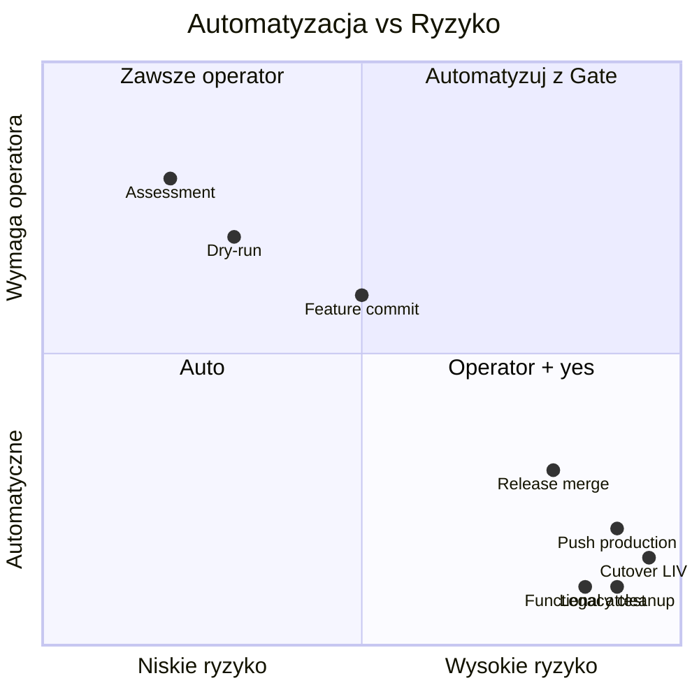
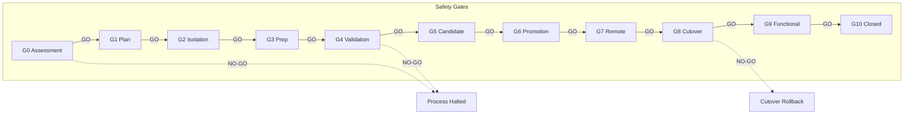
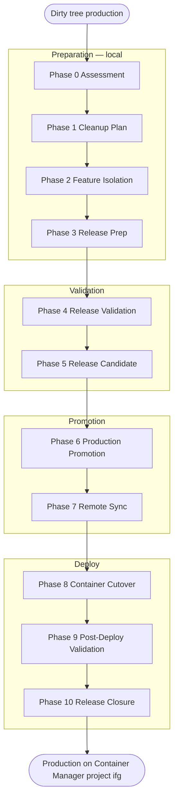
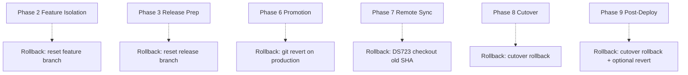
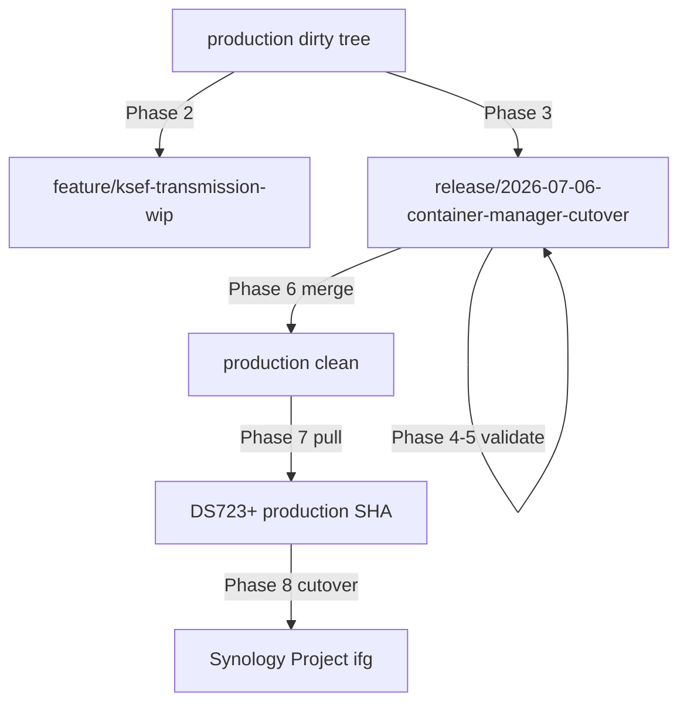
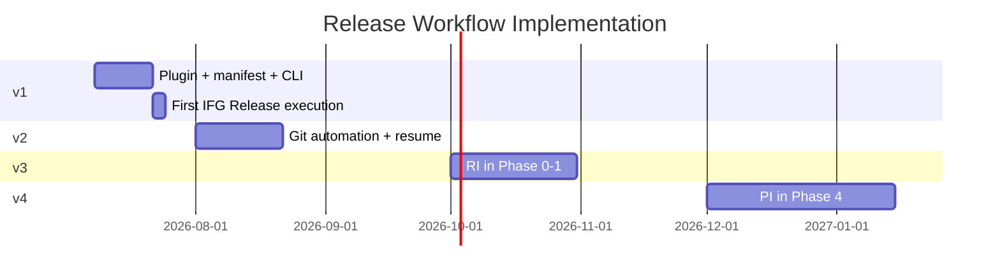

# Guardian Release Workflow — Design Report

**Data:** 2026-07-06  
**Status:** DESIGN (nie wdrożono)  
**Dokument kanoniczny:** [GUARDIAN_RELEASE_WORKFLOW.md](../guardian/core/GUARDIAN_RELEASE_WORKFLOW.md)  
**Kontekst:** pierwszy praktyczny test filozofii Guardiana — od dirty tree do gotowości cutover Container Manager  
**Ready Check:** [2026-07-06_IFG_CONTAINER_CUTOVER_READY_CHECK.md](./2026-07-06_IFG_CONTAINER_CUTOVER_READY_CHECK.md) → **NO-GO** (stan repo, nie technika)

---

## Spis treści

1. [Executive Summary](#1-executive-summary)  
2. [Etap 1 — Analiza Ready Check według procesu](#2-etap-1--analiza-ready-check-według-procesu)  
3. [Etap 2 — Projekt Release Workflow](#3-etap-2--projekt-release-workflow)  
4. [Etap 3 — Szczegóły faz](#4-etap-3--szczegóły-faz)  
5. [Etap 4 — Automatyczne vs operator](#5-etap-4--automatyczne-vs-operator)  
6. [Etap 5 — Safety Gates](#6-etap-5--safety-gates)  
7. [Etap 6 — Wznowienie procesu](#7-etap-6--wznowienie-procesu)  
8. [Etap 7 — Checkpoint i audyt](#8-etap-7--checkpoint-i-audyt)  
9. [Etap 8 — Struktura raportów](#9-etap-8--struktura-raportów)  
10. [Etap 9 — Workflow Engine](#10-etap-9--workflow-engine)  
11. [Etap 10 — Porównanie obecny vs proponowany](#11-etap-10--porównanie)  
12. [Etap 11 — Diagramy](#12-etap-11--diagramy)  
13. [Etap 12 — Roadmapa implementacji](#13-etap-12--roadmapa-implementacji)  
14. [Ryzyka i decyzje](#14-ryzyka-i-decyzje)  
15. [Wpływ na IFG, PSAG, Guardiana](#15-wpływ)

---

## 1. Executive Summary

Dotychczasowy IFG Container Manager cutover był projektowany jako **pojedynczy workflow** (`ifg.container.cutover`). Ready Check wykazał, że **NO-GO nie wynika z braku cutover** — wynika z **braku procesu Release** prowadzącego repo od dirty tree do stanu deployowalnego.

**Propozycja:** Guardian Release Workflow (`ifg.release.run`) — **11 faz** od Assessment do Closure, z **11 Safety Gates**, checkpointami, resume i orkiestracją istniejących workflow (doctor, release plan, cutover).

To jest **pierwszy praktyczny test filozofii Guardiana** z [GUARDIAN_VISION.md](../guardian/core/GUARDIAN_VISION.md): nie deploy tool, lecz **proces prowadzący projekt**.

**Nie implementujemy teraz.** Po zatwierdzeniu tego dokumentu — implementacja v1 i pierwszy rzeczywisty Release IFG.

---

## 2. Etap 1 — Analiza Ready Check według procesu

### 2.1 Od bloków technicznych do etapów procesowych

Ready Check identyfikuje **blokery B1–B7**. Poniżej mapowanie na **działania procesowe** (nie commity):

| Bloker RC | Problem procesowy | Faza Release | Działanie procesowe |
|-----------|-------------------|--------------|---------------------|
| B1 | Repo nie jest audytowalne operacyjnie | 0, 1, 3 | Assessment → Plan → Preparation |
| B2 | Brak cutover w źródle prawdy (HEAD) | 3 | Release Preparation — włączenie cutover stack |
| B3 | Brak Preflight w HEAD | 3 | Release Preparation — włączenie preflight |
| B4 | Brak synchronizacji z produkcją | 6, 7 | Promotion → Remote Sync |
| B5 | Mieszanie torów (WIP + cutover) | 1, 2 | Cleanup Plan → Feature Isolation |
| B6 | Szum (CRLF, dist) | 1, 3 | Plan housekeeping → untrack dist |
| B7 | Runtime w statusie | 1, 3 | Plan gitignore `.guardian/` |

### 2.2 Grupy zmian według procesu (nie commitów)

| Grupa procesowa | Pliki (~) | Destynacja procesowa | Faza |
|-----------------|-----------|----------------------|------|
| **G-CUTOVER** | ~25 | Release branch → production | 3 |
| **G-WIP-KSEF** | 1–2 | Feature branch | 2 |
| **G-NOISE-CRLF** | 9 | Poza release (opcjonalny chore) | 1 |
| **G-NOISE-DIST** | 10 tracked | Housekeeping untrack | 3 |
| **G-G003-EXEC** | ~15 | Poza tym release | 1 (defer) |
| **G-DOCS-DOMAIN** | ~25 | Poza tym release | 1 (defer) |
| **G-DOCS-VISION** | ~5 | Poza tym release | 1 (defer) |
| **G-RUNTIME** | ~287 | Ignore | 1, 3 |
| **G-SECRETS** | 1 | Never commit | 0 (flag) |
| **G-ALREADY-HEAD** | compose prep | Już na production | — |

### 2.3 Werdykt procesowy

```
Stan obecny:  Phase -1 (pre-release chaos)
Cel:          Phase 10 (release closed) + production na Container Manager
Blokada:      Brak procesu — operator musiałby „wiedzieć" kolejność
Rozwiązanie:  Guardian Release Workflow od Phase 0
```

---

## 3. Etap 2 — Projekt Release Workflow

### 3.1 Dlaczego 11 faz (nie 10 z zadania)

Dodano wyraźne rozdzielenie:

- **Phase 7 Remote Sync** — DS723+ to osobny aktor; wymaga własnego Gate przed cutover
- **Phase 5 Release Candidate** — zamrożenie SHA przed merge (zapobiega „drift" między validation a promotion)

### 3.2 Alternatywy rozważane

| Model | Opis | Werdykt |
|-------|------|---------|
| **A. Cutover-only** | Tylko `ifg cutover run` | ❌ Ready Check NO-GO — nie rozwiązuje repo |
| **B. Commit script** | Lista `git add` | ❌ Nie jest procesem; nie testuje filozofii |
| **C. Release = jeden merge** | release branch bez faz | ❌ Brak izolacji WIP, brak resume |
| **D. 11 faz + Gates** | Pełny Release Workflow | ✅ |
| **E. CI/CD pipeline** | GitHub Actions | ❌ Poza Guardian; nie prowadzi operatora |

### 3.3 Identyfikator pierwszego release IFG

```
release_id: 2026-07-06-container-manager-cutover
release_branch: release/2026-07-06-container-manager-cutover
feature_branch: feature/ksef-transmission-wip
tag: v6.7.0-container-manager-cutover
```

---

## 4. Etap 3 — Szczegóły faz

Pełna specyfikacja: [GUARDIAN_RELEASE_WORKFLOW.md §3](../guardian/core/GUARDIAN_RELEASE_WORKFLOW.md).

### 4.1 Macierz faz (skrót)

| Phase | ID | Mutating | Gate | Rollback point |
|-------|-----|----------|------|----------------|
| 0 | assessment | ❌ | G0 | — |
| 1 | cleanup_plan | ❌ | G1 | — |
| 2 | feature_isolation | ✅ Git | G2 | feature branch |
| 3 | release_prep | ✅ Git | G3 | release branch reset |
| 4 | release_validation | ❌ | G4 | — |
| 5 | release_candidate | ❌ | G5 | — |
| 6 | production_promotion | ✅ Git | G6 | git revert |
| 7 | remote_sync | ✅ SSH | G7 | DS723 checkout old SHA |
| 8 | container_cutover | ✅ SSH | G8 | cutover rollback |
| 9 | post_deploy_validation | ❌ | G9 | cutover rollback |
| 10 | release_closure | ⚠️ | G10 | brak auto-cleanup |

### 4.2 Phase 3 — grupy procesowe (IFG pierwszy release)

Zamiast „commit 1, commit 2" — **batch procesowy**:

| Batch | Grupa | Walidacja po batch |
|-------|-------|-------------------|
| 3A | Guardian Safety (Preflight) | `pytest test_guardian_preflight` |
| 3B | Guardian Cutover (workflow + CLI) | `pytest test_guardian_container_cutover` |
| 3C | Operational Docs (runbook + GWO) | Pliki istnieją, linki OK |
| 3D | Repo Housekeeping (gitignore, dist) | `git status` bez dist M |

Każdy batch = checkpoint w `checkpoints.json`.

---

## 5. Etap 4 — Automatyczne vs operator

### 5.1 Macierz decyzyjna



### 5.2 Zasady

| Zasada | Opis |
|--------|------|
| **Read = auto** | Assessment, validation, dry-run — bez `--yes` |
| **Write = gate + yes** | Git mutating, SSH mutating — `--yes` |
| **Production = double** | Gate GO + `--yes` + (dla cutover) runbook APPROVED |
| **Attestation = human** | Functional checklist — nie da się zautomatyzować UI/KSeF |
| **AI = propose only** | Przyszłość: propozycje w Phase 0–1, nie decyzje |

---

## 6. Etap 5 — Safety Gates

### 6.1 Implementacja Gate (projekt)

```python
# Pseudokod — nie implementacja
class ReleaseGate:
    phase: int
    result: Literal["GO", "NO_GO", "PENDING"]
    criteria: list[GateCriterion]
    operator_override: bool = False  # ZAWSZE False dla mutating

def advance_release(manifest: ReleaseManifest) -> None:
    if manifest.last_gate_result != "GO":
        raise ReleaseBlockedError("Cannot advance past NO-GO gate")
    if next_phase_is_mutating and not manifest.operator_yes:
        raise ReleaseBlockedError("Mutating phase requires --yes")
```

### 6.2 Diagram Safety Gates



### 6.3 NO-GO — co dalej

| Gate | Akcja po NO-GO |
|------|----------------|
| G0–G1 | Popraw klasyfikację / plan; `release resume --from-phase 0` |
| G2–G3 | Napraw repo; resume od fazy |
| G4 | Napraw testy/doctor; nie promuj |
| G6–G7 | Nie cutover; napraw push/sync |
| G8 | `cutover rollback`; production może być OK na starych kontenerach |
| G9 | Nie cleanup legacy; investigate |

**Brak „skip gate"** — jedyna droga to naprawa lub `release abort`.

---

## 7. Etap 6 — Wznowienie procesu

### 7.1 Stan obecny Workflow Engine

| Capability | Stan | Wystarcza na Release? |
|------------|------|----------------------|
| `WorkflowTransaction` per run | ✅ | Częściowo — jeden workflow |
| `.guardian/workflows/<ts>_<id>/` | ✅ | Per sub-workflow |
| Resume workflow | ❌ | Brak |
| Multi-workflow orchestration | ❌ | Brak |
| Release manifest | ❌ | Brak |
| Phase gates | ⚠️ | Safety Gate w cutover only |

### 7.2 Projekt mechanizmu Resume

**Release Manifest** (nowy artefakt, poza pojedynczym workflow):

```
.guardian/releases/2026-07-06-container-manager-cutover/
  manifest.json
  checkpoints.json
  phase_00_assessment.md
  ...
```

**`checkpoints.json`:**

```json
{
  "phases": {
    "2": {"gate": "GO", "feature_branch": "feature/ksef-transmission-wip", "sha": "def456"},
    "3": {"gate": "GO", "release_branch": "release/2026-07-06-container-manager-cutover", "shas": ["aaa", "bbb", "ccc", "ddd"]},
    "6": {"gate": "GO", "production_sha": "fff999", "tag": "v6.7.0-container-manager-cutover"},
    "7": {"gate": "GO", "remote_sha": "fff999"},
    "8": {"gate": "GO", "cutover_transaction": "2026-07-06T22:00:00Z_ifg_container_cutover"}
  }
}
```

**Resume logic:**

1. Wczytaj `manifest.json` → `current_phase`, `last_gate`
2. Jeśli `last_gate != GO` → wznów **tę samą** fazę
3. Jeśli `last_gate == GO` → start `current_phase + 1`
4. Phase 8 resume → wczytaj `cutover_transaction` z `.guardian/workflows/`

### 7.3 Scenariusze resume (IFG)

| Przerwanie | Resume |
|------------|--------|
| Po batch 3B (cutover committed) | `--from-phase 3` od 3C |
| Po merge production, przed push | Phase 6 — retry push |
| Po cutover_up, health FAIL | Phase 8 rollback; NO-GO G8 |
| Operator Ctrl+C w Phase 4 | `release status` → resume Phase 4 |

---

## 8. Etap 7 — Checkpoint i audyt

### 8.1 Co zapisywać po każdej fazie

| Pole | Źródło |
|------|--------|
| `phase_id` | 0–10 |
| `gate_result` | GO/NO-GO |
| `started_at`, `ended_at` | UTC |
| `operator` | env USER |
| `branch` | git branch |
| `sha` | git rev-parse HEAD |
| `artifacts[]` | ścieżki raportów |
| `sub_workflow_transaction` | jeśli delegacja (cutover) |

### 8.2 Audyt trail

```
Release 2026-07-06-container-manager-cutover
  Phase 0 → assessment.md → G0 GO
  Phase 1 → cleanup_plan.md → G1 GO (operator accepted)
  Phase 2 → feature_isolation.md → G2 GO (sha def456)
  Phase 3 → release_prep.md → G3 GO (4 batches)
  Phase 4 → validation.md → G4 GO (dry-run SUCCESS)
  Phase 5 → candidate.md → G5 GO (tag approved)
  Phase 6 → promotion.md → G6 GO (sha fff999)
  Phase 7 → remote_sync.md → G7 GO
  Phase 8 → cutover.md → G8 GO
  Phase 9 → functional.md → G9 GO
  Phase 10 → closed.md → RELEASE CLOSED
```

---

## 9. Etap 8 — Struktura raportów

| Raport | Lokalizacja | Tymczasowy | Promocja |
|--------|-------------|------------|----------|
| Phase 0–1 assessment/plan | `.guardian/releases/<id>/` | ✅ | → archive po Phase 10 |
| Phase 2–3 isolation/prep | `.guardian/releases/<id>/` | ✅ | snapshot w closed report |
| Phase 4 validation | `docs/reports/operational/` | ⚠️ | 12m → archive |
| Phase 5 candidate | `.guardian/releases/<id>/` | ✅ | tag + notes → migrations/ |
| Phase 6 promotion | `docs/reports/operational/` | ❌ | permanent |
| Phase 7 remote sync | `.guardian/releases/<id>/` | ✅ | snapshot w closed |
| Phase 8 cutover | `docs/guardian/IFG_CONTAINER_CUTOVER_*.md` | ⚠️ | → migrations/ |
| Phase 9 functional | `.guardian/releases/<id>/` | ✅ | checklist summary → migrations/ |
| Phase 10 closed | `docs/reports/migrations/GWO_*_RELEASE_CLOSED.md` | ❌ | **kanoniczna historia** |
| Sub-workflow transactions | `.guardian/workflows/` | ✅ (30d) | nie commitować |

### 9.1 Reguła promocji

> Raport staje się dokumentacją projektu **dopiero po Phase 10** (lub po explicit operator promote w Phase 4/6).

---

## 10. Etap 9 — Workflow Engine

### 10.1 Wymagane zmiany (projekt, nie implementacja)

| # | Zmiana | Priorytet | Opis |
|---|--------|-----------|------|
| E1 | **Release Orchestrator** | v1 | Meta-workflow nad fazami 0–10 |
| E2 | **ReleaseManifest** model | v1 | `guardian_release_v1` schema |
| E3 | **PhaseStage** abstraction | v1 | Faza = grupa stages + gate |
| E4 | **Resume command** | v1 | Wczytanie manifest, kontynuacja |
| E5 | **Hard gate** po fazie | v1 | NO-GO blokuje CLI exit 1 |
| E6 | **Git guidance stages** | v1 | Propozycje commitów bez auto-commit (operator `--yes` per batch) |
| E7 | **Sub-workflow delegation** | v1 | Phase 8 → `ifg.container.cutover` |
| E8 | **Cross-workflow checkpoint** | v2 | Link release manifest ↔ cutover transaction |
| E9 | **Repository Intelligence w Phase 0** | v3 | Auto-klasyfikacja grup |
| E10 | **Project Intelligence w Phase 4** | v4 | Holistyczny readiness |

### 10.2 Co NIE wymaga zmiany Core v1

- Workflow Engine stages/transactions — **reużycie**
- Preflight + Safety Gate — **reużycie** w Phase 4 i 8
- `ifg.container.cutover` — **delegacja**, nie przepisanie
- Execution backends — bez zmian

### 10.3 Nowy plugin (projekt)

```
scripts/ifg_guardian/plugins/ifg/release_run/
  models.py          # ReleaseManifest, ReleasePhaseState
  stages.py          # Phase0Stage ... Phase10Stage
  gates.py           # ReleaseGate evaluation
  workflow.py        # ifg.release.run
  service.py         # resume, status, abort
  report.py          # phase reports
```

CLI: `ifg release run|status|resume|abort`

---

## 11. Etap 10 — Porównanie

### 11.1 Obecny sposób (de facto)

```
Operator czyta raporty → ręcznie git add/commit → push → ifg cutover run --yes
```

| Aspekt | Ocena |
|--------|-------|
| Szybkość | Szybki jeśli operator wie co robić |
| Bezpieczeństwo | Niskie — dirty tree, brak gates między krokami |
| Audyt | Fragmentaryczny |
| Resume | Niemożliwy |
| Onboarding | Wymaga eksperta |
| Test filozofii | ❌ Nie testuje Guardian jako OS |

### 11.2 Proponowany Guardian Release Workflow

| Aspekt | Ocena |
|--------|-------|
| Szybkość | Wolniejszy pierwszy raz; szybszy przy powtórzeniach |
| Bezpieczeństwo | Wysokie — 11 gates, NO-GO domyślnie |
| Audyt | Pełny trail per faza |
| Resume | Tak — manifest + checkpoints |
| Onboarding | Guardian prowadzi krok po kroku |
| Test filozofii | ✅ Pierwszy praktyczny test VISION |

### 11.3 Zalety / wady / ryzyka / koszt

| | |
|---|--|
| **Zalety** | Proces > komendy; NO-GO z Ready Check staje się startem; cutover w kontekście; resume; audyt; uniwersalny szablon PSAG |
| **Wady** | Więcej ceremonii; pierwsza implementacja v1 manualna w części Git |
| **Ryzyka** | Over-process dla małych fixów; wymaga dyscypliny operatora |
| **Koszt wdrożenia v1** | ~1–2 tygodnie implementacji plugin + manifest; pierwszy release 1 dzień operatora |

---

## 12. Etap 11 — Diagramy

### 12.1 Cały Release Workflow



### 12.2 Punkty rollback



### 12.3 Checkpointy


### 12.4 Promocja branchy



---

## 13. Etap 12 — Roadmapa implementacji

### 13.1 v1 — Minimalny Release Workflow

| Deliverable | Opis |
|-------------|------|
| `ifg.release.run` plugin | 11 faz jako stages |
| `ReleaseManifest` | manifest.json + checkpoints |
| CLI | `release run`, `status`, `resume`, `abort` |
| Gates G0–G10 | Hard NO-GO |
| Delegacja Phase 8 | → `ifg.container.cutover` |
| Raporty | `.guardian/releases/<id>/` |
| **Pierwszy release IFG** | Walidacja procesu w praktyce |

**Bez:** auto-commit, Repository Intelligence

### 13.2 v2 — Automatyzacja

| Deliverable | Opis |
|-------------|------|
| Git batch automation | Po `--yes` — staged commits per batch |
| `release resume` pełne | Wszystkie scenariusze |
| Gate w CI | Opcjonalny hook |
| Release notes generator | Z commitów release branch |

### 13.3 v3 — Repository Intelligence

| Deliverable | Opis |
|-------------|------|
| Phase 0 auto-classify | Grupy G-CUTOVER, G-WIP, … |
| Phase 1 auto-plan | CleanupPlan bez ręcznej tabeli |
| Mixed-topic detection | Gate G3 |

### 13.4 v4 — Project Intelligence

| Deliverable | Opis |
|-------------|------|
| Holistyczny Phase 4 | Readiness z Twin |
| Impact analysis | „Co się stanie po release" |
| Drift detection | Remote vs manifest |



---

## 14. Ryzyka i decyzje

### 14.1 Ryzyka

| # | Ryzyko | Mitygacja |
|---|--------|-----------|
| R1 | v1 zbyt ceremonialny | v1 dopuszcza manual Git z Guardian guidance |
| R2 | Resume niekompletny | Checkpoints per batch w Phase 3 |
| R3 | Operator bypass | `no silent bypass` — brak skrótów |
| R4 | Release vs hotfix | Osobny `hotfix/*` flow (poza tym dokumentem) |
| R5 | Manifest nie w git | `.guardian/` — backup przed Phase 6 |

### 14.2 Decyzje operatora (przed implementacją)

| # | Pytanie | Rekomendacja |
|---|---------|--------------|
| D1 | Zatwierdzić 11 faz? | Tak |
| D2 | Pierwszy release ID? | `2026-07-06-container-manager-cutover` |
| D3 | v1: manual Git czy auto-commit? | Manual z guidance (bezpieczniejsze) |
| D4 | G4: git.clean FAIL czy WARNING? | **FAIL** na release validation |
| D5 | Phase 10 cleanup obowiązkowy? | Opcjonalny `--cleanup` (jak cutover) |

---

## 15. Wpływ

### 15.1 Istniejący Guardian

| Obszar | Wpływ |
|--------|-------|
| Core v1 | Bez zmian |
| `ifg.container.cutover` | Staje się podprocesem Phase 8 |
| `ifg.release.plan` | Używany w Phase 4 |
| Workflow Engine | Rozszerzenie (E1–E7), nie przepisanie |
| CLI | Nowa grupa `ifg release` |

### 15.2 IFG

| Obszar | Wpływ |
|--------|-------|
| Ready Check NO-GO | Rozwiązany przez Phase 0–3 |
| Cutover | Phase 8 w kontekście |
| Pierwszy test VISION | **Ten release** |

### 15.3 PSAG

| Obszar | Wpływ |
|--------|-------|
| Szablon | Ten sam 11-fazowy proces |
| Profile | Inne runbooki, ta sama orkiestracja |
| `guardian new-project` (v3+) | Kopiuje Release Workflow |

---

## Podsumowanie końcowe

### Najważniejsze decyzje architektoniczne

1. **Release Workflow** jest nadrzędny wobec cutover — cutover to Phase 8.
2. **11 faz + 11 Gates** — brak przypadkowego przejścia.
3. **Resume** przez `ReleaseManifest` + `checkpoints.json`.
4. **Proces, nie komendy** — Guardian prowadzi operatora.
5. **Pierwszy IFG release** = walidacja całej filozofii Guardiana.

### Werdykt procesowy (obecny stan)

| | |
|---|---|
| Cutover technicznie | ✅ Gotowy (WT) |
| Release procesowo | ❌ Brak |
| **Start** | Phase 0 po zatwierdzeniu dokumentu + implementacji v1 |

### Utworzone pliki `.md`

1. [docs/guardian/core/GUARDIAN_RELEASE_WORKFLOW.md](../guardian/core/GUARDIAN_RELEASE_WORKFLOW.md)
2. [docs/reports/2026-07-06_GUARDIAN_RELEASE_WORKFLOW_DESIGN.md](./2026-07-06_GUARDIAN_RELEASE_WORKFLOW_DESIGN.md)

---

*Projekt procesu. Nie wykonano commitów, push, merge, deploy, cutover ani zmian na DS723+.*
