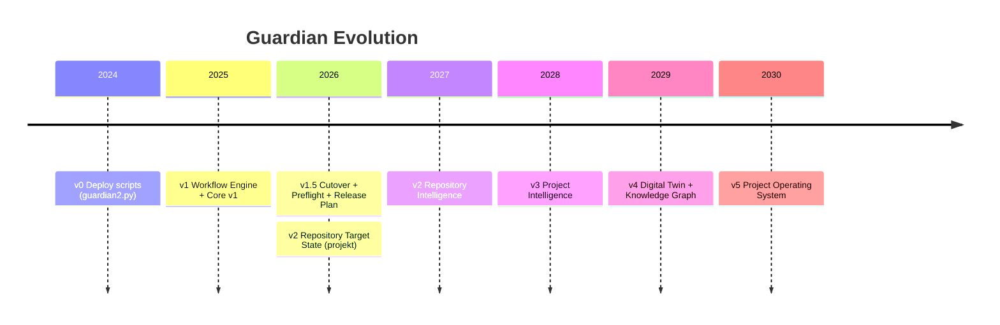
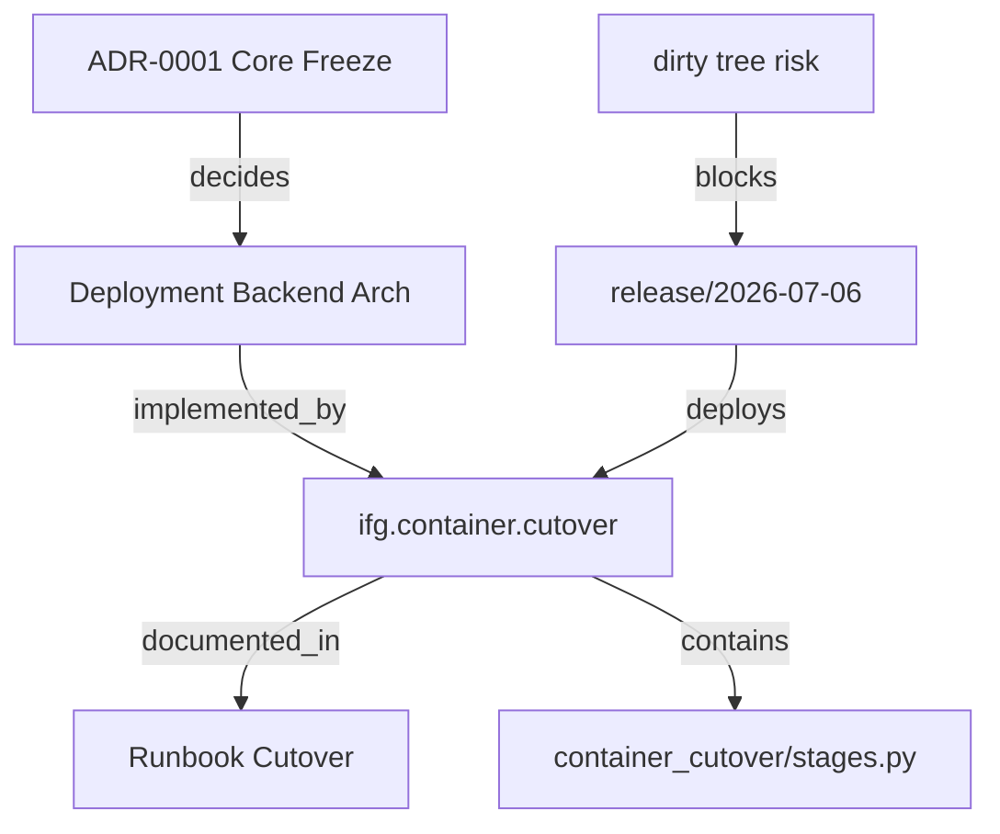
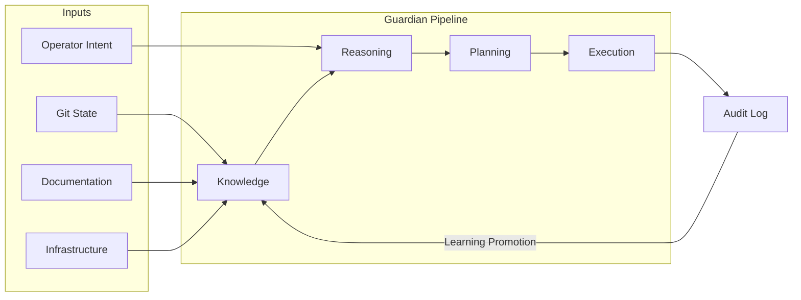
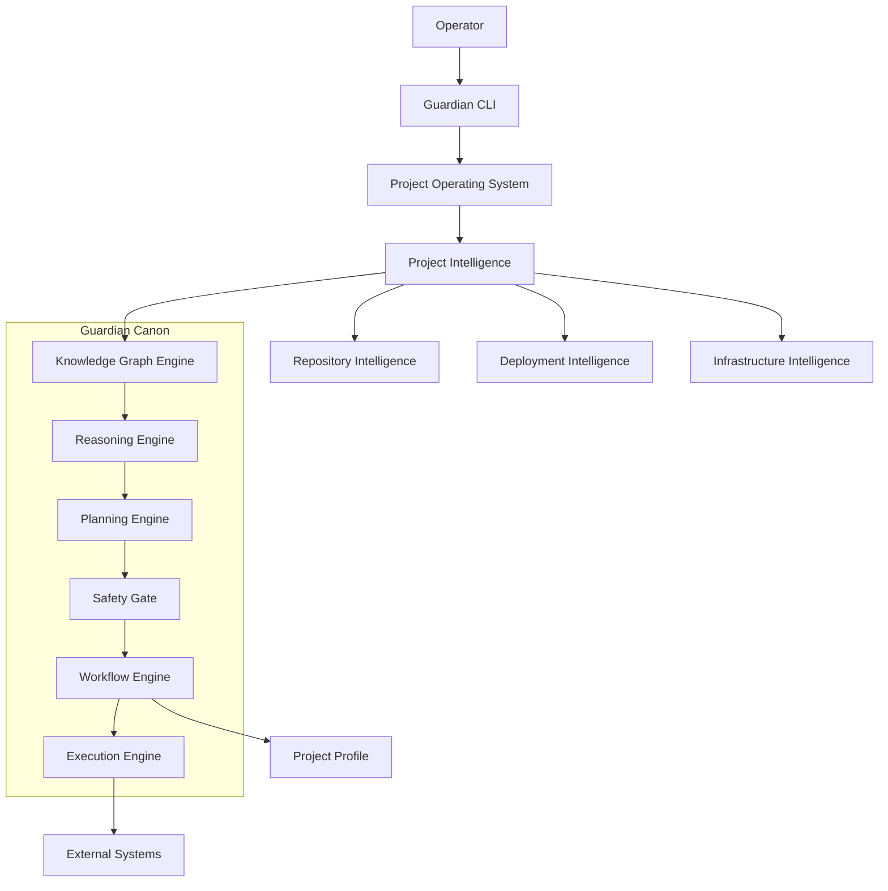
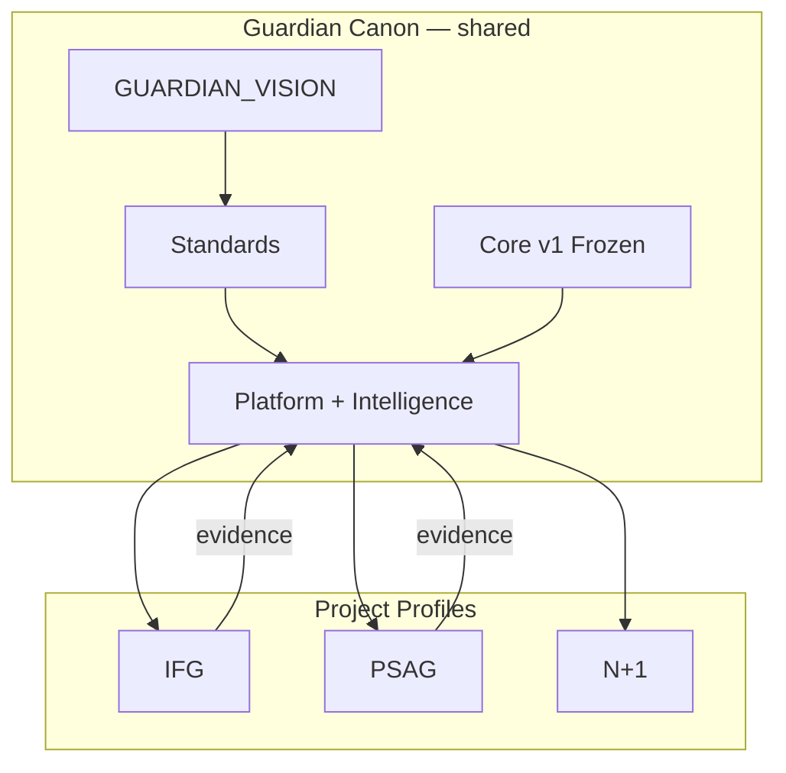
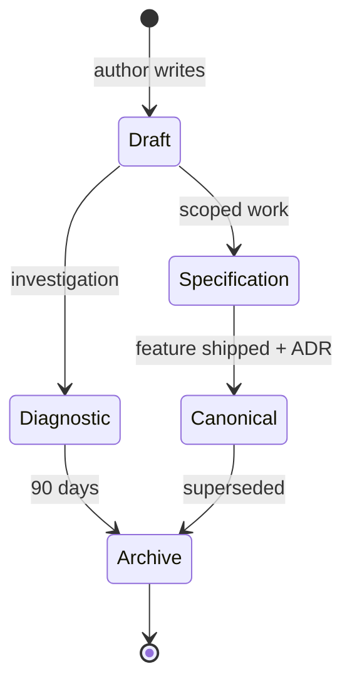
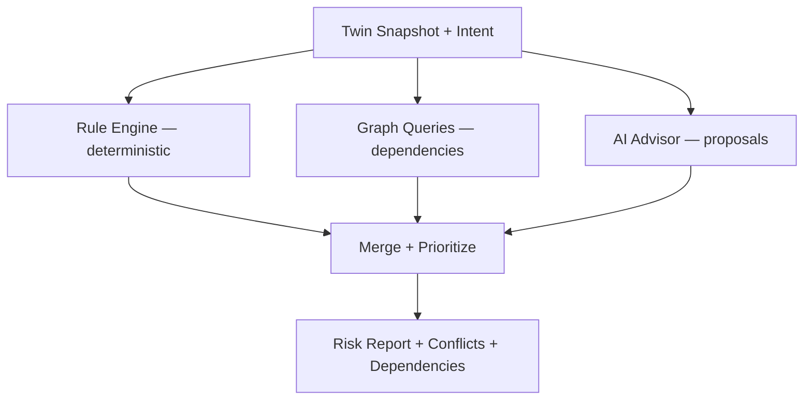
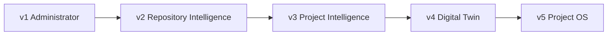

# Guardian Vision — Design & Analysis Report

**Data:** 2026-07-06  
**Status:** DESIGN (nie wdrożono)  
**Dokument kanoniczny:** [GUARDIAN_VISION.md](../guardian/core/GUARDIAN_VISION.md)  
**Podstawa:** [REPOSITORY_TARGET_STATE.md](../guardian/core/REPOSITORY_TARGET_STATE.md), [2026-07-06_REPOSITORY_TARGET_STATE_DESIGN.md](./2026-07-06_REPOSITORY_TARGET_STATE_DESIGN.md), Canon Guardian, architektura IFG

---

## Spis treści

1. [Cel analizy](#1-cel-analizy)  
2. [Kontekst: dlaczego teraz](#2-kontekst-dlaczego-teraz)  
3. [Analiza obecnego Guardiana](#3-analiza-obecnego-guardiana)  
4. [Etap 1 — Definicja (uzasadnienie)](#4-etap-1--definicja-uzasadnienie)  
5. [Etap 2 — Ewolucja (alternatywy)](#5-etap-2--ewolucja-alternatywy)  
6. [Etap 3 — Problemy](#6-etap-3--problemy)  
7. [Etap 4 — Project Digital Twin](#7-etap-4--project-digital-twin)  
8. [Etap 5 — Knowledge Graph](#8-etap-5--knowledge-graph)  
9. [Etap 6 — Reasoning Layer](#9-etap-6--reasoning-layer)  
10. [Etap 7 — Architektura warstw](#10-etap-7--architektura-warstw)  
11. [Etap 8 — Project Intelligence](#11-etap-8--project-intelligence)  
12. [Etap 9 — Canon vs Profile](#12-etap-9--canon-vs-profile)  
13. [Etap 10 — Wizja 5-letnia](#13-etap-10--wizja-5-letnia)  
14. [Etap 11 — Granice](#14-etap-11--granice)  
15. [Diagramy](#15-diagramy)  
16. [Roadmapa](#16-roadmapa)  
17. [Wpływ na IFG, PSAG, istniejący Guardian](#17-wpływ)  
18. [Ryzyka i decyzje operatora](#18-ryzyka-i-decyzje-operatora)

---

## 1. Cel analizy

Niniejszy raport uzasadnia dokument [GUARDIAN_VISION.md](../guardian/core/GUARDIAN_VISION.md) — nadrzędną wizję Guardiana jako **Project Operating System**.

Nie jest to specyfikacja techniczna. Nie definiuje API, klas ani workflow. Odpowiada na pytanie:

> *Czym powinien być Guardian, aby za pięć lat nadal stanowił centralny system zarządzania projektami, wiedzą, architekturą i procesami — a nie jedynie zbiorem skryptów?*

---

## 2. Kontekst: dlaczego teraz

### 2.1 Sygnały z praktyki IFG

| Obserwacja | Implikacja |
|------------|------------|
| ~100 niezacommitowanych zmian blokujących cutover | Guardian musi **rozumieć** repo, nie tylko je deployować |
| 213 plików `.md` bez taksonomii | Guardian musi być **kustoszem wiedzy** |
| Dwa stosy Guardiana (`ifg_guardian` + `guardian_platform`) | Potrzebna **wizja** konsolidacji, nie kolejny refactor |
| `ifg.release.plan` już istnieje, ale brak `release/*` branch | Release jest **konceptem Guardiana**, nie Gita |
| Core v1 frozen | Przyszłość leży **nad** Core — Intelligence, nie nowy executor |
| PSAG scaffold (`ping` only) | Standard musi być **uniwersalny** od początku |

### 2.2 Sygnały z Canonu

Canon Guardian (`guardian/Canon/`) już definiuje:

- **Repository / Documentation / Knowledge First** (PRINCIPLES, Intelligence Model)
- **Context Bootstrap** — Guardian musi wiedzieć gdzie jest
- **7-krokowy proces** — Problem → Research → ADR → Capability → GWO → Implementation → Review
- **Learning Promotion** — wzorce z audytu → heurystyki
- **Core freeze** (ADR-0001) — rozwój przez evidence z projektów

**Luka:** Canon opisuje *jak rozwijać* Guardiana, ale nie definiuje wystarczająco jasno *czym Guardian jest docelowo*. `GUARDIAN_VISION.md` wypełnia tę lukę na poziomie projektu IFG i synchronizuje się z Canonem platformy.

### 2.3 Pytanie za pytaniem

| Pytanie | Odpowiedź w VISION |
|---------|-------------------|
| Czy Guardian to CI/CD? | Nie — współpracuje z CI, ale zarządza **projektem** |
| Czy Guardian to framework workflow? | Workflow jest **narzędziem**, nie tożsamością |
| Czy Guardian to deploy tool? | Deploy jest **jednym z execution workflows** |
| Czym jest za 5 lat? | **Project Operating System** z Digital Twin |

---

## 3. Analiza obecnego Guardiana

### 3.1 Co już realizuje wizję (mocne strony)

| Capability | Implementacja | Faza wizji |
|------------|---------------|------------|
| Workflow orchestration | `core/workflow/engine.py`, stages, transactions | v1 ✅ |
| Safety przed deploy | Preflight + Safety Gate | v1 ✅ |
| Execution | SSH, Docker, Compose executors | v0–v1 ✅ |
| Project health | `ifg.doctor` | v2 🔄 |
| Release planning | `ifg.release.plan` + RepositoryAnalysisStage | v2 🔄 |
| Repo classification | `repo_audit/classifier.py`, CRLF detection | v2 🔄 |
| Repo graph | `guardian_platform/core/repository/` | v2 🔄 |
| Cleanup advisor | `profiles/ifg/repo_cleanup/` | v2 🔄 |
| Cutover workflow | `ifg.container.cutover` | v1 ✅ (nie w HEAD) |
| Profile model | `.guardian.yml`, plugins IFG/PSAG | v1 ✅ |
| Canon freeze | ADR-0001, Core v1 | Governance ✅ |

### 3.2 Co nie realizuje wizji (luki)

| Luka | Skutek |
|------|--------|
| Brak Reasoning Engine | Guardian wykonuje bez głębokiego „dlaczego" |
| Brak Planning Engine (standalone) | Plan commitów = ręczny dokument, nie CLI |
| Brak Knowledge Graph | ADR, docs, kod nie są połączone semantycznie |
| Brak Digital Twin | Guardian widzi pliki, nie projekt |
| Brak holistycznego Project Intelligence | Repo, infra, docs analizowane osobno |
| Dual stack | Dwie implementacje tej samej wizji |
| AI nie zintegrowane w model | Brak jasnej roli AI jako advisor |

### 3.3 Ocena tożsamości obecnej

```
Obecna tożsamość (de facto):  v1.5 — Orchestrator + początkujący Administrator
Deklarowana tożsamość (docs): v3 REVISED — Framework (aspiracja)
Wizja (GUARDIAN_VISION):      v5 — Project Operating System (cel)
```

**Wniosek:** Guardian **już ewoluuje** w kierunku v2 (administrator), ale **nie ma spójnej narracji**. VISION ją dostarcza.

---

## 4. Etap 1 — Definicja (uzasadnienie)

### 4.1 Wybrana definicja

> Guardian jest Project Operating System — systemem operacyjnym projektu, który utrzymuje cyfrowy model projektu, rozumie jego wiedzę i kontekst, planuje bezpieczne zmiany oraz wykonuje je tylko za zgodą operatora.

### 4.2 Alternatywy rozważane i odrzucone

| Definicja | Za | Przeciw | Werdykt |
|-----------|-----|---------|---------|
| „Guardian = DevOps platform" | Znane branży | Redukuje do CI/CD; ignoruje wiedzę i decyzje | ❌ |
| „Guardian = AI coding agent" | Trend rynkowy | Sprzeczne z Z5 (operator sovereignty) | ❌ |
| „Guardian = documentation system" | Docs First z Canonu | Zbyt wąskie; ignoruje execution | ❌ |
| „Guardian = workflow framework" | Obecny kod | Framework jest narzędziem, nie celem | ❌ |
| **„Guardian = Project OS"** | Łączy wiedzę, planowanie, execution | Wymaga Digital Twin (ambitne) | ✅ |

### 4.3 Analogia

| System operacyjny (OS) | Guardian (Project OS) |
|------------------------|----------------------|
| Kernel | Workflow + Execution Engine (Core v1) |
| File system | Repository (Git) |
| Process manager | Workflow orchestrator |
| Security model | Safety Gate + Preflight |
| Device drivers | Execution backends (SSH, Docker, Synology) |
| Desktop / Shell | Guardian CLI |
| System knowledge | Knowledge Graph + Digital Twin |
| User | Operator |

---

## 5. Etap 2 — Ewolucja (alternatywy)

### 5.1 Proponowana ścieżka (w VISION)

```
v0 Deploy Tool → v1 Orchestrator → v2 Administrator → v3 Intelligence → v4 Twin → v5 Project OS
```

### 5.2 Alternatywna ścieżka rozważana

```
v0 Scripts → v1 CI integration → v2 Full automation → v3 Autonomous agent
```

**Odrzucona** — narusza Z5 (operator sovereignty) i Z6 (safety over speed).

### 5.3 Argument za przyrostową ewolucją

| Faza | Co zachowujemy | Co dodajemy |
|------|----------------|-------------|
| v0→v1 | SSH, compose | Workflow, transactions, audit |
| v1→v2 | Workflows | Repo standards, release flow, doctor |
| v2→v3 | Repo audit | Reasoning, commit plan, impact |
| v3→v4 | Intelligence | Knowledge Graph, Twin |
| v4→v5 | Twin | Pełny cykl K→R→P→E→Learning |

**Żadna faza nie wymaga przepisania poprzedniej** — zgodnie z ADR-0001 (Core freeze) i Production-driven evolution.

### 5.4 Diagram ewolucji



---

## 6. Etap 3 — Problemy

### 6.1 Macierz problemów (pełna)

| # | Problem | Typ | Priorytet | Faza wizji |
|---|---------|-----|-----------|------------|
| P1 | Utrata wiedzy projektowej | Organizacyjny | Krytyczny | v4 |
| P2 | Deploy bez zrozumienia kontekstu | Operacyjny | Krytyczny | v3 |
| P3 | Chaos dokumentacji | Organizacyjny | Wysoki | v2 |
| P4 | Brak release discipline | Procesowy | Wysoki | v2 |
| P5 | Dirty tree na production | Techniczny | Krytyczny (teraz) | v2 |
| P6 | Onboarding = „zapytaj autora" | Ludzki | Średni | v4 |
| P7 | Brak impact analysis | Architektoniczny | Wysoki | v3 |
| P8 | Rozjazd docs ↔ kod ↔ infra | Poznawczy | Wysoki | v4 |
| P9 | Rollback bez wersjonowania | Operacyjny | Średni | v2 |
| P10 | Dual Guardian stack | Techniczny | Średni | v2 |

### 6.2 Problemy nietechniczne (kluczowe)

Guardian musi rozwiązywać **problem samotnego operatora** — jednej osoby, która:

- zna cały projekt,
- pamięta dlaczego coś zostało zrobione,
- wie co jest bezpieczne na produkcji,
- i nie ma czasu na utrzymanie dokumentacji.

To nie jest problem, który rozwiąże kolejny skrypt deploy. To problem **instytucjonalizacji wiedzy**.

---

## 7. Etap 4 — Project Digital Twin

### 7.1 Ocena koncepcji

| Kryterium | Ocena |
|-----------|-------|
| Zgodność z Canon (Knowledge First) | ✅ |
| Zgodność z Core freeze (nad Core, nie w Core) | ✅ |
| Wykonalność przyrostowa | ✅ (zaczynamy od repo graph) |
| Wartość dla małego zespołu | ✅ (onboarding, impact) |
| Ryzyko over-engineering | ⚠️ (mitigacja: v4, nie v1) |

**Werdykt: WŁAŚCIWY KIERUNEK** — z wdrożeniem przyrostowym.

### 7.2 Alternatywa: „Git jest wystarczający"

| Za | Przeciw |
|----|---------|
| Prostsze | Git nie ma relacji semantycznych |
| Brak nowego systemu | Nie łączy docs + infra + decisions |
| | Nie odpowiada na „co się stanie jeśli..." |

**Odrzucone** — Git jest **źródłem**, Twin jest **modelem**.

### 7.3 Alternatywa: „Zewnętrzny wiki (Notion, Confluence)"

| Za | Przeciw |
|----|---------|
| Ładny UI | Rozjazd z repo |
| | Nie widzi kodu ani infra |
| | Kolejny system do utrzymania |

**Odrzucone** — wiedza musi żyć **w repo** (Z2 Documentation First).

### 7.4 Minimalny Twin (MVP v4)

Pierwsza wersja Digital Twin **nie wymaga** pełnej ontologii:

1. Component graph (Python imports + docker services)
2. Doc graph (linki między markdown)
3. Decision index (ADR → pliki)
4. Operational state (ostatni deploy, branch, tag)
5. Risk register (z doctor + release plan)

---

## 8. Etap 5 — Knowledge Graph

### 8.1 Czy Guardian powinien mieć własny model wiedzy?

**Tak** — jako **materializowany indeks** nad artefaktami Git, nie jako osobna baza prawdy.

### 8.2 Co przechowywać

| Kategoria | W Git (source) | W Grafie (derived) |
|-----------|----------------|-------------------|
| ADR | `docs/decisions/` | Węzeł + relacje `decides`, `supersedes` |
| Architektura | `docs/architecture/` | Węzeł + `documents` edges |
| Kod | `app/`, `scripts/` | Węzeł Component + `depends_on` |
| API | OpenAPI / routes | Węzeł API + `exposes` |
| Infra | compose, `.guardian.yml` | Węzeł Infrastructure |
| Release | git tags, release plan | Węzeł Release + `contains` |
| Runbooki | `docs/runbooks/` | Węzeł + `governs` workflow |
| Ryzyka | doctor, release plan | Węzeł Risk + `blocks` |

### 8.3 Argumenty za i przeciw

| Za | Przeciw |
|----|---------|
| Holistyczny reasoning | Koszt utrzymania indeksu |
| Impact analysis | Ryzyko nieaktualnego grafu |
| Onboarding | Wymaga parserów per typ pliku |
| Spójność z Canon Intelligence Model | Może duplikować repo graph |

**Mitigacja przeciw:** graf jest **derived + odświeżany on-demand**, nie ręcznie utrzymywany.

### 8.4 Diagram Knowledge Graph



---

## 9. Etap 6 — Reasoning Layer

### 9.1 Czy potrzebny etap między Knowledge a Execution?

**Tak.** Obecny model `Analyze → Execute` jest **wystarczający dla v0–v1**, **niewystarczający dla v3+**.

### 9.2 Proponowany pipeline

| Etap | Wejście | Wyjście | Tryb |
|------|---------|---------|------|
| Knowledge | Repo, docs, infra, runtime | Twin snapshot | read-only |
| Reasoning | Twin + intended action | Risk assessment, conflicts, dependencies | read-only |
| Planning | Reasoning output | Ordered action plan | advisory |
| Execution | Approved plan | Workflow runs | mutating (za `--yes`) |
| Audit | Execution results | Transaction + learning candidates | write |

### 9.3 Alternatywa: „AI zastępuje Reasoning"

| Za | Przeciw |
|----|---------|
| Elastyczność | Brak determinizmu |
| | Trudny audyt |
| | Sprzeczne z Safety Gate |

**Decyzja:** AI jako **advisor w Reasoning**, nie jako Decision Maker. Reguły deterministyczne (Safety Gate, preflight) mają pierwszeństwo.

### 9.4 Diagram przepływu wiedzy



---

## 10. Etap 7 — Architektura warstw

### 10.1 Porównanie z przykładem z zadania

Zadanie sugerowało:

```
Project OS → Project Intelligence → Repository Intelligence →
Deployment Intelligence → Infrastructure Intelligence →
Workflow Engine → Execution Engine → External Systems
```

### 10.2 Dostosowana architektura (w VISION)

Dodano:

- **Knowledge Graph Engine** — fundament pod wszystkie Intelligence
- **Reasoning Engine** — między Intelligence a Planning
- **Planning Engine** — między Reasoning a Workflow
- **Project Profile** — obok Canon, nie pod Execution

### 10.3 Uzasadnienie zmian

| Zmiana | Dlaczego |
|--------|----------|
| +Knowledge Graph Engine | Bez niego Intelligence są izolowane |
| +Reasoning Engine | Oddziela „wiedzę" od „wnioskowania" |
| +Planning Engine | Oddziela „plan" od „wykonania" |
| Profile obok Canon | Zgodne z ADR-0001 i v3 REVISED |

### 10.4 Diagram warstw (pełny)



---

## 11. Etap 8 — Project Intelligence

### 11.1 Repository Intelligence vs Project Intelligence

| | Repository Intelligence | Project Intelligence |
|---|------------------------|---------------------|
| **Zakres** | Git, commity, branche, docs hygiene | Cały projekt |
| **Pytanie** | „Co commitować?" | „Czy projekt jest gotowy?" |
| **Źródła** | git, diff, import graph | Twin + wszystkie Intelligence |
| **Output** | Commit plan | Readiness + recommendation |
| **Faza** | v2 | v3 |

### 11.2 Współpraca modułów

Project Intelligence **nie zastępuje** Repository Intelligence — **agreguje** jego wyniki z Deployment i Infrastructure Intelligence.

Przykład:

```
Release Readiness Report
├── Repository: 2 mixed-topic clusters, CRLF noise — MEDIUM
├── Deployment: cutover workflow not in HEAD — CRITICAL
├── Infrastructure: compose prep OK, volume pinned — PASS
├── Knowledge: runbook APPROVED, ADR-0001 respected — PASS
└── Verdict: NO-GO (1 critical, 1 medium)
```

---

## 12. Etap 9 — Canon vs Profile

### 12.1 Podział (decyzja)

| Guardian Canon | Project Profile |
|----------------|-----------------|
| Workflow Engine | Domain workflows (cutover, ksef) |
| Execution Engine | Remote config (DS723 host) |
| Preflight + Safety Gate | Domain preflight checks |
| Knowledge Graph schema | Domain classifiers |
| Reasoning rules (generic) | Domain heuristics |
| Planning algorithms | Commit scope rules |
| Release model | Release checklist items |
| GUARDIAN_VISION | Runbooki |
| REPOSITORY_TARGET_STATE | `.guardian.yml` extensions |

### 12.2 Diagram Canon ↔ Profile



### 12.3 Zasada promocji

```
Profile practice → GWO → Review → ADR (jeśli architektura) → Canon
```

Zgodne z `DESIGN_EVOLUTION.md` i `Learning Promotion` z Intelligence Model.

---

## 13. Etap 10 — Wizja 5-letnia

### 13.1 Scenariusz 2031

| Obszar | Stan |
|--------|------|
| Operator | Decydent; 80% analizy robi Guardian |
| AI | Advisor w Reasoning; nigdy nie deployuje sam |
| Repo | Clean; feature→release→production automatycznie pilnowane |
| Docs | < 20 plików w root; reszta w taksonomii |
| Twin | Odświeżany przy każdym `guardian project status` |
| PSAG | Pełny profil; ten sam standard co IFG |
| Core | Nadal v1 frozen; Intelligence w Platform |

### 13.2 Scenariusz codzienny

1. Developer kończy feature → `guardian repo plan` → 3 commity.
2. Operator tworzy `release/*` → `guardian release readiness` → GO.
3. Merge → production → tag → `guardian deploy run --yes`.
4. Guardian aktualizuje Twin, archiwizuje raport, proponuje learning.

---

## 14. Etap 11 — Granice

### 14.1 Decyzje zawsze u operatora

- GO/NO_GO production
- ADR architektoniczne
- Runbook APPROVED
- Rollback biznesowy
- Roadmapa produktu
- Promocja do Canon

### 14.2 Nigdy automatycznie

- Merge production
- Force push
- Migracje DB bez backup
- Zmiana sekretów
- Usuwanie kodu/docs

Pełna lista: [GUARDIAN_VISION.md §12](../guardian/core/GUARDIAN_VISION.md).

---

## 15. Diagramy

### 15.1 Lifecycle dokumentacji (wizja)



### 15.2 Reasoning Engine (wewnętrzny)



---

## 16. Roadmapa

### 16.1 Proponowana kolejność



### 16.2 Szczegóły per wersja

| Wersja | Nazwa | Deliverables | Zależności | Ryzyko |
|--------|-------|--------------|------------|--------|
| **v1** | Administrator | Release flow, REPOSITORY_TARGET_STATE, cutover, gitignore, first release branch | Core v1 ✅ | Niskie |
| **v2** | Repository Intelligence | `repo plan`, commit grouping, doc taxonomy migration start | v1 | Średnie |
| **v3** | Project Intelligence | `project readiness`, impact analysis, conflict detection | v2 + Knowledge index | Średnie |
| **v4** | Digital Twin | Knowledge Graph MVP, component model, drift detection | v3 | Wysokie |
| **v5** | Project OS | Full K→R→P→E→Learning, onboard command, PSAG full profile | v4 | Średnie |

### 16.3 Dlaczego Twin po Intelligence (nie wcześniej)

| Opcja | Ocena |
|-------|-------|
| Twin przed Intelligence | Budowa modelu bez konsumenta — spekulacja (H-003) |
| Intelligence przed Twin | RI na repo graph — immediate value (cutover) |
| **Twin po Intelligence** | ✅ Model budowany z realnych pytań PI |

---

## 17. Wpływ

### 17.1 Wpływ na istniejącego Guardiana

| Obszar | Wpływ |
|--------|-------|
| Core v1 | **Brak zmian** — frozen |
| ifg_guardian | Staje się IFG Profile; konsolidacja z platform (v2) |
| guardian_platform | Staje się Platform + Intelligence host |
| guardian2.py | Deprecation path |
| Workflows istniejące | Pozostają; nowe Intelligence je **poprzedza** |
| `.guardian.yml` | Rozszerzenie schema (v2+) |

### 17.2 Wpływ na IFG

| Obszar | Wpływ |
|--------|-------|
| Cutover | Bezpośredni — v1 Administrator |
| Docs | Reorganizacja 213 plików (v2) |
| Branch model | `release/*` wprowadzenie |
| Operator workflow | Więcej planowania, mniej paniki |
| Repo hygiene | RI jako codzienny asystent |

### 17.3 Wpływ na PSAG

| Obszar | Wpływ |
|--------|-------|
| Onboarding | Szablon projektu z VISION + REPOSITORY_TARGET_STATE |
| Profile | `psag_scaffold` → pełny profil na wzorcze IFG |
| Canon | Wspólny — PSAG nie buduje własnego OS |
| Docs | Ta sama taksonomia od dnia zero |

---

## 18. Ryzyka i decyzje operatora

### 18.1 Ryzyka

| # | Ryzyko | P | W | Mitygacja |
|---|--------|---|---|-----------|
| R1 | Over-engineering Twin przed value | Ś | W | v4 dopiero po PI |
| R2 | Vision vs reality gap | W | Ś | Production-driven; v1 = cutover |
| R3 | Dual stack blokuje wizję | W | Ś | Konsolidacja v2 |
| R4 | AI w Reasoning bez kontroli | Ś | W | Rules first; AI advisory |
| R5 | Knowledge Graph nieaktualny | W | Ś | Derived on-demand |
| R6 | Operator obciążony procesem | Ś | Ś | Guardian planuje; operator zatwierdza |
| R7 | Konflikt z Canon VISION (guardian repo) | N | Ś | Sync przy ADR |

### 18.2 Decyzje operatora

| # | Pytanie | Opcje |
|---|---------|-------|
| D1 | Czy przyjąć tożsamość „Project OS" oficjalnie w Canon? | A) Sync do guardian/Canon/VISION B) Tylko IFG na razie |
| D2 | Kiedy startować Twin (v4)? | A) Po PI B) Równolegle z RI |
| D3 | Rola AI w Reasoning? | A) Advisory only (rekomendowane) B) Autonomiczne plany |
| D4 | Konsolidacja ifg_guardian → platform? | A) v2 B) Po v3 C) Zachowaj dual |
| D5 | Czy VISION unieważnia GUARDIAN_V3_ARCHITECTURE_REVISED? | A) Supersede B) Uzupełnia (rekomendowane) |

---

## Podsumowanie końcowe

### 1. Najważniejsze decyzje architektoniczne

1. **Guardian = Project Operating System** — nie deploy tool, nie CI/CD, nie framework.
2. **Ewolucja przyrostowa v0→v5** — Core v1 frozen, Intelligence nad Core.
3. **Project Digital Twin** — właściwy kierunek, wdrożenie v4 (po Intelligence).
4. **Knowledge Graph** — derived index nad Git, nie osobna baza prawdy.
5. **Pipeline Knowledge → Reasoning → Planning → Execution → Audit** — obowiązkowy dla production.
6. **AI = advisor**, nie decision maker.
7. **Canon + Profile** — wspólne jądro, domena per projekt.
8. **Repository Intelligence** — pierwszy krok Intelligence (v2), immediate value.

### 2. Elementy wymagające decyzji operatora

- D1: Oficjalna adopcja tożsamości Project OS w Canon platformy
- D2: Timing Digital Twin
- D3: Zakres AI w Reasoning
- D4: Harmonogram konsolidacji dual stack
- D5: Relacja do GUARDIAN_V3_ARCHITECTURE_REVISED

### 3. Ryzyka (skrót)

Over-engineering (R1), vision-reality gap (R2), dual stack (R3), AI control (R4) — wszystkie mają mitygację przez production-driven roadmap i v1 focus na cutover.

### 4. Wpływ na istniejącego Guardiana

Core bez zmian. Platform rośnie. Profile konsolidują. Workflows pozostają. Intelligence je poprzedza.

### 5. Wpływ na IFG

Natychmiastowy: v1 Administrator (cutover, release flow). Średnioterminowy: docs, RI. Długoterminowy: Twin, onboarding.

### 6. Wpływ na PSAG

Wspólny standard od startu. `psag_scaffold` → pełny profil na szablonie IFG. Brak osobnego toolchain.

### 7. Proponowana kolejność wdrażania

```
v1 Administrator (teraz: cutover + repo standards)
  → v2 Repository Intelligence (repo plan, docs taxonomy)
    → v3 Project Intelligence (readiness, impact)
      → v4 Digital Twin (Knowledge Graph)
        → v5 Project OS (full pipeline + learning)
```

### 8. Utworzone pliki `.md`

1. [docs/guardian/core/GUARDIAN_VISION.md](../guardian/core/GUARDIAN_VISION.md) — dokument kanoniczny
2. [docs/reports/2026-07-06_GUARDIAN_VISION_DESIGN.md](./2026-07-06_GUARDIAN_VISION_DESIGN.md) — niniejszy raport

### 9. Problemy wymagające pilnej interwencji (poza wizją)

| Pilność | Problem | Powiązanie z wizją |
|---------|---------|-------------------|
| 🔴 | Dirty tree + cutover nie w HEAD | v1 Administrator — **teraz** |
| 🟠 | Dual Guardian stack | v2 konsolidacja |
| 🟠 | 213 docs bez taksonomii | v2 Repository Intelligence |
| 🟡 | Brak Twin | v4 — nie pilne |

Wizja **nie blokuje** cutover — v1 jest jego pierwszym krokiem.

---

*Raport projektowy. Żadna zmiana kodu, workflow ani istniejących dokumentów nie została wykonana.*
