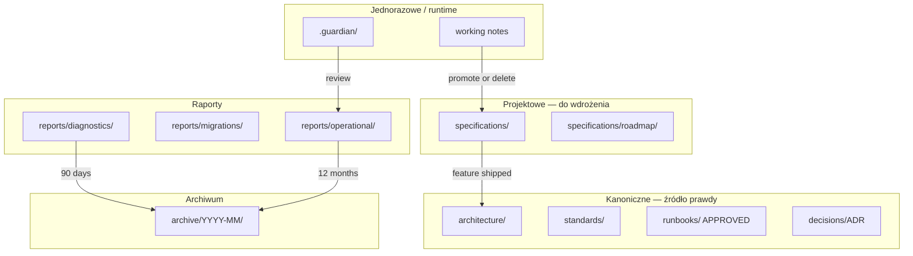
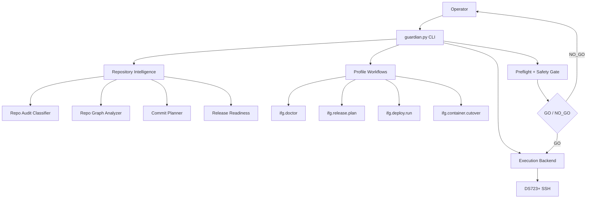
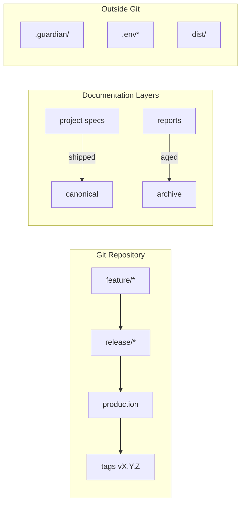
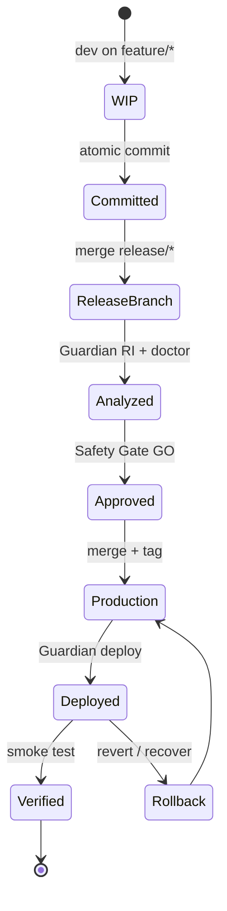
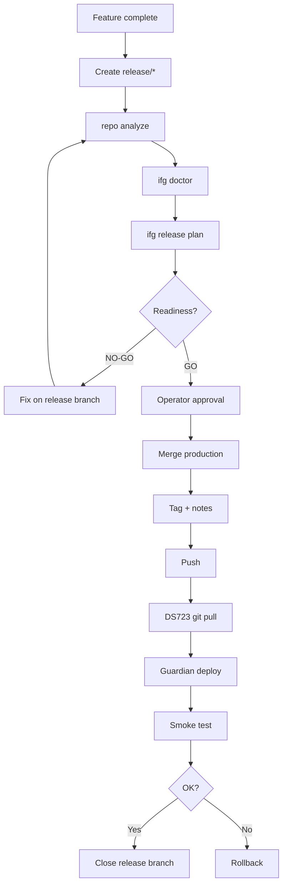
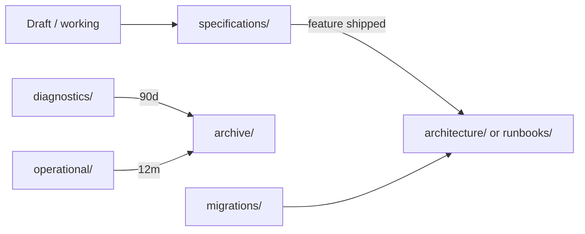
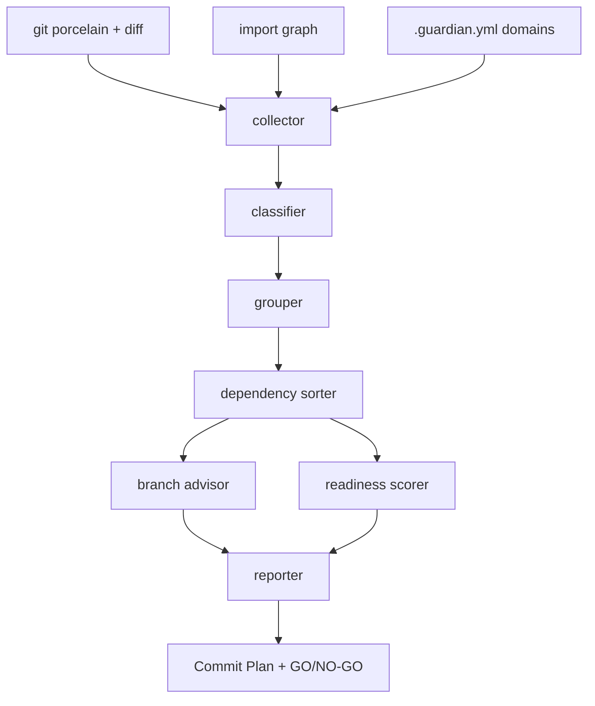
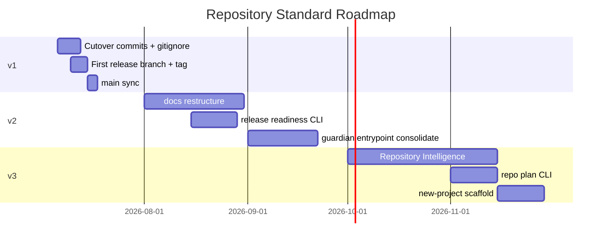

# Repository Target State — Design & Audit Report

**Data:** 2026-07-06  
**Autor:** Guardian Repository Strategy Audit  
**Status:** DESIGN (nie wdrożono)  
**Dokument kanoniczny:** [REPOSITORY_TARGET_STATE.md](../guardian/core/REPOSITORY_TARGET_STATE.md)  
**Punkt wyjścia:** [IFG_REPOSITORY_COMMIT_STRATEGY.md](./IFG_REPOSITORY_COMMIT_STRATEGY.md)

---

## Spis treści

1. [Executive Summary](#1-executive-summary)  
2. [Etap 1 — Audyt obecnego stanu](#2-etap-1--audyt-obecnego-stanu)  
3. [Etap 2 — Docelowa architektura repo](#3-etap-2--docelowa-architektura-repo)  
4. [Etap 3 — Strategia branchy](#4-etap-3--strategia-branchy)  
5. [Etap 4 — Commit Policy](#5-etap-4--commit-policy)  
6. [Etap 5 — Release Management](#6-etap-5--release-management)  
7. [Etap 6 — Repository Health](#7-etap-6--repository-health)  
8. [Etap 7 — Dokumentacja](#8-etap-7--dokumentacja)  
9. [Etap 8 — Guardian jako administrator](#9-etap-8--guardian-jako-administrator-repo)  
10. [Etap 9 — Repository Intelligence](#10-etap-9--guardian-repository-intelligence)  
11. [Etap 10 — Uniwersalność PSAG](#11-etap-10--uniwersalność)  
12. [Etap 11 — Diagramy](#12-etap-11--diagramy)  
13. [Etap 12 — Roadmapa](#13-etap-12--roadmapa)  
14. [Ryzyka i decyzje operatora](#14-ryzyka-i-decyzje-operatora)  
15. [Problemy wymagające pilnej interwencji](#15-problemy-wymagające-pilnej-interwencji)

---

## 1. Executive Summary

Repozytorium IFG ma **sprawną warstwę operacyjną Guardiana** (doctor, release plan, deploy run, cutover, preflight), ale **chaotyczną organizację dokumentacji**, **rozjechane branche** (`production` 76 commitów przed `main`), **brak warstwy `release/*`** oraz **~100 niezacommitowanych zmian** blokujących bezpieczny cutover.

Dokument `IFG_REPOSITORY_COMMIT_STRATEGY.md` poprawnie identyfikuje logiczne grupy commitów (Preflight → Cutover → Docs), ale jest **reakcją na bieżący kryzys**, nie **trwałym standardem**.

**Rekomendacja:** przyjąć model **Guardian Release Flow** (`feature/*` → `release/*` → `production`) i zbudować **Repository Intelligence** jako trzecią warstwę Guardiana po Core (frozen) i Profile Plugins.

---

## 2. Etap 1 — Audyt obecnego stanu

### 2.1 Struktura repozytorium

```
ifg_standalone/
├── app/                    # FastAPI backend (~13 modułów)
├── frontend-react/         # UI główne
├── mobile-expo/            # aplikacja mobilna (osobne docs/)
├── docker/                 # compose prod/staging
├── alembic/                # migracje DB
├── scripts/
│   ├── guardian.py         # entrypoint
│   ├── guardian2.py        # legacy?
│   ├── guardian_platform/  # Guardian Platform v0.1 (111 plików)
│   └── ifg_guardian/       # Legacy IFG profile (124 pliki) — aktywny tor cutover
├── agent/                  # git_guard, demo tools
├── tests/                  # unit + guardian_platform/
└── docs/                   # 213 plików .md — główny problem organizacyjny
```

| Obszar | Ocena |
|--------|-------|
| Kod aplikacji (`app/`) | Dobrze ustrukturyzowany (domain/persistence/services) |
| Docker / deploy | Compose prep na HEAD (`9505adc`) |
| Testy | Obecne dla Guardiana i domeny |
| Dokumentacja | **Krytyczny dług** — 145 plików `.md` bezpośrednio w `docs/` |
| Dual Guardian | **Dług architektoniczny** — `ifg_guardian` + `guardian_platform` |

### 2.2 Struktura Guardiana

**Dwa równoległe stosy:**

| Stos | Lokalizacja | Stan | Użycie operacyjne |
|------|-------------|------|-------------------|
| **IFG Guardian (legacy path)** | `scripts/ifg_guardian/` | Aktywny rozwój (cutover, preflight) | `python3 scripts/guardian.py` |
| **Guardian Platform** | `scripts/guardian_platform/` | Wprowadzony w `4edd388` | `python3 -m scripts.guardian_platform` |

**Istniejące możliwości repo (już zaimplementowane częściowo):**

| Moduł | Co robi |
|-------|---------|
| `ifg_guardian/core/repo_audit/` | Klasyfikacja plików, CRLF, ignore patterns |
| `ifg_guardian/plugins/ifg/release_plan/` | Release plan z `RepositoryAnalysisStage` |
| `guardian_platform/core/repository/` | Repo Graph, analyzer, scoring |
| `guardian_platform/profiles/ifg/repo_cleanup/` | Cleanup Advisor (fazy 0–3) |
| `ifg_guardian/core/preflight/checks.py` | `git.clean`, `git.branch` |
| `ifg_guardian/modules/repo.py` | `deploy check` — local/remote dirty |

**Brakuje:** spójnego CLI łączącego analizę → plan commitów → release readiness w jednym raporcie.

### 2.3 Struktura dokumentacji (stan faktyczny)

| Lokalizacja | Liczba `.md` | Problem |
|-------------|--------------|---------|
| `docs/` (root) | **145** | Płaskie nazewnictwo, brak klasyfikacji |
| `docs/reports/` | 45 | Mieszanka GWO, guardian_deploy, repository_* |
| `docs/guardian/` | 13 | Raporty runtime + architecture (dobry kierunek) |
| `docs/guardian2/` | 8 | Duplikat konwencji nazewniczej |
| `docs/runbooks/` | 1 | Dopiero powstaje (cutover) |
| `mobile-expo/docs/` | ~15 | Poza głównym drzewem docs |
| `doc/` (singular) | 1 README | Martwy katalog |

**Typy dokumentów w `docs/` root (próbka):**

- Diagnozy KSeF: `KSEF_*` (~40 plików)
- Magazyn: `WAREHOUSE_*`, `PZ_*`, `WZ_*`
- Guardian implementacja: `GUARDIAN_SPRINT*`, `GUARDIAN_V3_*`
- WIP/plany: `WIP_*`, `*_PLAN.md`, `*_AUDIT.md`

### 2.4 Model branchy (stan faktyczny)

```
* production          ← HEAD 9505adc, deploy DS723+
  main                ← origin/HEAD, 76 commitów ZA production
  feature/ifg-agent-v1
  feature/mobile-expo
  feature/settlements
  chore/repo-cleanup-2026-04-29
  backup/invoice-ui-2026-04-26
```

| Obserwacja | Wpływ |
|------------|-------|
| `production` >> `main` (76 commits) | Nowi devi klonują `main` — nie mają Guardiana, cutover prep, KSeF fixes |
| Brak `release/*` | Feature merge bezpośrednio na production (implicit) |
| Brak tagów release w ostatnich commitach | Rollback tylko po SHA, nie po wersji |
| `origin/HEAD → main` | Myjące — produkcja jest na `production` |

### 2.5 Sposób wykonywania commitów

**Mocne strony:**

- Conventional commits częściowo stosowane (`feat(guardian):`, `fix(ksef):`, `prep(docker):`)
- Commity logiczne w historii production (pojedyncze fixy KSeF, warehouse)
- `IFG_REPOSITORY_COMMIT_STRATEGY.md` — dobra dekompozycja bieżącego bałaganu

**Słabe strony:**

- Duże WIP bez commita (17 tracked + 82 untracked)
- Mieszanie Guardian + app + docs w jednym working tree
- Brak egzekucji „clean before deploy" (preflight: WARNING, nie FAIL)
- `git commit -am` ryzyko (nie stosowane systematycznie, ale brak polityki)

### 2.6 Raporty i artefakty runtime

| Artefakt | Lokalizacja | Plików | W Git? |
|----------|-------------|--------|--------|
| Workflow transactions | `.guardian/workflows/` | ~287 JSON | ❌ powinno być ignorowane |
| Latest snapshots | `.guardian/latest/` | 7 JSON | ❌ |
| Raporty Guardian | `docs/guardian/IFG_*` | 13 | Częściowo untracked |
| Deploy logs | `docs/reports/guardian_deploy_*` | 22 | Untracked |
| Recover logs | `docs/reports/guardian_recover_*` | 14 | Untracked |

`.guardian.yml` wskazuje `reports_dir: docs/guardian` — poprawne, ale `.guardian/` nie jest w `.gitignore`.

### 2.7 Deploy (obecny model)

```
Mac mini (operator)
    │  python3 scripts/guardian.py ifg deploy run --yes
    │  python3 scripts/guardian.py ifg cutover run --yes
    ▼
SSH → DS723+
    │  git pull (branch production)
    │  docker compose up
    ▼
IFG containers
```

Guardian już sprawdza: dirty tree local/remote, branch, health, compose.

### 2.8 Ocena IFG_REPOSITORY_COMMIT_STRATEGY.md

| Aspekt | Ocena |
|--------|-------|
| Dekompozycja grup B–L | ✅ Bardzo dobra |
| Kolejność zależności B→E→F | ✅ Poprawna |
| Minimalna ścieżka cutover | ✅ Praktyczna |
| Feature branch zamiast restore | ✅ Zgodna z celem |
| Brak warstwy release | ⚠️ Luka (ad hoc na production) |
| Brak standardu długoterminowego | ⚠️ To co niniejszy design uzupełnia |
| Brak uniwersalności PSAG | ⚠️ IFG-specific |

### 2.9 Co działa dobrze

1. **Guardian workflows** — doctor, release plan, deploy run, cutover, preflight, safety gate.
2. **Repo audit classifier** — wykrywa CRLF, ignore, kategorie ryzyka.
3. **Release plan workflow** — już ma `RepositoryAnalysisStage`, `BuildDecisionStage`, `MigrationStage`.
4. **Compose prep** — external volume/network na HEAD.
5. **Runbook cutover** — APPROVED, Scenario B.
6. **`.gitattributes`** — polityka LF zdefiniowana.
7. **Profile scaffold PSAG** — w `.guardian.yml` (`psag_scaffold`).

### 2.10 Co jest zbyt skomplikowane

1. **Dwa stosy Guardiana** (`ifg_guardian` vs `guardian_platform`) z nakładającymi się funkcjami.
2. **213 plików dokumentacji** bez taksonomii — wysoki koszt znalezienia „źródła prawdy".
3. **Ręczny podział commitów** — operator musi sam wiedzieć co do czego należy.
4. **Trzy entrypointy** — `guardian.py`, `guardian2.py`, `guardian_platform`.
5. **CRLF false positives** — 10 plików wygląda na zmienione, choć treść logiczna jest taka sama.

### 2.11 Co będzie problemem za rok

| Problem | Skutek |
|---------|--------|
| Rośnięcie `docs/` root bez archiwizacji | Repo nieprzeszukiwalne; AI i ludzie gubią kontekst |
| `main` dalej za `production` | Onboarding i CI na złym branchu |
| Brak tagów release | Rollback „na oko" po SHA |
| Dual Guardian bez konsolidacji | Każda nowa funkcja w dwoch miejscach |
| Brak Repository Intelligence | Każdy kryzys dirty tree = ręczny audyt |
| mobile-expo docs poza `docs/` | Fragmentacja standardu |

### 2.12 Co utrudnia rozwój IFG / Guardiana / PSAG

| Projekt | Bariery |
|---------|---------|
| **IFG** | Dirty tree blokuje cutover; docs rozproszone; brak release branch |
| **Guardian** | Core frozen — nowe funkcje repo muszą iść przez Profile/Intelligence, nie Core |
| **PSAG** | Tylko scaffold (`ping`); brak wzorca repo do skopiowania; standard musi być profile-agnostic |

---

## 3. Etap 2 — Docelowa architektura repo

Pełna specyfikacja: [REPOSITORY_TARGET_STATE.md §2](../guardian/core/REPOSITORY_TARGET_STATE.md).

### 3.1 Mapowanie migracji katalogów (IFG)

| Obecne | Docelowe |
|--------|----------|
| `docs/GUARDIAN_*_ARCHITECTURE*.md` | `docs/architecture/guardian/` |
| `docs/GUARDIAN_SPRINT*.md` | `docs/archive/2026-06/guardian/sprints/` |
| `docs/KSEF_*.md` (diagnozy) | `docs/reports/diagnostics/ksef/` |
| `docs/KSEF_*_FIX.md` (wdrożone) | `docs/archive/YYYY-MM/ksef/` |
| `docs/WAREHOUSE_*.md`, `PZ_*`, `WZ_*` | `docs/specifications/warehouse/` lub `archive/` |
| `docs/FV_*.md` | `docs/specifications/invoice/` |
| `docs/reports/GWO_*.md` | `docs/reports/migrations/` |
| `docs/reports/guardian_deploy_*` | `docs/archive/YYYY-MM/operational/` |
| `docs/runbooks/` | `docs/runbooks/` (bez zmian) |
| `docs/guardian/architecture/` | `docs/architecture/guardian/` |
| `docs/guardian/core/` | `docs/standards/guardian/` |
| `docs/guardian/IFG_*_2026_*.md` | generowane → `.guardian/` lub `reports/operational/` po review |

### 3.2 Rozdzielenie typów dokumentacji



---

## 4. Etap 3 — Strategia branchy

### 4.1 Porównanie modeli

| Model | Zalety | Wady dla IFG | Werdykt |
|-------|--------|--------------|---------|
| **Git Flow** | Jasne role branchy | `develop` + `main` + `release` — za ciężkie; `main` już nieaktualny | ❌ |
| **GitHub Flow** | Prosty | Brak release integration; bezpośredni push na prod | ❌ |
| **Trunk Based** | Szybki | Wymaga CI/CD, feature flags, mały zespół bez tego infra | ❌ na teraz |
| **Feature → Release → Production** | Integracja przed prod; rollback po tagu; pasuje do Guardiana | Wymaga dyscypliny release branch | ✅ **WYBRANY** |

### 4.2 Guardian Release Flow (szczegóły)

| Branch | Lifetime | Merge policy |
|--------|----------|--------------|
| `feature/<domain>-<topic>` | Dni–tygodnie | Squash lub merge commit → `release/*` |
| `release/<YYYY-MM-DD>-<name>` | Dni (krótkotrwały) | Merge commit → `production`; tag |
| `production` | Permanentny | Tylko z `release/*` lub `hotfix/*` |
| `hotfix/<id>-<topic>` | Godziny | Fast-track → `production` + backport |

### 4.3 Rola `main`

**Decyzja:** `main` staje się **mirror staging** synchronizowanym z `production` po każdym release.

Akcja v1: `git checkout main && git merge production` (jednorazowa synchronizacja 76 commitów) — do wykonania w ramach wdrożenia v1, nie teraz.

---

## 5. Etap 4 — Commit Policy

Szczegóły kanoniczne: [REPOSITORY_TARGET_STATE.md §4](../guardian/core/REPOSITORY_TARGET_STATE.md).

### 5.1 Uzupełnienia względem IFG_REPOSITORY_COMMIT_STRATEGY

| Temat | Ustalenie |
|-------|-----------|
| Partial commit | **Zalecany domyślny** — zawsze `git add <paths>` z planu Intelligence |
| WIP | Dozwolony na `feature/*` z prefiksem `wip:`; zabroniony na `production` |
| Draft commit | Tylko `feature/*`; nigdy push na remote |
| Squash | Feature → release: TAK; release → production: NIE |
| Rebase | Feature branch przed merge: TAK; production: NIE |
| Cherry-pick | Hotfix backport — TAK z Guardian tracking |
| Revert | Preferowany nad force-push |

### 5.2 Przykład planu commitów (z Intelligence)

Z audytu bieżącego stanu — potwierdzenie strategii z `IFG_REPOSITORY_COMMIT_STRATEGY.md`:

| # | Commit | Plików | Zależności |
|---|--------|--------|------------|
| 1 | `feat(guardian): add Preflight Engine` | 12 | — |
| 2 | `feat(guardian): add cutover workflow` | 9 | 1 |
| 3 | `feat(guardian): add execution backend` | 15 | — |
| 4 | `feat(guardian): integrate preflight into deploy run` | 4 | 1, 3 |
| 5 | `docs(ifg): cutover runbook and GWO reports` | 10 | 2 |
| 6 | `chore: ignore guardian runtime and untrack dist` | 3 | — |
| 7 | `chore: normalize CRLF to LF` | 9 | — |

Izolacja na `feature/ksef-transmission-wip`: 2 pliki.

---

## 6. Etap 5 — Release Management

### 6.1 Brakująca warstwa — stan obecny

Guardian ma `ifg.release.plan` ale **nie ma brancha `release/*`** ani formalnego gate przed merge na `production`.

### 6.2 Proces docelowy

| Faza | Akcja | Narzędzie |
|------|-------|-----------|
| **Integrate** | Merge feature → `release/2026-07-06-cutover` | git |
| **Analyze** | Repository Intelligence + repo audit | Guardian |
| **Verify** | doctor + pytest + build detector | `ifg doctor`, `pytest` |
| **Plan** | release plan artifact | `ifg release plan` |
| **Review** | Operator czyta plan + raport | manual |
| **Approve** | Safety Gate GO | `--yes` |
| **Promote** | Merge release → production | git |
| **Tag** | `v6.7.0-cutover` | git tag |
| **Notes** | CHANGELOG / release notes | Guardian helper (v2) |
| **Deploy** | deploy run / cutover | Guardian |
| **Smoke** | health + functional checklist | Guardian + operator |
| **Rollback** | revert / cutover rollback / recover | Guardian |

### 6.3 Checklist release (pełna)

- [ ] Branch = `release/*`
- [ ] Working tree clean (local)
- [ ] Remote DS723 clean
- [ ] `ifg doctor` PASS
- [ ] `ifg release plan` wygenerowany
- [ ] Repository Intelligence: brak mieszania tematów
- [ ] `pytest` unit PASS
- [ ] Frontend build aktualny (jeśli zmieniony `frontend-react/src/`)
- [ ] Alembic: migracje ocenione (forward-only plan)
- [ ] Runbook APPROVED dla operacji mutating
- [ ] Operator approval
- [ ] Merge → `production`
- [ ] Tag SemVer
- [ ] Push `production` + tags
- [ ] DS723 `git pull`
- [ ] Guardian deploy/cutover
- [ ] Smoke test
- [ ] Rollback point documented

---

## 7. Etap 6 — Repository Health

### 7.1 Macierz: gdzie co żyje

| Typ | `feature/*` | `release/*` | `production` | Ignorowane |
|-----|-------------|-------------|--------------|------------|
| Kod WIP | ✅ | ❌ | ❌ | — |
| Guardian workflows | ✅ | ✅ | ✅ | — |
| Runbooki APPROVED | — | ✅ | ✅ | — |
| Raporty runtime | ✅ | ⚠️ | ⚠️ | `.guardian/` |
| `dist/` | — | — | ❌ | ✅ |
| `.env.production` | — | — | ❌ | ✅ |
| CRLF noise | commit normalize | — | ❌ | — |
| Docs diagnostyczne | ✅ | ⚠️ | ❌ | → archive |

### 7.2 Automatyczne usuwanie

| Co | Jak |
|----|-----|
| `.guardian/workflows/` starsze niż 30 dni | Guardian cleanup job (v2) |
| `docs/reports/diagnostics/` > 90 dni | Cleanup Advisor faza 2 → archive |
| `__pycache__` | nigdy w git; gitignore |
| Stare release branchy | Po merge: usunąć po 14 dniach |

---

## 8. Etap 8 — Guardian jako administrator repo

### 8.1 Obecne vs docelowe obowiązki

| Obowiązek | Stan | v1 | v2 | v3 |
|-----------|------|----|----|-----|
| Dirty tree analysis | ✅ repo audit | ✅ | ✅ | ✅ |
| CRLF detection | ✅ classifier | ✅ | ✅ | ✅ |
| Release plan | ✅ workflow | ✅ | ✅ | ✅ |
| Deploy check | ✅ module | ✅ | ✅ | ✅ |
| Commit plan proposal | ❌ ręczny | ⚠️ docs | ✅ | ✅ auto |
| Dependency graph | ✅ platform | partial | ✅ | ✅ |
| Doc compliance | ⚠️ cleanup advisor | partial | ✅ | ✅ |
| Branch health | ⚠️ branch check | ✅ | ✅ | ✅ |
| Release gate | ❌ | ⚠️ manual | ✅ | ✅ |
| Architecture compliance | ❌ | — | partial | ✅ |

### 8.2 Architektura administratora



---

## 9. Etap 9 — Guardian Repository Intelligence

### 9.1 Wizja

Warstwa **read-only** między CLI a Profile Workflows, która zamienia:

```
Modified files: 48
```

na plan operacyjny z zależnościami i rekomendacją branchy.

### 9.2 Komponenty (projekt)

```
guardian_platform/core/repository_intelligence/
├── collector.py        # git status, diff stat, porcelain
├── classifier.py       # path → domain (reuse repo_audit + profile extensions)
├── grouper.py          # cluster by domain + import graph
├── dependency.py       # topological sort commit groups
├── branch_advisor.py   # feature vs release vs production
├── readiness.py        # release/production GO/NO-GO
├── risk.py             # mixed topics, secrets, dist, WIP
└── reporter.py         # markdown / JSON / terminal
```

### 9.3 Profile extensions (IFG)

```yaml
# .guardian.yml (docelowo rozszerzone)
repository_intelligence:
  domains:
    guardian:
      paths: ["scripts/ifg_guardian/**", "tests/unit/test_guardian_*"]
    ksef:
      paths: ["app/**/ksef*", "app/services/ksef*", "docs/**/KSEF*"]
    warehouse:
      paths: ["app/**/warehouse*", "docs/**/WAREHOUSE*", "docs/**/PZ_*"]
    invoice:
      paths: ["app/**/invoice*", "frontend-react/src/**/invoice*"]
  production_allowed_domains:
    - guardian
    - docker
  production_forbidden_patterns:
    - "docs/reports/diagnostics/**"
    - "**/dist/**"
    - ".env*"
```

### 9.4 Algorytm grupowania (uproszczony)

1. Zbierz changed paths z porcelain.
2. Klasyfikuj każdy path → domain + change_type (code/docs/crlf/generated).
3. Zbuduj graf importów między zmienionymi modułami Python.
4. Połącz w klastry: ten sam domain + połączone importem.
5. Oznacz klastry z >1 domain jako **MIXED** (ryzyko).
6. Topologicznie posortuj klastry po zależnościach importów.
7. Dla każdego klastra zaproponuj commit message i branch docelowy.
8. Oceń release readiness: brak MIXED na production path, brak dirty, testy.

### 9.5 CLI (v3)

```bash
python3 scripts/guardian.py repo analyze
python3 scripts/guardian.py repo plan
python3 scripts/guardian.py repo readiness --branch production
python3 scripts/guardian.py repo readiness --release release/2026-07-06-cutover
```

---

## 10. Etap 10 — Uniwersalność

### 10.1 Co jest wspólne (Guardian Canon)

- Struktura `docs/` (§2 REPOSITORY_TARGET_STATE)
- Guardian Release Flow
- Commit policy
- Repository Intelligence engine
- `.guardian.yml` schema `guardian_project_v1`

### 10.2 Co jest per-profile

| Element | Konfiguracja |
|---------|--------------|
| Domeny klasyfikacji | `repository_intelligence.domains` |
| Remote host | `deploy.remote` |
| Workflows | Profile plugin registration |
| Runbooki | `docs/runbooks/<project>/` |

### 10.3 PSAG — gotowość

| Element | Stan |
|---------|------|
| `psag_scaffold` profile | ✅ `ping` only |
| `.guardian.yml` active profile | ✅ zarejestrowany |
| Repo template | ❌ brak `guardian new-project` |
| Wspólny standard docs | ✅ ten dokument |

### 10.4 Proponowana zmiana architektury

**Konsolidacja Guardian entrypointów (v2):**

```
scripts/guardian.py          → jedyny entrypoint
scripts/guardian_platform/   → core + RI + profile loader
scripts/ifg_guardian/        → IFG profile plugin (migracja workflows)
scripts/guardian2.py         → deprecate
```

Guardian Core (osobne repo) pozostaje **frozen** — Repository Intelligence to **Platform**, nie Core.

---

## 11. Etap 11 — Diagramy

### 11.1 Architektura repo (docelowa)



### 11.2 Przepływ branchy

```mermaid
gitGraph
    commit id: "production-base"
    branch feature/ksef-list
    commit id: "wip transmission"
    checkout main
    branch release/2026-07-06-cutover
    merge feature/ksef-list tag: "excluded from prod"
    commit id: "guardian cutover + docs"
    commit id: "release plan PASS"
    checkout production
    merge release/2026-07-06-cutover tag: "v6.7.0"
    commit id: "hotfix if needed"
```

### 11.3 Lifecycle zmian



### 11.4 Lifecycle release



### 11.5 Lifecycle dokumentacji



### 11.6 Repository Intelligence



---

## 12. Etap 12 — Roadmapa

### v1 — Minimalny zestaw (0–4 tygodnie)

**Cel:** umożliwić bezpieczny cutover i ustabilizować `production`.

| # | Zadanie | Zależności | Ryzyko | Wpływ |
|---|---------|------------|--------|-------|
| 1 | Wykonać plan z `IFG_REPOSITORY_COMMIT_STRATEGY` (B→E→F→G) | — | Niskie | Odblokowanie cutover |
| 2 | Dodać `.guardian/` do `.gitignore` | — | Niskie | Clean status |
| 3 | `git rm --cached frontend-react/dist/` | — | Niskie | Usunięcie szumu |
| 4 | Utworzyć pierwszy `release/2026-07-06-cutover` | 1 | Średnie | Nowy proces |
| 5 | Tag `v*` na production po cutover | 4 | Niskie | Rollback anchor |
| 6 | Sync `main` ← `production` (76 commits) | 5 | Średnie | Onboarding |
| 7 | Opublikować `REPOSITORY_TARGET_STATE.md` jako standard | — | Niskie | Dokumentacja |

### v2 — Pełny standard (1–3 miesiące)

| # | Zadanie | Zależności | Ryzyko | Wpływ |
|---|---------|------------|--------|-------|
| 8 | Migracja `docs/` do struktury docelowej | v1 | Wysokie (linki) | Przeszukiwalność |
| 9 | Cleanup Advisor faza 2 — archiwizacja | 8 | Średnie | Redukcja 145 root md |
| 10 | Release checklist w Guardian (readiness command) | v1 | Niskie | Formalny gate |
| 11 | Konsolidacja entrypoint → `guardian.py` only | — | Wysokie | Uproszczenie |
| 12 | `preflight git.clean` → FAIL na production deploy | v1 | Średnie | Egzekucja polityki |
| 13 | Release notes generator | 10 | Niskie | Operacje |
| 14 | PSAG profile: skopiować strukturę docs + `.guardian.yml` | 7 | Niskie | Uniwersalność |

### v3 — Inteligentny Guardian (3–6 miesięcy)

| # | Zadanie | Zależności | Ryzyko | Wpływ |
|---|---------|------------|--------|-------|
| 15 | Repository Intelligence module | v2 | Średnie | Auto commit plan |
| 16 | `guardian repo plan` CLI | 15 | Niskie | Operator UX |
| 17 | Profile domain classifiers (IFG, PSAG) | 15 | Średnie | Uniwersalność |
| 18 | Mixed-topic detection + branch advisor | 15 | Średnie | Jakość commitów |
| 19 | `guardian new-project` scaffold | 14, 17 | Niskie | PSAG onboarding |
| 20 | Auto-archiwizacja docs + `.guardian/` retention | 9 | Niskie | Health |

### Diagram roadmapy



---

## 13. Plan migracji (bez wykonania)

### Faza A — Stabilizacja production (natychmiast po akceptacji operatora)

1. Commity wg `IFG_REPOSITORY_COMMIT_STRATEGY` grupy B, E, F, G.
2. WIP `transmission_repository` → `feature/ksef-transmission-wip`.
3. `.gitignore` + untrack dist.

### Faza B — Wprowadzenie release branch

1. `release/2026-07-06-cutover` z production + pending commits.
2. Guardian release plan na release branch.
3. Merge → production + tag.

### Faza C — Dokumentacja

1. Utworzyć podkatalogi `docs/architecture/`, `specifications/`, `reports/{operational,migrations,diagnostics}`, `archive/`.
2. Przenosić partiami (nie jednym PR).
3. Zostawić redirect-stub w starych lokalizacjach (jedna linia link) przez 1 release.

### Faza D — Intelligence (v3)

1. Zaimplementować w `guardian_platform/core/repository_intelligence/`.
2. Podłączyć do `ifg repo audit` i `ifg release plan`.

---

## 14. Ryzyka i decyzje operatora

### 14.1 Ocena ryzyka wdrożenia standardu

| Ryzyko | P | W | Mitygacja |
|--------|---|---|-----------|
| Cutover z dirty tree | W | K | v1 commity przed LIVE |
| Zerwanie linków w docs | Ś | Ś | Stuby redirect |
| Dual Guardian confusion | W | Ś | v2 konsolidacja |
| main sync konflikty | N | Ś | Jednorazowy merge |
| Zbyt restrykcyjny git.clean FAIL | Ś | Ś | Osobne progi: cutover=FAIL, dev=WARNING |

### 14.2 Decyzje wymagające operatora

| # | Pytanie | Opcje |
|---|---------|-------|
| D1 | Czy `main` zostaje, czy `production` staje się default branch? | A) sync main←prod B) zmiana default na production |
| D2 | Czy pierwszy release to cutover czy szerszy pakiet? | A) minimal cutover B) cutover + G003 execution |
| D3 | Kiedy `git.clean` = FAIL zamiast WARNING? | A) od razu B) po v1 cutover |
| D4 | Konsolidacja `ifg_guardian` → `guardian_platform` — kiedy? | A) v2 B) po v3 C) nigdy, dual stack |
| D5 | Retencja raportów operational w git? | A) 12m w repo B) tylko archive lokalne |
| D6 | Czy mobile-expo docs przenieść do `docs/specifications/mobile/`? | A) tak B) zostawić |

---

## 15. Problemy wymagające pilnej interwencji

| # | Problem | Pilność | Blokuje |
|---|---------|---------|---------|
| **P1** | ~100 niezacommitowanych zmian na `production` | 🔴 KRYTYCZNE | LIVE cutover |
| **P2** | Workflow cutover nie w HEAD | 🔴 KRYTYCZNE | `ifg cutover run --yes` |
| **P3** | `main` 76 commitów za `production` | 🟠 WYSOKIE | Onboarding, CI |
| **P4** | `.guardian/` nie w `.gitignore` (287 plików) | 🟠 WYSOKIE | Clean status |
| **P5** | `frontend-react/dist/` śledzone mimo gitignore | 🟡 ŚREDNIE | Fałszywe M |
| **P6** | 145 plików `.md` w `docs/` root | 🟡 ŚREDNIE | Utrzymanie długoterminowe |
| **P7** | Dual Guardian (`ifg_guardian` + `platform`) | 🟡 ŚREDNIE | Rozwój PSAG |

**P1 + P2** wymagają działania przed cutoverem — zgodnie z `IFG_REPOSITORY_COMMIT_STRATEGY.md`, nie wymagają jednak zmiany architektury.

---

## Załącznik A — Metryki audytu (2026-07-06)

| Metryka | Wartość |
|---------|---------|
| Branch | `production` @ `9505adc` |
| Dirty entries (`git status --short`) | 100 |
| Tracked modified | 17 |
| Untracked (excl. `.guardian/`) | ~90 |
| `.guardian/` workflow JSON | ~287 |
| `docs/*.md` w root | 145 |
| `docs/**/*.md` total | 213 |
| Commits `production` ahead of `main` | 76 |
| Guardian stacks | 2 aktywne |
| Release branches | 0 |

---

## Załącznik B — Powiązane dokumenty

| Dokument | Rola |
|----------|------|
| [REPOSITORY_TARGET_STATE.md](../guardian/core/REPOSITORY_TARGET_STATE.md) | Kanon docelowy |
| [IFG_REPOSITORY_COMMIT_STRATEGY.md](./IFG_REPOSITORY_COMMIT_STRATEGY.md) | Plan bieżący (v1 tactical) |
| [GWO_IFG_002A_REPO_CLEAN_STATE_PREP.md](./GWO_IFG_002A_REPO_CLEAN_STATE_PREP.md) | Cutover prep |
| [GUARDIAN_IFG_REPOSITORY_CLEANUP_ADVISOR.md](../GUARDIAN_IFG_REPOSITORY_CLEANUP_ADVISOR.md) | Cleanup Advisor (istniejący) |
| [GUARDIAN_CORE_STATUS.md](../guardian/core/GUARDIAN_CORE_STATUS.md) | Core frozen |

---

*Raport projektowy. Żadna zmiana nie została wdrożona w repozytorium poza utworzeniem niniejszego dokumentu i dokumentu kanonicznego.*
