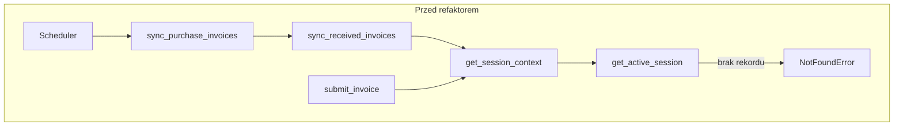
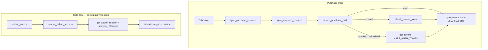

# GWO-IFG-0032 — KSeF Purchase Authentication Refactor

**Data:** 2026-07-07  
**Status:** zaimplementowano (bez deployu, bez migracji produkcyjnych)  
**Kontekst audytu:** `docs/reports/2026-07-07_KSEF_AUTO_SYNC_SESSION_DEPENDENCY_AUDIT.md`

---

## 🩷 STATUS KOŃCOWY

### ✅ Co działa

- `PurchaseAuthService.ensure_purchase_auth()` — pełny cykl: valid token → refresh → full auth.
- `sync_received_invoices()` używa purchase auth zamiast `get_session_context()`.
- Scheduler auto-sync może działać bez sesji online i bez kliknięcia „Połącz”.
- `refresh_access_token()` podłączony w `_refresh_tokens()`.
- Sprzedaż (`submit_invoice`, `poll_ksef_status`) nadal wymaga sesji online.
- **69 testów** jednostkowych KSeF-related — wszystkie przechodzą.

### ⚠️ Znane problemy

- Wymagany `KSEF_AUTH_TOKEN` w ENV workera dla pełnej autoryzacji w tle (jak przy ręcznym `open_session`).
- `refresh_access_token()` nie aktualizuje `refresh_token` z odpowiedzi KSeF (API zwraca ten sam refresh) — zgodne z obecną implementacją integracji.

### ❌ Co nie działa

- Brak — w zakresie zadania. Deploy **nie wykonano** (zgodnie z wymaganiami).

---

## A. Root cause

Scheduler działał poprawnie. Błąd `Brak aktywnej sesji KSeF` wynikał z architektury:

```
sync_received_invoices()
  → get_session_context()      # wymaga session_reference + kluczy
    → get_active_session()     # NotFoundError bez rekordu online
```

API zakupów KSeF wymaga wyłącznie **access tokena** — sesja online FA(3) jest potrzebna tylko do wysyłki faktur.

---

## B. Obecna architektura (przed refaktorem)



Jedna ścieżka `get_session_context()` obsługiwała zarówno zakupy, jak i sprzedaż.

---

## C. Nowa architektura (po refaktorze)



### Podział odpowiedzialności

| Komponent | Odpowiedzialność |
|-----------|------------------|
| `ksef_token_store.py` | Statusy DB, walidacja tokenów, budowa metadata |
| `PurchaseAuthService` | access/refresh token, auto-refresh, full auth |
| `KSeFSessionService` | open/close online session, sprzedaż, delegacja auth przy sync |
| `KSeFAuthProvider` | HTTP do KSeF: challenge, tokens, refresh |
| Scheduler / worker | Bez zmian — enqueue i handler |

---

## D. Diagram przepływu schedulera (docelowy)

```
Scheduler
    ↓
ensure_purchase_auth()
    ↓
[access ważny?] ──yes──→ sync_purchase_invoices → OK
    ↓ no
[refresh ważny?] ──yes──→ refresh_access_token()
    ↓ fail / no
get_tokens(KSEF_AUTH_TOKEN)
    ↓
sync_purchase_invoices()
    ↓
koniec
```

Bez: kliknięcia „Połącz”, aktywnej sesji online, interwencji operatora.

---

## E. Zmienione / nowe pliki

| Plik | Zmiana |
|------|--------|
| `app/services/ksef_token_store.py` | **NOWY** — wspólne typy i walidacja |
| `app/services/ksef_purchase_auth_service.py` | **NOWY** — purchase auth |
| `app/services/ksef_session_service.py` | Rozdzielenie online vs purchase; `ensure_online_session()` |
| `tests/unit/test_ksef_purchase_auth_service.py` | **NOWY** — scenariusze auth |
| `tests/unit/test_ksef_sync_service.py` | Mock `purchase_auth` zamiast `get_session_context` |
| `tests/unit/test_ksef_purchase_sync_resume.py` | j.w. |
| `tests/unit/test_ksef_session_service.py` | `TestEnsureOnlineSession`, fix mocków |
| `tests/unit/test_ksef_session_worker.py` | `_get_active_online_session` w mocku |
| `docs/architecture/KSEF_PURCHASE_AUTH.md` | **NOWY** |
| `docs/architecture/KSEF_SCHEDULER.md` | Sekcja purchase auth |

**Bez zmian:** worker handler, scheduler, API routery, mobile UI, `app/integrations/ksef/auth.py` (refresh już kompletny).

---

## F. Uzasadnienie decyzji

| Decyzja | Uzasadnienie |
|---------|--------------|
| Reuse tabeli `ksef_sessions` | Backward compatible, brak migracji |
| Status `auth_active` + `session_reference=NULL` | Jednoznaczne rozróżnienie purchase vs online |
| Osobny `PurchaseAuthService` | Single responsibility, testowalność |
| `open_session()` upgrade z `auth_active` | Operator może przejść do sprzedaży bez duplikatu rekordu |
| Pełna autoryzacja przy failed refresh | Odporność na unieważniony refresh token |
| `ensure_online_session()` jako alias | Jawna semantyka dla sprzedaży bez łamania API |

---

## G. Wpływ na kompatybilność

- **API:** bez zmian kontraktu HTTP.
- **DB:** nowa wartość `status='auth_active'` — kolumna tekstowa, bez ALTER.
- **Istniejące sesje online:** nadal `active` + `session_reference` — sprzedaż i zakupy OK.
- **UI:** `get_connection_status()` zwraca `PURCHASE_AUTH_ONLY` gdy tylko tokeny zakupowe.

---

## H. Ocena ryzyka

| Ryzyko | Poziom | Mitygacja |
|--------|--------|-----------|
| Brak `KSEF_AUTH_TOKEN` w prod | Średnie | Dokumentacja + istniejący guard w `open_session` |
| Regresja sprzedaży | Niskie | `get_session_context()` wymaga `session_reference`; testy poll/submit |
| Podwójne rekordy sesji | Niskie | Upgrade path w `open_session()` |
| Refresh token wygasły | Niskie | Fallback do full auth |

---

## I. Plan wdrożenia

1. Code review tego PR / brancha.
2. Upewnić się, że `KSEF_AUTH_TOKEN` jest w ENV workera (już wymagany dla `open_session`).
3. Uruchomić testy: `pytest tests/unit/test_ksef*.py`.
4. Uruchomić Guardian: `python scripts/guardian.py`.
5. Deploy backend + worker (bez migracji DB).
6. Monitor: `SCHEDULER_ENQUEUE` → job `sync_purchase_invoices` → `PURCHASE_IMPORT_SUMMARY` w dzienniku KSeF.
7. Opcjonalnie: pierwszy sync ręczny `POST /api/v1/ksef/sync/purchases` na staging.

**Migracja:** nie wymagana. Przygotowana konwencja statusów — brak skryptu Alembic.

---

## J. Plan rollback

1. Revert commitów GWO-IFG-0032.
2. Redeploy poprzedniej wersji backend/worker.
3. Rekordy `auth_active` w DB są nieszkodliwe dla starego kodu (traktowane jako brak sesji online) — opcjonalnie ręcznie `UPDATE status='expired'` jeśli potrzeba czystego stanu.
4. Auto-sync wróci do wymagania ręcznego „Połącz” — znane zachowanie z audytu.

---

## K. Nowe / zmodyfikowane testy

| Test | Scenariusz |
|------|------------|
| `test_full_auth_when_no_record` | Brak tokena → full auth → OK |
| `test_scheduler_path_no_token_then_sync_ok` | Ścieżka schedulera |
| `test_expired_access_refreshes` | Wygasły → refresh → OK |
| `test_refresh_failed_falls_back_to_full_auth` | Refresh fail → full auth |
| `test_returns_existing_valid_token` | Ważny token bez HTTP |
| `TestEnsureOnlineSession` | Sprzedaż wymaga online session |
| `test_ksef_poll_session_lookup` | Poll nadal znajduje sesję online |
| `test_ksef_session_worker` | `mark_session_expired` na online session |

Uruchomienie:

```bash
python -m pytest tests/unit/test_ksef_purchase_auth_service.py \
  tests/unit/test_ksef_session_service.py \
  tests/unit/test_ksef_sync_service.py \
  tests/unit/test_ksef_purchase_sync_resume.py \
  tests/unit/test_ksef_poll_session_lookup.py \
  tests/unit/test_ksef_session_worker.py -q
```

Wynik: **69 passed**.

---

## L. Wpływ na Guardian

- Brak nowych endpointów — Guardian MVP bez zmian w skanowaniu.
- Przed deployem: `python scripts/guardian.py` — exit 0 wymagany.
- Operacyjnie: worker musi mieć `KSEF_AUTH_TOKEN` (nie jest walidowany przez Guardian).

---

## M. Rekomendacja deployu

**Deploy możliwy po review**, gdy:

1. `KSEF_AUTH_TOKEN` potwierdzony w ENV produkcyjnym workera.
2. Testy KSeF green (dowód powyżej).
3. Guardian green.
4. Akceptacja: pierwszy auto-sync po deploy może utworzyć rekord `auth_active` — to oczekiwane.

**Nie deployować** bez `KSEF_AUTH_TOKEN` — scheduler nie uzyska tokenów w tle.

---

## N. Następny krok

- Staging: obserwacja slotu CRON 08:00 / 14:00 bez wcześniejszego „Połącz”.
- Opcjonalnie: UI badge `PURCHASE_AUTH_ONLY` z wyjaśnieniem „sync zakupów OK, wysyłka wymaga Połącz”.
