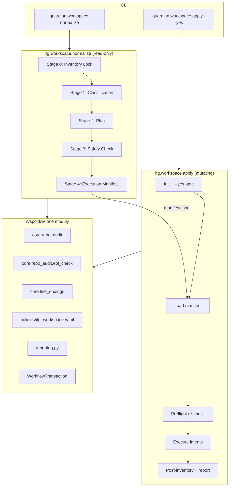

# GWO-IFG-0039 — Guardian Workspace Normalize Workflow

**Data:** 2026-07-08  
**Status:** Projekt architektury (bez implementacji, bez mutacji repo)  
**Zależność wejściowa:** [GWO-IFG-0038](2026-07-08_GWO-IFG-0038_WORKSPACE_NORMALIZATION_PLAN.md) — materiał referencyjny, nie specyfikacja 1:1  
**Branch referencyjny:** `production`  
**Cel:** Zaprojektować ogólny, wielokrotnego użytku workflow Guardiana do bezpiecznej normalizacji workspace przed większymi zmianami (nowy branch, nowy sprint, deploy, cutover).

---

## 1. Streszczenie wykonawcze

Guardian otrzymuje **dwa powiązane workflow**:

| Workflow ID | Tryb | Cel |
|-------------|------|-----|
| `ifg.workspace.normalize` | read-only (`mutating=False`) | Etapy 0–4 analizy: migawka → klasyfikacja → plan → safety check → manifest operacji |
| `ifg.workspace.apply` | mutating (`mutating=True`, `requires_yes=True`) | Wykonanie operacji z manifestu po wyraźnym potwierdzeniu operatora (`--yes`) |

Filozofia:

- **Branch-first** — domyślna strategia izolacji zmian to nowy branch (`git switch -c`), nie `git stash`.
- **Stash = emergency only** — tylko gdy branch nie jest możliwy (np. detached HEAD, konflikt nazw).
- **Raporty ≠ śmieci** — rozróżnienie dokumentacji projektowej, raportów historycznych i artefaktów generowanych automatycznie.
- **Zero auto-destruct** — Guardian nigdy nie wykonuje commita, restore, archive ani ignore bez osobnego polecenia `apply --yes`.

CLI docelowe:

```bash
# Analiza + plan (bezpieczne, domyślne)
python scripts/guardian.py workspace normalize

# Podgląd wykonania (symulacja)
python scripts/guardian.py workspace apply --dry-run

# Wykonanie po akceptacji planu
python scripts/guardian.py workspace apply --yes
```

---

## 2. Kontekst i problem

### 2.1. Co pokazał GWO-IFG-0038

Ręczna analiza 165 pozycji dirty tree w IFG standalone wykazała:

- zmiany produkcyjne wymieszane z eksperymentami Guardiana,
- ~85 plików dokumentacji/raportów,
- szum CRLF w plikach magazynowych,
- brak jednolitego mechanizmu decyzyjnego w Guardianie.

Plan 0038 był **jednorazowy i specyficzny dla bieżącego stanu repo**. GWO-IFG-0039 ma dostarczyć **trwały, powtarzalny mechanizm** działający w dowolnym projekcie IFG.

### 2.2. Luka w obecnym Guardianie

| Istniejący komponent | Zakres | Luka |
|---------------------|--------|------|
| `core.repo.audit` | status, klasyfikacja ryzyka, EOL | brak planu normalizacji, brak manifestu, brak inventory lock z hashami |
| `ifg.release.evaluate` | gotowość deployu | klasyfikacja release-specific (BLOCKER/WARNING), nie workspace |
| `ifg.deploy.run` | pipeline deployu | wymaga czystego drzewa; nie normalizuje go |
| `repo eol-check` | szum CRLF | tylko EOL, bez planu commit/branch/archive |

**Wniosek:** nowy plugin `workspace_normalize`, który **kompozycyjnie** wykorzystuje `core.repo_audit`, ale nie duplikuje ani nie rozszerza `release_evaluate/classification.py`.

---

## 3. Architektura wysokiego poziomu



### 3.1. Warstwy (zgodnie z konwencją Guardiana)

```
scripts/ifg_guardian/
├── plugins/ifg/workspace_normalize/     # NOWY — logika domenowa
│   ├── __init__.py
│   ├── workflow.py                      # IFG_WORKSPACE_NORMALIZE_WORKFLOW
│   ├── apply_workflow.py                # IFG_WORKSPACE_APPLY_WORKFLOW (v2)
│   ├── stages.py                        # Etapy 0–4
│   ├── apply_stages.py                  # Etapy apply
│   ├── models.py                        # WorkspaceNormalizeState, InventorySnapshot, ...
│   ├── classification.py                # Multi-signal classifier
│   ├── planner.py                       # Plan builder (akcje + uzasadnienia)
│   ├── safety.py                        # Safety checks
│   ├── manifest.py                      # Serializacja manifestu operacji
│   ├── service.py                       # get_state(ctx), helpers
│   ├── policy.py                        # Loader policies/ifg_workspace.yaml
│   └── report.py                        # terminal / markdown / json
├── modules/ifg_workspace_normalize.py   # CLI bridge
├── policies/ifg_workspace.yaml          # NOWY — reguły workspace (nie release)
└── cli.py                               # workspace normalize | apply
```

Rejestracja w `plugins/ifg/plugin.py`:

```python
IFG_WORKSPACE_NORMALIZE_WORKFLOW,
IFG_WORKSPACE_APPLY_WORKFLOW,  # v2 — po stabilizacji normalize
```

---

## 4. Etapy workflow `ifg.workspace.normalize`

### Etap 0 — Inventory Lock

**Cel:** Niezmienna migawka repo przed jakąkolwiek analizą. Stan zapisany w artefakcie transakcji — punkt odniesienia dla rollbacku audytowego.

**Zbierane dane (`InventorySnapshot`):**

| Pole | Źródło |
|------|--------|
| `timestamp` | UTC ISO-8601 |
| `head` | `git rev-parse HEAD` |
| `branch` | `git branch --show-current` |
| `remote` | `git remote get-url origin` (+ tracking branch) |
| `ahead` / `behind` | `git rev-list --left-right --count @{u}...HEAD` |
| `porcelain` | `git status --porcelain=v1` |
| `modified` | parsowane z porcelain (` M`, `M `, `MM`) |
| `staged` | parsowane z porcelain (`M `, `A `, `D `) |
| `untracked` | parsowane z porcelain (`??`) |
| `deleted` | parsowane z porcelain (` D`, `D `) |
| `file_hashes` | SHA-256 zawartości worktree per ścieżka objęta analizą |
| `change_counts` | `{modified, staged, untracked, deleted, total}` |
| `inventory_id` | UUID powiązany z `WorkflowTransaction` |

**Implementacja:**

- Rozszerzenie `core.repo_audit.service.collect_git_status()` — nie fork.
- Nowy intent `GitRemoteIntent` (opcjonalnie) lub lokalny `subprocess` w service (jak `collect_git_status`).
- Hashe: `hashlib.sha256(Path(path).read_bytes())` dla każdej ścieżki z porcelain; dla deleted — hash pusty + flaga `missing`.
- Artefakt: `.guardian/workflows/{txn_id}/inventory_lock.json` + wpis w `transaction.artifacts`.

**Gwarancja:** Etap 0 jest **pierwszym** stage; żaden późniejszy stage nie modyfikuje plików. `mutating=False`.

---

### Etap 1 — Klasyfikacja

**Cel:** Przypisanie każdej pozycji z inventory do klasy semantycznej z uzasadnieniem wielosygnałowym.

**Enum `WorkspaceItemClass`:**

| Klasa | Opis |
|-------|------|
| `PRODUCTION_FIX` | Poprawka produkcyjna (hotfix, schema fix, polityka deploy) |
| `CURRENT_FEATURE` | Aktywna funkcja w toku (GWO bieżącego sprintu) |
| `EXPERIMENTAL` | Eksperyment / WIP bez ticketu produkcyjnego |
| `GENERATED` | Artefakt buildowy, cache, dist (nie commitować) |
| `DOCUMENTATION` | Dokumentacja projektowa (README, ADR, reguły `.cursor/`) |
| `REPORT` | Raport historyczny (`docs/reports/`, `docs/guardian/`) |
| `CRLF_EOL_NOISE` | Zmiana wyłącznie końców linii |
| `UNKNOWN` | Niewystarczająca pewność — wymaga review |

**Klasyfikator wielosygnałowy (`classification.py`):**

Każdy plik otrzymuje `ClassificationResult`:

```python
@dataclass
class ClassificationResult:
    path: str
    git_status: str
    workspace_class: WorkspaceItemClass
    confidence: float          # 0.0–1.0
    signals: list[Signal]      # audytowalna lista dowodów
    policy_rule_ids: list[str] # reguły YAML które zadziałały
```

**Sygnały (kolejność ważenia, nie wyłączność):**

| Sygnał | Moduł źródłowy | Przykład |
|--------|----------------|----------|
| `path_pattern` | `policy.py` + `ifg_workspace.yaml` | `docs/reports/**` → REPORT |
| `git_diff_stat` | `git diff --numstat` | 0 insertions, 0 deletions, binary unchanged → CRLF candidate |
| `eol_analysis` | `core.repo_audit.eol_check` | `LOGICAL_CHANGE` vs `EOL_ONLY` |
| `line_endings` | `core.line_endings` | confidence HIGH → CRLF_EOL_NOISE |
| `content_vs_head` | `eol_check._normalized_content_matches_head` | restore candidate |
| `recent_commits` | `git log -5 --oneline -- path` | plik w ostatnim GWO → CURRENT_FEATURE |
| `branch_context` | `inventory.branch` | zmiany na `production` + `app/` → wyższa waga PRODUCTION_FIX |
| `repo_audit_category` | `core.repo_audit.classifier` | mapowanie `FileCategory` → `WorkspaceItemClass` |
| `guardian_policy` | `ifg_production.yaml` patterns | `.env` → UNKNOWN + BLOCKER w safety |
| `untracked_suspicious` | `non_report_untracked_block_patterns` | współdzielone z release policy |

**Zasada:** żaden plik nie jest klasyfikowany **wyłącznie** po ścieżce. Ścieżka to jeden sygnał (`weight` konfigurowalny w YAML). Próg `confidence < 0.5` → `UNKNOWN`.

**Rozróżnienie dokumentacji (wymaganie użytkownika):**

| Typ | Ścieżki (przykład) | Domyślna polityka |
|-----|-------------------|-------------------|
| Dokumentacja projektowa | `README.md`, `docs/architecture/`, `.cursor/rules/` | `ARCHIVE` lub `COMMIT` jeśli część GWO |
| Raport historyczny | `docs/reports/YYYY-*_GWO-*.md` | `ARCHIVE` (osobny commit docs) |
| Artefakt Guardian auto | `docs/guardian/*.md`, `.guardian/workflows/` | `IGNORE` / nie commitować do repo głównego |

---

### Etap 2 — Plan

**Cel:** Dla każdej pozycji (lub logicznego **bundle'a**) wygenerować rekomendowaną akcję z uzasadnieniem tekstowym.

**Enum `NormalizeAction`:**

| Akcja | Znaczenie |
|-------|-----------|
| `COMMIT` | Włączyć do commita na bieżącym branchu |
| `BRANCH` | Przenieść na nowy branch (preferowane nad stash) |
| `ARCHIVE` | Osobny commit dokumentacji lub katalog archiwum |
| `IGNORE` | Pozostawić untracked / dodać do `.gitignore` (propozycja) |
| `REVIEW` | Wymaga decyzji operatora |
| `RESTORE` | `git checkout -- path` (odrzucenie szumu) |
| `GENERATED_ARTIFACT` | Artefakt buildowy — nie śledzić |

**Struktura planu (`NormalizationPlan`):**

```python
@dataclass
class PlanItem:
    paths: list[str]
    workspace_class: WorkspaceItemClass
    action: NormalizeAction
    rationale: str                    # obowiązkowe uzasadnienie
    bundle_id: str                    # grupowanie logiczne, np. "gwo-0037"
    branch_name: str | None           # dla BRANCH: proponowana nazwa
    commit_message_hint: str | None   # dla COMMIT/ARCHIVE
    priority: int                     # kolejność wykonania
    signals_summary: list[str]        # skrót sygnałów z klasyfikacji
```

**Reguły planowania (`planner.py`):**

1. `CRLF_EOL_NOISE` + `restore_recommended` → `RESTORE` (nie commit).
2. `EXPERIMENTAL` → `BRANCH` z nazwą `workspace/{date}-{slug}` (nie stash).
3. `REPORT` → `ARCHIVE` (osobny commit `docs: archive reports YYYY-MM-DD`).
4. `GENERATED` / `GENERATED_ARTIFACT` → `IGNORE` + propozycja wpisu `.gitignore`.
5. `PRODUCTION_FIX` + branch `production` → `COMMIT` z hintem GWO.
6. `UNKNOWN` → `REVIEW` (blokuje auto-apply).
7. Wiele plików tej samej klasy + wspólny `bundle_id` → jeden `PlanItem`.

**Stash (emergency):**

```yaml
# policies/ifg_workspace.yaml
isolation:
  preferred: branch
  fallback: stash          # tylko gdy branch niemożliwy
  stash_conditions:
    - detached_head
    - branch_name_collision
```

Gdy `stash` jest jedyną opcją — plan oznacza `action: BRANCH` z `fallback: stash` i `REVIEW` obowiązkowe.

---

### Etap 3 — Safety Check

**Cel:** Ocena ryzyka przed wygenerowaniem manifestu. Integracja z policy engine tam, gdzie reguły są współdzielone.

**Sprawdzane warunki (`safety.py`):**

| Check ID | Opis | Severity |
|----------|------|----------|
| `DATA_LOSS_RISK` | Plan zawiera RESTORE na plikach ze `SUBSTANTIVE` diff | BLOCKER |
| `BRANCH_CORRECTNESS` | Operator na `production` + plan COMMIT eksperymentów | BLOCKER |
| `MERGE_CONFLICTS` | `git diff --check` / conflict markers w zmienionych plikach | BLOCKER |
| `UNCLASSIFIED_ITEMS` | `UNKNOWN` count > `max_unknown_without_review` | BLOCKER |
| `PLAN_CONSISTENCY` | Ten sam plik w >1 akcji; sprzeczne bundle | BLOCKER |
| `SUSPICIOUS_UNTRACKED` | `.env`, `credentials` (z `ifg_production.yaml`) | BLOCKER |
| `INVENTORY_DRIFT` | Porównanie bieżącego status z inventory lock (jeśli etap >0 minął >N s) | WARNING |
| `PRODUCTION_BRANCH_COMMIT` | COMMIT na production bez GWO prefix | WARNING |

**Wynik:** `SafetyReport` z `status: PASS | BLOCKED | WARN` i listą `SafetyFinding`.

- `BLOCKED` → manifest generowany z `executable: false`, exit code 2.
- `WARN` → manifest z `executable: true` + `requires_explicit_ack: true`.

**Policy engine:**

- Współdzielone wzorce z `ifg_production.yaml`: `report_paths`, `non_report_untracked_block_patterns`.
- Nowe reguły workspace-specific w `policies/ifg_workspace.yaml` (sekcja `safety_rules`).
- Loader wzorowany na `release_evaluate/policy_engine.py` — **osobny moduł**, nie import `finalize_classification()`.

---

### Etap 4 — Execution Manifest (bez wykonania)

**Cel:** Przygotować kolejkę operacji do wykonania przez `ifg.workspace.apply`. **Żadna operacja nie jest wykonywana** w tym workflow.

**Manifest (`manifest.json`):**

```json
{
  "schema": "workspace_normalize_manifest_v1",
  "inventory_id": "uuid",
  "transaction_id": "2026-07-08T..._ifg_workspace_normalize",
  "created_at": "2026-07-08T12:00:00Z",
  "source_head": "876900f",
  "source_branch": "production",
  "executable": true,
  "requires_explicit_ack": false,
  "safety_status": "PASS",
  "operations": [
    {
      "id": "op-001",
      "type": "restore",
      "paths": ["app/persistence/repositories/transmission_repository.py"],
      "rationale": "CRLF-only diff, no logic change (eol_check LOGICAL_CHANGE=false)",
      "mutating": true,
      "rollback": "git checkout {source_head} -- {paths}"
    },
    {
      "id": "op-002",
      "type": "branch",
      "branch_name": "workspace/2026-07-08-guardian-experiments",
      "paths": ["scripts/ifg_guardian/core/progress/"],
      "rationale": "EXPERIMENTAL class, isolate from production",
      "mutating": true,
      "rollback": "git switch {source_branch}"
    }
  ]
}
```

**Typy operacji manifestu:**

| type | Intent docelowy (apply) | mutating |
|------|-------------------------|----------|
| `restore` | `LocalExecIntent(["git", "checkout", "--", path])` | yes |
| `branch` | `LocalExecIntent(["git", "switch", "-c", name])` + optional path add | yes |
| `commit` | `LocalExecIntent(["git", "add", ...])` + `git commit -m` | yes |
| `archive` | commit na branch `docs/archive-*` lub osobny commit | yes |
| `ignore` | propozycja diff `.gitignore` (REVIEW jeśli plik tracked) | conditional |
| `noop_review` | tylko raport, bez git | no |

Manifest zapisywany jako artefakt transakcji i referencja w raporcie markdown.

---

## 5. Workflow `ifg.workspace.apply` (faza 2 implementacji)

**Cel:** Wykonanie operacji z manifestu po potwierdzeniu operatora.

| Właściwość | Wartość |
|------------|---------|
| `mutating` | `True` |
| `requires_yes` | `True` |
| `depends_on` | opcjonalnie `ifg.workspace.normalize` (ten sam txn lub `--manifest PATH`) |

**Etapy:**

1. **InitStage** — gate `--yes` (wzorzec `deploy_run/stages.py`).
2. **LoadManifestStage** — wczytaj manifest, zweryfikuj schema i `inventory_id`.
3. **PreflightStage** — re-run safety na aktualnym drzewie vs inventory (wykrycie drift).
4. **ExecuteStage** — kolejno wykonuj operacje przez `LocalExecIntent` / przyszłe `GitCheckoutIntent`.
5. **PostInventoryStage** — nowa migawka (mini inventory lock).
6. **SummaryStage** — raport wykonania + rollback hints.

**Tryby:**

| CLI | ExecutionMode |
|-----|---------------|
| domyślny (bez flag) | odrzucone — wymaga `--dry-run` lub `--yes` |
| `--dry-run` / `--plan` | DRY_RUN — log operacji, brak mutacji |
| `--yes` | LIVE — wykonanie |

**DS723 guard:** `core.execution_guard.py` blokuje LIVE na serwerze produkcyjnym — apply musi działać lokalnie.

---

## 6. Integracja z istniejącym Guardianem

### 6.1. Workflow engine

- Rejestracja przez `IFGPlugin.workflows()` — jak `ifg.release.evaluate`.
- `WorkflowTransaction` — nowe pole `workspace_normalize: dict` i `workspace_apply: dict` (analogia do `release_evaluate`).
- Transakcje w `.guardian/workflows/{timestamp}_{workflow_id}/transaction.json`.
- `depends_on=["core.repo.audit"]` — **opcjonalne**; preferowane wbudowanie etapów audit zamiast pełnej zależności (uniknięcie podwójnego raportu).

### 6.2. Repo audit — kompozycja, nie duplikacja

| Funkcja repo_audit | Użycie w workspace_normalize |
|--------------------|------------------------------|
| `collect_git_status()` | Etap 0 — rozszerzony o remote |
| `parse_changed_paths()` | Etap 0 — listy modified/staged/untracked |
| `classify_modified_path()` / `classify_untracked()` | Sygnał wejściowy klasyfikatora |
| `classify_line_endings()` | Sygnał CRLF |
| `eol_check` | Etap 1 — decyzja RESTORE vs COMMIT |
| `build_recommended_actions()` | Inspiracja dla planner, nie bezpośredni import |

**Nie rozszerzamy** `core.repo.audit` o logikę GWO — plugin IFG pozostaje właścicielem semantyki normalizacji.

### 6.3. Release evaluate — granice

| Element | Reuse? |
|---------|--------|
| `ClassifiedFinding`, `FindingCategory` | Nie — inna taksonomia |
| `policy_engine.load_policy_config()` | Tak — wzorzec loadera |
| `is_local_environment_error()` | Tak — jeśli normalize uruchamia pytest |
| `finalize_classification()` | Nie |
| `report.py` sekcje (BLOCKERS/...) | Wzorzec formatowania, nie import |

### 6.4. System raportów

- Prefix: `IFG_WORKSPACE_NORMALIZE` → `docs/guardian/IFG_WORKSPACE_NORMALIZE_2026_07_08.md`
- `write_report()` / `default_report_path()` z `reporting.py`.
- Sekcje raportu markdown:
  1. Executive Summary (status, liczba plików, safety)
  2. Inventory Lock (HEAD, branch, timestamp, counts)
  3. Classification table (path, class, confidence, top signals)
  4. Normalization Plan (action, bundle, rationale)
  5. Safety Findings
  6. Execution Manifest (operations preview)
  7. Recommended Operator Commands
  8. Appendix: pełne `inventory_lock.json` (lub link)

JSON schema: `ifg_workspace_normalize_report_v1`.

### 6.5. Policy engine

Nowy plik `policies/ifg_workspace.yaml`:

```yaml
version: v1
classification:
  path_signals:
    - pattern: "docs/reports/**"
      class: REPORT
      weight: 0.6
    - pattern: "docs/guardian/**"
      class: GENERATED
      weight: 0.7
    - pattern: "**/node_modules/**"
      class: GENERATED
      weight: 0.95
  min_confidence: 0.5
planning:
  default_experimental_branch_prefix: "workspace/"
  documentation_archive_branch: "docs/archive"
  prefer_branch_over_stash: true
safety:
  max_unknown_without_review: 0
  block_restore_on_substantive_diff: true
  production_branches: ["production", "main"]
shared_policy_refs:
  - ifg_production.yaml:report_paths
  - ifg_production.yaml:non_report_untracked_block_patterns
```

---

## 7. Model danych (skrót)

```python
# plugins/ifg/workspace_normalize/models.py

@dataclass
class InventorySnapshot: ...

@dataclass
class ClassifiedWorkspaceItem:
    path: str
    classification: ClassificationResult
    repo_audit_file: ClassifiedFile | None  # opcjonalny link

@dataclass
class WorkspaceNormalizeState:
    inventory: InventorySnapshot
    items: list[ClassifiedWorkspaceItem]
    plan: NormalizationPlan
    safety: SafetyReport
    manifest: ExecutionManifest | None
    status: str  # PASS | BLOCKED | WARN
```

Serializacja: `to_dict()` / `from_dict()` — konwencja jak `ReleaseEvaluateState`.

---

## 8. CLI — szczegóły

### `guardian workspace normalize`

```
usage: guardian workspace normalize [--fetch] [--json | --markdown] [--report PATH]
                                    [--progress] [--no-progress]

Options:
  --fetch          git fetch przed inventory (opcjonalnie)
  --json           raport JSON na stdout
  --markdown       raport markdown (domyślnie: terminal + zapis do docs/guardian/)
  --report PATH    nadpisanie ścieżki raportu
```

Exit codes:

| Code | Znaczenie |
|------|-----------|
| 0 | Plan gotowy, safety PASS |
| 1 | Błąd wykonania workflow |
| 2 | Safety BLOCKED lub UNKNOWN bez review |

### `guardian workspace apply`

```
usage: guardian workspace apply [--manifest PATH] [--dry-run | --yes]
                                [--json | --markdown] [--report PATH]

  --manifest PATH  domyślnie: ostatni manifest z bieżącej transakcji normalize
  --dry-run        symulacja (DRY_RUN)
  --yes            potwierdzenie LIVE
```

---

## 9. Plan implementacji

### Faza 1 — MVP normalize (read-only) — GWO-IFG-0040

| Krok | Zadanie | Pliki | Szacunek |
|------|---------|-------|----------|
| 1.1 | Modele `InventorySnapshot`, `WorkspaceNormalizeState` | `models.py` | 1d |
| 1.2 | Etap 0 — inventory lock + hashe | `stages.py`, `service.py` | 1d |
| 1.3 | `ifg_workspace.yaml` + loader | `policy.py`, `policies/` | 0.5d |
| 1.4 | Klasyfikator wielosygnałowy | `classification.py` | 2d |
| 1.5 | Planner z rationale | `planner.py` | 1d |
| 1.6 | Safety checks | `safety.py` | 1d |
| 1.7 | Manifest generator (bez wykonania) | `manifest.py` | 0.5d |
| 1.8 | Raport markdown/json/terminal | `report.py` | 1d |
| 1.9 | Workflow + rejestracja plugin | `workflow.py`, `plugin.py` | 0.5d |
| 1.10 | CLI + module bridge | `cli.py`, `modules/ifg_workspace_normalize.py` | 0.5d |
| 1.11 | Testy jednostkowe | `tests/unit/test_guardian_workspace_normalize*.py` | 2d |
| 1.12 | Pole `workspace_normalize` w transaction | `transaction.py` | 0.25d |

**Deliverable fazy 1:** `guardian workspace normalize` produkuje raport + manifest; zero mutacji.

### Faza 2 — Apply workflow — GWO-IFG-0041

| Krok | Zadanie |
|------|---------|
| 2.1 | `ifg.workspace.apply` workflow + stages |
| 2.2 | `--yes` gate, dry-run, DS723 guard |
| 2.3 | Wykonanie operacji: restore, branch, commit, archive |
| 2.4 | Post-inventory + raport wykonania |
| 2.5 | Testy integracyjne na repo testowym (git fixture) |

### Faza 3 — Integracja z Release Engine — GWO-IFG-0042

| Krok | Zadanie |
|------|---------|
| 3.1 | `ifg.release.evaluate` — opcjonalna zależność od świeżego normalize |
| 3.2 | Blocker `workspace_not_normalized` gdy UNKNOWN > 0 na production |
| 3.3 | Link w raporcie evaluate → ostatni manifest normalize |

### Faza 4 — Rozszerzenia

- `RepoAuditExtension` dla pluginów — custom classifiers per projekt.
- `guardian workspace normalize explain` — dump reguł YAML (wzorzec `release explain`).
- Dashboard progress dla długich inventory (hash 150+ plików).

---

## 10. Uzasadnienie decyzji projektowych

| Decyzja | Alternatywa | Uzasadnienie |
|---------|-------------|--------------|
| Dwa workflow (normalize + apply) | Jedno workflow z flagą `--execute` | Spójność z `release.evaluate` + `deploy.run`; wyraźna separacja read/write |
| Branch-first | Stash-first (jak 0038) | Wymóg użytkownika; branch zachowuje kontekst, historię i reviewability |
| Osobny `ifg_workspace.yaml` | Rozszerzenie `ifg_production.yaml` | Reguły workspace nie są regułami deployu; łatwiejsze testowanie i reuse między projektami |
| Manifest JSON | Bezpośrednie git w normalize | Wymóg „Etap 4 bez wykonania”; audytowalny kontrakt między analizą a apply |
| Multi-signal classifier | Tylko ścieżki (jak 0038) | Wymóg użytkownika; ścieżka to jeden sygnał, nie jedyny |
| Hashe w inventory | Tylko porcelain | Wykrywanie drift między etapami; dowód w raportach GWO |
| `UNKNOWN` blokuje apply | Auto-ignore unknown | Bezpieczeństwo — brak cichej utraty zmian |
| Stash jako fallback | Usunięcie stash | Wymóg — emergency path dla edge cases |

---

## 11. Ryzyka

| Ryzyko | Prawdopodobieństwo | Wpływ | Mitygacja |
|--------|-------------------|-------|-----------|
| Fałszywe `CRLF_EOL_NOISE` → RESTORE utraci zmiany | Średnie | Wysoki | `block_restore_on_substantive_diff`; wymóg `eol_check` + diff stat |
| Zbyt wiele sygnałów → wolny inventory | Średnie | Średni | Limit plików; równoległe hashowanie; skip binary >N MB |
| Konflikt z ręcznymi zmianami podczas normalize | Niskie | Średni | `INVENTORY_DRIFT` warning; krótki czas etapów |
| Operator commituje eksperymenty na production | Średnie | Wysoki | Safety `BRANCH_CORRECTNESS`; WARN na COMMIT bez GWO prefix |
| Duplikacja z repo_audit | Średnie | Niski | Ścisła kompozycja — import funkcji, nie kopiowanie |
| Manifest nieaktualny przy opóźnionym apply | Średnie | Wysoki | Preflight re-check w apply; odrzucenie jeśli head != source_head |
| Stash fallback użyty zbyt często | Niskie | Średni | Telemetry w raporcie; WARNING gdy stash zamiast branch |

---

## 12. Przyszłe możliwości rozwoju

1. **Workspace profiles** — `normalize --profile sprint-start|pre-deploy|post-gwo` z gotowymi presetami planu.
2. **Cross-repo normalize** — monorepo z wieloma `ROOT` (mobile-expo + backend).
3. **IDE integration** — Cursor rule wywołująca `guardian workspace normalize` przed sugerowaniem commita.
4. **Automatic bundle detection** — ML/heurystyka na `git log --follow` do grupowania plików jednego GWO.
5. **Guardian Cloud artifact storage** — inventory lock w S3 zamiast lokalnego `.guardian/`.
6. **Policy as code** — reguły klasyfikacji w `.cursor/rules/` czytane przez `policy.py`.
7. **Normalize diff view** — terminalowy TUI (rich) z podglądem planu per bundle.

---

## 13. Rekomendowane kolejne GWO

| GWO | Tytuł | Priorytet | Zależność |
|-----|-------|-----------|-----------|
| **GWO-IFG-0040** | Workspace Normalize MVP (etapy 0–4, read-only) | P0 | 0039 |
| **GWO-IFG-0041** | Workspace Apply (`--yes`, restore/branch/commit) | P0 | 0040 |
| **GWO-IFG-0042** | Integracja normalize ↔ release.evaluate | P1 | 0040 |
| **GWO-IFG-0043** | Etap B/C wykonanie na bieżącym repo (operator + apply) | P1 | 0041 |
| **GWO-IFG-0044** | `RepoAuditExtension` — plugin API dla klasyfikatorów | P2 | 0040 |
| **GWO-IFG-0045** | Workspace profiles (`sprint-start`, `pre-deploy`) | P2 | 0040 |

**Natychmiastowy następny krok:** GWO-IFG-0040 — implementacja `ifg.workspace.normalize` zgodnie z sekcją 9, fazą 1.

---

## 14. Przykładowy przebieg (scenariusz IFG standalone)

Stan po GWO-IFG-0038A: ~151 dirty items na `production`, HEAD `876900f`.

```bash
# 1. Analiza
python scripts/guardian.py workspace normalize --markdown

# Oczekiwany output (skrót):
# Inventory: 151 items, HEAD 876900f, branch production
# Classes: PRODUCTION_FIX 0, CURRENT_FEATURE 0, EXPERIMENTAL 54,
#          REPORT 72, CRLF_EOL_NOISE 7, DOCUMENTATION 12, UNKNOWN 6
# Safety: WARN (6 UNKNOWN)
# Manifest: 8 operations, executable=false

# 2. Operator review — rozstrzyga UNKNOWN (np. scripts/ds723.env → REVIEW)

# 3. Ponowna analiza po ręcznym pliku override (przyszła flaga --override)

# 4. Apply (po 0041)
python scripts/guardian.py workspace apply --dry-run
python scripts/guardian.py workspace apply --yes
```

Plan dla bieżącego repo (walidacja projektu vs 0038):

| Grupa 0038 | WorkspaceItemClass | NormalizeAction |
|------------|-------------------|-----------------|
| Resztki 0036 (już commit 0038A) | — | — |
| Guardian experiments (54) | EXPERIMENTAL | BRANCH |
| docs/reports (72) | REPORT | ARCHIVE |
| docs/guardian artifacts | GENERATED | IGNORE |
| CRLF noise (7) | CRLF_EOL_NOISE | RESTORE |
| ds723.env, WIP audit | UNKNOWN → REVIEW | REVIEW |

---

## 15. Mapowanie wymagań → architektura

| Wymaganie użytkownika | Realizacja |
|----------------------|------------|
| Etap 0 — Inventory Lock | `InventoryLockStage`, `inventory_lock.json` |
| Etap 1 — Klasyfikacja wielosygnałowa | `classification.py` + `ifg_workspace.yaml` |
| Etap 2 — Plan z uzasadnieniem | `planner.py`, `PlanItem.rationale` |
| Etap 3 — Safety Check | `safety.py`, integracja policy |
| Etap 4 — bez auto-wykonania | `manifest.py`; wykonanie w `ifg.workspace.apply` |
| Branch > stash | `planning.prefer_branch_over_stash` |
| Raporty ≠ śmieci | klasy REPORT / DOCUMENTATION / GENERATED |
| Zgodność z architekturą Guardiana | plugin + stages + module + transaction |
| Brak duplikacji | kompozycja `core.repo_audit` |
| `guardian workspace normalize` | `cli.py` — nowy subparser `workspace` |

---

## 16. Pliki do utworzenia / modyfikacji (checklist implementacyjna)

**Nowe:**

- `scripts/ifg_guardian/plugins/ifg/workspace_normalize/` (cały pakiet)
- `scripts/ifg_guardian/modules/ifg_workspace_normalize.py`
- `scripts/ifg_guardian/policies/ifg_workspace.yaml`
- `tests/unit/test_guardian_workspace_normalize_workflow.py`
- `tests/unit/test_guardian_workspace_classification.py`

**Modyfikacje:**

- `scripts/ifg_guardian/plugins/ifg/plugin.py` — rejestracja workflow
- `scripts/ifg_guardian/cli.py` — subparser `workspace`
- `scripts/ifg_guardian/core/workflow/transaction.py` — pola `workspace_normalize`, `workspace_apply`

**Bez zmian w tym GWO:**

- Kod produkcyjny aplikacji (`app/`, `frontend-react/`)
- `git` state repo
- `ifg_production.yaml` (tylko odczyt współdzielonych wzorców)

---

*Dokument przygotowany w ramach GWO-IFG-0039. Implementacja kodu — po akceptacji architektury przez operatora (GWO-IFG-0040).*
