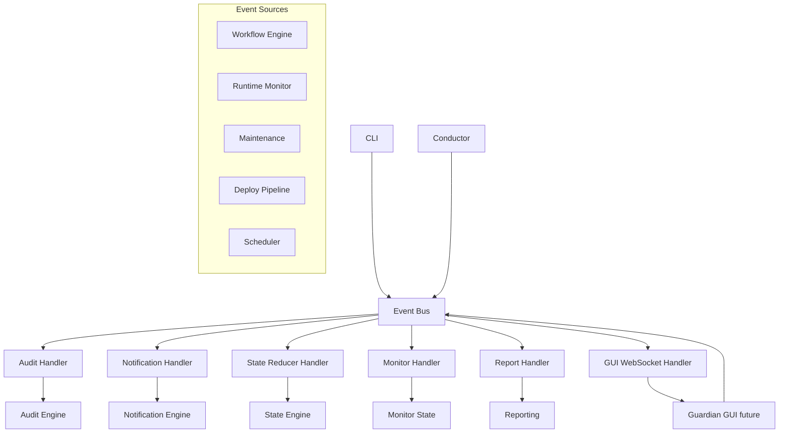
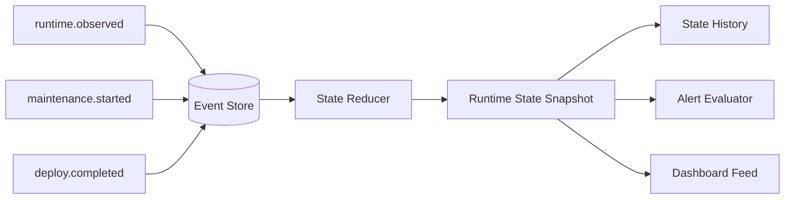
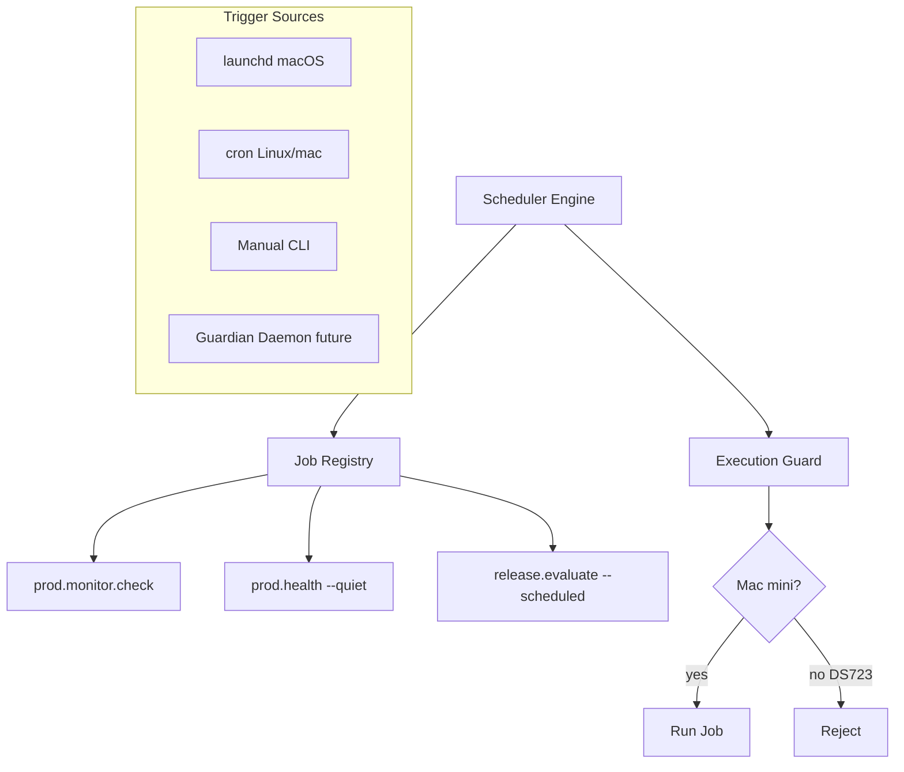
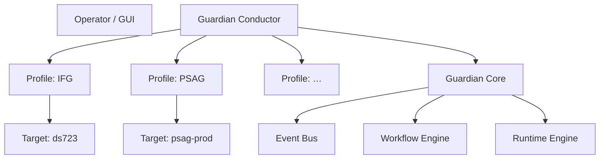
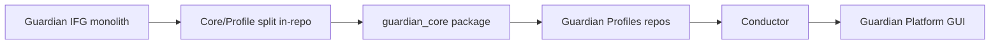
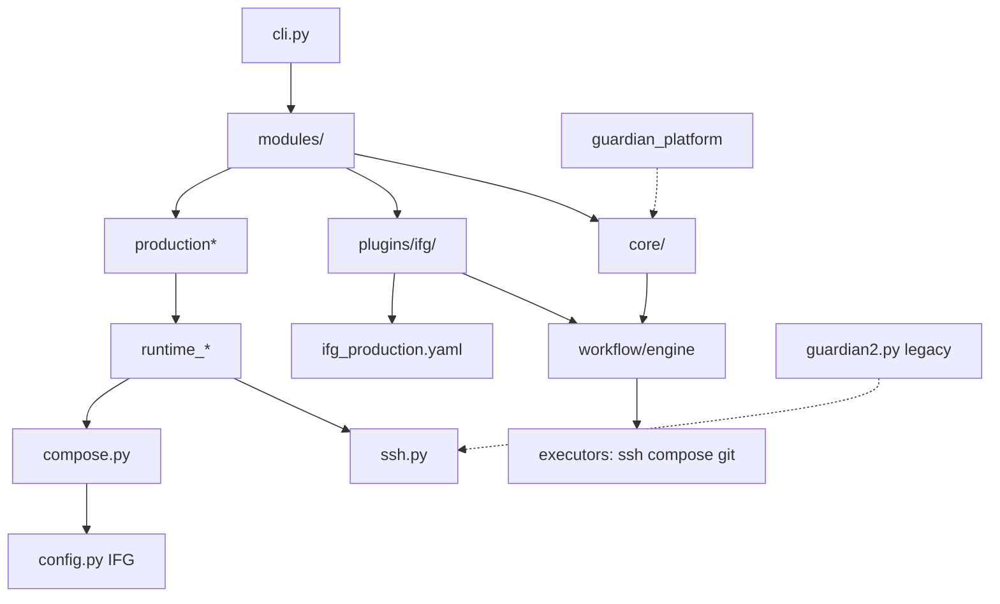

# GWO-IFG-0073 — Guardian Core Foundation w IFG

**Data:** 2026-07-11  
**Typ:** Architektura (bez implementacji, bez refactoringu)  
**Werdykt:** **ARCHITECTURE FOUNDATION DOCUMENTED**

**Kontekst wejściowy:** Po GWO-IFG-0072 Guardian IFG posiada Runtime Engine, Maintenance Mode, Runtime Monitor, Runtime Audit, launchd Scheduler. Niniejszy GWO wydziela fundament przyszłego **Guardian Core** bez osobnego repozytorium i bez zmiany zachowania produkcji.

---

## LAMUS — rejestracja GDD

| Żądane LAMUS | Zarejestrowane ID | Uwaga |
|---|---|---|
| GDD-0011 — rotacja audit YYYY/MM/DD | **GDD-0015** | GDD-0011 = Report Metadata (DONE) |
| GDD-0012 — Runtime State Engine | **GDD-0014** | GDD-0012 = dirty-tree loop (OPEN) |
| GDD-0013 — Notification Engine | **GDD-0013** | nowy |

Wpisy: `docs/guardian/deferred_decisions.json`

---

## ETAP 1 — Skan modułów Guardiana

### Źródła w repozytorium

| Drzewo | Pliki .py | Rola |
|---|---|---|
| `scripts/ifg_guardian/` | ~173 | **Aktywny** CLI + workflow engine + runtime (0072) |
| `scripts/guardian_platform/` | ~112 | **Równoległy** profil platformy (M3, cleanup) |
| `scripts/guardian2.py` | 1 | Legacy deploy/recovery DS723+ |
| `scripts/guardian.py` | 1 | Legacy MVP (endpoint parity, deploy check) |

**Uwaga:** Dwa silniki współistnieją (`ifg_guardian` = produkcyjny path; `guardian_platform` = eksperymentalny/prototypowy). Migracja Core musi uwzględnić konwergencję, nie duplikację.

### Mapa klasyfikacji (skrót)

Legenda kolumn: **IFG** = zna domenę IFG | **Docker** | **KSeF** | **Prod** = produkcja DS723+ | **Uniw.**

#### A) Guardian Core — kandydaci do wydzielenia

| Moduł | Odpowiedzialność | Zależności | IFG | Docker | KSeF | Prod | Uniw. |
|---|---|---|---|---|---|---|---|
| `core/workflow/*` | Silnik workflow, stage, transaction, state machine | plugins, executors | — | — | — | — | ✅ |
| `core/workflow/executors/*` | local, git, ssh, http, compose, docker, fs | ssh, subprocess | — | częściowo | — | — | ✅ |
| `core/plugins/*` | Plugin bootstrap, registry, loader | workflow | — | — | — | — | ✅ |
| `plugins/core/*` | Core workflows (repo_audit, ping) | repo_audit | — | — | — | — | ✅ |
| `core/preflight/*` | Safety Gate, probes, engine | deploy_config⚠️ | — | częściowo | — | częściowo | ✅ |
| `core/execution/*` | Operation/Deployment engine, backends, capability | compose, synology | — | ✅ | — | — | ✅ |
| `core/execution/event_bus.py` | Event envelope (stub) | — | — | — | — | — | ✅ |
| `core/repo_audit/*` | Klasyfikacja zmian, ryzyko, raport | git, config⚠️ | — | — | — | — | ✅ |
| `core/progress/*` | GWO_PROGRESS protocol, timeline | — | — | — | — | — | ✅ |
| `core/dashboard/*` | Live terminal dashboard | rich | — | — | — | — | ✅ |
| `core/reporting/*` | Debt sections, report helpers | — | — | — | — | — | ✅ |
| `core/deferred_decisions/*` | GDD registry | JSON store | — | — | — | — | ✅ |
| `core/report_metadata.py` | YAML front matter raportów | — | — | — | — | — | ✅ |
| `core/runtime_store.py` | Atomowy JSON w `.state/` | pathlib | — | — | — | — | ✅ |
| `core/runtime_audit.py` | JSONL audit trail | runtime_store | — | — | — | częściowo | ✅ |
| `core/runtime_monitor.py` | Stanowy monitor, próg 10 min | notify, store | — | — | — | częściowo | ✅ |
| `core/runtime_notify.py` | Notification sink (log) | — | — | — | — | — | ✅ |
| `core/runtime_status.py` | Klasyfikacja runtime statusów | compose⚠️ | — | — | — | częściowo | ✅ |
| `core/runtime_maintenance.py` | Marker maintenance | runtime_store | — | — | — | — | ✅ |
| `core/ssh.py` | SSH remote exec | — | — | — | — | częściowo | ✅ |
| `core/git.py` | Git helpers | config⚠️ | — | — | — | — | ✅ |
| `core/compose.py` | Parse compose ps, health | REQUIRED_SERVICES⚠️ | — | ✅ | — | — | ✅ |
| `core/execution_guard.py` | Blokada mutacji na DS723+ | hostname, path | — | — | — | ✅ | ✅ |
| `core/line_endings.py` | EOL policy | — | — | — | — | — | ✅ |
| `core/risk.py` | Risk levels | — | — | — | — | — | ✅ |
| `core/time_compat.py` | UTC compat | — | — | — | — | — | ✅ |
| `core/clipboard.py` | macOS pbcopy | — | — | — | — | — | ✅ |
| `modules/deferred_decisions.py` | CLI GDD | deferred_decisions | — | — | — | — | ✅ |
| `modules/repo_audit.py` | CLI repo audit | core workflow | — | — | — | — | ✅ |
| `modules/workflow.py` | Generic workflow runner | engine | — | — | — | — | ✅ |
| `guardian_platform/core/*` | Duplikat koncepcji: workflow, registry, repository | profiles | — | — | — | — | ✅ |

#### B) Guardian IFG — profil domenowy

| Moduł | Odpowiedzialność | IFG | Docker | KSeF | Prod |
|---|---|---|---|---|---|
| `config.py` | Stałe IFG: ds723, compose path, KSeF markers | ✅ | ✅ | ✅ | ✅ |
| `plugins/ifg/doctor/*` | Diagnostyka IFG (frontend, KSeF, docker) | ✅ | ✅ | ✅ | ✅ |
| `plugins/ifg/release_*/*` | Release plan/evaluate/policy | ✅ | częściowo | częściowo | ✅ |
| `plugins/ifg/deploy_run/*` | Pipeline deploy LIVE | ✅ | ✅ | — | ✅ |
| `plugins/ifg/container_cutover/*` | Migracja CM project `ifg` | ✅ | ✅ | — | ✅ |
| `policies/ifg_production.yaml` | Policy engine release | ✅ | — | — | ✅ |
| `modules/ifg_*` | Handoff, deploy, doctor CLI wrappers | ✅ | — | — | ✅ |
| `modules/production*.py` | prod health/recover/maintenance/monitor | ✅ | ✅ | — | ✅ |
| `core/prod_health_collector.py` | Zbieranie health DS723+ | ✅ | ✅ | — | ✅ |
| `modules/ksef.py` | KSeF bundle/sync checks | ✅ | — | ✅ | — |
| `modules/frontend.py` | Dist freshness, connect fix | ✅ | — | — | częściowo |
| `modules/api_mobile.py` | Endpoint parity mobile/backend | ✅ | — | — | — |
| `modules/warehouse.py` | Warehouse file checks | ✅ | — | — | — |
| `modules/deploy.py` | deploy check (guardian.py bridge) | ✅ | ✅ | — | ✅ |
| `modules/ds723_pull_unblock.py` | Operacja jednorazowa DS723 | ✅ | — | — | ✅ |
| `core/frontend_artifacts.py` | Artifact gate IFG frontend | ✅ | — | — | ✅ |
| `core/deploy_config.py` | DS723 paths, env | ✅ | — | — | ✅ |
| `scripts/guardian2.py` | Legacy recover-prod | ✅ | ✅ | — | ✅ |
| `scripts/guardian.py` | Legacy MVP checks | ✅ | częściowo | częściowo | ✅ |
| `guardian_platform/profiles/ifg/*` | Profil IFG platformy | ✅ | ✅ | ✅ | ✅ |

#### C) Niejednoznaczne — wymagają decyzji przy wydzieleniu

| Moduł | Dlaczego niejednoznaczne |
|---|---|
| `core/preflight/` | Uniwersalny gate, ale checks/probes zawierają IFG volume names |
| `core/compose.py` | Uniwersalny parser, ale `REQUIRED_COMPOSE_SERVICES` z config IFG |
| `core/runtime_status.py` | Statusy nazwane `PRODUCTION_*` — semantyka uniwersalna, nazewnictwo IFG |
| `modules/repo.py` | Repo sync/status — `TARGET_BRANCH=production` z config |
| `modules/production_monitor.py` | launchd + monitor — logika Core, label/ścieżki IFG |
| `cli.py` | Router CLI — mieszanka Core commands + IFG domains |
| `reporting.py` / `compat.py` | Mosty legacy — do usunięcia po konwergencji |

---

## ETAP 2 — Docelowa architektura Guardian Core

### Proponowana struktura (wewnątrz IFG → później osobne repo)

```
guardian_core/                    # przyszły pakiet / repo
├── cli/                          # router, argument parsing (bez domeny)
├── conductor/                    # multi-project orchestration (future)
├── events/
│   ├── bus.py                    # publish/subscribe (zastąpi stub)
│   ├── envelope.py
│   └── handlers/
├── runtime/
│   ├── status.py                 # classify (generic RuntimeStatus enum)
│   ├── maintenance.py
│   └── health_collector.py       # abstract TargetHealthCollector
├── state/
│   ├── store.py                  # atomic persistence
│   ├── engine.py                 # event sourcing + reducer (GDD-0014)
│   └── models.py
├── monitoring/
│   ├── monitor.py                # threshold, dedup
│   └── scheduler/                # launchd, cron, daemon adapters
├── notifications/
│   ├── engine.py
│   ├── interfaces.py
│   └── adapters/                 # email, slack, discord, … (GDD-0013)
├── audit/
│   ├── writer.py                 # append-only JSONL
│   ├── reader.py                 # search, filter, export
│   ├── rotation.py               # YYYY/MM/DD (GDD-0015)
│   └── index.py
├── workflow/
│   ├── engine.py
│   ├── transaction.py
│   ├── state_machine.py
│   └── executors/
├── execution/
│   ├── operation_engine.py
│   ├── deployment_engine.py
│   └── backends/                 # compose, synology_project, k8s…
├── preflight/
│   ├── gate.py
│   └── engine.py
├── policy/
│   ├── engine.py                 # generic rule evaluation
│   └── models.py
├── profiles/
│   ├── base.py                   # GuardianProfile interface
│   ├── loader.py
│   └── registry.py
├── repository/                   # repo audit, EOL, cleanup advisor
├── reporting/
│   ├── metadata.py
│   ├── debt.py
│   └── writers.py
├── infra/
│   ├── ssh.py
│   ├── git.py
│   ├── docker/
│   └── compose.py
├── health/                       # abstract health probes
└── config/
    └── models.py                 # ProjectProfileConfig (no IFG constants)

guardian_ifg/                     # profil — zostaje w ifg_standalone
├── plugin.py
├── policies/ifg_production.yaml
├── workflows/                    # doctor, release, deploy, cutover
├── checks/                       # KSeF, frontend, warehouse
├── targets/ds723.yaml            # host, path, compose, services
└── commands/                     # thin CLI bindings

guardian_psag/                    # przyszły profil (osobne repo PSAG)
└── …

guardian_platform/                # konwergować z guardian_core lub deprecate
```

### Ocena propozycji

| Aspekt | Ocena |
|---|---|
| Zgodność z GUARDIAN_VISION (Canon + Profile) | ✅ Wysoka |
| Mechaniczność migracji z `ifg_guardian/core/` | ✅ ~70% plików mapuje 1:1 |
| Ryzyko duplikacji z `guardian_platform/` | ⚠️ Wymaga explicit deprecate planu |
| Gotowość na PSAG | ✅ Po wydzieleniu `guardian_ifg/targets/` |

---

## ETAP 3 — Miejsca silnego sprzężenia z IFG

| # | Sprzężenie | Poziom | Rozdzielenie | Koszt | Ryzyko |
|---|---|---|---|---|---|
| 1 | `config.py` — wszystkie stałe IFG | **KRYTYCZNY** | `ProjectProfileConfig` YAML per profil | M | Regresja ścieżek deploy |
| 2 | `REQUIRED_COMPOSE_SERVICES` w runtime/compose | **WYSOKI** | `targets/*.yaml` → profile inject | S | Fałszywe PRODUCTION_STOPPED |
| 3 | `execution_guard` — markery `ds723`, `/volume1/` | **ŚREDNI** | `OrchestrationHost` config per profil | S | Mutacja z NAS |
| 4 | `plugins/ifg/doctor/checks.py` — KSeF, frontend | **WYSOKI** | Zostaje w profilu; Core tylko `CheckResult` | — | Niskie jeśli nie ruszać |
| 5 | `policy_engine` + `ifg_production.yaml` | **WYSOKI** | `guardian_core/policy` + profil YAML | M | Release gate regression |
| 6 | `deploy_run/pipeline.py` — IFG steps | **KRYTYCZNY** | Profile workflow; Core executors | L | Deploy failure |
| 7 | `prod_health_collector` — curl :8000, ifg-* containers | **WYSOKI** | `HealthCollector` interface + profile targets | M | Monitor false alerts |
| 8 | `runtime_status` enum `PRODUCTION_*` | **NISKI** | Rename → `RUNTIME_*` + profile display labels | S | Raporty, testy |
| 9 | `cli.py` — monolit IFG+Core | **WYSOKI** | `conductor` + profile command registration | M | CLI breakage |
| 10 | Dual engine (`ifg_guardian` + `guardian_platform`) | **KRYTYCZNY** | Pick canonical; deprecate other | L | Split brain |
| 11 | `guardian2.py` legacy recover | **WYSOKI** | Migrate to workflow `prod.recover` | M | Recovery regression |
| 12 | `docs/guardian/` raporty w Git | **ŚREDNI** | GDD-0012 dirty-tree; Core report_paths | M | Gate loop |

---

## ETAP 4 — Event Bus (projekt)

### Stan obecny

`core/execution/event_bus.py` — stub `NotImplementedError` (GuardianEvent envelope zdefiniowany).

### Docelowy przepływ



### Kontrakt zdarzenia (propozycja)

```python
@dataclass
class GuardianEvent:
    event_id: str           # UUID
    event_type: str         # runtime.observed | workflow.stage.completed | …
    correlation_id: str     # operation_id / workflow_id
    project_id: str         # ifg | psag | …
    timestamp_utc: str
    source: str             # cli | scheduler | workflow | external
    payload: dict           # bez sekretów
    severity: str           # info | warn | alert
```

### Integracja z przyszłym GUI

- GUI subskrybuje `event_type` prefix `runtime.*`, `workflow.*`, `alert.*`
- Bus emituje `state.snapshot` po każdym reducer pass (GDD-0014)
- CLI pozostaje thin client — publikuje intent events, nie wywołuje SSH bezpośrednio
- WebSocket/SSE layer **poza** Core v1 — ale Event Bus musi być transport-agnostic

---

## ETAP 5 — Runtime State Engine (projekt)

### Stan obecny (GWO-0072)

```
.state/runtime_monitor.json   # bezpośredni zapis stanu
```

Pola: `current_state`, `first_seen_at`, `last_alerted_state`, `consecutive_failures`, …

### Docelowy model (GDD-0014)



| Warstwa | Odpowiedzialność |
|---|---|
| **Event Store** | Append-only `state_events.jsonl` (osobny od audit — audit = operacje, state = obserwacje) |
| **Reducer** | Pure function: `(snapshot, event) → snapshot` |
| **Snapshot** | Materialized view — zastępuje `runtime_monitor.json` |
| **History** | Ring buffer / dzienne rollupy dla GUI |
| **Alert Evaluator** | Logika 10 min + dedup (z `runtime_monitor.py`) |
| **Dashboard** | Odczyt snapshot + history; zero SSH w GUI |

### Zdarzenia reducera (przykłady)

- `runtime.health_check` → update `last_observed`, `consecutive_failures`
- `maintenance.marker_set` → force `RUNTIME_MAINTENANCE`
- `alert.sent` → update `last_alerted_*`
- `recovery.detected` → reset alert state, set `last_recovery_at`

---

## ETAP 6 — Notification Engine (projekt)

### Stan obecny

`RuntimeNotifier` → append `.state/runtime_notifications.log` (GWO-0072).

### Docelowy interfejs (GDD-0013)

```python
@dataclass
class Notification:
    level: Literal["INFO", "WARN", "ALERT", "RECOVERY"]
    title: str
    body: str
    project_id: str
    runtime_state: str | None
    correlation_id: str | None
    suggested_command: str | None

class NotificationAdapter(Protocol):
    name: str
    def send(self, notification: Notification) -> AdapterResult: ...
    def health_check(self) -> bool: ...

class NotificationEngine:
    def __init__(self, adapters: list[NotificationAdapter], config: NotificationConfig): ...
    def dispatch(self, notification: Notification) -> list[AdapterResult]: ...
```

### Adaptery (implementacja przyszła)

| Adapter | Konfiguracja | Priorytet |
|---|---|---|
| Log sink | `.state/runtime_notifications.log` | ✅ istnieje |
| Webhook | URL w `~/.config/guardian/notifications.yaml` | P1 |
| Slack | webhook URL / bot token (env) | P1 |
| Discord | webhook URL | P2 |
| Telegram | bot token + chat_id (env) | P2 |
| Email | SMTP settings (env) | P2 |
| Pushover | user/key (env) | P3 |
| SMS | provider API (env) | P3 |
| Desktop | macOS `osascript` / notify-send | P3 |

**Zasada:** zero sekretów w repo; `NotificationConfig` ładuje z `~/.config/guardian/` lub env.

---

## ETAP 7 — Audit Engine (projekt)

### Stan obecny

- `.state/runtime_audit.jsonl` — append-only JSONL
- Rotacja: rename do `.jsonl.1` przy 5 MB
- Odczyt: `guardian prod audit --last N --since 24h` (linear scan)

### Docelowy model (GDD-0015)

```
.state/audit/
├── 2026/
│   └── 07/
│       └── 11/
│           ├── events.jsonl
│           └── index.json          # operation_id → byte offset
├── index/
│   └── by_operation_id.sqlite      # optional — przy dużej skali
└── manifest.json                   # retencja, schema_version
```

| Capability | Projekt |
|---|---|
| **Rotacja** | Dzienna (UTC); nowy plik o północy; nie 5MB threshold |
| **Indeksy** | `operation_id`, `workflow`, `event_type`, `timestamp_utc` |
| **Wyszukiwanie** | `guardian audit search --operation-id X` |
| **Filtrowanie** | `--workflow`, `--phase`, `--since`, `--project` |
| **Eksport** | `--format jsonl|csv|md --output file` |
| **Retencja** | Default 90 dni; config per profil; nigdy nie w Git |

---

## ETAP 8 — Scheduler Engine (projekt)

### Stan obecny

- **launchd** — `guardian prod monitor install` (Mac mini, 5 min)
- **manual** — operator CLI
- **cron** — nie używany
- **daemon** — brak

### Docelowa architektura



| Backend | Rola |
|---|---|
| `LaunchdBackend` | ✅ zaimplementowany w 0072 |
| `CronBackend` | Generuje crontab entry; alternatywa dla Linux |
| `ManualBackend` | CLI invoke — zawsze dostępny |
| `DaemonBackend` | Przyszły `guardian daemon start` — jeden proces, wiele jobów, Event Bus |

**Unified CLI:**

```
guardian scheduler install --backend launchd --job prod.monitor.check
guardian scheduler status
guardian scheduler uninstall
```

---

## ETAP 9 — Conductor (projekt)

Guardian Conductor = warstwa **nad** profilami, bez wiedzy o implementacji IFG/PSAG.



### Kontrakt profilu

```python
class GuardianProfile(Protocol):
    id: str
    def register_commands(self, registry: CommandRegistry) -> None: ...
    def register_workflows(self, registry: WorkflowRegistry) -> None: ...
    def targets(self) -> list[DeploymentTarget]: ...
    def policies(self) -> PolicyPack: ...
```

Conductor:

1. Ładuje profile z `guardian_profiles.yaml` (lista aktywnych projektów)
2. Routing: `guardian ifg prod health` → profil IFG → Core runtime
3. Nie importuje `plugins/ifg/doctor/checks.py` — tylko przez plugin interface
4. Multi-project: `guardian conductor status` — runtime wszystkich profili
5. GUI: Conductor API jako jedyne wejście

---

## ETAP 10 — Migration Plan



| Faza | GWO (proponowane) | Zakres | Ryzyko |
|---|---|---|---|
| **0** | 0073 ✅ | Architektura, GDD, bez kodu | — |
| **1** | GWO-GUARDIAN-0074 | Wydziel `guardian_core/` w IFG repo; `config` → profile YAML | M |
| **2** | GWO-GUARDIAN-0075 | Event Bus Etap 1 — wire audit + monitor | M |
| **3** | GWO-GUARDIAN-0076 | Runtime State Engine (GDD-0014) | M |
| **4** | GWO-GUARDIAN-0077 | Notification Engine + 1 adapter (Webhook) | S |
| **5** | GWO-GUARDIAN-0078 | Audit rotation YYYY/MM/DD (GDD-0015) | S |
| **6** | GWO-GUARDIAN-0079 | Scheduler unified; deprecate direct launchd | S |
| **7** | GWO-GUARDIAN-0080 | Conductor CLI; multi-profile registry | L |
| **8** | GWO-GUARDIAN-0081 | Deprecate `guardian_platform/` + `guardian2.py` | L |
| **9** | GWO-GUARDIAN-0082 | Extract `guardian_core` → osobne repo | M |
| **10** | GWO-PSAG-00xx | Pierwszy profil PSAG na Core | L |

**Zasady migracji:**

- Każda faza = backward-compatible shim w `ifg_guardian/`
- Zero zmiany zachowania produkcji bez explicit GWO + Guardian gate
- Testy: Core unit bez SSH; profile integration z mocks

---

## Diagram zależności (stan obecny)



---

## Struktura repozytoriów (docelowa)

| Repo | Zawartość |
|---|---|
| `guardian_core` | Silnik, runtime, audit, notify, workflow, conductor |
| `ifg_standalone` | App IFG + `guardian_ifg` profil + runbooki |
| `psag` (future) | App PSAG + `guardian_psag` profil |
| `guardian_canon` (istniejący koncept) | Vision, standards, ADR |

W fazie przejściowej: `ifg_standalone/scripts/guardian_core/` jako subpackage.

---

## Ocena ryzyka

| Ryzyko | Prawdopod. | Wpływ | Mitygacja |
|---|---|---|---|
| Split brain ifg_guardian vs guardian_platform | Wysoka | Wysoki | Faza 8 — explicit deprecate |
| Regresja deploy przy wydzieleniu config | Średnia | Krytyczny | Profile YAML + parity tests |
| Event Bus over-engineering | Średnia | Średni | Incremental wiring od audit |
| GUI przed State Engine | Niska | Średni | GDD-0014 przed GUI GWO |
| Dual maintenance paths (guardian2 vs prod recover) | Wysoka | Wysoki | Single workflow w Fazie 8 |

---

## Rekomendowana kolejność dalszych GWO

1. **GWO-GUARDIAN-0074** — Core/Profile split in-repo (config → YAML)
2. **GWO-GUARDIAN-0075** — Event Bus MVP (audit + monitor handlers)
3. **GWO-GUARDIAN-0076** — Runtime State Engine (GDD-0014)
4. **GWO-GUARDIAN-0077** — Notification Engine + Webhook (GDD-0013)
5. **GWO-GUARDIAN-0078** — Audit rotation + search (GDD-0015)
6. **GWO-GUARDIAN-0079** — Scheduler Engine unified
7. **GWO-IFG-0074** — GDD-0012 dirty-tree fix (osobno od State Engine)
8. **GWO-GUARDIAN-0080** — Conductor + multi-profile

---

## Ograniczenia tego GWO

- ❌ Brak implementacji
- ❌ Brak refactoringu
- ❌ Brak zmian produkcji / deploy / monitoringu
- ✅ Architektura udokumentowana
- ✅ GDD-0013/0014/0015 zarejestrowane
- ✅ Plan migracji 10 faz

---

🩷 STATUS KOŃCOWY

✅ Co działa
- Pełna mapa modułów Core vs IFG vs niejednoznaczne
- Projekt Event Bus, State Engine, Notification, Audit, Scheduler, Conductor
- Plan migracji 10 faz bez zmiany produkcji
- LAMUS GDD zarejestrowane (0013/0014/0015)

⚠️ Znane problemy
- Dual engine (`ifg_guardian` + `guardian_platform`) — wymaga decyzji konwergencji
- Kolizja numeracji GDD-0011/0012 z istniejącymi wpisami

❌ Co nie działa
- Brak (to etap architektoniczny)

A. Root cause N/A — zadanie projektowe  
B. Zmienione: `docs/guardian/deferred_decisions.json`, raport 0073  
C. Deploy: nie wykonano (zgodnie z zakresem)  
D. Testy: nie dotyczy  
E. Następny krok: GWO-GUARDIAN-0074 Core/Profile split

## Decyzje dla ChatGPT

1. Czy `guardian_platform/` deprecate na rzecz `ifg_guardian/core/` jako canonical Core, czy merge odwrotny?
2. Czy `PRODUCTION_*` statusy rename do neutralnego `RUNTIME_*` przed PSAG, czy profile-specific labels?
3. Czy Event Store (state) i Audit Trail (operations) pozostają osobnymi plikami JSONL, czy jeden bus z typami?

## Wygenerowane raporty

| Ścieżka |
|---|
| `docs/reports/2026-07-11_GWO-IFG-0073_GUARDIAN_CORE_FOUNDATION.md` |
