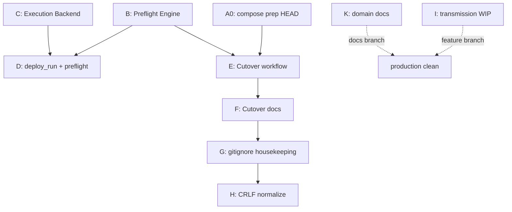

# IFG — Repository Commit Strategy

**Data:** 2026-07-06  
**Branch:** `production`  
**HEAD:** `9505adc` — `prep(docker): pin compose project ifg to existing prod volume and network`  
**Cel:** bezpieczna droga do `git status` → working tree clean przed produkcyjnym cutoverem  
**Zakres:** wyłącznie plan — **bez commitów, stash, restore, deployu, cutovera**

---

## 1. Stan wyjściowy

| Metryka | Wartość |
|---------|---------|
| Zmodyfikowane (tracked) | **17** plików |
| Nieśledzone (top-level) | **~82** wpisy (`git status --short` = 99 linii z rozwinięciem `.guardian/`) |
| Już na HEAD (cutover compose) | `docker/docker-compose.prod.yml` + raport compose prep |
| Blokada cutover | workflow `ifg.container.cutover` **nie jest w HEAD**; dirty tree |

### 1.1 Analiza tracked — co jest „prawdziwą” zmianą?

| Plik | Typ zmiany | Uwagi |
|------|------------|-------|
| `app/api/deps.py` | **CRLF/LF** | `git diff --ignore-cr-at-eol` pusty |
| `app/domain/enums.py` | **CRLF/LF** | j.w. |
| `app/persistence/mappers/invoice_mapper.py` | **CRLF/LF** | j.w. |
| `app/persistence/models/invoice.py` | **CRLF/LF** | j.w. |
| `app/persistence/repositories/transmission_repository.py` | **Funkcjonalna WIP** | +`list_all_paginated`, `add`, `get_latest_ksef_errors_for_invoices` (~106→211 linii) |
| `app/services/invoice_number_policy.py` | **CRLF/LF** | j.w. |
| `app/services/payment_service.py` | **CRLF/LF** | j.w. |
| `frontend-react/src/api/invoices.js` | **CRLF/LF** | j.w. |
| `frontend-react/src/components/invoice/InvoiceActions.jsx` | **CRLF/LF** | j.w. |
| `frontend-react/vite.config.js` | **CRLF/LF** | j.w. |
| `frontend-react/dist/index.html` | **Artefakt buildu** | zmiana hashów assetów Vite; katalog `dist/` jest w `.gitignore`, ale pliki historycznie śledzone |
| `scripts/ifg_guardian/cli.py` | **Cutover CLI** | subkomendy `ifg cutover run/rollback` |
| `scripts/ifg_guardian/plugins/ifg/plugin.py` | **Cutover** | rejestracja workflow |
| `scripts/ifg_guardian/core/workflow/transaction.py` | **Cutover** | pole `cutover_run` |
| `scripts/ifg_guardian/core/workflow/executors/__init__.py` | **GWO-G-003** | podpięcie `DeploymentEngine` / `ComposeBackend` |
| `scripts/ifg_guardian/plugins/ifg/deploy_run/workflow.py` | **GWO-G-003** | +`PreflightStage` |
| `tests/unit/test_guardian_ifg_deploy_run_workflow.py` | **GWO-G-003** | asercja preflight stage |

**Wniosek:** 10 plików `app/` + 3 `frontend-react/src/` to artefakt EOL (potwierdzone wcześniej w `docs/IFG_PENDING_CHANGES_AUDIT.md`, z wyjątkiem `transmission_repository.py`, który od tamtej pory zyskał realny diff). Guardian to 3 logiczne tory: **Preflight**, **Execution**, **Cutover**.

---

## 2. Logiczne grupy zmian

### Grupa A — Już na `production` (HEAD)

| ID | Cel | Pliki | Status |
|----|-----|-------|--------|
| **A0** | Compose prep pod Container Manager (`name: ifg`, external volume/network) | `docker/docker-compose.prod.yml`, `docs/reports/GWO_IFG_002A_COMPOSE_PROJECT_PREP.md` | ✅ `9505adc` |

---

### Grupa B — Guardian Preflight Engine (GWO-G-003A)

| Pole | Wartość |
|------|---------|
| **Cel** | Read-only preflight + Safety Gate (GO/NO_GO) przed deploy/cutover |
| **Pliki** | `scripts/ifg_guardian/core/preflight/` (8 plików), `tests/unit/test_guardian_preflight.py`, `docs/reports/GWO_G003A_PREFLIGHT_ENGINE.md` |
| **Commit message** | `feat(guardian): add Preflight Engine and Safety Gate` |
| **Zależności** | Brak (fundament) |
| **Cutover** | **Wymagane** — stage `preflight` w cutover |

---

### Grupa C — Guardian Execution Backend (GWO-G-003 Stage 1)

| Pole | Wartość |
|------|---------|
| **Cel** | `DeploymentEngine`, `ComposeBackend`, warstwa wykonania compose up/logs |
| **Pliki** | `scripts/ifg_guardian/core/execution/` (10 plików), `scripts/ifg_guardian/core/workflow/executors/__init__.py`, `docs/reports/GWO_G003_IMPLEMENTATION_STAGE1.md`, `docs/reports/GWO_G003B_STATUS_SEMANTICS.md`, `docs/reports/GUARDIAN_DEPLOYMENT_BACKEND_ARCHITECTURE_UPDATE.md`, `docs/guardian/architecture/GUARDIAN_DEPLOYMENT_BACKEND_ARCHITECTURE.md` |
| **Commit message** | `feat(guardian): add execution backend and deployment engine` |
| **Zależności** | Niezależne od cutover; opcjonalne dla `ifg deploy run` |
| **Cutover** | **Nie wymagane** — cutover używa SSH/remote bezpośrednio |

---

### Grupa D — Deploy Run + Preflight (GWO-G-003 integracja)

| Pole | Wartość |
|------|---------|
| **Cel** | Wpięcie PreflightStage do workflow `ifg.deploy.run` |
| **Pliki** | `scripts/ifg_guardian/plugins/ifg/deploy_run/preflight_stage.py`, `scripts/ifg_guardian/plugins/ifg/deploy_run/workflow.py`, `tests/unit/test_guardian_ifg_deploy_run_workflow.py` |
| **Commit message** | `feat(guardian): integrate preflight into ifg deploy run workflow` |
| **Zależności** | **B** (preflight); opcjonalnie **C** (execution — `executors/__init__.py` łączy oba) |
| **Cutover** | **Nie wymagane** |

> **Uwaga zależności:** `executors/__init__.py` importuje `core/execution/`. Commit **D** bez **C** złamie testy deploy_run. Kolejność: **B → C → D** albo **B → (C+D w jednym commicie)**.

---

### Grupa E — Container Manager Cutover (GWO-IFG-002A)

| Pole | Wartość |
|------|---------|
| **Cel** | Workflow `ifg.container.cutover` + CLI `ifg cutover run/rollback` |
| **Pliki** | `scripts/ifg_guardian/plugins/ifg/container_cutover/` (7), `scripts/ifg_guardian/modules/ifg_container_cutover.py`, `scripts/ifg_guardian/cli.py`, `scripts/ifg_guardian/plugins/ifg/plugin.py`, `scripts/ifg_guardian/core/workflow/transaction.py`, `tests/unit/test_guardian_container_cutover_workflow.py` |
| **Commit message** | `feat(guardian): add IFG Container Manager cutover workflow` |
| **Zależności** | **B** (PreflightEngine w `stages.py`); **nie** wymaga **C/D** |
| **Cutover** | **Krytyczne** — bez tego `ifg cutover run` nie istnieje w HEAD |

---

### Grupa F — Dokumentacja cutover / migracji (GWO-IFG-002)

| Pole | Wartość |
|------|---------|
| **Cel** | Runbook APPROVED + raporty operacyjne dla operatora |
| **Pliki** | `docs/runbooks/RUNBOOK_IFG_CONTAINER_MANAGER_CUTOVER.md`, `docs/reports/GWO_IFG_002A_GUARDIAN_CUTOVER_PREP.md`, `docs/reports/GWO_IFG_002A_RUNBOOK_FINAL.md`, `docs/reports/GWO_IFG_002B_CONTAINER_MANAGER_BEHAVIOUR.md`, `docs/reports/GWO_IFG_002A_PRODUCTION_MIGRATION.md`, `docs/reports/GWO_IFG_002_PROJECT_MIGRATION_PLAN.md`, `docs/reports/IFG_CONTAINER_MANAGER_MIGRATION.md`, `docs/reports/IFG_DS723_CONTAINER_MANAGER_PROJECT.md`, `docs/reports/GWO_IFG_002A_REPO_CLEAN_STATE_PREP.md`, `docs/reports/IFG_REPOSITORY_COMMIT_STRATEGY.md` |
| **Commit message** | `docs(ifg): add Container Manager cutover runbook and GWO-IFG-002 reports` |
| **Zależności** | Logicznie po **E**; można w tym samym commicie co **E** |
| **Cutover** | Zalecane (operator ma runbook w repo po `git pull`) |

---

### Grupa G — Housekeeping repo (bez utraty plików)

| Pole | Wartość |
|------|---------|
| **Cel** | Usunąć szum ze statusu bez kasowania danych |
| **Pliki** | `.gitignore` (+ wpisy: `.guardian/`, opcjonalnie `docs/guardian/IFG_*_20*.md` jako generated), `git rm --cached frontend-react/dist/*` |
| **Commit message** | `chore: ignore guardian runtime artifacts and untrack frontend dist` |
| **Zależności** | Po commitach produkcyjnych; **nie** kasuje plików na dysku |
| **Cutover** | Pomocnicze — czysty `git status` |

---

### Grupa H — Normalizacja EOL (CRLF → LF)

| Pole | Wartość |
|------|---------|
| **Cel** | Usunąć fałszywe `M` z powodu CRLF (bez zmiany logiki) |
| **Pliki** | `app/api/deps.py`, `app/domain/enums.py`, `app/persistence/mappers/invoice_mapper.py`, `app/persistence/models/invoice.py`, `app/services/invoice_number_policy.py`, `app/services/payment_service.py`, `frontend-react/src/api/invoices.js`, `frontend-react/src/components/invoice/InvoiceActions.jsx`, `frontend-react/vite.config.js` |
| **Commit message** | `chore: normalize CRLF to LF in app and frontend-react` |
| **Zależności** | **Wykluczyć** `transmission_repository.py` (ma realny diff) |
| **Cutover** | Opcjonalne na `production`; można odłożyć na `develop` |

**Metoda (bez restore):** `git add --renormalize <pliki>` lub commit znormalizowanej treści — to **commit**, nie discard.

---

### Grupa I — WIP aplikacja (poza `production`)

| Pole | Wartość |
|------|---------|
| **Cel** | KSeF transmission listing / błędy na liście faktur |
| **Pliki** | `app/persistence/repositories/transmission_repository.py` |
| **Commit message** | `feat(ksef): extend transmission repository for listing and error lookup` *(gdy gotowe)* lub `wip: transmission repository expansion` |
| **Zależności** | Brak dla cutover |
| **Branch** | `feature/ksef-transmission-list` lub `develop` |

---

### Grupa J — Test frontend (poza `production`)

| Pole | Wartość |
|------|---------|
| **Cel** | Regresja numeracji na `InvoiceCardList` |
| **Pliki** | `frontend-react/src/components/invoice/invoiceCardListNumbering.test.js` |
| **Commit message** | `test(ifg): add invoice card list numbering regression test` |
| **Zależności** | Powiązane z torami FV numbering (docs), nie z cutover |
| **Branch** | `feature/invoice-numbering` lub razem z **I** |

---

### Grupa K — Dokumentacja domenowa IFG (poza `production`)

| Pole | Wartość |
|------|---------|
| **Cel** | Notatki audytowe FV / PZ / WZ / magazyn / KSeF |
| **Pliki** | `docs/FV_*.md`, `docs/PZ_*.md`, `docs/WZ_*.md`, `docs/WAREHOUSE_*.md`, `docs/KK_*.md`, `docs/KSEF_*.md`, `docs/UI_*.md`, `docs/IFG_LONG_RUNNING_OPERATIONS_STANDARD.md`, `docs/IFG_PENDING_CHANGES_AUDIT.md`, `docs/REPO_*.md`, `docs/WIP_COMMIT_SPLIT_PLAN.md` |
| **Commit message** | `docs(ifg): add domain audit and implementation notes` |
| **Zależności** | Brak |
| **Branch** | `docs/ifg-domain-notes` |

---

### Grupa L — Artefakty runtime (nie commitować)

| Pole | Wartość |
|------|---------|
| **Cel** | — |
| **Pliki** | `.guardian/` (~150+ JSON), `.env.production.migration-test`, `docs/guardian/IFG_*_2026_*.md`, `docs/guardian/CUTOVER_PRECHECK_*.md`, `docs/guardian/PRECHECK_*.md`, `docs/reports/guardian_deploy_*`, `docs/reports/guardian_recover_*`, `docs/reports/repository_*.md` |
| **Akcja** | `.gitignore` (**G**); pliki zostają na dysku |
| **Branch** | — |

---

### Grupa M — Guardian Canon / Core (poza `production`)

| Pole | Wartość |
|------|---------|
| **Cel** | Przegląd kanonu Guardian (osobny tor) |
| **Pliki** | `docs/reports/GUARDIAN_CANON_REVIEW_2026-07-06.md`, `docs/guardian/core/GUARDIAN_CORE_STATUS.md` |
| **Branch** | `docs/guardian-canon` lub repo `guardian` |

---

## 3. Proponowana kolejność commitów

### Ścieżka minimalna — cutover-ready na `production`

Wystarczy do `ifg cutover run --yes` po push:

```
A0 (HEAD) → B → E → F → G
```

| Krok | Grupa | Commit | Test po commicie |
|------|-------|--------|------------------|
| 1 | **B** | Preflight Engine | `pytest tests/unit/test_guardian_preflight.py` |
| 2 | **E** | Cutover workflow | `pytest tests/unit/test_guardian_container_cutover_workflow.py` |
| 3 | **F** | Dokumentacja cutover | — |
| 4 | **G** | gitignore + untrack dist | `git status` |

**Opcjonalnie później na `production`:** C → D (deploy run hardening).

### Ścieżka pełna — Guardian GWO-G-003 + cutover

```
A0 → B → C → D → E → F → G → H
```

| Krok | Grupa | Uwaga |
|------|-------|-------|
| 1–2 | B, C | Preflight, potem execution |
| 3 | D | Wymaga B+C |
| 4–6 | E, F, G | Cutover + docs + housekeeping |
| 7 | H | EOL — osobno, bez `transmission_repository.py` |

### Ścieżka WIP — poza `production` (kolejność dowolna względem siebie)

```
I + J  →  branch feature/*
K      →  branch docs/*
M      →  branch docs/guardian-canon
L      →  gitignore (G), nie commit
```

---

## 4. Co można commitować już teraz

| Grupa | Gotowość | Uzasadnienie |
|-------|----------|--------------|
| **B** Preflight | ✅ Teraz | Testy istnieją; cutover na tym polega |
| **E** Cutover | ✅ Teraz | Dry-run SUCCESS (raport w `docs/guardian/IFG_CONTAINER_CUTOVER_2026_07_06.md`) |
| **F** Docs cutover | ✅ Teraz | Runbook APPROVED |
| **G** Housekeeping | ✅ Teraz | Tylko `.gitignore` + `git rm --cached` |
| **C, D** Execution + deploy_run | ✅ Teraz | Kod kompletny; **nie blokuje** cutover |
| **H** CRLF | ✅ Teraz | Bezpieczne po wykluczeniu `transmission_repository.py` |
| **I** transmission_repository | ⚠️ WIP | Realny diff; brak potwierdzenia „done” |
| **J** test numbering | ⚠️ WIP | Sensowny, ale tor FV nie na production |
| **K** docs domenowe | 📋 Opcjonalnie | Wartościowe, ale nie dla cutover |
| **L** runtime | ❌ Nigdy | Generated / sekrety |

---

## 5. Co powinno zostać poza `production`

| Obszar | Powód |
|--------|-------|
| `transmission_repository.py` (WIP) | Zmiana aplikacji niezwiązana z cutover |
| `invoiceCardListNumbering.test.js` | Tor numeracji FV |
| Wszystkie `docs/FV_*`, `PZ_*`, `WZ_*`, `WAREHOUSE_*` | Dokumentacja rozwoju funkcji |
| `docs/KSEF_PURCHASE_SYNC_*` | Osobny deploy KSeF |
| `.env.production.migration-test` | Wzorzec sekretów |
| `.guardian/`, `guardian_deploy_*`, `guardian_recover_*` | Artefakty runtime |
| **C + D** (opcjonalnie) | Można na `production`, ale nie jest wymagane przed cutover |

---

## 6. Najbezpieczniejsza droga do clean tree (bez restore / bez dużego stash)

### Zasady

1. **Surgical `git add`** — tylko pliki z danej grupy; nigdy `git add .`
2. **Feature branch zamiast stash** — WIP commitowany na osobnym branchu; po `git switch production` pliki wracają do wersji HEAD **bez restore**
3. **`git worktree`** (opcjonalnie) — równoległa praca: `git worktree add ../ifg_wip feature/ksef-transmission-list`
4. **`.gitignore` zamiast kasowania** — `.guardian/` znika ze statusu, pliki zostają
5. **Snapshot filesystem** (poza git) — `cp -a` repo przed większą serią commitów

### Plan krok po kroku

#### Faza 0 — Zabezpieczenie (poza git lub lekki marker)

```bash
# Opcjonalnie: pełna kopia katalogu
cp -a /Users/lukasz/projekty/ifg_standalone /Users/lukasz/projekty/ifg_standalone_snapshot_2026-07-06

# Lekki marker w git (nie zmienia plików)
git branch backup/pre-cleanup-2026-07-06
```

#### Faza 1 — Odizoluj WIP aplikacji (żeby nie blokował clean `production`)

```bash
git switch -c feature/ksef-transmission-wip

git add app/persistence/repositories/transmission_repository.py
git add frontend-react/src/components/invoice/invoiceCardListNumbering.test.js
# commit dopiero gdy operator zatwierdzi gotowość WIP

git switch production
# transmission_repository wraca do HEAD; working tree bez tego pliku jako M
```

Jeśli WIP **nie jest gotowy do commita**: zostaw branch bez commita i użyj **worktree** — skopiuj zmiany do drugiego katalogu ręcznie lub commit z prefiksem `wip:` na branchu feature (praca nie ginie, `production` nadal ma ten plik jako `M` — wtedy Faza 1 nie daje clean bez commita WIP).

**Wniosek:** dla pełnego clean na `production` plik **I** musi być **zacommitowany gdzieś** (feature branch) — to jedyny sposób bez restore/stash.

#### Faza 2 — Commity produkcyjne na `production` (surgical add)

```bash
git switch production

# Krok B
git add scripts/ifg_guardian/core/preflight/ tests/unit/test_guardian_preflight.py docs/reports/GWO_G003A_PREFLIGHT_ENGINE.md
# git commit ...

# Krok E
git add scripts/ifg_guardian/plugins/ifg/container_cutover/ scripts/ifg_guardian/modules/ifg_container_cutover.py \
  scripts/ifg_guardian/cli.py scripts/ifg_guardian/plugins/ifg/plugin.py \
  scripts/ifg_guardian/core/workflow/transaction.py \
  tests/unit/test_guardian_container_cutover_workflow.py
# git commit ...

# Krok F
git add docs/runbooks/ docs/reports/GWO_IFG_002*.md docs/reports/IFG_CONTAINER_MANAGER_MIGRATION.md \
  docs/reports/IFG_DS723_CONTAINER_MANAGER_PROJECT.md docs/reports/GWO_IFG_002A_REPO_CLEAN_STATE_PREP.md \
  docs/reports/IFG_REPOSITORY_COMMIT_STRATEGY.md
# git commit ...

# Krok G
# edycja .gitignore: .guardian/
git rm --cached -r frontend-react/dist/ 2>/dev/null || true
git add .gitignore
# git commit ...
```

#### Faza 3 — Opcjonalnie GWO-G-003 (C + D)

```bash
git add scripts/ifg_guardian/core/execution/ scripts/ifg_guardian/core/workflow/executors/__init__.py \
  docs/reports/GWO_G003*.md docs/reports/GUARDIAN_DEPLOYMENT_BACKEND_ARCHITECTURE_UPDATE.md \
  docs/guardian/architecture/
# git commit ...

git add scripts/ifg_guardian/plugins/ifg/deploy_run/preflight_stage.py \
  scripts/ifg_guardian/plugins/ifg/deploy_run/workflow.py \
  tests/unit/test_guardian_ifg_deploy_run_workflow.py
# git commit ...
```

#### Faza 4 — CRLF (H), bez transmission_repository

```bash
git add --renormalize \
  app/api/deps.py app/domain/enums.py app/persistence/mappers/invoice_mapper.py \
  app/persistence/models/invoice.py app/services/invoice_number_policy.py \
  app/services/payment_service.py frontend-react/src/api/invoices.js \
  frontend-react/src/components/invoice/InvoiceActions.jsx frontend-react/vite.config.js
# git commit ...
```

#### Faza 5 — Dokumentacja domenowa (branch K)

```bash
git switch -c docs/ifg-domain-notes
git add docs/FV_*.md docs/PZ_*.md docs/WZ_*.md docs/WAREHOUSE_*.md docs/KK_*.md \
  docs/KSEF_*.md docs/UI_*.md docs/IFG_*.md docs/REPO_*.md docs/WIP_COMMIT_SPLIT_PLAN.md
# git commit ...
git switch production
```

#### Faza 6 — Weryfikacja

```bash
git status
# Oczekiwane na production: clean (lub tylko ignorowane pliki)

pytest tests/unit/test_guardian_preflight.py tests/unit/test_guardian_container_cutover_workflow.py -q
python3 scripts/guardian.py ifg cutover run --dry-run
```

### Diagram zależności



---

## 7. Czy po planie można uruchomić LIVE cutover?

| Warunek | Po ścieżce minimalnej B→E→F→G + Faza 1 (WIP off production) |
|---------|-----------------------------------------------------------|
| `git status` clean na `production` | ✅ |
| `ifg cutover` w HEAD | ✅ |
| Compose prep w HEAD | ✅ (już) |
| `pytest` cutover + preflight | ✅ (lokalnie) |
| `dry-run` | ✅ |
| `git push` + `git pull` DS723+ | ⏳ operator |
| Okno maintenance | ⏳ operator |

**Werdykt:** Po wykonaniu planu (bez migracji teraz) — **GO** dla `python3 scripts/guardian.py ifg cutover run --yes`.

**Teraz:** **NO-GO**.

---

## 8. Ryzyka

| # | Ryzyko | Mitygacja |
|---|--------|-----------|
| R1 | `git add .` wciągnie WIP / `.env` | Tylko surgical add z tabel w §2 |
| R2 | WIP transmission zostaje `M` na production | Commit na `feature/*` lub worktree |
| R3 | Commit C bez B lub D bez C | Trzymać kolejność B→C→D |
| R4 | Utrata pracy przy błędnym branch switch | Snapshot `cp -a`; commit `wip:` na feature |
| R5 | `git rm --cached dist` — duży diff | Jednorazowy chore; dist i tak w `.gitignore` |
| R6 | Push WIP docs na production | Osobny branch `docs/ifg-domain-notes` |
| R7 | Cutover bez push | DS723 ma compose z `9505adc`; Guardian działa z Mac mini — ale runbook/docs warto mieć po pull |

---

## 9. Mapowanie: commit → cutover

| Commit (grupa) | Wymagany przed LIVE cutover? |
|----------------|------------------------------|
| A0 compose | ✅ (HEAD) |
| B preflight | ✅ |
| E cutover | ✅ |
| F docs | Zalecany |
| G housekeeping | Zalecany (czysty status) |
| C, D execution/deploy_run | ❌ |
| H CRLF | ❌ |
| I, J, K, M | ❌ (inne branche) |

---

## 10. Podsumowanie operacyjne

| Kategoria | ~Liczba plików |
|-----------|----------------|
| Do commita na `production` (minimal) | ~35 |
| Do commita na `production` (pełny G003) | ~55 |
| Do branchy feature/docs | ~25 |
| Do `.gitignore` (zostają na dysku) | ~200+ |
| Już na HEAD | 2 |

**Następny krok operatora:** wykonać Fazę 1 (izolacja WIP), potem Fazę 2 (commity B→E→F→G) — **bez** uruchamiania cutovera do momentu `git status` clean + `dry-run` + `git push`.

---

*Plan przygotowany bez wykonywania commitów, stash, restore, deployu ani połączenia z DS723+.*
